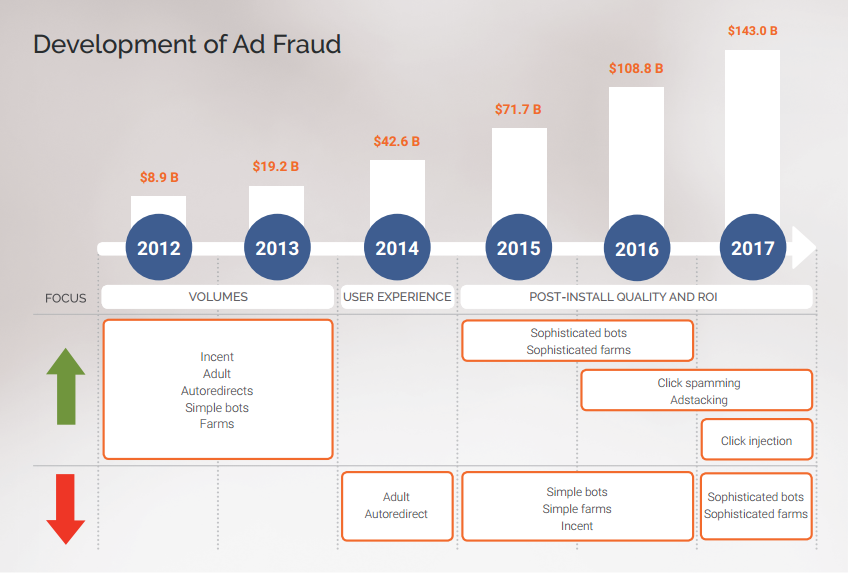

# AppLift Combating mobile advertising fraud: the next battleground

*** 2017-08-08 set_daemon@126.com ***

[材料来源AppLift](http://www.applift.com/blog/ebook-combating-mobile-advertising-fraud)  

## 前言

​	广告作弊是广告行业的普遍常见的现象，吸引了诸多的关注和讨论，最直接的问题就是广告作弊带来经济损失的深度估计。有研究表明，2017年全球数字广告在作弊流量上浪费的金额高达164亿美元，是之前预测值的两倍。另外一个最近的研究指出广告作弊带来65亿美元的经济损失，比2016年估计的72亿美元要下降10%（white ops提供）。

​	不深究具体数字，有一件事情已经非常明确：自从2012年移动广告出现后，广告作弊的规模和复杂度一直在增长。由于作弊者的不断寻找新的途径来欺骗系统，广告作弊普遍存在于多种级别。

​	直到现在，行业里对广告作弊的观点依旧短视，认为这主要是广告主该关心的问题。但是作弊实际上影响的不仅仅包括app开发者和广告主，还破坏了广告网络、发布商和广告主之间的信任，损害了整个行业的信誉。

​	作为广告技术领域的积极参与者，我们已经付出了大量的努力去检测和防止广告作弊。我们在2015年发布了针对移动程序化作弊扩展性的初步综合研究，基于此，对移动程序化作弊的统计和模式的深入挖掘，使我们更容易理解作弊的趋势。

​	今天，广告行业暴露出新的挑战，广告作弊这个话题也日益重要，随着简单的机器人已经发展成更复杂的技术，且更难以被检测到，除非采用听起来可以理解的模式识别、启发性的思路以及结合人工和技术的努力，才有可能在对抗广告作弊这场战斗中取得胜利。

​	在这个研究中，我们尽力解释在持续不断的偏差中面临的挑战。这个电子文档也试图提供更新的作弊模式，展示作弊检测和防止的关键启发性思路。

​	关于作弊对抗措施的设计和执行，我们提供了具体的指导，以作为所有利益相关者愿意一起努力对抗作弊的基础。

​	（以上来自 AppLift总经理Stefan）

## 执行摘要

​	移动行业在持续地发展当中，我们也已经看到自从广告在移动的发力以来发生了巨大的进展。尽管如此，我们不可避免地要持续地面临挑战。在今天，广告作弊是一个紧迫而又复杂的话题当中的一个。

​	从简单的机器人和自动跳转技术的发展到现在，作弊者开发出了更多复杂的技术，例如点击垃圾、广告栈和点击注入，这些可以称作广告作弊战场当中的温床。全球的作弊分布暴露出今天我们要面对的脆弱点，印度和印度尼西亚等这些相对新兴的市场比西方更成熟的市场有更高程度的作弊。

​	观察到最新型的作弊发生在技术作弊的环节当中（例如作弊通过技术的手段来愚弄广告技术系统），我们将作弊分类成compliance作弊和技术作弊两个维度。在漏斗的每个环节，我们都标定了作弊点，以此观察到通常的广告作弊类型，例如归因作弊，以及安装/后安装作弊，这些对今天的广告主而言是很危险的。

​	技术作弊类型难以在简单的层面被检测到，依赖于复杂的模式识别技术，外加人工的努力。有六个主要模式可以用来检测作弊类型：

​	1）IP过滤和阻止

​		在作弊检测的早期阶段，映射安装的来源IP或子网到无作弊 对比 可疑流量，可以作为初步过滤，以判别是否有特殊的IP或子网存在不正常的高安装量。（Detecting fraud at early stages by mapping the installs received by IPs/Subnets for fraud-free versus suspect traffic can be first filter to see if particular IPs/Subnets are delivering unusually high installs）

​	2）设备分析

​		借助设备信息实现特定的算法监控不同来源流量并识别任何奇怪行为的案例，以一定判别标准来检测作弊行为。

​	3）安装的当天分布

​		观察24小时时期内的异常抖尖（spikes）帮助识别可疑的流量，作为映射，将会显示一条24小时内持续稳定安装曲线，对比平坦或者异常抖尖的情况下可能是作弊流量。当然，这种指标需要特别考虑不同时区的流量。（可能是在说：某些时段没有安装，某些时段突然大量的安装，可能意味着是作弊者定时产生的动作）	

​	4）点击-安装-时间（CTIT）分布

​		点击和安装的时间分布模型是一种可探测任何可疑模式的很有意义的指标。典型的CTIT遵循一种模式，即在点击后，一小段时间内有大量的安装，但之后极少产生安装。同样，用户安装到使用也有一定时间的滞后，影响的因素包括应用的大小和类型。

​	5）App内活动相关

​		用户在APP内的行为是一种用来识别安装是否是作弊特性的良好指标。典型地，如果观察到某一个来源的用户没有或者极少的后装app内行为，那么这个特别来源可以被标识成作弊。

​	6）转化率

​		与APP内行为相似，不寻常的高或非常低的转化率同样可以用作任何可疑流量的指示器。	

## 简介

​	"追逐金钱"来源于1976年戏剧“总统的子民”的一句流行语，指的是在高层政治办公室中的金钱臭迹（money trail）和腐败。

​	在移动广告方向上，作弊者完全知道，广告主的花费在不断增加，移动app和网站对作弊者而言是攫取利益的目标。过去的两年，我们已经在检测、阻止和对抗作弊在转化漏斗不同阶段取得了很大的进展。但是作为任何作弊的天性，作弊者试图寻找到新的方式来发现新的脆弱点，随着行业的发展，其手段和形态也在不断发展和改变。

​	要掌握广告作弊在行业里面是如何发展，我们需要探查广告作弊的历史，来理解现在发现的新趋势。

## 作弊历史及当前挑战

​	作弊者就像变色龙一般：混淆视听以期不被发现。自市场的早期以来，他们的技术都是紧随在广告主所能看到和关注的地方（即在广告主任何能看到和想看到的结果上加以处理，其效果都是符合广告主期望/要求的）。

​	回退到2012年，当时的广告主关注增长、并仅追求投放的体量，作弊者使用不同的方法来达到投放的规模：使用激励（incent）流量投放非激励（non-incent）活动，购买成人或自动跳转的便宜流量，开发模拟移动设备的机器人（bot），生成安装，投资付费下载安装模式增加app在设备上的安装量。

​	有些作弊技术很快被广告主发现了，原因是收到用户的投诉，在未经用户同意或者他们在成人网站上的一个广告时，用户便被自动引导跳转到应用商店。在那个时候，广告主开始更加关心用户的体验，并携手广告网络方（networks）有效地打击这种行为。

​	在疯狂刷量的时期之后，股东以及C级高管（CEO、CFO、COO......）意识到他们在市场上投资巨大，但实际并未从最新获取的用户取得预期的回馈。可以说，我们当前看到的这个行业趋势，就是在那一刻启动的，广告主更加关注后安装（post-install）的质量和ROI。

​	在那时，广告主开始与广告网络进入更系统级的后安装数据的共享。简单的机器人和积分墙（farms）并不能很快的模拟后安装的行为，对作弊者而言也就意义不大了（提升了作弊难度），同时也很容易被广告主和广告网络识别。作弊者不得不开发更复杂的机制来模拟真实用户的行为，他们的机器人或者Farm能与应用互动，甚至能实现一定程度的应用内购买行为。这些机器人和farm目前基本上可以被识别出来，因为他们的模拟用户行为并不完美，例如，在一定时期后就没有活跃，或者超乎实际的活跃，等等。

​	根据广告主对质量要求日益提高，经常会比较来自organics和付费安装的质量，作弊者开始自问：怎样才能在提高安装体量的同时又与organics相同的质量？答案异常简单：与organics一样好的，不就是organics自身？（what is as good as organics, if not organics themselves?），这就是行业里兴起偷取organic技术的时候。我们将要讨论点击欺诈(click spamming)、广告栈（ad stacking，在别的广告上铺广告），以及更近的点击注入，这三个作弊机制在移动作弊生态中已经占据了很大的比例，也是利益受损方一直在尝试有效检测和阻止的技术，但这并不容易，我们在后面会展开陈述。

​	

## 探查作弊分布：当前趋势

## 作弊分类

## 作弊检测：主要度量

## 案例分析：使用AppLift的模式检测技术来识别作弊

## AppLift作弊对抗矩阵

## 对抗作弊的一种十步方法

## 总结