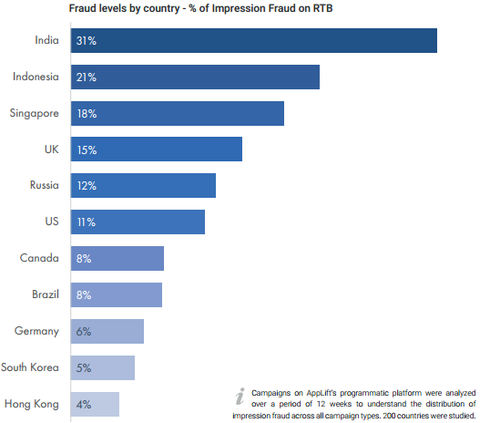
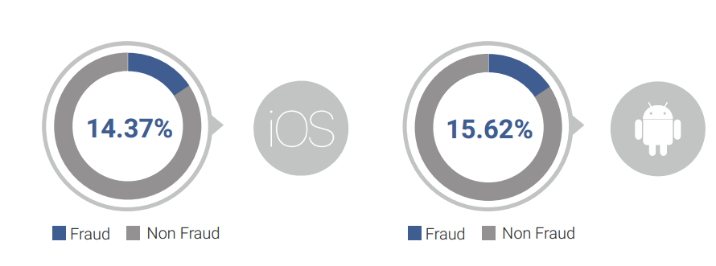
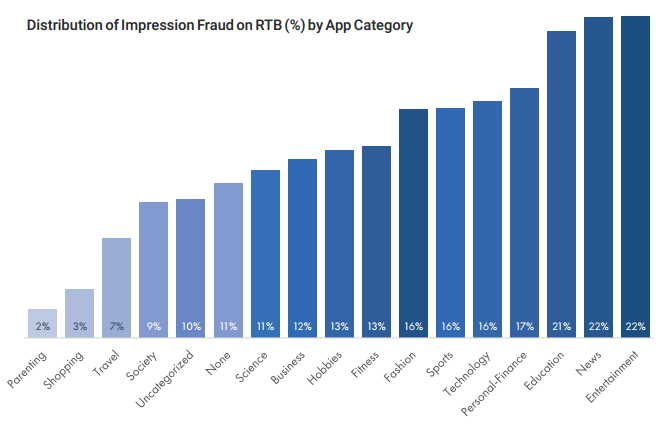
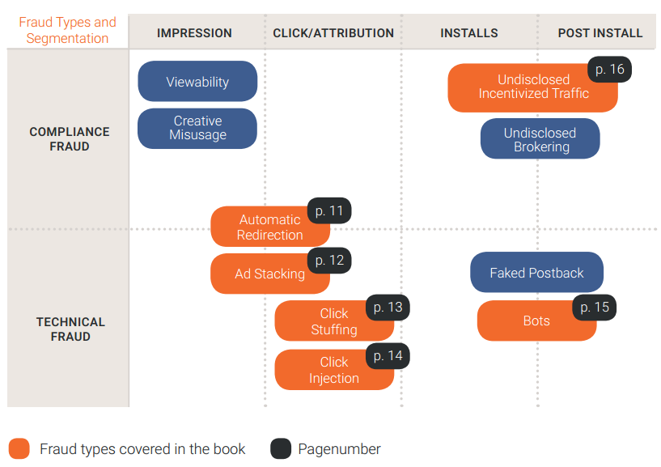
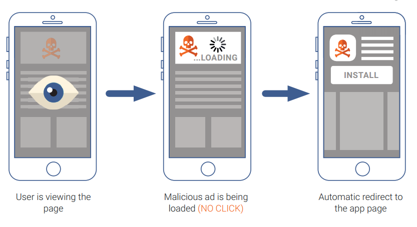
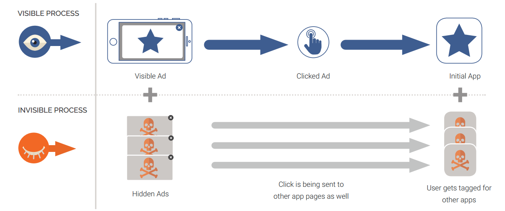
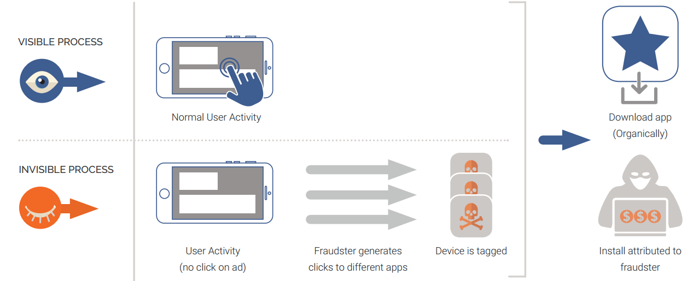
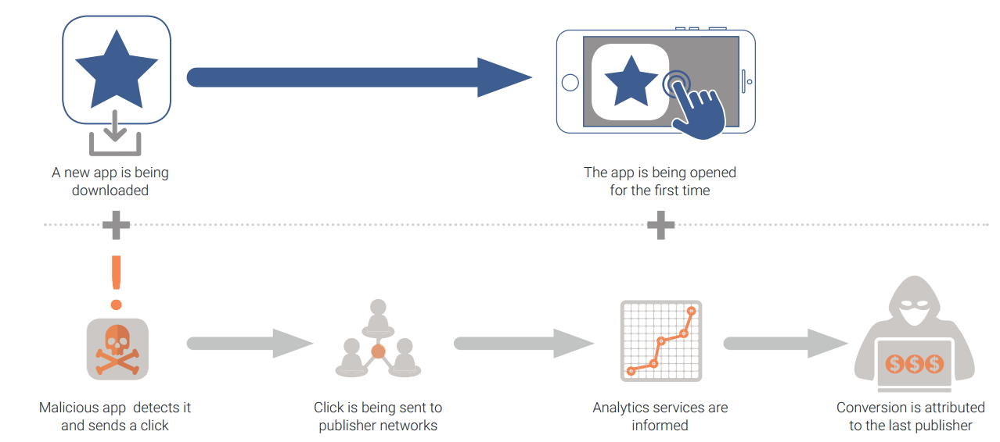
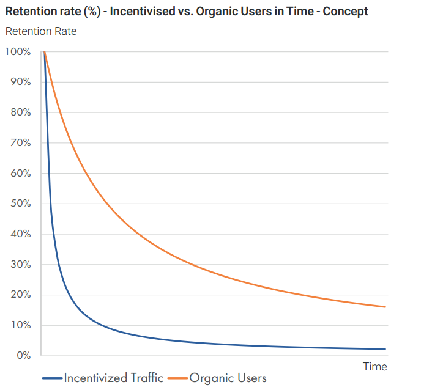

# AppLift Combating mobile advertising fraud: the next battleground

*** 2017-08-08 set_daemon@126.com *** (如有涉及侵权，请及时与我联系)

[材料来源AppLift](http://www.applift.com/blog/ebook-combating-mobile-advertising-fraud)   [下载](attachments/applift-fraud-ebook-the-next-battleground.original.pdf)

## 前言

​	广告作弊是广告行业的普遍常见的现象，吸引了诸多的关注和讨论，最直接的问题就是广告作弊带来经济损失的深度估计。有研究表明，2017年全球数字广告在作弊流量上浪费的金额高达164亿美元，是之前预测值的两倍。另外一个最近的研究指出广告作弊带来65亿美元的经济损失，比2016年估计的72亿美元要下降10%（white ops提供）。

​	不深究具体数字，有一件事情已经非常明确：自从2012年移动广告出现后，广告作弊的规模和复杂度一直在增长。由于作弊者的不断寻找新的途径来欺骗系统，广告作弊普遍存在于多种级别。

​	直到现在，行业里对广告作弊的观点依旧短视，认为这主要是广告主该关心的问题。但是作弊实际上影响的不仅仅包括app开发者和广告主，还破坏了广告网络、发布商和广告主之间的信任，损害了整个行业的信誉。

​	作为广告技术领域的积极参与者，我们已经付出了大量的努力去检测和防止广告作弊。我们在2015年发布了针对移动程序化作弊扩展性的初步综合研究，基于此，对移动程序化作弊的统计和模式的深入挖掘，使我们更容易理解作弊的趋势。

​	今天，广告行业暴露出新的挑战，广告作弊这个话题也日益重要，随着简单的机器人已经发展成更复杂的技术，且更难以被检测到，除非采用听起来可以理解的模式识别、启发性的思路以及结合人工和技术的努力，才有可能在对抗广告作弊这场战斗中取得胜利。

​	在这个研究中，我们尽力解释在持续不断的偏差中面临的挑战。这个电子文档也试图提供更新的作弊模式，展示作弊检测和防止的关键启发性思路。

​	关于作弊对抗措施的设计和执行，我们提供了具体的指导，以作为所有利益相关者愿意一起努力对抗作弊的基础。

​	（以上来自 AppLift总经理Stefan）

## 执行摘要

​	移动行业在持续地发展当中，我们也已经看到自从广告在移动的发力以来发生了巨大的进展。尽管如此，我们不可避免地要持续地面临挑战。在今天，广告作弊是一个紧迫而又复杂的话题当中的一个。

​	从简单的机器人和自动跳转技术的发展到现在，作弊者开发出了更多复杂的技术，例如点击垃圾、广告栈和点击注入，这些可以称作广告作弊战场当中的温床。全球的作弊分布暴露出今天我们要面对的脆弱点，印度和印度尼西亚等这些相对新兴的市场比西方更成熟的市场有更高程度的作弊。

​	观察到最新型的作弊发生在技术作弊的环节当中（例如作弊通过技术的手段来愚弄广告技术系统），我们将作弊分类成compliance作弊和技术作弊两个维度。在漏斗的每个环节，我们都标定了作弊点，以此观察到通常的广告作弊类型，例如归因作弊，以及安装/后安装作弊，这些对今天的广告主而言是很危险的。

​	技术作弊类型难以在简单的层面被检测到，依赖于复杂的模式识别技术，外加人工的努力。有六个主要模式可以用来检测作弊类型：

​	1）IP过滤和阻止

​		在作弊检测的早期阶段，映射安装的来源IP或子网到无作弊 对比 可疑流量，可以作为初步过滤，以判别是否有特殊的IP或子网存在不正常的高安装量。（Detecting fraud at early stages by mapping the installs received by IPs/Subnets for fraud-free versus suspect traffic can be first filter to see if particular IPs/Subnets are delivering unusually high installs）

​	2）设备分析

​		借助设备信息实现特定的算法监控不同来源流量并识别任何奇怪行为的案例，以一定判别标准来检测作弊行为。

​	3）安装的当天分布

​		观察24小时时期内的异常抖尖（spikes）帮助识别可疑的流量，作为映射，将会显示一条24小时内持续稳定安装曲线，对比平坦或者异常抖尖的情况下可能是作弊流量。当然，这种指标需要特别考虑不同时区的流量。（可能是在说：某些时段没有安装，某些时段突然大量的安装，可能意味着是作弊者定时产生的动作）	

​	4）点击-安装-时间（CTIT）分布

​		点击和安装的时间分布模型是一种可探测任何可疑模式的很有意义的指标。典型的CTIT遵循一种模式，即在点击后，一小段时间内有大量的安装，但之后极少产生安装。同样，用户安装到使用也有一定时间的滞后，影响的因素包括应用的大小和类型。

​	5）App内活动相关

​		用户在APP内的行为是一种用来识别安装是否是作弊特性的良好指标。典型地，如果观察到某一个来源的用户没有或者极少的后装app内行为，那么这个特别来源可以被标识成作弊。

​	6）转化率

​		与APP内行为相似，不寻常的高或非常低的转化率同样可以用作任何可疑流量的指示器。	

## 简介

​	"追逐金钱"来源于1976年戏剧“总统的子民”的一句流行语，指的是在高层政治办公室中的金钱臭迹（money trail）和腐败。

​	在移动广告方向上，作弊者完全知道，广告主的花费在不断增加，移动app和网站对作弊者而言是攫取利益的目标。过去的两年，我们已经在检测、阻止和对抗作弊在转化漏斗不同阶段取得了很大的进展。但是作为任何作弊的天性，作弊者试图寻找到新的方式来发现新的脆弱点，随着行业的发展，其手段和形态也在不断发展和改变。

​	要掌握广告作弊在行业里面是如何发展，我们需要探查广告作弊的历史，来理解现在发现的新趋势。

## 作弊历史及当前挑战

​	作弊者就像变色龙一般：混淆视听以期不被发现。自市场的早期以来，他们的技术都是紧随在广告主所能看到和关注的地方（即在广告主任何能看到和想看到的结果上加以处理，其效果都是符合广告主期望/要求的）。

​	回退到2012年，当时的广告主关注增长、并仅追求投放的体量，作弊者使用不同的方法来达到投放的规模：使用激励（incent）流量投放非激励（non-incent）活动，购买成人或自动跳转的便宜流量，开发模拟移动设备的机器人（bot），生成安装，投资付费下载安装模式增加app在设备上的安装量。

​	有些作弊技术很快被广告主发现了，原因是收到用户的投诉，在未经用户同意或者他们在成人网站上的一个广告时，用户便被自动引导跳转到应用商店。在那个时候，广告主开始更加关心用户的体验，并携手广告网络方（networks）有效地打击这种行为。

​	在疯狂刷量的时期之后，股东以及C级高管（CEO、CFO、COO......）意识到他们在市场上投资巨大，但实际并未从最新获取的用户取得预期的回馈。可以说，我们当前看到的这个行业趋势，就是在那一刻启动的，广告主更加关注后安装（post-install）的质量和ROI。

​	在那时，广告主开始与广告网络进入更系统级的后安装数据的共享。简单的机器人和积分墙（farms）并不能很快的模拟后安装的行为，对作弊者而言也就意义不大了（提升了作弊难度），同时也很容易被广告主和广告网络识别。作弊者不得不开发更复杂的机制来模拟真实用户的行为，他们的机器人或者Farm能与应用互动，甚至能实现一定程度的应用内购买行为。这些机器人和farm目前基本上可以被识别出来，因为他们的模拟用户行为并不完美，例如，在一定时期后就没有活跃，或者超乎实际的活跃，等等。

​	根据广告主对质量要求日益提高，经常会比较来自organics和付费安装的质量，作弊者开始自问：怎样才能在提高安装体量的同时又与organics相同的质量？答案异常简单：与organics一样好的，不就是organics自身？（what is as good as organics, if not organics themselves?），这就是行业里兴起偷取organic技术的时候。我们将要讨论点击欺诈(click spamming)、广告栈（ad stacking，在别的广告上铺广告），以及更近的点击注入，这三个作弊机制在移动作弊生态中已经占据了很大的比例，也是利益受损方一直在尝试有效检测和阻止的技术，但这并不容易，我们在后面会展开陈述。

​	

## 探查作弊分布：当前趋势

相比移动广告兴起之前，在过去两年，我们被更好的告知广告作弊的范围、表面和复杂性。广告主完全不希望看到移动端的广告作弊。为了更清晰的掌握作弊分布模式，AppLift的作弊团队研究了RTB平台超过12个星期的曝光、点击和转化数据，并发现了以下趋势：

​	1）国家级别的作弊分布

​	我们研究了全球主要国家的数据，并掌握了作弊分布和市场依靠RTB曝光的弱点如何作弊（how markets stand against vulnerability of impression fraud on RTB）。如下图所示这些国家的热力图分布，可以看到，特别是印度和印度尼西亚这类相对年轻的应用市场，相比西方国家，其作弊的量非常之高。

​	2）操作系统级别的作弊分布

​	最终，我们并没有发现各操作系统的作弊量有任何有意义的差别，这些系统都被曝出有相同的作弊。如下图所示。

​	

​	3）应用类别级别的作弊分布

​	经过检查在RTB上的曝光作弊总量，发现对于所有各类应用类别，无论是ios或者android操作系统，都有以下趋势：一些更流行的类别（娱乐类应用更常见）更容易吸引发布商通过作弊轻松获取金钱。

​	

## 作弊分类

在转化漏斗的任何阶段，模拟一些动作（曝光、点击、安装等）是有可能的。如我们前一节所看到的，机器人技术，由于过于简单的动作，已经发展成为一种通用的广告作弊手法。作弊者尝试在一些他们观察后觉得合算、容易产生利润的点进行掘金，新的作弊类型也随之出现。为了更好的理解每种作弊类型背后的动机，第一步便是识别已经存在于行业内的广告作弊不同类型、主要特性以及辨认多样形式的方法。一旦我们知道如何识别作弊，我们便能学习如何去打击它。

大体上，作弊可以被分为以下几种：

​	1）Compliance作弊

​		欺骗性的做法通常不直接使用任何特定的技术，主要目的是挖掘平台的弱点。

​	2）技术性作弊

​		这种作弊类型使用技术欺骗广告技术系统以实现目标。

​	在本电子书中，我们将深入集中探讨一些限制广告主和整个行业的作弊类型，下面你将看到一个详细的矩阵，展示最普遍的作弊类型，这些类型基于转化漏斗的级别（曝光、点击、安装以及后安装Post-install），划分到Compliance或技术作弊。

​	

#### 归因作弊(attribution fraud)

当机器人和未知的激励（incentivized）流量产生作弊安装，归因作弊发掘并利用了现存的监测模型的弱点，便可以将这类作弊安装归因在正常条件下产生的，将这部分安装贡献来源归因到另一个publisher或organics的一部分。这里有许多种方法让作弊publisher偷取安装。在接下来的小节中，我们会关注主要的手法。

###### 自动跳转

​	标识设备的最低复杂性方法是将用户引导到应用商店或Google Play商店，当用户浏览有广告的移动web网页，这种情况最常发生。作弊者在曝光像素上实现了一个点击监测的链接，所以当banner广告被加载时，点击将被自动触发，而非用户真实点击了广告所引起的。完全没有用户的主观意向，用户就被重定向到应用页面，甚至用户都未决定立即下载应用，这个设备已经被监测方案标识上了。之后，如果这个用户决定下载该应用，转化自然直接归因到作弊者。

​	这种作弊不仅造成广告主必须向organic用户付费的副作用，并严重损害了publisher的用户体验。

###### 广告栈

对比自动跳转的方法下用户完全不用点击banner，广告栈则要求用户真实对app感兴趣时点击banner。作弊者将许多看不见的banner层叠起来，只有其中一个才能被有效看见。因此，当点击发生时，这将不仅发送到原始应用页面，也将发送到其它不同的应用页面。这套方案让作弊者既降低了消耗（因为他们只需要支付单个点击的费用），又从广告主或其它合法的publisher那里偷到了安装。用户点击其中一个广告，这次初始安装理应归因到该publisher，但是用户设备已经与其它app标识关联上了，如果用户之后安装了这些应用，转化将会归因到作弊者。

###### 点击填充(click stuffing)

cookie填充是一种在pc端常用的作弊类型，用户在访问一个与广告产品无关、伪造的web网站后，将收到第三方cookie，但是最终转化将归因到媒体源。同样的偷取安装技术也可以用于移动设备。在移动广告，作弊者试图以点击填充的形式来模拟。click-through是最常用的归因类型，因此作弊者只要产生了对不同app广告的点击就可以标识设备，但实际上并没有广告投放到用户。点击是在设备后台偷偷产生的，用户关注不到，但如果用户试图安装其中一个应用，转化将被归因到这个伪造的媒体源。

###### 点击注入(click injection)

这个技术允许作弊者偷取本应归因到organic安装（自然下载安装）或其他publisher，方法是在用户正在下载应用时，通过在设备上发送一个新的点击，所以当应用第一次被打开时，此次安装就归因到作弊者。

为了实现这种点击注入，作弊者首先需要用户安装一个恶意软件（通常被认为是一个有用的应用），这样就可以监视设备的活动以及监测到何时用户将要安装一个新的应用。这种欺骗仅适用于android设备，恶意应用才有权限获取到设备上产生的动作的信息，特别是安装另一个应用的信息。

#### 安装作弊

###### 机器人/模拟器

机器人是广告作弊常用类型的一种：它们模仿人类行为来伪造动作，产生作弊的曝光、点击、安装和post-install事件。不是为了提升应用和寻找真实用户，作弊publisher使用机器人模拟设备，推送并未给广告主带来任何价值的安装。典型地，作弊者使用hosting方案和VPNs来模拟用户，并让广告主相信这些流量是来自真实的设备，事实上这与真相相差万里。

虽然有许多种方法来发现机器人，但最好的方法是分析在安装后的应用内行为。更多的时候，由机器人带来的安装并不会在应用内产生任何动作。

这类作弊可以相对很快地被识别，所以为了持续获得金钱，作弊者开发了越来越复杂的工作区（workaround）。对于有高额额外费用的订单活动，作弊者甚至能使的机器人执行一些应用内的初级动作，还能执行购买动作。这类机器人极难检测，它们被设定的实在太像真实用户。只有依赖深度分析这些机器人的长期行为才能帮助揭露作弊的本质。

###### 秘密的激励流量

激励安装本质上并不是一种作弊策略，但用激励流量冒充非激励流量就是。在这种作弊的场景，一些作弊者试图发送激励流量给非激励订单，这样广告主将获得低质量流量，然而要支付高额的附件费。

确实有鼓励用户只需特殊的动作来获得一定回报的服务：大多应用内福利包括游戏的额外点数或app虚拟币，当然也有真实金钱。这些激励动作可以有相当大的差别。有时用户被要求看一个广告，参与一次调查或安装一个应用，这些都是倾向于获取移动用户的主要做法（which is the main point of interest for mobile user acquisition）。由于这种流量类型产生的安装来自于真实用户，他们的行为是非常不同于普通正常用户。通常，这类用户是在安装应用后被激励去完成一些动作，所以广告主确实能看到来自这些安装的应用内获得。然而，由于这类用户是为了获得回报才被激励去完成应用下载的动作，当然完成要求的动作后，他们会停止使用这个应用。

## 作弊检测：主要指标

## 案例分析：使用AppLift的模式检测技术来识别作弊

## AppLift作弊对抗矩阵

## 对抗作弊的一种十步方法

## 总结