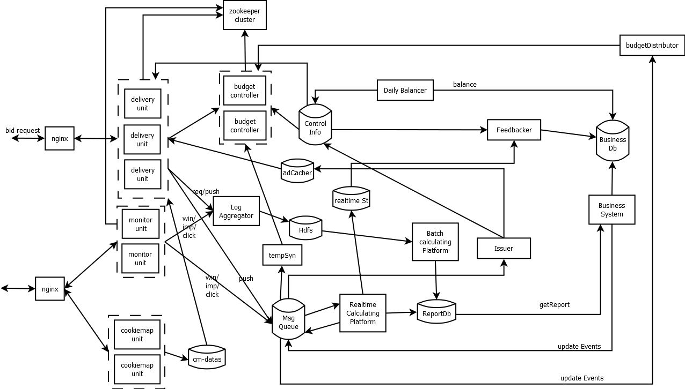

# DSP整体架构
***set_daemon@126.com 2018-04-16***

## 架构图


### Delivery Unit
投放单元，通过Nginx负载接入竞价流量，竞价请求为长连接。加入zookeeper集群管理。
1. 处理流程
流量适配、用户识别、地域识别、流量过滤及限流、人群查询、广告筛选、频次控制、点击率预估、价格预估、预算控制、广告Rank，竞价拼包、响应，记录日志。
2. 外部请求
* 用户识别 -- 比如PC/WAP流量，通过cookiemap数据查询对应的内部ID，这时会发起网络请求；而移动端用户，通过常见的AndroidId、Mac、IDFA和IMEI，本地处理即可。
* 人群查询 -- 使用用户ID通过网络查询人群信息，如demography、兴趣爱好，是否为可疑的作弊用户。
* 广告筛选 -- 理应通过一个分布式索引器做广告筛选。
* 频次控制 -- 查询用户在多个广告（非广告组和计划）上的当日投放次数，如果超过限制，则过滤掉该广告。
* 价格预估 -- 可能要查询计算出来的推荐广告位可能的竞价成功价格
* 预算控制 -- 请求预算控制器判别当前的广告是否可投
以上请求均会产生IO等待，即可以在这些点上做异步处理。

3. 框架/工作单元
动态配置管理线程、请求接入线程、请求处理线程、广告缓存线程、预算控制器监听线程构成。

4. zookeeper中的集群数据结构
```
|---deliveries
     |--- 01 (数据：{ip:"", port:"", id:""})
```

### Budget Controller
预算控制器，为投放单元提供实时预算控制。

1. 处理流程
* 优先处理控制消息，如广告主账户余额变化、计划预算变化、计划状态变化等，影响投放的信息。
* 其次是预算判别请求，由投放单元发来的请求，携带信息如[计划ID,出价]，返回[计划ID,是否可投]。
* 最后是实时推送/消耗消息，在内存中累积缓存起来，为同步数据做准备。

以上是由消息处理线程顺序处理，防止加锁。

2. 外部请求
无。

3. 框架/工作单元
三种消息接入线程分别监听和接收端口数据，通过三个队列发送给顺序处理线程，并由一个缓存线程将数据刷入磁盘，防止因意外丢失数据。

4. 控制逻辑
* 判别是否该计划出价是否可行的依据是，计划是否正常、全局投放开关是否开启、“伪push量”是否超过预算和广告主账户余额，如果未超过，将该出价累计到“伪push量上”，并反馈结果给对应的投放单元，如果原来有锁，去锁，否则，“锁定”该计划状态，并记录锁定时间。
* 收到控制信息中的同步真实push数据，如果锁定时长超过5秒，则同步真实push数据到“伪push量”，并比较真实推送数据是否已经达到限额，如果是，加“二重”锁定。
* 收到控制信息中的同步真实曝光数据，如果加的是“二重锁定”，且时长超过2分钟，则同步真实曝光数据到真实push数据以及“伪push量上”，如果此时都达到限额，则标识为“绝对锁定”，否则解锁。
* 收到刷数据至磁盘的消息，则将全量数据拷贝推送给刷磁盘线程。

5. 输入/输出
* 控制消息
	tcp承载，二进制数据，格式为：请求类型(1byte)、请求时间(4bytes)、请求ID(4bytes)、请求源类型(1byte)、请求源标识(4bytes)、数据长度(2bytes）、请求数据（不定，看具体请求）、校验值(4bytes，暂不使用)
| 类型值 | 类型说明       |   请求数据| 说明    |
| ---    | ---            | ---       | ---     |
| 1      | 广告主状态更新 |   广告主ID(4bytes)、状态(1byte)        |    无响应     |
| 2      | 广告主余额更新 |   广告主ID(4bytes)、余额(4byte，值*10000，整数)        |    无响应      |
| 3      | 计划状态更新   |   计划ID(4bytes)、状态(1byte)       |         |
| 4      | 计划预算更新   |   计划ID(4bytes)、总预算(4byte，值*10000，整数)、天预算(4byte，值*10000，整数)        |   无响应       |
| 5      | 同步数据请求   |       空           | 即将锁定的计划的真实数据刷到伪数据上；无响应  |
| 6      | 数据刷入磁盘   |    空              |  将变化的数据更新到磁盘；无响应    |
| 7      | 系统可投全局开关 |  状态(1byte,0或1) | 系统是否可投放                    |

* 预算判别请求
   tcp承载，二进制数据，格式为：请求类型(1byte)、请求时间(4bytes)、请求ID(4bytes)、请求源类型(1byte)、请求源标识(4bytes)、个数(1byte)、[计划ID(4bytes)、出价价格(4byte，值*10000)]
   响应数据格式：响应类型(1byte)、响应时间(4bytes)、响应ID(4bytes)、响应源类型(1byte)、响应源标识(4bytes)、个数(1byte)、[计划ID(4bytes)、允许出价(1byte，0或者1)]

* 推送/消耗消息
	tcp承载，二进制数据，格式为：请求类型(1byte)、请求时间(4bytes)、请求ID(4bytes)、请求源类型(1byte)、请求源标识(4bytes)、预算控制器id(1byte)、个数(1byte)、[广告主ID(4bytes)、计划ID(4bytes)、push价格(4bytes，*10000)、曝光价格(4bytes，*10000)]


以上数据接口暂时自行解析，以后可采用thrift或protobuf来实现。

6. 部署
可多个实例部署，投放单元查询请求可均衡负载到这些控制器，并将推送与控制器ID关联，发生真实推送前，将推送信息发送给对应控制器，且在实时流统计时，也将来自该控制器的推送和曝光数据发送到对应的控制器上。

下发器根据控制器个数，平均分配预算给控制器。

7. 问题
* 可能会出现有的控制器提前消耗完预算，而有的无法消耗完，在投放单元使用Round Robin均衡方法可尽可能消除影响。
* 如果升级，则需要先全局停广告后，等待5分钟左右；
* 如果某个控制器出现异常，则向该控制器传递数据的模块需要感知，并且将数据缓存等下次启动；或者将数据放入消息队列中等待启动时消费。

### Budget Distributor
预算分配器，根据业务系统的数据变化，分配预算给预算控制器。

1. 处理流程
监听预算控制器的变化（zookeeper），如果发生变化，则读取缓存中的广告主和广告计划信息，如账户余额、预算，根据当前的预算控制器进行平均分配。
监听业务数据变化事件（kafka），变更相应计划/广告主在预算控制器的分配。

2. 框架/服务单元
监视预算控制器的线程，以及监听业务事件线程。

3. 输入/输出
3.1 输入
* 监听zookeeper上的`/budgetors`路径。
	-- 即当前预算控制器的活跃列表
* 监听读取kafka的topic`businessEvent`
	-- 广告主余额变更：{cmd:sponsor_balance_update, sponsor_id:1333, newBalance:30.0}
	-- 广告主状态变更：{cmd:sponsor_status_update, sponsor_id:1333, newStatus: 1}
	-- 计划预算变更：{cmd:plan_budget_update, plan_id:4444, newDayBudget: 33344, newBudget:44444}
	-- 计划状态变更：{cmd:plan_status_update, plan_id:4444, newStatus: 0}
* 读取缓存（redis）上的计划、广告主信息
	-- 今日投放的广告主集合，sponsors:{day} 
	-- 今日投放的广告计划集合，plans:{day}
	-- 计划状态：plan:{plan_id}，包括属性有，status、total_budget、day_budget
	-- 广告主状态：sponsor:{sponsor_id}，包括的属性有：status、balance

4. 部署
	单节点部署，性能上可以保证。

### tempSync
临时同步器，实现小batch数据同步到BudgetController，降低接收端的压力。

### Monitor Unit
监控单元，监控数据项有：bid win, ad impression, ad click。使用zookeeper做集群管理。
1. 处理流程
根据URL中的特征，识别请求平台类型，获取平台处理器，处理请求，记录日志，发送日志。

2. 外部请求
* 发送日志 -- 发送至诸如kafka的消息队列。

3. 框架/服务单元

4. 控制逻辑

5. 部署


### Cookemap Unit
cookiemap单元

### Log Aggregator
日志聚合器


### Issuer
业务数据下发器，连接投放系统和业务系统。

### Feedbacker
反馈器，将线上投放情况反馈至业务系统。

### Daily Balancer
日结算器。

### Business System
业务系统，提供业务操作服务。
