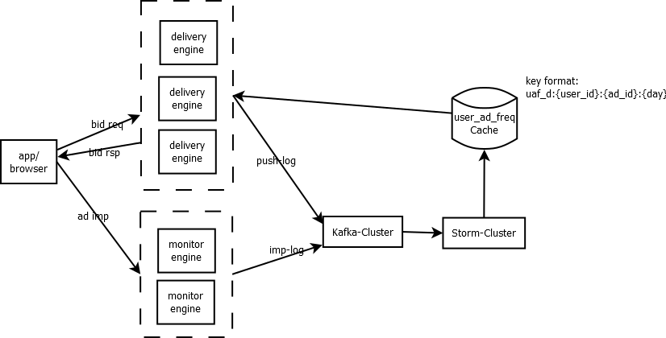

# DSP用户频次控制
***set_daemon@126.com  2018-04-06***

## 用户频次控制的意义
1 降低预算浪费的可能性
  如果是效果广告，超过5次左右，用户仍然没有转化的话，之后再多次曝光给该用户效果也不大，同样对于品牌广告（同样的素材），过多的曝光会引起用户的反感。
2 防作弊
  当有不正当渠道刷量时，一定程度上还可以降低作弊量带来的巨大预算浪费。比如，作弊渠道有10万台真假设备，如果不加频控，每个广告可能会被同一个用户一天刷100次，而加上频控后（一般设定5次），降低了20倍的浪费。
3 提升效果
  不浪费对系统而言就是提升，比如不加控制的曝光10000次，点击50次，点击率为0.5%，而控制之后，曝光变为3000次，点击50次，点击率为1.67%。

## 系统架构

其中，delivery engine为投放引擎，线上实际会部署多个，以横向扩展负载；monitor engine为监测引擎，相对来说处理逻辑和流程比较简单，但在广告投放量大时，还是有其瓶颈，这一端处理的主要是短链接。广告推送日志和曝光监测日志会通过网络发送给kafka在线消息队列，之后由工作在storm之上的实时统计任务计算单次/批量的用户广告投放报表数据推送（这里为累加）到缓存（redis）中，其key格式为uaf_d:{user_id}:{ad_id}:{day}，例如uaf_d:34771233:3:20180406，数据内容格式为：push(int), last_push_time(unix timestamp), imp(int), last_imp_time(unix timestamp)。

一般，这一套架构足够把频次控制的功能跑起来。

## 关键点
1 用户识别
  PC web和移动wap通常采用cookie做用户识别，这牵涉到cookiemap过程（如果对接了多个adexchange，那么内部的cookie id可以映射多个外部cookie id，对用户的识别度更高）；移动APP一般有android ID、IMEI、IDFA、MAC，而渠道方有可能会对原始数据加密（可逆或不可逆），所以，一般为了识别加密和不加密两种场景下的用户ID，内部有必要对给过来的非加密ID做加密处理，尽量识别唯一用户。当然，有的渠道如果获取不到设备ID，会给一个默认值，比如一串0,这种情况也不少。
2 实时计算
  频次控制不可能做成离线形式，必须要实时，当然不可能完全实时，一般会有毫秒级的时延，kafka+storm的方案可以满足需求。
3 一致性要求
  由于线上的投放是并行的，以及广告投放、广告曝光到通过监测系统进入到实时计算系统会消耗一定的时间（正常1秒内），所以，频次控制是否要和是否能做到完全一致性（比如控制5次，绝对不能超过该数）是系统复杂性体现的一个点。
4 缓存能力
  一般，能接入的用户大概会有亿级别，系统投放的广告量也可能成千上万（公司业务相关），一天产生的key将达到千亿甚至万亿级别，按照一个key消耗的内存大约60字节，如果纯内存缓存系统，大概要消耗100000000*1000*60.0/1024/1024/1024=5587.9GB内存，大约5T的量（受眼界影响，最大的也就只见过128GB的），单机应该不支持这么大内存，那必须要有集群方案，redis是一种选择，其它磁盘型的缓存系统也可能是一种选择（但请求的数据随机性很大，SSD的磁盘不知道能不能抗得住）。

## 优化和完善方案
  目标：降低或杜绝超频。
### 杜绝超频
  构建分布式锁，资源名称可为：dlock_{user_id}_{ad_id}_{day}，使用redis实现（setnx/expire/delete，注意：锁的量级依然巨大）。
  在投放引擎中，rank流程之后，对每个候选广告加锁访问，对获取到锁的广告（候选广告的量可能会比较大，要严格控制时间）设置过期时间，该时间应与监测引擎上设置的曝光有效时长一致，并且，在实时流统计时，如果有该锁的曝光，即将该锁删除。这样下来，无论因为投放引擎的并行化，还是曝光的时延，都可以完全控制住频次。
  问题：这种方案会增加系统的复杂性和资源的消耗，带来的收益是否能平衡，需要细细核算。
### 降低超频
  暂时没想到好的方案（20180408)。 
