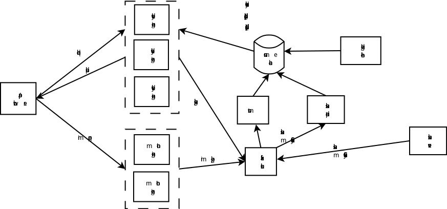

# DSP预算控制
***set_daemon@126.com 2018-04-07***
## 预算控制的意义
按照业务定义，广告分层为计划、分组和广告，其中计划通常与订单合同相关，会有投放期、总预算及日预算的要求，这里说的预算控制即为订单总预算不能超（超了算平台的），日预算也不能超（业务需求），所以必须满足这两点要求，既要达到客户提出的需求，也不能让平台亏。
另外，如果投放不加平滑，在数据上不好看，同时也不利于采购不同时段的流量，所以，预算控制还包括平滑投放。

## 架构

如图所示。由于计划不完全依赖于合同，业务系统允许用户修改总预算和日预算，以实时控制投放的量，所以，在用户修改时，系统会做两件事情：1)检查总预算是否低于已消耗的量，如果低于，则暂停投放，并告知用户，同时检查日预算是否低于当日已消耗的量，则暂停计划，并告知用户 2）以事件的方式告诉“下发服务”，预算发生改变。
预算控制器定时检查计划和广告主的实时消耗数据，如果达到预期的量，则停止本日投放。

按照上述架构，基本可以实现预算控制的功能。

### 实时计算
实时计算模块从Kafka中主动拉取消息，曝光日志中含有当前竞价成功的价格，统计后将信息再推入到缓存中，在缓存压力较大时，可以以batch更新的方式推入，但最多不能超过50毫秒。

### 预算控制逻辑
由于预算控制需要接近实时检查计划的消耗，为了减少对业务数据库的访问压力以及提升查询速度，每日凌晨结算后下发总预算和日预算到缓存（redis），同时通过事件的方式实时通知更新，控制器定时（50毫秒）扫描缓存中当日可投放的计划、广告主余额、广告主和计划当日消耗，在以下逻辑下控制投放：  
&nbsp;$nbsp;获得广告主余额AccountRemains，获得计划日预算PlanDayBudget，总预算PlanTotalBudget，广告主当日消耗SponsorDayConsumes，计划当日消耗PlanDayConsumes，计划总消耗PlanTotalConsumes； 
	如果AccountRemains<=0 OR SponsorDayConsumes >= AccountRemains，则将该广告主下的所有计划停投； 
	否则， 
	&nbsp;&nbsp;如果PlanTotalConsumes >= PlanTotalBudget，则将该计划停投； 
	&nbsp;&nbsp;否则，如果PlanDayConsumes >= PlanDayBudget，则将该计划停投； 
控制计划的方式为修改缓存中键plan_st_{planId}的状态实现投放或停投，投放引擎会在每次投放前检查该状态。

### 平滑控制逻辑
由于计划下面的广告组会设定投放时段，所以每日结算后，会将当日可投计划下的所有可投广告组的时段下发到缓存，在业务端操作修改时间段策略以及暂停或开启某些广告组的投放时，以事件的方式通知更新；
平滑控制器定时（50毫秒）扫描缓存中当日可投放计划，以及当前计划的日消耗、5分钟消耗情况（一天有24*60/5=168个5分钟间隔），根据以下逻辑来控制计划是否可投： 
&nbsp;&nbsp;获得计划日预算PlanDayBudget，日消耗PlanDayConsumes，当前时间下可投的时段数RemainHours（统计广告组的当日可投时段以及当前小时），计算出剩余5分钟间隔量Intervals，计算得出每个interval的可用预算IntervalBudget=(PlanDayBudget-PlanDayConsumes)/Intervals
&nbsp;&nbsp;如果当前间隔消耗量curIntervalConsumes >= IntervalBudget，则暂停该计划。

如果预算控制逻辑和平滑控制逻辑分开定时执行，会对计划的控制状态产生混乱，所以最终应合在一个逻辑中。

## 优化和完善
在预算较小以及出价过快、价格比较高的时候，且线上多个投放引擎同时工作，曝光反馈会有一个时延，所以非常容易超投，优化的目标即为降低超投。
