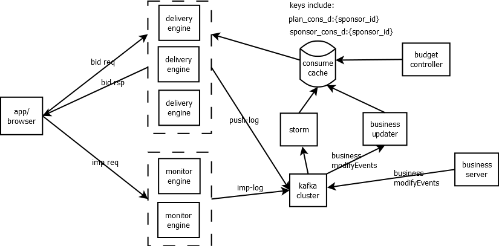

# DSP预算控制
***set_daemon@126.com 2018-04-07***
## 预算控制的意义
按照业务定义，广告分层为计划、分组和广告，其中计划通常与订单合同相关，会有投放期、总预算及日预算的要求，这里说的预算控制即为订单总预算不能超（超了算平台的），日预算也不能超（业务需求），所以必须满足这两点要求，既要达到客户提出的需求，也不能让平台亏。
另外，如果投放不加平滑，在数据上不好看，同时也不利于采购不同时段的流量，所以，预算控制还包括平滑投放。

## 架构

如图所示。由于计划不完全依赖于合同，业务系统允许用户修改总预算和日预算，以实时控制投放的量，所以，在用户修改时，系统会做两件事情：1)检查总预算是否低于已消耗的量，如果低于，则暂停投放，并告知用户，同时检查日预算是否低于当日已消耗的量，则暂停计划，并告知用户 2）以事件的方式告诉“下发服务”，预算发生改变。
预算控制器定时检查计划和广告主的实时消耗数据，如果达到预期的量，则停止本日投放。

按照上述架构，基本可以实现预算控制的功能。

### 实时计算
实时计算模块从Kafka中主动拉取消息，曝光日志中含有当前竞价成功的价格，统计后将信息再推入到缓存中，在缓存压力较大时，可以以batch更新的方式推入，但最多不能超过50毫秒。

### 预算控制逻辑
由于预算控制需要接近实时检查计划的消耗，为了减少对业务数据库的访问压力以及提升查询速度，每日凌晨结算后下发总预算和日预算到缓存（redis），同时通过事件的方式实时通知更新，控制器定时（50毫秒）扫描缓存中当日可投放的计划、广告主余额、广告主和计划当日消耗，在以下逻辑下控制投放：  
&nbsp;$nbsp;获得广告主余额AccountRemains，获得计划日预算PlanDayBudget，总预算PlanTotalBudget，广告主当日消耗SponsorDayConsumes，计划当日消耗PlanDayConsumes，计划总消耗PlanTotalConsumes； 
	如果AccountRemains<=0 OR SponsorDayConsumes >= AccountRemains，则将该广告主下的所有计划停投； 
	否则， 
	&nbsp;&nbsp;如果PlanTotalConsumes >= PlanTotalBudget，则将该计划停投； 
	&nbsp;&nbsp;否则，如果PlanDayConsumes >= PlanDayBudget，则将该计划停投； 
控制计划的方式为修改缓存中键plan_st_{planId}的状态实现投放或停投，投放引擎会在每次投放前检查该状态。

### 平滑控制逻辑
由于计划下面的广告组会设定投放时段，所以每日结算后，会将当日可投计划下的所有可投广告组的时段下发到缓存，在业务端操作修改时间段策略以及暂停或开启某些广告组的投放时，以事件的方式通知更新；
平滑控制器定时（50毫秒）扫描缓存中当日可投放计划，以及当前计划的日消耗、5分钟消耗情况（一天有24*60/5=168个5分钟间隔），根据以下逻辑来控制计划是否可投： 
&nbsp;&nbsp;获得计划日预算PlanDayBudget，日消耗PlanDayConsumes，当前时间下可投的时段数RemainHours（统计广告组的当日可投时段以及当前小时），计算出剩余5分钟间隔量Intervals，计算得出每个interval的可用预算IntervalBudget=(PlanDayBudget-PlanDayConsumes)/Intervals
&nbsp;&nbsp;如果当前间隔消耗量curIntervalConsumes >= IntervalBudget，则暂停该计划。

如果预算控制逻辑和平滑控制逻辑分开定时执行，会对计划的控制状态产生混乱，所以最终应合在一个逻辑中。

## 优化和完善
### 降低超投
在预算较小以及出价过快、价格比较高的时候，且线上多个投放引擎同时工作，曝光反馈会有一个时延，所以非常容易超投，优化的目标之一为降低超投。
平滑投放的附加功能是增加了控制力度，但不能完全消除超投。有以下方案可以逐步降低超投：
* 每个投放机都能感知到投放机的总数N（统一注册到某个监测服务上，比如zookeeper，该服务会将当前活跃的投放机总数反馈回来），假设每个投放机对每个计划都是等概率投放的，那么每个投放机能分配到的预算即为当前计划总预算的1/N。

* 每个投放机在投放一次广告后，将该次单价（cpm/1000）累加到缓存的同一个KEY上，例如plan_dcon:{plan_id}:{day}，形成“伪消耗量”--P，控制器定时检查，得到计划当日实时真实消耗量C，以及计划日预算B，如果剩余量(B-P) <= N，则“封锁”该计划t秒钟（为了回收前一批推送的结果），在t秒钟后，同步实时消耗量C到P（即P恢复为真实数据），如果剩余量大于N元，则“解封”计划。该方案会对投放机增加一次网络访问时间（但可以设计成异步），折中方案为实时流本来就可以统计推送数据，相比投放机的即时累计，会晚几十毫秒或者更多些。

* 增加一个预算控制器，为每个可能的计划推送分配“虚拟令牌”，一个计划的总令牌数（预算金额表示）固定，每次“投放单元”向控制器询问某个计划在P元时是否可投，如果可投，返回该计划该金额可投，并将金额累加到该计划的伪推送量上，如果伪推送量大于等于实际预算，则不可投，该计划锁闭一定时间后，通过实际的推送量来更新（相当于定时回收发放下去的令牌），如果这时还是大于等于实际预算，那么进入回收曝光的锁定状态，在一定时间（10秒～15秒）后更新实际曝光费用到推送量，进而更新到伪推送量上，检查是否未达到总预算，来判断后续的请求是否可投。
相比第二个方案，会直接与投放单元进行交互以实现近完美控制预算，但带来的架构变更、模块设计的复杂性大大增加，并发接入请求，顺序处理请求，需要同步实时投放数据、业务变更信息等，单例服务按照理论估计，一个请求处理在20us～50us就能完成（大都是内存操作），如果投放单元的实例个数以及并发量超过2万，则无法承受，缓存数据需要定时刷磁盘（逐渐变得像redis）。
如果要实现多实例工作，则必须保证：1）发出推送令牌要回到发送者手里 2）曝光要回到发送推送令牌的控制器上  3）计划预算要在多个控制器实例上做平均分配。 如果其中一个要升级或出现问题，怎么保证数据再按上面的要求再进去？（要历史积压起来，然后在该控制器启动后再传递）。

### 控制逻辑
当客户量比较大、计划数达到一定量级时，单个控制逻辑体会在计算上会产生较大延迟，比如原先定义50毫秒处理一次数据，而处理的时长可能会超过50ms，那么由定时器触发的，前一次还未完成，新的又到来，就算可以保持结果正确，但是会影响正常的业务控制。所以，对控制器的架构调整极为有必要。
首先，为每个客户产生一个控制器，即控制器集群；
其次，以消息驱动的方式，将控制器接入到消息队列，由一个中心调度器发送消息给控制器，以方便制定计划，并由控制器快速可靠的执行。
最后，收集和分析执行记录，方便发现和定位问题。
