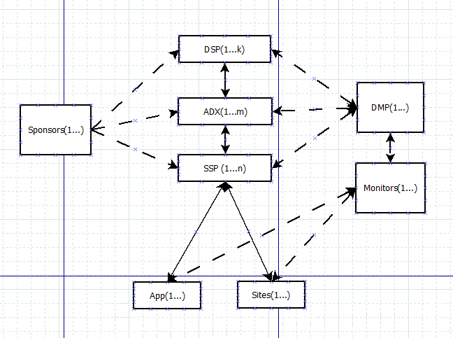
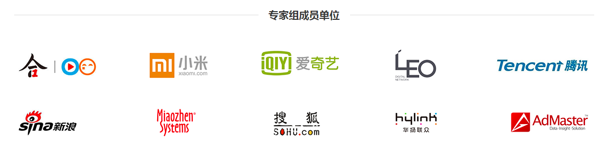

# dsp广告系统-数据平台的一些想法

***set_daemon@126.com    2017-08-17***

## dsp的江湖地位

dsp的位置挺尴尬，明明是demand side platform，大部分独立dsp还兼干着类似ssp的活，比如销售或者领导嘴上跑了火车，客户KPI不能达标，自己利益是绝对不能损害，面子也不能丢，那怎么办？

​	找运营商刷真流量，这是好的；

​	找其它平台扣指标，救命于危难间，背锅的；其它平台处理方式自行递归；

​	自己刷量，纯粹作假，坏坏哒；

​	直接改数据还能不被发现，最牛逼！

大家都说客户太牛逼了，以至于sa-波了，给钱让吃屎，你不吃，有人会抢着吃，吃完的人擦擦嘴还说好吃、健康的味道，客户爽了，接着拉更臭的屎掏钱请人吃，直到客户发现，妈蛋，我好像病了，为什么那群sa-波骗我？于是反思，痛定思痛，直接砍掉一些吃屎的合作方，留下一些貌似忠厚耿直却又有一定江湖地位的，同时以不无警告的意味，我们要加强各种防御措施，拉电网，建关卡，坚堡垒，筑长城，要品牌，还要效果，当红打手纷纷表示要撸起袖子加油干。（这一段瞎写的，别当真）

言归正传，dsp不好干。

## 数据来源

如下简图所示，关系远比这要复杂，线太多也不容易看清楚，干脆简单点。dsp在最边际、尴尬无比的地方，想做独立dsp，广告主几乎不能提供数据，而用户流量数据也受限于前置平台，而且一般dsp平台又会出现“蛋生鸡，鸡生蛋”的窘境：客户会问流量、价格怎么样，ADX/SSP会问你的客户消耗情况怎么样，初建时，两方其实都会缺，怎么弄？只能依靠强大的心理上演一出“空手套白狼”的戏，客户问时，告诉客户，我们有强大的技术能力和数据挖掘能力，每天数十亿的流量接入，流量方都是好哥们，妥妥的可以满足KPI；ADX/SSP问时，告诉他们，客户预算很大，对各类资源都有大量需求，而且客户关系非常好，您就等着放量变现吧；如果胆小点的，直接关门卷铺盖走人。

当然，以上只是分析弊端，下面分析优势，从结构上来看，dsp有这个节点优势，背靠客户（如果真有的话），把所有的平台、媒体都覆盖上还是比较靠谱的，但ADX/SSP这些媒体代理平台就不同，媒体的考虑会更现实，你家平台变现能力差，我就找别家，所以中间代理平台会出现多家，每家的覆盖量有大有小，但dsp把这些都对接上，理论上会有“海纳百川”的效果。

说到这里，脑海中出现成龙洗发水的广告，不停“duang duang duang"。没有平台能真做到“海纳百川”，谍报司也没办法把所有数据都监控起来。虽有遗憾，但反过来想想，大家做不到那么好，但是也可以继续做，梦想总得有，万一实现了呢？

## 数据类型

dsp平台应该要做到记录最基本的数据：竞价请求，广告推送，竞价成功，广告曝光，广告点击。客情关系好一点的，在落地页上、下载动作等上面加点监测，收集到转化数据对于做转化分析挖掘是极有好处的。

下面分别分析各种类型的数据。

#### 竞价请求

​	根据IAB的标准规范，一个竞价请求里面要包括：广告位的信息、所在媒体信息、用户信息、设备信息、位置信息、媒体限制、广告位限制。

​	识别用户这个问题首当其冲，用户不识别，没法继续做频次控制、标签定向，移动端相对好一些，能通过sdk获取到例如***imei/idfa/mac/android id***类似的数据，不过传递到dsp的时候可能会各种加密，而不是原始id，更为难的是不同平台可能用的加密算法不一样，一个用户可能会识别成多个；pc端一般做cookiemap，很耗费资源，然后在请求时将平台给的用户id做个映射查询，找到dsp的用户id，这样，如果dsp与各个平台都打通了pc的cookiemap，倒是更方便做跨平台的唯一用户识别，只是cookie数据就像豆腐，放了一段时间会变味儿，虽然还可以吃，但终究不是原来那样的。

​	客户的产品大多有地域倾向，所以地域的准确度会影响投放策略正常执行，可以从请求中取出设备联网ip，用ip反查地域。公司小要省钱的话，可以用[ip纯真库](http://www.cz88.net/)，准确度还可以，但是如果客户要搞第三方监测，最好是用[IP地理位置标准委员会](http://www.iac-i.org/)提供的ip库，原因在下图，“就算错大家都错成一样，那就是对的”。其它家，如[淘宝ip库](http://ip.taobao.com/)没用过，提供公开查询服务，应该也还可以，问题是会麻烦点。更多的有[ipip](http://www.ipip.net/)，高春辉大师搞出的来的。

​	

#### 广告推送

​	记录dsp选择了哪个广告进行投放，其中有一个比较重要的pushid比较重要，用于和后面的转化打通，串联起来可以做一级过滤，即没投放过的广告还能有曝光？

#### 竞价成功

​	由adx告知dsp，参与竞价成功，有机会展示广告，一般adx会发出这个通知，并带上价格。但是由于结算按cpm，有的平台省了这步，也相当于节约了服务资源。

#### 广告曝光

​	广告在设备上渲染展示，监听到该事件时，会同时向多个监测方发送请求，一般是异步执行。行业里都在说广告真实曝光和可见性的问题，落到执行的时候，监测脚本要检测渲染结果和展示环境（如是否在第一屏）来判断能不能把曝光监测请求发出去。

#### 广告点击

​	广告点击发生的原因有以下几个：1）确实是感兴趣的用户点击 2）手指头较粗的用户不小心点到的 3）通过人工 智能点击（脑补下一个蓬头散发的人在一堆设备面前使用一阳指） 4）机器人点击（这个极为牛逼）

## 数据需求

主要分广告主和运营人员两个角色。

#### 广告主

​	账户里面还有多少钱，够花几天的；

​	花了多少钱，广告有多少曝光和点击，转化怎么样，投了多少人，在哪里投的；

#### 运营人员

​	哪些广告主快没钱了，该通知的通知；

​	广告主们都投了哪些广告，广告的投放转化效果怎么样，效果不好要先分析原因，哪些媒体表现不佳可能是质量就差，广告位转化率低是不是因为位置太偏，或者新疆投放量大但是点击少，又或是android用户购买欲望不高不如投ios的等等，需要一个钻探工具来维度组合分析，最终给广告主建议；

​	各大流量平台的消耗情况是什么样的，和他们的数据差异大不大，大的话要暂停这些平台的投放，跟研发沟通；

​	广告主预算花的太快了，得缓着来；

​	为毛一个人看了这个广告多次，该用户会不会愤怒了？

​	

## 技术选型

​	kafka + storm + zookeeper + redis：打通实时流处理通道；

​	flume + hadoop + spark + hive + mongodb： 打通离线处理通道

## 数据指标

## ETL流程

