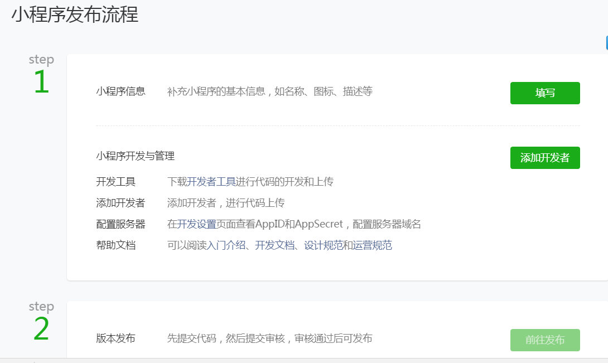
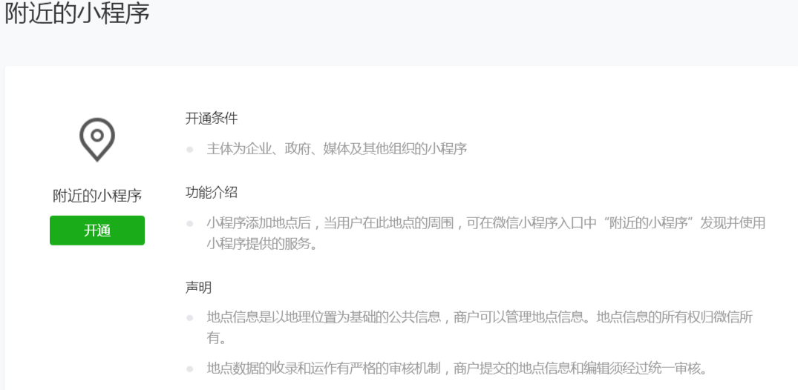

# 微信小程序调研

***set_daemon@126.com 2017-09-07***

## 目的

调研技术接口；

调研支持的业务场景；

调研微信运作小程序的机制（如附近的小程序）；

调研微信小程序的案例；

##注册微信小程序开发管理账号

访问https://mp.weixin.qq.com，点击注册后，选择“小程序”，之后按步骤一步步往下即可。

注意：个人账号的权限比较少。更详细的信息参考链接https://mp.weixin.qq.com/debug/wxadoc/introduction/index.html?t=1504750366。

##开发流程

登录到小程序后台，可以看到“小程序发布流程”：

管理员可以添加新的开发者，赋予不同的权限，管理员本身也可以是开发者。

下载开发工具，可以在手机上预览效果。

## API功能

#### 网络服务

文件上传、下载；

WebSocket；

#### 媒体服务

相册选择、拍照、预览；

录音、播放录音；

视频选择/拍摄；

音乐播放；

#### 文件服务

文件打开、保存、删除；

#### 数据服务

本地缓存管理；

#### 位置服务

位置获取、打开地图；

#### 设备服务

设备信息、网络、扫码、拨打电话、罗盘、加速度、剪贴板；

#### 界面服务

窗口、导航、标题、菜单、弹窗、动画、绘图；

#### WXML节点管理

选择器、布局、滚动；

#### 开放接口

登录、用户信息、收货、支付、卡券；

## 案例

#### 有赞

官网：https://www.youzan.com

提供微商城、零售、餐饮、美业、收银、批发解决方案；

#### 给赞

#### 晓商+

官网：http://www.xsplus.cn/index.html

提供零售商场、智慧门店、企业展示、餐饮外卖等saas解决方案；

## 问题

#### 附近的小程序如何生成的

参考链接https://mp.weixin.qq.com/wxopen/entityshop?action=info&lang=zh_CN&token=1795388019，截图如下：

#### 什么样的主体才能认证

除个人外，其他都可以。

## 参考

https://mp.weixin.qq.com/debug/wxadoc/dev/

小程序的红利期http://mp.weixin.qq.com/s/8wXzBU79EO-gzPdw6fD_xA