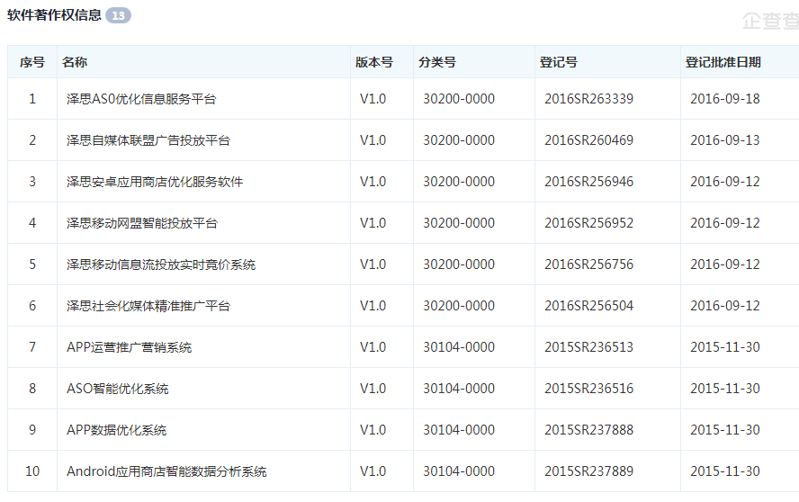

# 移动APP推广厂商渠道汇总

***set_daemon@126.com 2017-09-06***

## 目的

汇总移动推广厂商、渠道信息，调研这些厂商做了有哪些渠道、工具、执行思路。

## 泽思

官网地址：http://www.zesmob.com

公司信息：http://www.qichacha.com/firm_7314ef915934cd6431fec1ae396e036f.html

综合渠道移动推广厂商；

软件著作权：

#### 服务项目

应用商店优化   AppStore Optimization

苹果App推广  iOS Promotion

安卓App推广 Android Promotion

#### 渠道

App推广渠道资源；    ==>  有哪些？ 投DSP？

提升App知名度、下载量；  ==> 即做品牌、也做效果。

ASO优化：应用标题、关键词、下载量、评论，提升搜索热词覆盖量和排名 ==>搜索优化，尽量可以被搜索到

榜单优化：总榜/分类榜/热搜榜

付费推广：应用商店精准投放（CPD、CPC）

评测媒体曝光：原创评测发布至主流门户、垂直媒体； ==> 写写软文？

信息流广告投放：微信、今日头条等HeroApp广告投放；

移动广告联盟推广：投放In-App内广告（CPA、CPC）；

DSP广告效果营销：

移动搜索SEM营销：官网SEO、百科、问答等建立品牌信息；移动SEM推广；

#### 执行流程

**1、应用分析报告：**通过App营销工具针对应用现状（下载、排名、搜索、竞品、评论等）进行全面的数据分析；

**2、目标用户定位：**制订多类标签确定目标用户群，并与客户沟通商议App推广指标（激活、注册、活跃、留存）；

**3、精准营销方案：**分阶段制定手机App推广方案，精准投放手机App的目标受众，有效提升手机App推广的ROI；

**4、应用数据分析：**通过友盟或TalkingData等监测和追踪各个App推广渠道效果，统计分析用户使用的各项数据；

**5、推广优化改进：**根据上一阶段的推广数据分析结果，优化下一阶段推广策略，形成一个循环优化的App推广模式。

#### AARRR数据模型

AARRR：Acquisition、Activation、Retention、Revenue、Refer，产品周期5个重要环节。

**获取用户：**通过App推广鼓励用户下载安装、打开试用；

**提高活跃度：**关注日活跃用户DAU、月活跃用户MAU；

**提高留存率：**不断优化提高App的日留存率、周留存率；

**获取收入：**提升付费、应用内付费、广告等类型的充值；

**自传播：**建立社交网络（微信、微博）的病毒式口碑传播。

#### 具体工具和渠道

参考：http://www.zesmob.com/app-tools

###### ASO优化工具

​	针对苹果&安卓应用商店榜单、热搜、搜索等数据进行分析的ASO优化工具

1 国内ASO工具

​	ASO100 https://aso100.com/

​	CQASO http://www.cqaso.com/

​	德普优化 http://www.deepaso.com/

​	ASO114  http://aso114.com/

​	酷传  http://www.coolchuan.com/

​	爱盈利 http://rank.aiyingli.com/

​	应用雷达  http://www.ann9.com/

​	蝉大师 http://www.chandashi.com/

​	AppDuu http://www.appduu.com/

​	ASOU http://www.asou.com/

​	AppBK http://www.appbk.com/

​	果搜  http://www.guoaso.com/

​	应用微风 http://appvf.com/

​	清源火眼  http://www.huoyanapp.com/

2 国外ASO工具

​	AppAnnie  https://www.appannie.com/cn/

​	SearchMan  https://searchman.com/

​	KeywordTool  http://keywordtool.io/app-store

​	AppTweak https://www.apptweak.com/

​	MobileAction  https://www.mobileaction.co/

###### 应用市场发布

​	国内主流安卓&苹果应用市场，提供各大应用商店开发者应用提交入口

1 苹果商店

​	AppStore  https://itunesconnect.apple.com/itc/static/login

​	91  http://app.91.com/

​	PP  http://dev.pp.cn/

​	iTools  http://open.itools.cn/

​	同步推  http://dev.tongbu.com/

​	爱思 http://www.i4.cn/

​	XY http://dev.xyzs.com/dev

​	快用  http://developer.kuaiyong.com/

​	海马  http://www.haima.me/mark/developer.html

​	叉叉  http://www.xxzhushou.cn/

2 安卓厂商

​	小米  http://dev.xiaomi.com/

​	华为  http://developer.huawei.com/

​	OPPO  http://open.oppomobile.com/

​	魅族  http://open.flyme.cn/

​	乐视  http://open.letv.com/dev-web/index.html

​	联想  http://open.lenovo.com/developer/

​	锤子  http://dev.smartisan.com/

​	VIVO  https://dev.vivo.com.cn/

​	金立  http://open.appgionee.com/

​	酷派  http://dev.yulong.com/login.html

3 安卓助手

​	360  http://dev.360.cn/

​	应用宝  http://open.qq.com/

​	百度（91&安卓）http://app.baidu.com/

​	PP（淘宝&UC）http://open.apps.uc.cn/

​	豌豆荚  http://developer.wandoujia.com/

​	搜狗  http://zhushou.sogou.com/open/

4 安卓商店

​	安智  http://dev.anzhi.com/

​	应用汇   http://dev.appchina.com/dev/index

​	木蚂蚁  http://dev.mumayi.com/

​	机锋  http://dev.gfan.com/

​	历趣  http://dev.liqucn.com/

​	优亿  http://dev.eoemarket.com/

​	谷歌  https://play.google.com/apps/publish/

​	电信  http://ap.189store.com/Home/APLogin

​	移动  http://dev.10086.cn/

​	联通  http://dev.wo.com.cn/index.action

######移动应用统计

​	统计和分析应用新增用户、活跃用户、启动次数、使用时长、渠道来源等数据

1 国内

​	友盟+  http://www.umeng.com/

​	TalkingData  https://www.talkingdata.com/

​	Cobub  http://www.cobub.com/

​	热云  http://reyun.com/

​	精硕   http://www.admaster.com.cn/

​	秒针  http://www.miaozhen.com/index.html

​	莲子  http://www.lotuseed.com/

 	魔方   http://www.imofan.com/

​	腾讯  http://mta.qq.com/mta/

​	百度https://mtj.baidu.com/web/welcome/login

2 国外

​	Flurry  https://developer.yahoo.com/

​	AppAnnie   https://www.appannie.com/cn/

​	AppsFlyer  https://support.appsflyer.com/hc/zh-cn

​	Appfigures   https://appfigures.com/

​	TapStream   https://www.tapstream.com/

​	Localytics  https://www.localytics.com/hello/

​	Countly  https://count.ly/

###### 移动广告渠道

1 应用商店

​	360  http://e.360.cn/

​	应用宝  http://open.qq.com/

​	百度  http://baitong.baidu.com/login.html

​	小米  http://e.mi.com/

​	华为  http://developer.huawei.com/cn/consumer

​	OPPO  http://open.oppomobile.com/

​	魅族  http://e.flyme.cn/views/index.html

​	PP  http://dev.pp.cn/

​	豌豆荚   http://open.wandoujia.com/home

​	YunOS   http://appdev.yunos.com/

2 信息流

​	 今日头条	https://ad.toutiao.com/login/

​	 广点通	http://e.qq.com/index.shtml

​	 腾讯智汇推    http://snswin.qq.com/

​	 粉丝通      http://tui.weibo.com/

​	 新浪扶翼    http://sea.sina.com.cn/

​	  陌陌         http://ad.immomo.com/ad/home/login

​	 搜狐汇算   http://hui.sohu.com/

​	  UC             http://ads.uc.cn/

3 DSP平台

​	新数	http://www.wisemedia.cn/

​	璧合	http://www.behe.com/

​	舜飞	http://www.sunteng.com/

​	 品友	http://www.ipinyou.com.cn/

​	悠易	http://www.yoyi.com.cn/index.html

​	瑞狮	http://www.vlion.cn/

​	智云众	http://www.optaim.com/

​	 传漾	http://www.adsame.com/

​	MediaV	http://www.mediav.cn/index.html

​	 好耶	http://winmax.allyes.com/

4 移动搜索

​      百度移动搜索推广	http://e.baidu.com/

​	神马移动搜索推广	https://e.sm.cn/

​	 搜狗移动搜索推广	http://fuwu.sogou.com/index.html

​	好搜移动搜索推广	http://e.360.cn/

5 移动网盟

​	万普 	 http://www.waps.cn/

​	点入	http://www.dianru.com/

 	多盟	http://www.domob.cn/

 	力美	http://www.limei.com/

​	有米	https://www.youmi.net/

 	亿动智道	http://www.smartmad.com/

​	 艾德思奇 http://www.adsage.cn/

​	Adview	http://www.adview.cn/

​	InMobi	http://china.inmobi.com/

###### 其它渠道

其他App推广渠道，包含行业资讯媒体、软件下载网站、预装刷机渠道

1 行业资讯

​	威锋网   http://www.feng.com/

​	 苹果园  http://www.app111.com/)

​	爱应用   http://www.iapps.im/

​	 机锋网   http://www.gfan.com/

​	虎嗅网   https://www.huxiu.com/
​	 36氪     http://36kr.com/

​	钛媒体   http://www.tmtpost.com/

​	 艾瑞网  http://www.iresearch.cn/

​	 App营  http://www.appying.com/

2 下载网站

​	ZOL   http://sj.zol.com.cn/

​	PC6   http://www.pc6.com/

​	西西   http://www.cr173.com/

​	太平洋  http://dl.pconline.com.cn/

​	 华军   http://www.onlinedown.net/

​	 非凡   http://www.crsky.com/

​	 天空   http://www.skycn.com/

​	统一   http://www.3987.com

​	 绿茶   http://www.33lc.com/

​	 绿盟   http://www.xdowns.com

​	 天极   http://mydown.yesky.com/

3 预装刷机

​	鼎开互联   http://www.dingkai.com/

​	18助手  http://zs.18.net/

​	酷乐无限  http://www.colee.net/

​	帆悦  http://www.apkshow.com/index.php

​	2345预装联盟  http://shouji.2345.com/

​	蘑菇分发  http://app.yzmg.com/

​	卓大师   http://ds.opda.com/

###### 移动云服务平台

推动移动应用产品迭代，降低测试成本，保护App应用安全，增加开发者收入

1 应用加固

​	360加固保  http://jiagu.360.cn/

​	腾讯云乐固  http://legu.qcloud.com/

​	阿里聚安全  http://jaq.alibaba.com/

​	爱加密  http://www.ijiami.cn/

​	梆梆  https://www.bangcle.com/

​	NAGA http://www.nagain.com/

​	移动安全云  http://www.appfortify.cn/pc-index.html

2 测试平台

​	Testin云测  http://www.testin.cn/

​	腾讯优测  http://utest.qq.com/

​	百度MTC  http://mtc.baidu.com/

​	阿里MQC  http://mqc.aliyun.com/

​	贯众  http://cloudtest.komect.com/#/

​	TestBird   https://www.testbird.com/

​	掌测  http://www.appstest.cn/

​	爱内测  http://www.ineice.com/

3 IM云服务

​	 融云 http://www.rongcloud.cn/

​	环信   http://www.easemob.com/

​	容联  http://www.yuntongxun.com/

​	网易云信  http://netease.im/

​	阿里悟空  https://imwukong.com/

​	亲加  http://www.gotye.com.cn/

​	LeanCloud  https://leancloud.cn/

​	友盟openIM  http://im.umeng.com/

###### 应用推送分享

应用内容或者活动主动推送给终端用户，让帮助用户通过社会化媒体进行分享

1 推送

​	友盟U-Push  http://mobile.umeng.com/push?spm=0.0.0.0.QzcU34

​	JPush极光  https://www.jiguang.cn/

​	百度云  http://push.baidu.com/

​	小米  http://dev.xiaomi.com/doc/?page_id=1670

​	华为  http://developer.huawei.com/push

​	个推  http://www.getui.com/

​	融云  http://www.rongcloud.cn/

​	活动盒子   http://www.huodonghezi.com/

2 分享

​	友盟U-Share  http://mobile.umeng.com/social?spm=0.0.0.0.zZgFno

​	友推社会化分享](http://youtui.mobi/

​	Mob社会化分享  http://www.mob.com/#/

​	bShare分享   http://www.bshare.cn/products/bshareMobileSDK

​	JiaThis分享  http://www.jiathis.com/

###### ABBS云服务&游戏渠道SDK

移动后端的云服务平台，快速适配市场上主流手游渠道SDK

​	AVOS Cloud   https://cn.avoscloud.com/

​	Bmod  http://www.bmob.cn/

​	棱镜SDK   http://www.ljsdk.com/

​	AndSDK  http://www.anysdk.com/

​	易接SDK  http://www.1sdk.cn/

