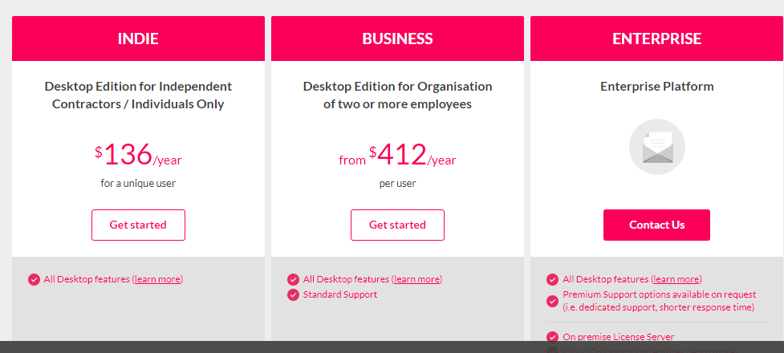
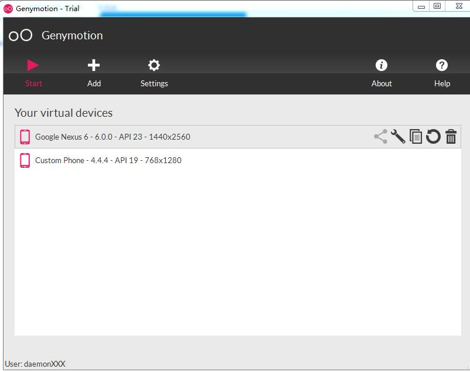
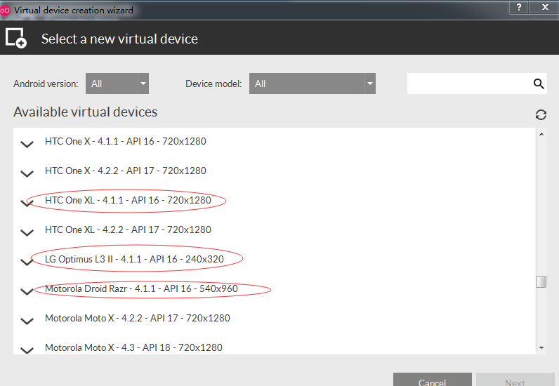
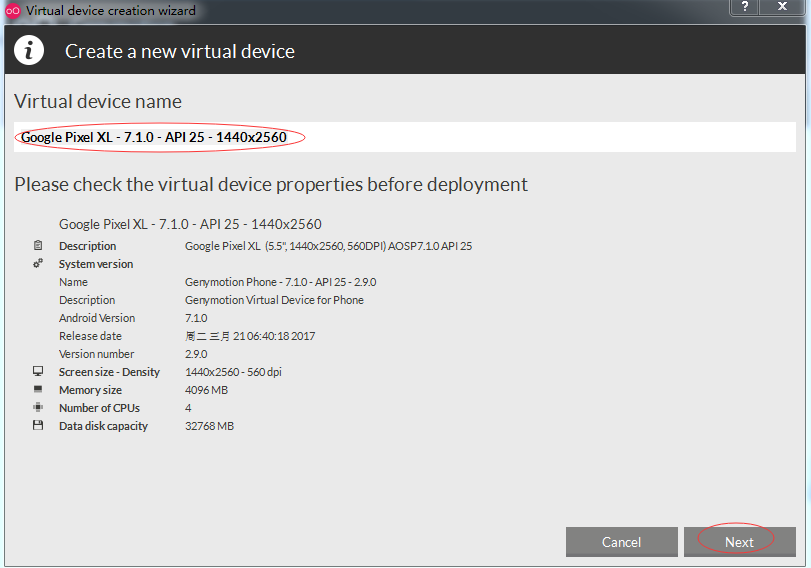
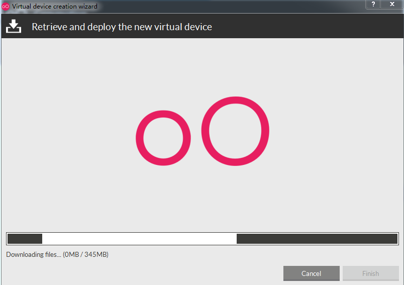
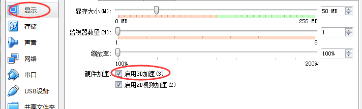
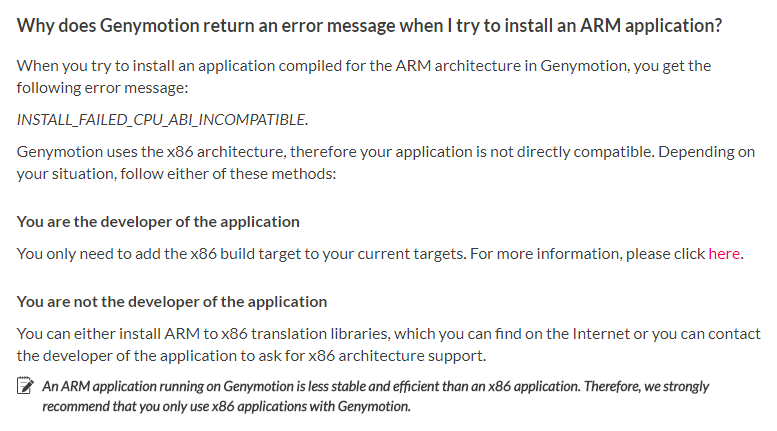

# android模拟器genymotion

***set_daemon@126.com  2017-09-14***

##获取

官网：https://www.genymotion.com/，打开有的时候会比较慢，可能是加载了一些被墙掉的链接，如谷歌统计之类的，实在不行，就找VPN、加hosts。

价格不算便宜，但有1个月试用版，提供的虚拟机会阉割点功能。下载和使用必须用账号登录才行，所以不是常使用genymotion的用户，可以考虑试用版。如果专业开发需要调试测试的，建议付费购买，提供的虚拟机种类确实很多，也很强大，可以体验多种品牌，比买真机是要便宜，还方便。

## 依赖

#### Virtualbox

去官网https://www.virtualbox.org/下载安装即可，版本最新的稳定版一般都没问题。

## 安装

#### windows

直接点击就会开始自动安装到指定的目录。

其数据路径为C:\Users\用户名称\AppData\Local\Genymobile，其下的文件和目录：

​	genymotion.log    程序执行的日志文件，如果操作上出现什么问题，可以在这里面查看原因

​	Genymotion  目录，下面包括以下几个子目录：

​		cache

​		deployed

​		ova

​		templates

​		tmp

​		vdi

​	目前了解的是ova，在软件里面添加的虚拟机会下载到该目录下，加载时也会从该路径下查找。

#### ubuntu

提供的bin文件，命令行下执行前修改文件属性:chmod +x {安装文件名}，然后直接"./安装文件名"。

数据路径为"/home/用户名/.Genymotion"，其它与windows相同。

## 使用

点击打开软件后的主页面如下（一上来会要求登录，把在官网注册好的用户名、密码输入登录就行）：

上面的两个虚拟机是已经加载好的，如果要添加别的，可以点击"+Add"，进入下面的页面：

选择其中一个点右下角的"Next"，可以看到：

继续点击"Next"按键，开始下载

网速可能会比较慢，这个时候可以考虑用迅雷，在C:\Users\用户名\AppData\Local\Genymobile目录下的genymotion.log中"Starting download of"这样行中可以找到虚拟机的下载地址，本处是“http://dl.genymotion.com/dists/7.1.0/ova/genymotion_vbox86p_7.1_170320_224018.ova”，记得将下载的ova与对应的设备型号关联起来，要不然启动的时候得在列表中试半天。

下载完后，选择想要启动的虚拟设备，点击左上方的"Start"即可。据说可以多开，前提是设备的CPU、内存够多。

虚拟设备启动后，就可以像真机一样去设置、操作，注意这个时候的虚拟机已经是root过的。

如果要安装app，直接拖拽到窗口里就会自动传输、安装和启动。

## 问题

1 在虚拟机中容易出现opengl版本过低的问题

​	在虚拟机设置里开启3D加速，如图所示。

2 不能接受android native的apk安装

官网的faq页面上可以看到

在网上找到Genymotion-ARM-Translation.zip包后，直接拖入到设备里即可。如果有需要的，可以联系我。

3 有的应用闪退

​	暂时没找到原因。

## 参考

http://blog.csdn.net/u012399175/article/details/54020032  genymotion上不能安装APK的问题

https://www.genymotion.com/help/desktop/faq/ 

https://www.v2ex.com/t/259515 在 x86 安卓模拟器上运行 ARM 原生 App

