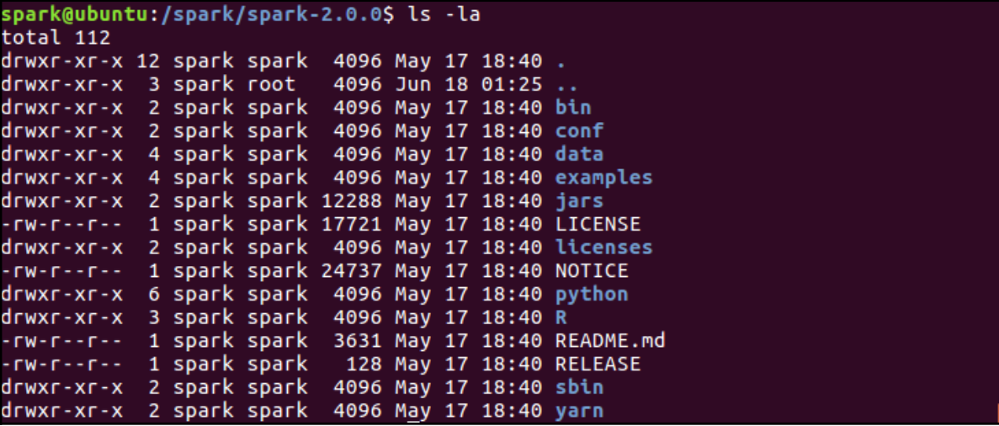
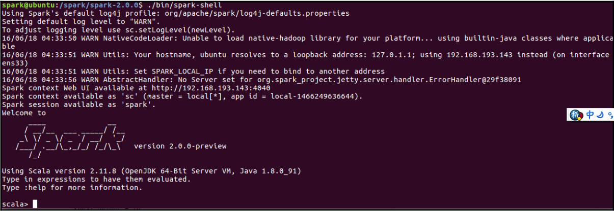
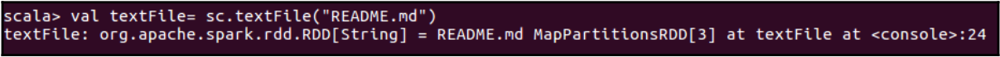
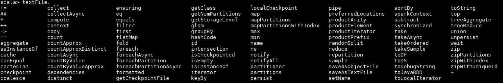
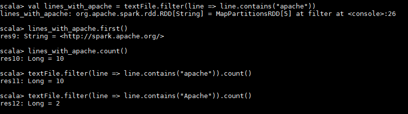
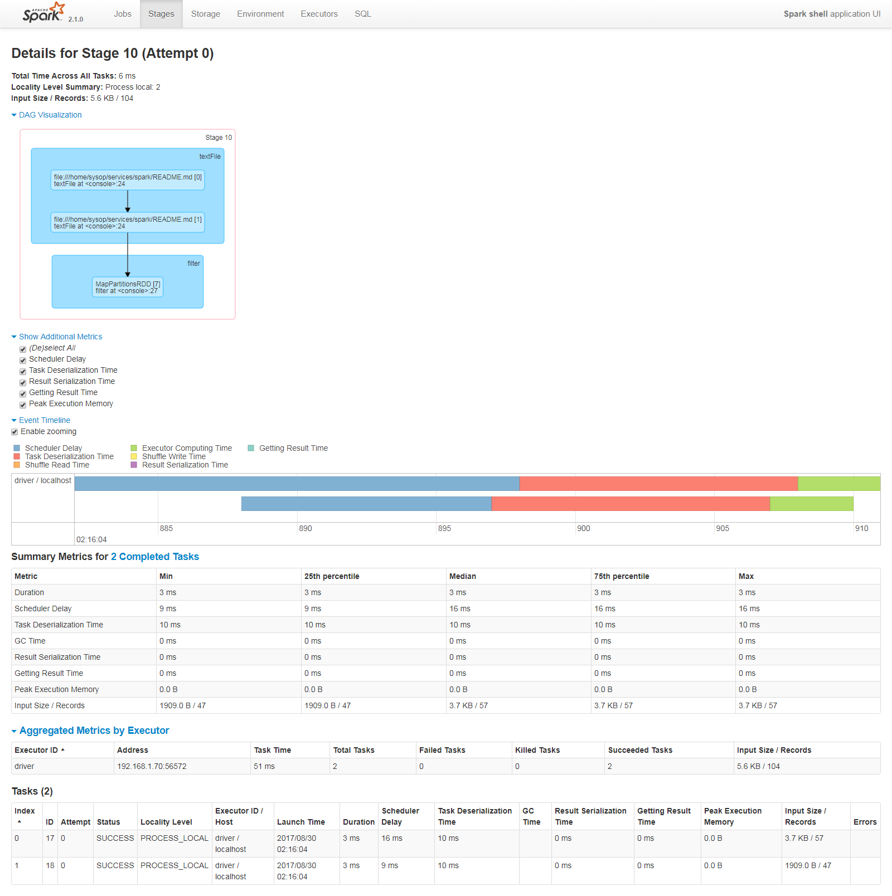
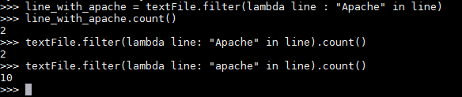
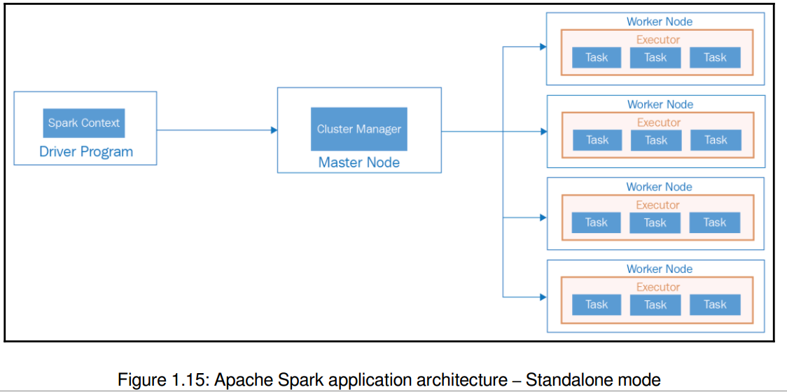
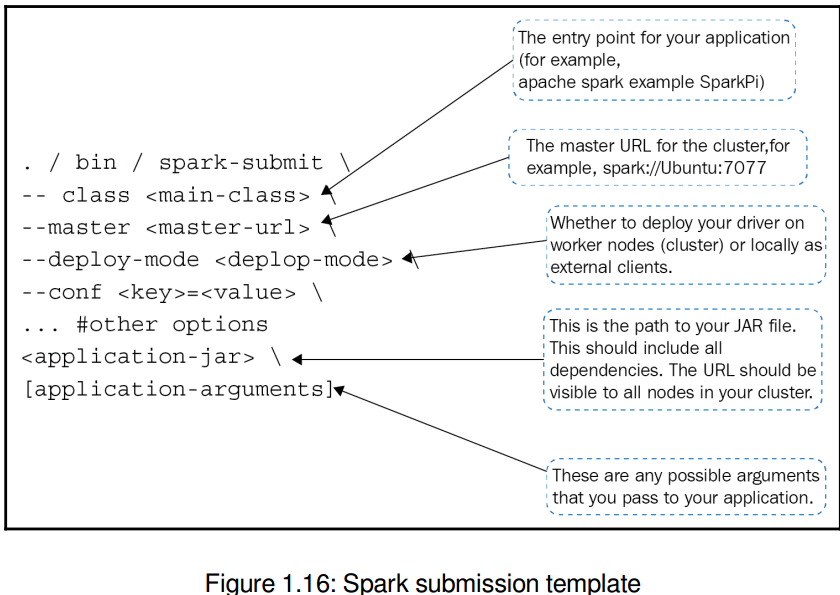
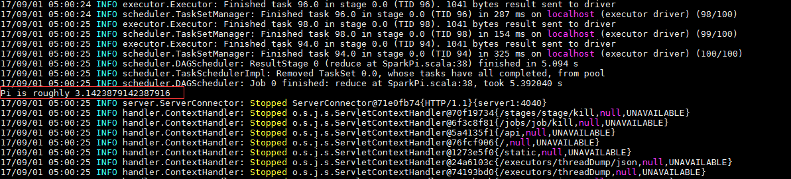

# 第一章 架构与安装

***set_daemon@126.com 2017-09-19 图书：Learning Apache Spark 2，可在github https://github.com/PacktPublishing/Learning-Apache-Spark-2找到源码。 （如有侵权，请与我联系）***

本章意在提供和描述有关Spark的整个体系，包括Spark架构。你将会领略这个框架的高层级细节、安装以及编写你第一个Spark程序。

本章将覆盖接下来的核心主题，如果你已经熟悉这些主题，可以放心的转到下一章：Resilient Distributed Datasets（RDDs）。

Apache Spark的架构概览：

​	Apache Spark部署

​	安装Apache Spark

​	编写第一个Spark程序

​	提交应用

#### Apache Spark架构概览

Apache Spark是一个开源中的分布式数据处理引擎集群，提供统一编程模型引擎，可跨多种类型数据处理工作负载和平台（注：数据源可多种）。

这个项目的核心是支持Streaming、SQL、Machine Learning（ML）和Graph的API集合。Spark社区提供多样开源和合适的数据存储引擎的连接器支持，除随Spark绑定的独立安装的独立集群管理器外，也具备运行在其它多种集群管理器的能力，如YARN和Mesos。因此，这与Hadoop生态系统有很大的不同，hadoop提供了一个完整的平台，如存储格式，计算引擎，集群管理，等等。Spark的单一设计目标是一个优化的计算引擎。因而这允许你在不同的集群管理器上运行Spark，包括独立运行，或插入到YARN和Mesos。同样，Spark也没有自己的存储，但它可以连接到大量的存储引擎。

当前Spark APIs已经得到最通用语言的支持，包括Scala、Java、Python和R。

让我们从浏览Spark上的各类API开始来这段旅途。

#### Spark-core

Spark架构的心脏就是Spark的核心引擎，通常被称作spark-core，构成了这个强大架构的基础。Spark-core支持服务，例如，管理内存池，集群任务调度（Spark部署成集群模式时以大量并行处理系统Massively Parallel Processing的方式工作，即MPP），恢复失败的job，以及提供支持在多种存储系统上工作，如HDFS、S3等等。

***注意***：Spark-core为独立调度提供了一个完整的调度组件，代码可以从以下网址获取到：https://github.com/apache/spark/tree/master/core/src/main/scala/org/apache/spark/scheduler。

<u>Spark-core为用户从集群工作模式下的底层技术抽象了一套API。Spark-core支持作为其它高层级API基础的RDD API，这是Spark的核心编程元素</u>。我们将在本书之后的章节讨论RDD、DataFrame和Dataset的API。

***注意***：MPP系统通常使用大量的处理器（在单独的硬件上或虚拟化出来的）来并行化执行操作集合。MPP系统的目标是将工作划分为更小的任务片段，并行化的执行这些小任务，以期增加吞吐量。

#### Spark SQL

Spark SQL是Spark最流行模块中的一个，被设计成结构化和半结构化的数据处理。Spark SQL允许用户在Spark程序内使用SQL或DataFrame和Dataset API来查询结构化数据，并被Java、Scala、Python和R所支持。基于DataFrame API支持统一方式访问多源数据，包括Hive数据集、Avro、Parquet、ORC、JSON和JDBC，用户可以用同样的方式连接到任何数据源，并将多个数据源连接在一起。Spark SQL可以使用Hive的元存储，为用户提供了完全兼容的方式来访问已经存在的Hive数据、查询和UDF，这样，用户能无缝的运行他们当前的Hive工作，而不需要在Spark上做修改。

Spark SQL也能通过spark-sql shell被访问，也可以使用商业工具通过标准JDBC和ODBC接口来连接。

#### Spark Streaming

超过50%的用户认为Spark Streaming是Apache Spark最重要的组件，Spark Streaming使得处理主动到来的数据或实时流数据成为可能。主动流可以是来自于静态文件，你将其数据流入到Spark集群，包括多种数据，例如web服务器的日志，社交媒体行为（比如跟随一个特定的Twitter标签），来自于汽车/手机/家庭的传感数据，等等。Spark-Streaming提供一堆API来帮助你创建streaming应用，如同创建一个batch job一样，只需微小改动。

作为Spark 2.0，<u>隐含在Spark Streaming背后的哲学并不是要像传统数据源的处理方案一样推导出streaming和创建数据应用的方式</u>，这意味着从数据源出来的数据持续地附加到已经存在的表里，所有的操作是在新窗口里运行。一个单独的API就可以让用户创建一个batch或streaming的应用，唯一不同之处是在batch应用中的表是有限的，而在streaming job中的表是无限的。

#### MLlib

MLlib是Spark的机器学习库，如果你从封面处还记得，迭代算法是创造Spark的关键推动器中的一个，大多数机器学习算法用不同方式执行迭代处理。

***注意***：机器学习是AI人工智能的一个类型，为计算机提供无需显性编程就能自学的能力。机器学习关注于开发能教自己成长且顺应新数据做相应改变的计算机程序。

Spark MLlib允许开发者使用Spark API，访问多种数据源构建机器学习算法，包括HDFS、HBase、Cassandra等等。Spark执行迭代计算非常快，比MapReduce要快100倍。Spark MLlib包括大量算法和适用工具，包括但不限于，逻辑回归，SVM，分类和回归树，随机森林，梯度增强树（gradient-boost tree），使用ALS的推荐，K-Means的聚类，主成份分析PCA以及其它。

#### GraphX

GraphX被设计用来操作图的一套API。图可以是，通过超级链接构成的web页面链接图，或Twitter上由followers或retweets连接而成的社会化网络图，或Facebook朋友列表。

​	图理论是对图的研究，一种模型化物体之间关系对的数学化结构。一个图由多个节点构成，节点之间通过边连接。  --- Wikipedia.org

Spark提供了内置的图操作库，<u>因而允许开发者无缝工作于图和集合，将ETL、发现性腺分析和迭代图操作合并到一个单独的工作流中。</u>在一个单独系统能高速地合并transformations、机器学习和图计算的能力，使得Spark成为最灵活和最强大的框架。Spark既能保留容错的标准特征又不失计算速度，使得它特别适合处理大数据问题。Spark GraphX有一系列的内置图算法，包括PageRank、Connected Components、Label Propagation、SVD++和Triangle Counter。

#### Spark部署

Apache Spark可以运行在Windows和Unix类系统（例如，Linux和Mac OS）。如果你刚开始使用Spark，可以先在单机上运行本地环境。Spark要求Java 7+，Python 2.6+，以及R 3.1+。如果你喜欢用Scala API（这是实现Spark的语言），你需要至少Scala版本2.10.x。

Spark能运行在集群模式，Spark使用该模式可以自己运行，也可以运行在其它一些集群管理器上。你可以部署spark在以下的集群管理器上，且随着活跃社区的支持，该列表每天都在增长：

​	Hadoop YARN

​	Apache Mesos

​	Standalone调度

<u>***Yet Another Resource Negotiator(YARN)***是关键特性中的一个，包括一个重新设计的资源管理器，在hadoop中将调度和资源管理能力从原来的MapReduce中分离出来。</u>

Apache Mesos是一个加利福尼亚伯克利大学开发的开源集群管理器。它提供了有效的跨分布式应用/框架的资源隔离和共享。

#### 安装Apache Spark

如前几页所提到的，Spark既能部署到一个集群上，也可以在单机上本地运行。

在本章，我们将要下载和安装Apache Spark到Linux机器上，并运行为本地模式。在做任何事情之前，我们需要从Spark项目的Apache网页上下载Apache Spark：

​	1 使用你喜欢的浏览器浏览页面http://spark.apache.org/downloads.html

​	2 选择Spark的一个发布版本。你也会看到Spark之前的发布版本列表，我们将选择发布版本2.0.0（在本书写作时，仅预览版本是可用的）。

​	3 你可以下载Spark的源码，用来编译生成支持Hadoop的多个版本，或者下载特定Hadoop版本的。在本例中，我们将下载支持Hadoop2.7+的预构建版本。

​	4 你也可以选择直接下载，或从其它不同的镜像中挑选一个下载。为了练习的目的，我们将使用直接下载，存放到我们首选的位置。

​	***注意***：如果使用windows系统，请记得使用一个不带空格的路径名。

​	5 你刚下载的文件是一个压缩的TAR包。你需要解压缩该文档。

​	***注意***：这个TAR应用工具通常用来解压TAR文件。如果你没有TAR，你也许可以从仓库中下载下来，或使用7-ZIP，这也是我喜爱的一个工具。

​	6 一旦解压完成，你将看到一系列目录/文件。当你列出解压后的目录下的内容时，下面是你通常能看到的：

​		bin文件夹包括一些可执行shell脚本，例如pyspark、sparkR、spark-shell、spark-sql和spark-submit。所有这些可执行文件都是用来与Spark交互，我们将使用这其中的大部分。
​	7 如果你看到我特定的Spark下载，你将发现一个文件夹叫做yarn。下面的例子表示Spark是基于Hadoop版本2.7构建的，随带着YARN作为集群管理器。

我们将开始运行Spark Shell，这是开始Spark和学习API的非常简单的方式。Spark shell是一个Scala Read-Evaluate-Print-Loop（REPL），并且支持Spark的REPL还有Python和R。

你应该切换至Spark下载路径，如下执行Spark shell：/bin/spark-shell。

现在我们将Spark运行在standalone模式。我们稍后在本章讨论部署架构的细节，但现在让我们启动基本的Spark编程，来领略Spark框架的强大和简单。

#### 编写你的第一个Spark程序

如之前所述，你可以使用Python、Scala、Java和R来用Spark。在spark/bin路径下有不同的可执行shell脚本可用，且到目前为止，我们仅仅尝试了Spark shell，使用Scala来探索数据。在spark/bin路径下还有如下的可执行文件可用，在本书的课程中将使用其中的一些：

​	beeline

​	pyspark

​	run-example

​	spark-class

​	sparkR

​	spark-shell

​	spark-sql

​	spark-submit

无论你使用那个shell，都基于你过去的经验和能力，且都必须掌握好一个抽象概念，那是你在Spark集群上能操作数据的手柄，可以是本地的，也可以是跨分布在上千台机器上的。这个抽象概念在本处所指的是Resilient Distributed Datasets（RDD），是Spark上数据和计算的基础单元。顾名思义，除其它之外，它们还有两个关键特性：

​	***它们是弹性的***：如果内存中的数据丢失了，新的RDD将被创建

​	***它们是分布式的***：你能用Java或Python操作跨集群分布的对象

*第二章，Spark RDD的转换和动作*，将会带你领略RDD的复杂精细度，当然也将讨论其它基于RDD创建的更高层API，例如Dataframe和机器学习管道。

让我们快速给你展示如何使用Spark浏览本地文件系统的文件，之前在图1.2中，我们浏览spark的文件夹内容时，我们看到一个名为README.md的文件，该文件包含了Spark的概览、在线文档的链接，以及开放给开发者和分析师的其它有用的东西。我们即将读取那个文件，并将其转化成一个RDD。

为了进入Scala shell，请操作接下来的命令：

​	./bin/spark-shell

用这个Scala shell运行以下代码：

​	val textFile = sc.textFile("README.md") #创建一个名为textFile的RDD

你会立即得到这种类型的变量被创建的确认提示：

如果你想查看RDD支持的操作类型，在命令行提示符后写入变量名“textFile.”（注：后面加原点号），并按下Tab键，你将看到以下可用的操作/动作列表：

由于我们的目标是做一些基本探索性的分析，我们将看一看该RDD上的一些基本操作。

***注意***：RDD可以在它们上调用action或transformation，但是它们的结果却是不同的。transformation的结果是一个新创建的RDD，而action的结果是RDD被执行、并返回结果给客户端。

让我们看一看在该RDD中的前7行：

​	textFile.take(7)  #以字符串数组的形式返回文件中的前7行

其结果看起来像：

或者，让我们看一看该文件中总行数，<u>使用字符串RDD上另一个作用像是list的action</u>。请注意，在RDD中，文件中的每一行被看作是单独的项：

​	textFile.count() # 返回总项数

我们了解了几个action后，现在再来了解下字符串RDD操作支持的transformation。如前所述，transformation是一直返回结果为另一个RDD的操作。

试着对数据文件过滤出包含关键词Apache的数据行：

​	val linesWithApache = textFile.filter(line => line.contains("Apache"))

该transformation将返回另一个字符串RDD。

你也可以将多个transformation和action串起来。举个例子，下面将过滤文本文件中包含关键词Apache的行，然后返回在结果RDD中这样的行数：

​	textFile.filter(line=>line.contains("Apache")).count()

你可以从Spark UI上监视在集群中运行的job，默认端口4040。

如果你用浏览器访问http://localhost:4040，你将看到以下Spark驱动程序的UI：

取决于你运行了多少个job，你将看到基于所处状态的job列表（注：分为运行中、失败、完成）。通过UI，你可以看到job类型的概览，提交日期/时间，所用时长，完成的stage数。如果你想查看job的详情，简单的点击job的描述，将会带你进入到另一个展示所有完成stage详情的页面。你也许想看该job的某个stage，点击它，你会得到更多关于该job的详细指标。

我们将在后续章节中介绍UI更多的细节，例如DAG Visualization、Event Timeline和其它方面，当然给你展示这些的目的是让你明白，如何在运行和完成后监视你的job。

在查看更多例子之前，我们用为Python程序员准备的Python Shell重演一遍同样的例子。

#### Python shell例子

为了满足习惯用Python而非Scala的读者，我们将在Python shell下执行一遍之前的例子。

为了进入Python shell，请执行以下命令：

​	./bin/pyspark
你将看到类似下面的输出：

如果你仔细查看这个输出，你将看到框架试图在端口4040上启动Spark UI，但没能成功（注：原书的截图是有这个提示，但是自己的环境没有输出），最终在4041端口上启动的。你能猜到为什么吗？原因是4040端口已经被占用，Spark将在4040端口后继续尝试，直到找到一个可用于绑定UI的端口。

让我们在Python shell上使用python做一些基本的数据操作，再次读入README.md文件：

​	textFile  = sc.textFile("README.md") # 创建一个读取文件README.md内容的名为textFile的RDD

读取该文件的前7行：

​	textFile.take(7)

查看文件总行数：

​	textFile.count()

你将看到类似下面的输出：

和使用Scala shell展示的一样，我们也能用Python来运用transformation，并将transformation和action串起来。

使用以下的代码对数据集应用transformation操作，记住，transformation返回的结果是另一个RDD。

下面的代码应用transformation，过滤输入数据集，并找出包含单词Apache的行：

​	lineWithApache = textFile.filter(lambda line: "Apache" in line) # 查找包含Apache的行

一旦得到过滤后的RDD，对其应用action：

​	lineWithApache.count() //计算项目总数

再将transformation和action串起来：

​	textFile.filter(lambda line: "Apache" in line).count()  // 将transformation和action串起来

如果你不熟悉Python的lambda函数，此时也不必过于担心，因为展示该用法的目的是告诉你用spark做数据探索是很容易的。我们将在之后的章节中涵盖更多的细节。

如果你想看驱动程序的UI，你会发现，相比用Scala shell执行的结果，新生成的总结指标更清晰。

到目前为止，我们完成了一些基本的Spark程序，所以现在也值得去对Spark的架构做更多理解。在下一节，我们将深挖Spark的架构，再在下一章用更多的代码例子来解释有关RDD的不同概念。

#### Spark架构

让我们从高层次角度的概览以及一些关键软件组件的简要描述来了解Apache Spark的架构。

##### 高层次概览

从高层次来看，Apache Spark应用架构包括以下关键软件组件，而且重要的是要掌握它们中的每一个，以理解框架的精细复杂度：

​	驱动程序

​	Master节点

​	Worker节点

​	Executor

​	Tasks

​	SparkContext

​	SQL context

​	Spark session

这里有一张概览图，可以看到这些软件组件如何在整个架构中配合工作的：

###### 驱动程序

驱动程序是Spark应用的主要程序。Spark应用进程（创建了SparkContext和Spark Session）运行的机器称作驱动节点，该进程称作驱动进程。驱动程序通过与集群管理器通信以分发任务到执行器（executor）。

###### 集群管理器

集群管理器，顾名思义管理一个集群，如之前讨论的，Spark具备工作在多种集群管理器上的能力，如YARN、Mesos和独立的集群管理器。独立集群管理器包括两个长期运行的守护进程，一个运行在master节点，另一个运行在worker节点。关于集群管理器和部署模型，我们将在第8章***集群模式下的操作***有更多讨论。

###### Worker

如果你熟悉Hadoop，可以理解成Worker节点就相当于slave节点。<u>Worker机器是那些在Spark执行器内部执行真实工作的机器</u>。这个进程向master节点报告节点上可用资源，通常在Spark集群内的每个除master外的节点，都运行一个worker进程。我们通常的做法是，一个工作节点启动一个spark worker守护进程，这些进程可以为应用启动和监视执行器。

###### Executors

master分配资源，使用跨集群的workers为驱动器创建Executor，驱动器这时才能用这些Executor运行它的任务。只有当一个job在worker节点上启动时，Executor才会启动。每个应用有它自己的executor进程，这些进程会保持到应用结束，并用多线程执行任务。这也导致了应用隔离和多应用之间数据非共享的副作用。Executor负责执行任务，<u>将数据保存在跨进程的内存或磁盘存储中</u>。

###### Tasks

一个task就是将要发送到一个executor的工作单元。具体来说，这是一个由驱动器程序将Function对象序列化成的命令并发送至executor，executor反序列化该命令（实际上是已经加载的JAR包一部分）后在一个partition上执行该task。

partition是在Spark集群上分发的一个数据逻辑块。很多情况下，Spark将会从分布式存储上读取数据，为了跨集群的并行处理，也会将数据分区。例如，如果你从HDFS上读取数据，每一个HDFS分区将会被创建成一个partition。partition很重要，因为Spark将为每个partition运行一个任务，这也意味着partition的数量也很重要。Spark因此会在你没有手动设置partition个数时自动生成partition的个数，手动配置项有sc.paralleize(data,numPartitions)。

###### SparkContext

***SparkContext***是Spark session的进入点，也是Spark集群的连接，能用来在集群上创建RDDs、accumulators和广播变量。每个JVM最好只有一个活跃的SparkContext，因此在创建一个新的SparkContext前要对当前活跃的调用stop()操作。你也许注意到了，之前在本地模式下，无论我们启动Python或Scala shell，我们都有一个自动创建的SparkContext对象，变量sc指向该SparkContext对象。我们不需要创建SparkContext，而直接用它从文本文件中创建了RDD。

###### Spark Session

Spark session是spark编程下使用dataset和DataFrame API编程的进入点。

#### Apache Spark集群管理器类型

据之前所讨论的，Apache Spark当前支持三种集群管理器：

​	独立集群管理器

​	Apache Mesos

​	Hadoop YARN

我们将在第8章***集群模式下的操作***详细介绍这些类型的启用，讨论了集群模式下的操作。

#### 用Apache Spark创建独立应用

直至现在我们在Scala和Python shell下使用spark做探索性分析，同样也能使运行Java、Scala、Python或R语言的独立应用操作Spark。在之前看到的，Spark shell和PySpark为你提供了SparkContext，然而，当你在使用一个应用时，你需要初始化你自己的SparkContext。一旦你得道SparkContext的引用，剩下的API与在交互查询分析环境下保持完全一致。毕竟，这是相同的对象，不同的是这两个context的运行环境。

在你的应用中使用Spark方法的区别在于你更倾向的语言。所有Spark artifact由Maven中心服务，你可以像下面同等增加一个maven依赖（即改变版本）：

​	groupId: org.apache.spark

​	artifactId: spark_core_2.10

​	version: 1.6.1

你能用Maven来创建项目，也可以使用Scala/Eclipse IDE添加Maven依赖到项目中。

***注意***：Apache Maven是一个Java项目主要使用的自动化构建工具。单词maven在Yiddish语（犹太人主要用语）中意思是“知识积累”。Maven表现了构建软件的两个核心方面：第一，描述软件如何被构建，第二，描述了软件的依赖。

你可以配置你的IDE做spark相关的事情。虽然一些Spark开发者在命令行下使用SBT和Maven，但最通用的IDE是IntelliJ IDEA，社区版本是免费的，你可以在上面安装JetBrains Scala插件。更多关于设置IntelliJIDEA或eclipse来使用spark的指导，请参考http://bit.ly/28RDPFy。

###### 提交应用

在Spark bin路径下的spark提交脚本，是提交spark应用到spark集群最常用的方法，可以在所有支持类型的集群上启动应用。你也需要将应用所有的依赖项目与应用一起打包，Java项目可以生成一个集成的JAR文件（aka uber/fat JAR），这样Spark就能在集群上分发。

带依赖的spark应用可以使用bin/spark-submit脚本启动，该脚本仔细设置classpath以及它的依赖，并支持所有spark支持的集群管理器和部署模式。

对于Python应用：

​	不需要\<application-jar\>，简单传递.py文件；

​	添加Python的.zip、.egg和.py文件添加到搜索路径下，可以指定--py-files选项；

#### 部署策略

***Client方式***，常用于当你的应用靠近集群时。在这个模式下，驱动程序作为spark-submit进程的一部分被启动，对集群来说就是一个客户端，应用的输入输出通过console传递。这种模式适合于，当你的网关机器（？）与worker机器物理上集中时（？），也用于包括REPL的spark shell应用。这是默认的模式。

***集群模式***：当你的应用是从远离worker机器的机器上提交时（例如，在你本地的笔记本），为了最小化驱动程序和executor之间的网络延迟，采用集群模式比较合适。当前仅YARN支持Python应用的集群化。<u>下面的表格所展示的集群管理器、部署管理器和使用在Spark2.0.0上并没有支持</u>：

| 集群管理器      | 部署模式    | 应用类型          | 支持   |
| ---------- | ------- | ------------- | ---- |
| Mesos      | Cluster | R             | 否    |
| Standalone | Cluster | Python        | 否    |
| Standalone | Cluster | R             | 否    |
| Local      | Cluster | -             | 不兼容  |
| -          | Cluster | Spark-Shell   | 无应用  |
|            | Cluster | Sql-Shell     | 无应用  |
|            | Cluster | Thrift Server | 无应用  |

#### 运行Spark例子

Spark提供了打包的例子，涵盖Java、Python、Scala和R语言。我们将演示如何在样例目录下运行程序。

由于之前我们只做了本地安装，所以接下来的例子Spark PI将会在本地4核上运行。这些例子可以在Apache Spark的Github页面http://bit.ly/28S1hDY上找到，我们截取样例一小段代码来解释SparkContext如何被初始化：

​	val conf = new SparkConf().setAppName("Spark Pi")

​	val spark = new SparkContext(conf)

该例子与Spark的可执行包打包在一起，代码也可以从Github上下载到。仔细阅读这段代码，你将了解到我们自己的SparkContext对象是从SparkConf对象初始化而来。名称为“Spark PI”的应用在执行期间将会以运行中的应用出现在Spark UI中，这也可以帮助你追踪该job的状态。记住，这与spark-shell自动初始化SparkContext并传递它的一个引用形成鲜明对比。

让我们用Spark submit脚本运行这个例子：

这个脚本的日志跨越多页，所以我们将跳过这些中间操作步骤，直接跳到输出打印的地方。记住这个例子中我们运行的是Spark Pi，它输出的是Pi值。这是日志的第二部分：

此时，我们看到的是Scala例子，如果我们用这个例子的python版本，你将看到我们将尽需要传递Python源码。由于不引用其它代码，我们不需要传递任何JAR文件（？Python）。类似于Scala例子，我们也需要直接初始化SparkContext，不像PySpark shell已经自动提供给你一个该context对象的引用：

​	sc  = SparkContext(appName = "PythonPi")

运行这个Spark Pi例子与Scala例子略有不同：

与PySpark例子相似（？应该是Scala的），这个SparkPi程序在spark-shell上的日志同样跨越多页。我们将直接跳到Pi值输出的地方：

#### 构建你自己的程序

我们测试了预编译好的程序，但是如本章之前所讨论的，你能创建自己的应用程序，用sbt或Maven打包后，再调用spark-submit脚本运行。在本书后续的章节中，我们将同时使用REPL环境和spark-submit来执行多个代码例子。对于完整的代码例子，我们将在***第9章，构建推荐系统***中创建一个推荐系统，在***第10章 客户流失预估***中预估在电信环境下的客户流失。这两个例子（尽管是虚构的）将会帮助你理解一个机器学习应用的整个生命周期。

#### 脑筋急转弯

与Spark shell对应的端口4041而不是4040。

我们已经运行了一个Scala shell，该shell在端口4040上创建Spark UI，Python Shell绑定UI到不同的端口，这个场景下是4041。（？这是脑筋急转弯还是转筋）

#### 参考引用

https://en.wikipedia.org/wiki/Apache_Mesos

https://aws.amazon.com/ec2/

http://spark/apache.org/docs/2.0.0-preview/quick-start.html

http://spark.apache.org/docs/2.0.0-preview/cluster-overview.html

http://spark.apache.org/docs/2.0.0-preview/submitting-applications.html

https://en.wikipedia.org/wiki/Apache_Maven

http://cdn2.hubspot.net/hubfs/438089/DataBricks_Surveys_-_Content/2016_Spark_Survey/2016_Spark_Infographic.pdf 

#### 总结

在本章中，我们给出了Spark架构的概览，编写第一个Spark应用，了解Spark的软件组件，并执行Spark应用。这为下一章讨论Spark RDD提供了坚实的基础，Spark RDD是Apache Spark最重要的构成之一。