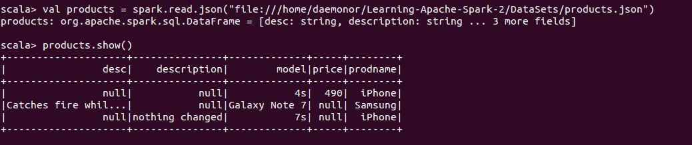
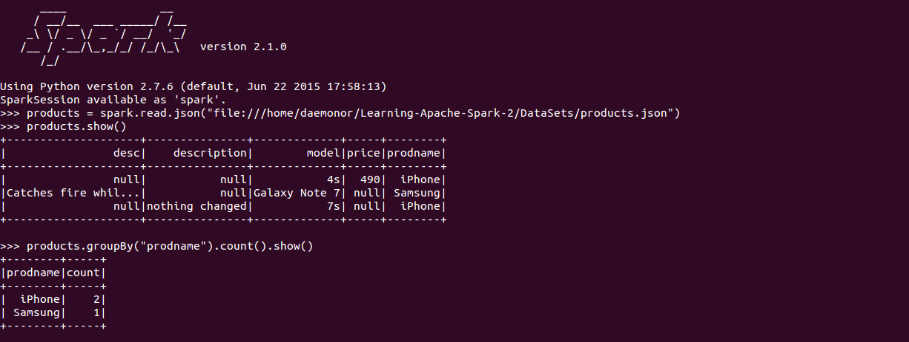
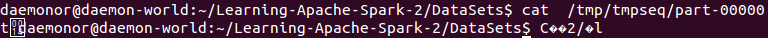
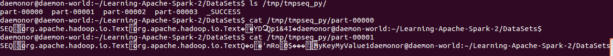
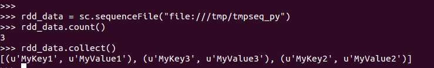

# 第三章 Spark ETL

***set_daemon@126.com 2017-09-22 图书：Learning Apache Spark 2，可在github https://github.com/PacktPublishing/Learning-Apache-Spark-2找到源码。 （如有侵权，请与我联系）***

现在我们已查看了Spark的架构，并且对RDD做过一番详细的讨论，在第二章***Spark RDD的transformation和action***的结尾部分，我们重点关注了PairRDD和它的一些transformation。

本章重点是用Apache Spark实现ETL，包括以下的一些主题，希望可以为你在Apache Spark上做更多事情提供帮助：

​	理解ETL过程；

​	通常支持的文件格式；

​	通常支持的文件系统；

​	对接NoSQL数据库；

让我们开始吧！

## 什么是ETL

ETL代表抽取（Extraction）、转换（transformation）以及加载（loading），该术语存在了近20年，作为工业标准，代表数据移动和转换处理以构建数据管道传递给BI和分析系统。ETL处理广泛用于数据迁移和主数据管理创始（master data management initiatives？）。由于本书的重点是Spark，我们将稍微讲讲ETL这个话题，但不会过多过细。

#### 抽取

抽取是ETL处理的第一个部分，表示从源系统的数据抽取。这通常是ETL处理的最重要部分之一，为后续更多处理设立了阶段（？），在抽取过程中主要考虑以下事情：

​	源系统类型（RDBMS、NoSQL、FlatFiles、Twitter/Facebook流）

​	文件格式（CSV、JSON、XML、Parquet、Sequence、Object文件）

​	抽取频率（天、小时、每秒）

​	抽取的大小

#### 加载

一旦数据抽取完成，下一个逻辑步骤是将数据载入至相关的框架以便于处理。在转换前将数据载入到相关的框架或工具的目的是，允许执行转换的系统与数据处理更相关且高性能。例如，如果你从一个Spark连接不上的系统中抽取数据，比如说Ingres数据库，并将其保存为文本文件，现在，在数据可用之前，你可能需要做一些转换。这里，你有两个选择：要么基于已抽取的文件做转换，要么将数据载入到类似于Spark的框架以便后续处理。后一种方法的好处是像Spark这种MPP框架比基于文件系统的数据处理性能更高。

#### 转换

一旦数据在框架中可用，你可以运用一些相关的转换。由于在Spark的核心抽象是一个RDD，而我们也看过了RDD上的一些可用转换。

Spark支持对某些系统的连接，这本质上将抽取和载入过程结合成单个活动（即一并完成了），因为可以从数据源直接将数据流入到Spark上。在一些案例中，由于我们有大量不同种类的可用源系统，而Spark并不能提供所有的连接器，意味着你不得不借助特定系统或第三方的工具抽取数据。

## 如何使用Spark

Matei Zaharia是Apache Spark项目的创建者，也是DataBricks公司的联合创始人，这家公司也是有Apache Spark的创建者们组建的。Matei在2015年秋的欧洲Spark高层会议的演讲文稿中提到，Spark使用在不同的运行环境的关键指标。我对这个数字有一些惊讶，我一直认为Spark运行在YARN的情况要比其它的要高的多，而事实并非如此，关键数据如下：

​	Spark运行在Standalone模式：48%；

​	Spark运行在YARN：40%；

​	Spark运行在MESOS：11%；

可以从数字上看的，接近90%的Apache Spark安装都是在standalone模式或在YARN上。当Spark被配置工作于YARN，可以猜想到该组织已经选择Hadoop作为他们的数据操作系统，并会计划迁移数据到Hadoop，这意味着主要的摄入数据源可能是Hive、HDFS、HBASE或者其它NoSQL系统。

当Apache Spark安装在Standalone模式，主要源的可能性增加了，但数据存放于HDFS仍然保持巨大的可能性，完全有可能客户安装了Hadoop，但希望将Spark独立出来作为“挖掘”平台。

Spark可以工作于多种源，让我们看看最常见的那些已经遇到过的源：

​	文件格式；

​	文件系统；

​	结构化数据源/数据库；

​	Key/Value存储；

#### 一般支持的文件格式

我们已经看到用基于Spark类SparkContext的textFile()方法处理文本文件是多么轻松。然而，Apache Spark支持大量的其它格式必定会让你更高兴，且随着Spark的每次发布都会增加。在Apache Spark发布版2.0，下面的文件格式也被支持：

​	Text文件（已经涵盖）；

​	JSon文件；

​	CSV文件；

​	序列化文件；

​	Object文件；

###### 文本文件

​	我们已经在第一章***架构与安装***和第二章***Spark RDD的transformation和action***看到多个用textFile()函数读取文本文件的例子。在文本文件中的每一行作为一个新纪录。我们也看过whoTextFiles()的例子，返回一个PairRDD，其key是文件的标识。这在ETL job中非常有用，有时会想基于key对数据做不同的处理，或者甚至传递至下一个处理流程。

ETL处理的一个重要部分是在平台之上运行的应用执行处理之后保存数据，一个非常趁手的方法saveAsTextFile(pathToFile)可以存储问题。值得注意的是传递给该方法的路径基本上是一个路径名称，从不同节点的输出将会保存到该特殊的路径下。

例子3.1：Scala的saveAsTextFile()：

​	// 读取所有的README.md文件

​	val dataFile = sc.textFile("file:///home/sysop/services/spark/README.md")

​	// 对行划词，将每个split的结果平铺

​	val words = dataFile.flatMap(line => line.split(" "))

​	// 保存至文本文件

​	words.saveAsTextFile("file:///tmp/scalawords")	

例子3.2：Python的saveAsTextFile()：

​	// 读取所有的README.md文件

​	dataFile = sc.textFile("file:///home/sysop/services/spark/README.md")

​	// 对行划词，将每个split的结果平铺

​	words = dataFile.flatMap(lambda line: line.split(" "))

​	// 保存至文本文件

​	words.saveAsTextFile("file:///tmp/pythonwords")

例子3.3：Java的saveAsTextFile()：

​	// 读取所有README.md文件

​	JavaRDD\<String\> dataFile = sc.textFile(fileName);

​	// 对行划词，每个split的结果平铺

​	JavaRDD\<String\> words = dataFile.flatMap(line -> Arrays.asList(line.split("")).iterator());

​	// 保存至文本文件

​	words.saveAsTextFile(outputFile);

###### CSV和TSV文件

CSV是一种通用的数据交易格式，被大多消费者、业务和科学应用所广泛支持，其最常用的一个场景是在应用和平台间移动数据，且在许多场景中已经被ETL应用当作事实上的标准。除此之外，大量的公开数据是CSV格式。

自Spark2.0开始，CSV现在是一个基于DataBricks的Spark-CSV模块（http://bit.ly/2cAXCyr）的原生数据源。重点需要理解的是CSV通常表示一个结构化的数据集，在文件中有由逗号分割的特定列数。在更深入些之前，我们需要理解，到现在为止，我们只使用过RDD API，但是以非结构化数据角度来查看数据，Spark框架并不知道你的RDD内容，只是当作一个可以持久化、在网络传输或者用迭代器操作的对象，这明显意味着它限制了框架执行高级优化的能力（例如压缩等等）。然而，由定义而来的应用结构化意味着，我们将限制表达能力。但是，我们通常需要对我们的数据做什么？通常的计算是读取数据、联合数据、过滤数据、统计数据以及聚合数据，这意味着，即使我们有更多结构化API，我们可以应用到多种计算上（？）。

DataFrame是一种不可变的、组织成有名列的分布式数据集合。如果你有数据库背景，可以把它类比成数据库表。如果你有Python/R背景，你将发现Spark的DataFrame使用起来极为灵活（？）；然而，框架提供了更丰富的优化，DataFrame的目标是掩盖RDD的复杂性，并让Spark为更多的人所接受。

Spark在2.0版本中统一了DataFrame和Dataset（直到1.6还是分开的），这为你提供编译时的语法和分析错误报告，该特性又比较像类型化的RDD。Dataset API是类型安全的对象，可以操作编译好的lambda函数。我们将在第5章***Spark流处理***讨论DataFrame和Dataset的更多细节，现在介绍它们的原因是我们想用最简单的方式来读取CSV文件，直接用SparkSession并返回一个DataFrame而非一个RDD。

我们将加载一个有关UK的房屋价格数据集，由land registery发布，且在链接http://bit.ly/2cb58h下载该数据集（注：貌似现在”失联“了）。

例子3.4:用Scala读取CSV：

​	val pricePaidDS = spark.read.format("csv").option("header", "false").load("file:///home/spark/sampledata/pp-monthly-update-new-version.csv")

当然，你仍可以反过来用老式工作方式，用toJavaRDD()操作将dataset转换成一个RDD。

例子3.5:用Python读取CSV：

​	pricePaidDS = spark.read.csv("file:///home/spark/sampledata/pp-monthly-update-new-version.csv", header=False)

例子3.6:用Java读取CSV：

​	SparkSession spark = SparkSession.builder().master("local").appName("SparkCSVExample").config("spark.some.config.option", "some-value").getOrCreate();

​	Dataset\<Row\> pricePaidDS = spark.read().csv(fileName);

​	JavaRDD\<Row\> pricePaidRDD = pricePaidDS.toJavaRDD();

###### CSV文件的写入

写入CSV文件与读非常相似，尽管你必须使用spark.write()存储数据，并选择csv作为输出格式。重要的是要意识到，Spark将写到多个分输出文件，可能你需要它们拼接在一起。

例子3.7:用Scala写入CSV：

​	pricePaidDS.write.format("csv").save("file:///home/spark/sampledata/price_paid_outpout")

###### Tab分割的文件

Tab分割的文件（TSV）也是一种存储结构化数据的通用方法，可以作为CSV格式的替代，这经常有难度，由于文件数据广泛使用了字面的逗号，因此需要提供转义的逗号。Spark让你可以在相同效率方式下读取TSV文件。记住，tsv与csv相似，仅仅不同之处是分隔符从逗号变为tab。

我们有一个样本文件test.tsv，这是一个tab分隔的文件，用于展示需要用于加载tsv文件的代码。

例子3.8:用Scala读取TSV：

​	val testDS = spark.read.format("csv").option("delimiter", "t").load("/home/spark/sampledata/test.tsv")

例子3.9：用Python读取TSV：

​	testDS = spark.read.csv("/home/spark/sampledata/test.tsv", sep="t")

例子 3.10:用J啊v啊读取TSV：

​	SparkSession spark = SparkSession.builder().master("local").appName("SparkTSVExample").config("spark.some.config.option", "some-value").getOrCreate();

​	Dataset\<Row\> pricePaidDS = spark.read().option("sep", "t").csv(fileName);

如你所见，你将仅仅需要指定分隔符sep并传入t参数，指定你正在读取一个TSV文件。

###### JSON文件

JSON是JavaScript对象标记的简写，一种用平铺文本传输包含“属性-值”对的数据对象的公开标准格式。用于异步浏览器/服务器通信的最常用数据格式，本质上是XML（可扩展标记语言）的替代物。JSON是语言无关的数据格式，产生于Javascript，但对于2016年，在许多编程语言中支持代码生成和解析JSON格式数据。

JSON是一种半结构化数据格式，像CSV一样，大量的公开数据集以JSON格式存在。事实上，最流行的公开数据是Twitter feed，也是JSON格式。让我们用一个SON格式的多结构化文本的简单例子来展示这种特性。

下面是JSON文件products.json的截屏，可以在本书的协助网站上获取。

​	{"prodname":"iPhone", "model":"4s", "price":490}

​	{"prodname":"Samsung", "model": "Galaxy Note 7", "desc":"Catches fire while charging"}

​	{"prodname":"iPhone", "model":"7s", "description":"nothing changed"}

用Scala加载JSON文件与加载CSV文件相似，让我们看一个例子，将文件转换成DataFrame，以及在DataFrame上相关的操作：

Python提供了非常相似的读取JSON文件的方法：

用Java读取JSON文件：

​	/*

​	\*读取JSON

​	*/

​	Dataset\<Row\> products = spark.read().json("file:///home/daemonor/Learning-Apache-Spark-2/DataSets");

​	products.show();

到目前为止，我们已经覆盖了标准的文本文件，CSV、TSV和JSON文件。然而，我们已经处理过本地文件系统。我们也在第一章解释了如何在Hadoop下工作，以及如何从HDFS读取文件。当我们讨论Hadoop时，该数据平台已经变得非常流行，我们需要查看流行的Hadoop格式，包括序列化、对象以及parquet文件。

###### 序列文件

序列文件是一种包含二进制的key/value对的flat文件。序列文件是Hadoop格式最流行的一种，如果你使用带Hadoop的Apache Spark，非常可能你的数据已经是序列文件的格式。序列文件包含一个头，紧接着是一个或多个记录。sync操作用于允许读取器从文件的任何位置同步到一个记录的边界。一条记录的内部格式取决于压缩是否开启，如果开启的话，你是否选择记录压缩或者块压缩。文件默认是非压缩的。

为优化从Hadoop读取数据，定位到文件的特定点通常很方便。序列文件有两种定位到文件中特定位置的方法：

​	seek()方法：将读取器定位到文件的给定点。如果这个位置不是一条记录的边界，读取器将会在next()调用时失败，所以你需要同步到记录的边界。

​	sync()方法：第二种查找记录边界的方法，是使用sync。你可以在流中的任何位置调用sync，没必要是一条记录的边界，读取器将会连接到下一个sync点以继续读取。

由于序列文件的流行，Apache Spark框架支持序列文件。你可以使用sequenceFile(key,value)方法来加载序列文件，其中的key和value类型应该为Hadoop的writable接口的子类。例如，你可能有一个存储时间戳的key，用一个LongWritable表示，value可能是文本，表示已经记录下的日志文本。Spark允许你从通用的Writables指定原生类型，例如，sequenceFile[Long, String]将自动读取LongWritable和文本。

让我们创建一个序列文件，保存到磁盘上，并加载到RDD中。

例如3.11:用Scala保存一个RDD为序列文件：

​	val data = sc.parallelize(List(("MyKey1", "MyValue1"), ("MyKey2", "MyValue2"), ("MyKey3", "MyValue3")))

​	data.saveAsSequenceFile("file:///tmp/tmpseq")

如你所见，文件内容是二进制类型的。我们可以用SparkContext的序列化文件方法来加载序列文件：

Python同样提供了保存数据为序列文件以及加载回RDD的能力。

例如3.12:用Python保存RDD为序列文件：

​	data = sc.parallelize([("MyKey1", "MyValue1"), ("MyKey2", "MyValue2"), ("MyKey3", "MyValue3")])

​	data.collect()

​	data.saveAsSequenceFile("file:///tmp/tmpseq")

与Scala相似，Python中的SparkContext允许你从文件系统中加载序列文件：

用Java保存序列文件要更复杂一些，没有API可以支持直接保存到序列文件，转而需要使用saveAsHadoopFile()来保存。然而，你依然可以使用SparkContext的sequenceFile()方法来取得序列文件。

###### 对象文件

Apache Spark允许读取对象文件，使用objectFile()方法可以实现。

​	objectFile[T] (path:String, minPartitions:Int=defaultMinPartitions) (implicit arg0: ClassTag[T]): RDD[T]

这个方法保存和获取任意对象是足够简单的，然而，默认的Java序列化会让它变慢。请访问附录-关于Spark更多的信息，可以用来理解如何用Kyro覆盖默认的serializer以及关联的好处。Apache Spark提供了例如SparkContext对象的objectFile()方法来获取包括序列化对象的序列文件，RDD接口也提供了saveAsObjectFile()方法来保存RDD为对象文件。

#### 通常支持的文件系统

直到现在，我们关注更多的是Spark的功能方面，因此尝试开始探讨Spark支持的文件系统。你可能看过大量有关HDFS的例子，但主要关注的也是本地文件系统。然而，在产品环境，你极少会工作在本地文件系统，有可能你会使用分布式文件系统，如HDFS和Amazon S3。

###### 使用HDFS

Hadoop Distributed File System（HDFS）是一个分布式的、可扩展的以及用Java编写的可移植的Hadoop框架。HDFS提供了在商品硬件上存储大数据量的能力，很多公司已经从他们的传统数据库系统迁移大量数据到HDFS，并在Hadoop上创建了数据“湖”。Spark允许你像读取本地文件系统一样从HDFS中读取数据，唯一不同点是指向NameNode和HDFS端口。

如果你在Hadoop集群的YARN上运行Spark，你可能甚至都不需要提及NameNode和HDFS的细节，因为你传递的路径将默认为HDFS的。

在之前看到的大多数方法都可以运用在HDFS上，指定HDFS的路径可以像这样：

​	hdfs://master\:port/filepath

我们将使用以下Hadoop集群的设置：

​	NameNode： hadoopmaster.packtpub.com

​	HDFS Port：8020

​	文件位置：/spark/samples/productsales.csv

这样，你需要指定的路径将会如下：

​	hdfs://hadoopmaster.packtpub.com\:8020/spark/samples/productsales.csv

###### 使用Amazon S3

S3代表Simple Storage Service，由Amazon Web服务提供的线上存储服务。在2013年，据报道Amazon S3存储了超过2万亿对象。S3的核心原则是可扩展性、高可用、低延迟以及低价。S3的典型用户包括Netflix、Reddit、Dropbox、Mojang（Minecraft的创造者）、Tumblr以及Pinterest。

当你的集群部署在Amanzon EC2时，S3提供了不可思议的速度，但通过公网访问大量数据的性能却会是噩梦。访问S3数据也是相对直接的，你只需要在路径开头处添加s3n://，传递给Spark的文件输入方法。

然而，从S3读取数据前，你需要设置环境变量AWS_ACCESS_KEY_ID以及AWS_SECRET_ACCESS_KEY，或传递它们作为路径的一部分：

​	配置参数：

​	sc.hadoopConfiguration.set("fs.s3n.awsAccessKeyId", "myAccessKeyID")

​	sc.hadoopConfiguration.set("fs.s3n.awsSecretAccessKey", "mySecretAccessKey")

​	val data = sc.textFile("s3n:///bucket/fileLocation")

传递Access Key Id和Secret Key：

​	val data = sc.textFile("s3n:///MyAccessKeyId:MySecretKey@svr/fileloc")

看过大多通用的文件系统后，让我们关注Spark与常用数据库和结构化源交互的能力。我们已经突出了Spark从CSV和TSV文件中获取数据及加载到DataFrame的能力，然而，现在该是我们讨论Spark与数据库交互能力的时候，将在第四章***Spark SQL***中会有更多的说明。

#### 结构化数据源和数据库

Spark可以工作在多种结构化数据源，包括但不限于以下几种：

​	1 Parquet文件：Apache Parquet是一种列式存储格式。关于Parquet结构的更多细节以及Spark如何使用它，可以查看***Spark SQL***章节。

​	2 Hive tables。

​	3 JDBC：Spark允许使用JDBC来连接多种数据库，当然与原生数据库功能相比，通过JDBC访问数据会相对慢一些。

我们将在本书后面的第四章***Spark SQL***介绍结构化数据源的更多细节。

###### 使用NoSQL数据库

NoSQL（原指非SQL、非关系型或不仅仅SQL）数据库提供一种存储(https://en.wikipedia.org/wiki/Computer_data_storage)以及数据获取（https://en.wikipedia.org/wiki/Data_retrieval）机制，一种不同于关系型数据库的关系表建模方法(https://en.wikipedia.org/wiki/Relational_database)。NoSQL是一种相对新的数据管理方法以及被广泛接受。NoSQL所遇到的核心挑战包括可扩展性以及大数据难题中的性能问题。需要重要理解的一点是NoSQL数据库通常可以通过SQL来访问，但通常提供API级的数据结构体访问，这会非常快速。除了这一点，数据可能用key/value对而非标准数据库的表格与列形式管理。

最流行的NoSQL数据库包括：

​	Cassandra

​	HBase

​	MongoDB

​	Solr

让我们看一看如何与这些NoSQl系统进行交互，以Cassandra开始，这是这些数据库中最流行中的一个。

1 使用Cassandra

Apache Cassandra是一种免费开源数据库管理系统，被设计用于处理多商业服务器上的大量数据，提供了无单点故障的高可用性。在2012年，多伦多大学研究员研究了NoSQL(https://en.wikipedia.org/wiki/NoSQL)指出”考虑可扩展性，通过我们的实验得出一个完全获胜者。Cassandra获得了在所有实验中最大节点数的最高吞吐量“，尽管”这带来高写入和读取延迟的代价“。

DataStax Inc是一家开发并提供Cassandra数据库企业版本的商业支持的公司。为了让Spark能与Cassandra配合使用，你需要使用开源的Spark Cassandra连接器，可以在GitHub(http://bit.ly/1R1suw0)上获取到。一旦你安装了Spark与Cassandra，你可以顺利地操作Cassandra表。

1.1作为RDD获取Cassandra表

你可以将Cassandra表对象载入为Spark的RDD，并像普通RDD一样操作。在使用通常的RDD操作之前，你将需要加载隐性函数，请记住加载相关的JAR文件到你的Spark Jar文件目录：

​	import com.datastax.spark.connector._

​	sc.cassandraTable("keyspacename", "table name")

如你所能看到的，你并不需要向cassandraTable操作提供任何类型，这会产生CassandraRDD[CassandraRow]对象。如果你不想映射Cassandra行到CassandraRow类类型，你可以使用你自己期望的Tuple类型，如下：

​	sc.cassandraTable[(String, Int)] ("key", "value").select("word", "count").toArray

​	asyc.cassandraTable [(Int, String)] ("key", "value").select("count", "word").toArray

你可以选择定义一个case类，含有属性命名为Cassandra列：

​	case class WordCounts (word: String, count: Int) sc.cassandraTable[WordCount].select("count", "word").toArray

1.2保存数据到Cassandra

一旦你配置好connector，你可以保存任何RDD到Cassandra。与从Cassandra读取数据时提供映射的概念相似，你可以在保存数据到Cassandra时提供映射。如果没提供映射，你必须确保RDD对象类是tuple类，或者其属性名字对应于Cassandra列名字。保存数据到Cassandra非常直观，你只需要最终调用saveToCassandra方法，并提供keyspace名字、表名字以及一个可选的列列表。

你可以像下面将一个tuple集合保存到Cassandra：

​	val reviews = sc.parallelize(List(("saving Private Ryan", 9992), ("Schindler's List", 1092)))

​	reviews.saveToCassandra("movies", "reviews", SomeColumns("movieTitle", "numReviews"))

对于更复杂的映射，你可以定义一个case类来将RDD存回Cassandra：

​	case class Review (movieTitle: String, numReviews: Long)

​	reviews = sc.parallelize(List(Review("Saving Private Ryan", 9992), Review("Schindler's list", 1092)))

​	reviews.saveToCassandra("movies", "reviews", SomeColumns("movieTitle", "numReviews"))

希望这能给你使用Cassandra表的一个简介。你可以访问GitHub页面(http://bit.ly/2capip3)或访问datastax网站获取更多细节，这些页面有关于集成Cassandra和Spark的大量信息。

2 使用HBase

HSBC是一个开源的、非关系型的分布式数据库，参考Google BigTable模型，由Java编写。作为ASF Hadoop项目的一部分，它运行在HDFS之上，为Hadoop提供类似BigTable能力，以容错方式存储大量稀疏数据。

HBase特征有压缩、内存型操作以及基于列的Bloom filters。已经为许多数据驱动的网站提供服务，例如Facebook的消息平台。应用HBase的最有名的企业包括Adobe、AirBnb、Amadeus IT Group、Imagur、LinkedIn、NetFlix、Sears以及Yahoo。

使用HBase Spark模块可以方便地访问HBase，感谢社区的伟大工作和最著名的Cloudera的Ted Malaska在他的博客发布中公布的集成工作(http://bit.ly/2cv9xMt)。这些代码摘要可以从Apache/HBase GitHub页面获取到，访问http://bit.ly/2cSCXD1可以看到全部例子。

基本架构是在每个Spark executor上获取一个HBase连接对象。这个来自于Cloudera的基于HBase的Spark项目提供了RDD级别的Spark HBase集成。

###### 批量删除例子

这是一个相对简单的批量删除例子，我们使用了hbaseBulkDelete()方法来删除相关数据。

​	val hbaseCtx = new HBaseContext(sc, config)

​	rdd.hbaseBulkDelete(hbaseCtx, TableName.valueOf(tableName), putRecord => new Delete(putRecord), 4)

###### map分区例子

这是一个相对简单的map分区例子。

​	val hbaseCtx = new HBaseContext(sc config)

​	val getRdd = rdd.hbaseMapPartitions(hbaseCtx, (it, conn) => {val table = conn.getTable(TableName.valueOf(tableName)) ...})

如我们之前讨论的，RDD有时对一些用户比较复杂，且大量的用户更喜欢基于DataFrame的API，这提供了内置的查询计划优化。

Hotonworks在他们的博客2016年7月发布的消息宣称基于DataFrame的HBase连接器(http://bit.ly/2cSCXD1)发布了具备查询优化的Spark Catalyst引擎。Spark-HBase连接器的目标是使用户能在HBase key/value存储上使用DataFrame执行复杂的数据分析。

在本书写作时，这个连接器由Hortonworks Repo提供，且有计划逐步迁移到HBase Trunk。

1.3使用MongoDB

MongoDB(来自humongous)是一个NoSQL、可扩展、高性能、开源、面向文档的数据库，目的在提供快速支持基于文档的丰富且易于阅读的查询。不像你在传统关系数据库中按表和行的方式存储数据，MongoDB允许你以动态模式存储类JSON的文档。MongoDB提升了产品效率，原因是按文档化数据建模更为简单，且允许模式快速变革而无重复。MongoDB可增加更多服务器来扩展，因此可基于需求增加容量。

MongoDB的一些关键用户包括SAP、Mcafee、Foursquare、eBay、Adobe以及LinkedIn。

Spark的MongoDB连接器(http://bit.ly/2cDtRZG)发布于2016年9月6日，提供MongoDB和Apache Spark之间的集成。这个连接器允许你使用所有的Spark库操作MongoDB数据集。MongoDB的spark连接器网站(http://bit.ly/2cO98Y9)提供了从Spark访问MongoDB的详细例子，考虑到读者，我们将会列出一些例子。

###### 连接MongoDB

当RDD action执行MongoDB的读写时将会自动连接MongoDB。然而，为了可使用MongoDB连接器的特定函数、隐性的SparkContext以及RDD，你需要导入相关的对象：

​	import com.mongodb.spark._

###### 写入MongoDB

为了将RDD写入MongoDB，你可以使用MongoSpark的save方法，这是一个helper对象，允许很方便创建RDD、DataFrame和Dataset。MongoSpark对象使用SparkConf配置，要求SparkSession被显性设置或通过SparkContext对象：

​	MongoSpark.save(myRDD) //使用SparkConf配置

你可以用RDD的隐性helper方法saveToMongoDB()将数据写入MongoDB：

​	myRDD.saveToMongoDB()   //使用SparkConf配置

###### 从MongoDB载入数据

你可以使用MongoSpark.load()方法来创建一个代表集合的RDD。你可以在启动Spark-Shell时传递配置，或者选择性地创建一个ReadConfig对象，这将提供多个读配置的设置。要查看更多详细例子，你应该访问spark-connector页面(http://bit.ly/2cO98Y9)或mongo-spark连接器的GitHub页面(http://bit.ly/2cZHNTC)。

1.4使用Apache Solr

Apache Solr是一个基于Java库Lucene的开源搜索平台，之所以是一个网站流行搜索平台，它可以索引和搜索大量网站，并基于搜索查询的 返回相关内容的推荐。

Spark-Solr项目(http://bit.ly/1Ub12GU)提供了从Solr读取数据成Spark RDD和索引对象的工具。

###### 通过Spark-shell导入Jar文件

在启动前，你将需要通过Spark-shell导入Jar文件：

​	cd $SPARK_HOME

​	./bin/spark-shell --packages "com.lucidworks.spark:spark-solr:2.1.0" 或

​	./bin/spark-shell --jars spark-solr-2.0.1.jar

一旦你已经导入Jar文件，你可以通过DataFrame API或RDD连接到你的SolrCloud实例。

###### 通过DataFrame API连接到Solr

​	val options = Map("collection" -> "{solr_collection_name}", "zkhost" -> "{zk_connect_string}")

​	val df = sqlContext.read.format("solr").options(options).load

###### 通过RDD连接到Solr

​	import com.lucidworks.rdd.SolrRDD

​	val solrRDD = new SolrRDD(zkHost, collectionName, sc)

在项目的GitHub页面有一些使用Spark操作Solr的好例子，包括索引和查询Twitter数据(http://bit.ly/2cvPjSV)以及分析NYC黄色taxi csv数据(http://bit.ly/2d56EUI)。

## 参考

本章使用了以下的一些有价值的参考，将会帮助你发掘更多信息。我们已讨论的每个集成通常对它们来说都是一个主题，且需要一整章来描述，这非常有必要深入阅读下面的参考文章。

1 http://prod.publicdata.landregistry.gov.uk.s3-website-eu-west-1.amazonaws.com/pp-monthly-update-new-version.csv

2 http://www.purplemath.com/modules/numbprop.htm

3 https://en.wikipedia.org/wiki/JSON

4 http://data.consumerfinance.gov/api/views.json

5 https://databricks.com/blog/2015/02/17/introducing-dataframes-in-spark-for-large-scale-data-science.html

6 https://en.wikipedia.org/wiki/Apache_Cassandra

7 https://www.youtube.com/watch?v=_gFgU3phogQ&feature=youtu.be

8 https://docs.datastax.com/en/datastax_enterprise/4.5/datastax_enterprise/spark/sparkSave.html

9 http://blog.cloudera.com/blog/2015/08/apache-spark-comes-to-apache-hbase-with-hbase-spark-module/

10 https://en.wikipedia.org/wiki/Couchbase_Server

11 https://docs.mongodb.com/spark-connector/getting-started/

## 总结

在本章，我们包含了ETL的一些基础，以及Spark与多种数据源交互的能力，包括标准文本、CSV、TSV以及JSON文件。我们继续往下查看了访问文件系统，包括本地文件系统、HDFS以及S3。最终，我们花了一些时间帮助你理解访问不同NoSQL数据库以及可用的连接器。如你所能看到的，我们覆盖了一些流行的系统，但是大量的围绕Spark的开源生态系统意味着每个月基本上都有新的连接器出现。非常推荐仔细查看项目的GitHub页面以获取最近的开发。

我们现在要往下一章推进，将更关注于Spark SQL、DataFrame和Dataset。下一章比较重要，将构建我们已经覆盖的内容，帮助我们理解Spark2.0如何为开发者从相对复杂的RDD概念抽离出来，并基于已经介绍的DataFrame和Dataset进行扩展。