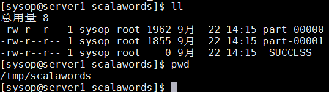

# 第三章 Spark ETL

***set_daemon@126.com 2017-09-22 图书：Learning Apache Spark 2，可在github https://github.com/PacktPublishing/Learning-Apache-Spark-2找到源码。 （如有侵权，请与我联系）***

现在我们已查看了Spark的架构，并且对RDD做过一番详细的讨论，在第二章***Spark RDD的transformation和action***的结尾部分，我们重点关注了PairRDD和它的一些transformation。

本章重点是用Apache Spark实现ETL，包括以下的一些主题，希望可以为你在Apache Spark上做更多事情提供帮助：

​	理解ETL过程；

​	通常支持的文件格式；

​	通常支持的文件系统；

​	对接NoSQL数据库；

让我们开始吧！

## 什么是ETL

ETL代表抽取（Extraction）、转换（transformation）以及加载（loading），该术语存在了近20年，作为工业标准，代表数据移动和转换处理以构建数据管道传递给BI和分析系统。ETL处理广泛用于数据迁移和主数据管理创始（master data management initiatives？）。由于本书的重点是Spark，我们将稍微讲讲ETL这个话题，但不会过多过细。

#### 抽取

抽取是ETL处理的第一个部分，表示从源系统的数据抽取。这通常是ETL处理的最重要部分之一，为后续更多处理设立了阶段（？），在抽取过程中主要考虑以下事情：

​	源系统类型（RDBMS、NoSQL、FlatFiles、Twitter/Facebook流）

​	文件格式（CSV、JSON、XML、Parquet、Sequence、Object文件）

​	抽取频率（天、小时、每秒）

​	抽取的大小

#### 加载

一旦数据抽取完成，下一个逻辑步骤是将数据载入至相关的框架以便于处理。在转换前将数据载入到相关的框架或工具的目的是，允许执行转换的系统与数据处理更相关且高性能。例如，如果你从一个Spark连接不上的系统中抽取数据，比如说Ingres数据库，并将其保存为文本文件，现在，在数据可用之前，你可能需要做一些转换。这里，你有两个选择：要么基于已抽取的文件做转换，要么将数据载入到类似于Spark的框架以便后续处理。后一种方法的好处是像Spark这种MPP框架比基于文件系统的数据处理性能更高。

#### 转换

一旦数据在框架中可用，你可以运用一些相关的转换。由于在Spark的核心抽象是一个RDD，而我们也看过了RDD上的一些可用转换。

Spark支持对某些系统的连接，这本质上将抽取和载入过程结合成单个活动（即一并完成了），因为可以从数据源直接将数据流入到Spark上。在一些案例中，由于我们有大量不同种类的可用源系统，而Spark并不能提供所有的连接器，意味着你不得不借助特定系统或第三方的工具抽取数据。

## 如何使用Spark

Matei Zaharia是Apache Spark项目的创建者，也是DataBricks公司的联合创始人，这家公司也是有Apache Spark的创建者们组建的。Matei在2015年秋的欧洲Spark高层会议的演讲文稿中提到，Spark使用在不同的运行环境的关键指标。我对这个数字有一些惊讶，我一直认为Spark运行在YARN的情况要比其它的要高的多，而事实并非如此，关键数据如下：

​	Spark运行在Standalone模式：48%；

​	Spark运行在YARN：40%；

​	Spark运行在MESOS：11%；

可以从数字上看的，接近90%的Apache Spark安装都是在standalone模式或在YARN上。当Spark被配置工作于YARN，可以猜想到该组织已经选择Hadoop作为他们的数据操作系统，并会计划迁移数据到Hadoop，这意味着主要的摄入数据源可能是Hive、HDFS、HBASE或者其它NoSQL系统。

当Apache Spark安装在Standalone模式，主要源的可能性增加了，但数据存放于HDFS仍然保持巨大的可能性，完全有可能客户安装了Hadoop，但希望将Spark独立出来作为“挖掘”平台。

Spark可以工作于多种源，让我们看看最常见的那些已经遇到过的源：

​	文件格式；

​	文件系统；

​	结构化数据源/数据库；

​	Key/Value存储；

#### 一般支持的文件格式

我们已经看到用基于Spark类SparkContext的textFile()方法处理文本文件是多么轻松。然而，Apache Spark支持大量的其它格式必定会让你更高兴，且随着Spark的每次发布都会增加。在Apache Spark发布版2.0，下面的文件格式也被支持：

​	Text文件（已经涵盖）；

​	JSon文件；

​	CSV文件；

​	序列化文件；

​	Object文件；

###### 文本文件

​	我们已经在第一章***架构与安装***和第二章***Spark RDD的transformation和action***看到多个用textFile()函数读取文本文件的例子。在文本文件中的每一行作为一个新纪录。我们也看过whoTextFiles()的例子，返回一个PairRDD，其key是文件的标识。这在ETL job中非常有用，有时会想基于key对数据做不同的处理，或者甚至传递至下一个处理流程。

ETL处理的一个重要部分是在平台之上运行的应用执行处理之后保存数据，一个非常趁手的方法saveAsTextFile(pathToFile)可以存储问题。值得注意的是传递给该方法的路径基本上是一个路径名称，从不同节点的输出将会保存到该特殊的路径下。

例子3.1：Scala的saveAsTextFile()：

​	// 读取所有的README.md文件

​	val dataFile = sc.textFile("file:///home/sysop/services/spark/README.md")

​	// 对行划词，将每个split的结果平铺

​	val words = dataFile.flatMap(line => line.split(" "))

​	// 保存至文本文件

​	words.saveAsTextFile("file:///tmp/scalawords")	

例子3.2：Python的saveAsTextFile()：

​	// 读取所有的README.md文件

​	dataFile = sc.textFile("file:///home/sysop/services/spark/README.md")

​	// 对行划词，将每个split的结果平铺

​	words = dataFile.flatMap(lambda line: line.split(" "))

​	// 保存至文本文件

​	words.saveAsTextFile("file:///tmp/pythonwords")

例子3.3：Java的saveAsTextFile()：

​	// 读取所有README.md文件

​	JavaRDD\<String\> dataFile = sc.textFile(fileName);

​	// 对行划词，每个split的结果平铺

​	JavaRDD\<String\> words = dataFile.flatMap(line -> Arrays.asList(line.split("")).iterator());

​	// 保存至文本文件

​	words.saveAsTextFile(outputFile);

###### CSV和TSV文件

