# 第二章 Spark RDD的transformation和action

***set_daemon@126.com 2017-09-19 图书：Learning Apache Spark 2，可在github https://github.com/PacktPublishing/Learning-Apache-Spark-2找到源码。 （如有侵权，请与我联系）***

现在我们已经对Spark的架构和关键软件组件的基本认识，本章将介绍Spark RDD。在本章的课程中，将逐一说明以下主题：

​	如何构造RDD

​	RDD的操作，例如transformation和action

​	传递函数给Spark（Scala、Java和Python）

​	transformation的具体方法map、filter、flatMap以及样例d	

​	集合操作，例如distinct、intersection和union

​	action的方法reduce、collect、count、take和first

​	PairRDD

​	共享及广播变量

让我们开始破解其中的奥秘。

#### 什么是RDD

<u>在一个名字中有什么，对玫瑰来说是对的</u>，但对弹性分布式数据集（RDD）也许并不是这样，它本质上是在描述一个RDD是什么。

它们是基本的数据集，跨集群分布的（记住Spark框架是继承自MPP架构），并天性上提供弹性（自动故障恢复）。

在我们讨论更更多细节之前，让我们试着对此理解更多一些，也再试着尽可能抽象些。我们假设你拥有来自飞行器传感器的传感数据，且只想分析数据而不用管数据大小和位置。例如，空客A350整机大约有6000个传感器，每天产生2.5TB，而预期在2020投产的更新型号每天将产生7.5TB数据。从数据工程的角度，理解数据管道会更重要，而从分析师和数据科学家的角度，更主要关注的是分析数据而不用理会数据大小以及数据存储的跨节点个数。这就是RDD概念以及对整个数据集上执行的transformation/action产生的纯粹缘由。A350六个月有价值的数据集大约有450TB数据，将需要跨越多台机器存储。

为便于讨论，我们假设你工作在4个worker机器的集群上，你的数据也将像下面一样在这些worker上分区：

这个图基本解释了一个RDD是数据的分布式集合，框架将数据跨集群分发。跨机器集的数据分布带来了包括要从节点失败恢复的干扰。RDD由于能从RDD关系图中重新计算而具有弹性，这种图是当前RDD的整个父RDD的图。除了弹性、分布式以及表达一个数据集，一个RDD还有多种其它的与众不同的品质：

​	内存型：一个RDD是对象常驻于内存的集合。我们将看到一些可选项，使得RDD可以存储在内存、磁盘或者两者。然而，Spark的执行速度来源于一个事实，数据存放在内存中，而不是每次操作都从磁盘获取。

​	分区：分区是将逻辑数据集或组成的元素划分为独立部分。分区是分布式系统一个事实上的性能优化技术，用于最小化网络带宽消耗，去除这个高性能工作的”杀手“。面向数据key-value的分区的目的是放置相似的key区间，起到了最小化shuffling的作用。在RDD内的数据被分割到分区上，并且跨集群多个节点。我们将在本章后面的内容给出更多细节来进行讨论。

​	类型：在RDD中的数据是强类型的。当你创建了一个RDD，所有的元素类型由数据类型决定。

​	延迟执行：在spark上，transformation操作是延迟的，这意味着只有当你执行一个action时才会在RDD中产生数据。然而，你可以在任何时候对RDD使用一个count() action来生成可用数据。我们将讨论该特性及其相关的好处。

​	不可变：RDD一旦创建即不能修改。当然，可以执行一系列的transfromation操作来将其转换成一个新的RDD。

​	并行：RDD的操作是并行化的。由于数据会被传播到集群的不同分区，每个分区都能并行操作。

​	缓存：由于RDD是延迟执行的，在RDD上的任何action都会导致执行所有的transformation以此来创建该RDD。通常这对于大数据集不是很好的行为（注：每个action都会对已经执行过的关系图再执行），因此spark提供可选项来缓存数据到内存或磁盘。我们将在本章讨论缓存的细节。

一个典型的带RDD的spark程序流程包括：

​	1 从数据源创建RDD

​	2 一系列的transformation，例如，filter、map、join等等

​	3 持久化RDD以防止再执行

​	4 对RDD调用action开始在集群上执行并行操作

下图描述了以上的流程：

让我们快速查看可以创建RDD的不同方法。

#### 构造RDD

创建RDD有两种主要的方法：

​	在驱动程序中并行化一个已经存在的集合；

​	通过引用外部数据源来创建RDD，例如，文件系统、HDFS、HBASE，或者可以支持Hadoop输入格式的任何数据源

###### 并行化已存在的集合

并行化的集合是通过在驱动程序内的SparkContext上调用方法paralleize()产生的。这个parallelize()方法要求Spark基于给定的数据集创建一个新的RDD。一旦本地的集合/数据集转换成了RDD，那它就可以被并行化操作。parallelize()通常用于构建原型，而少用于产品环境，由于这个数据仅在单机上能获取到。让我们看分别用Scala、Python和Java将集合并行化的例子：

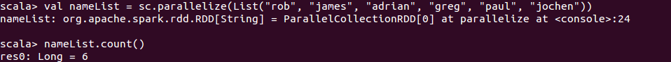

用Python并行化集合与Scala非常相似，如下例子所示：

用Java也是一样的（注：本处可能有问题）：

​	textFile = sc.textFile("README.md")  //读取README.MD文件内容来创建一个名为textFile的RDD

该parallelize方法有很多变种，包括设定数值区间的一个选项，例如：

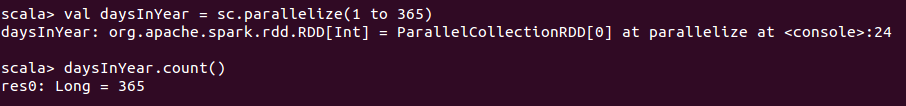

与Scala稍有差异的是，Python要用range()方法。结尾的值是不包括的，因此，你可以看到与Scala例子不同的地方，结尾值是366而不是365:

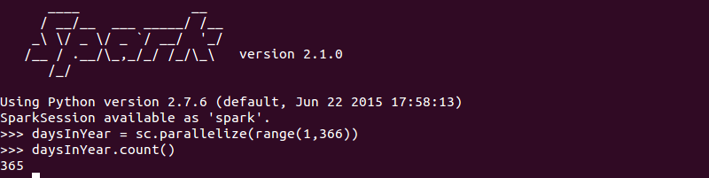

python提供的xrange函数也可以使用，与range相似，但执行更快，因为与在内存中创建列表的range()比较，它本质上是一个延迟执行的序列对象。

现在RDD已经创建完毕，它可以被并行化操作。你可以传递第二个参数给方法parallelize()，用于指示数据将要被分片的分区个数，作为一种深入优化的手段。spark将为集群的每个分区运行一个任务：

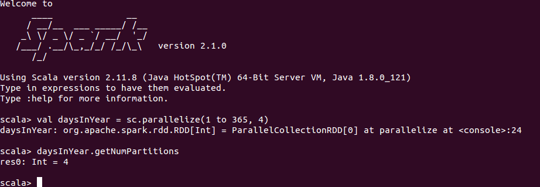

Python对这个的处理语法看起来与Scala差不多。例如，如果你想要对一个范围内的整数分割到4个分区做并行化，你可以像这样：

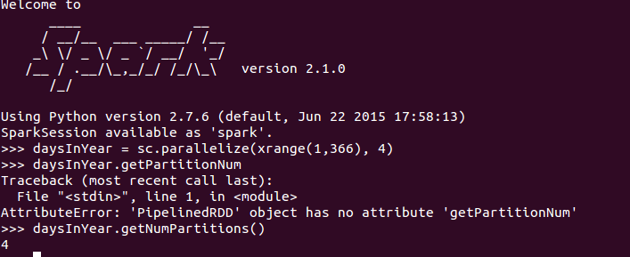

#### 引用外部数据源

你已经用parallelize方法创建了Spark的RDD对象，这主要用于构建原型。在产品使用中，spark可以从由Hadoop支持的任何存储源中加载数据，这些源包括本地文件系统的文本文件，以及HDFS、HBASE或Amazon S3上的数据。

如我们在前面例子看到的，你可以用textFile方法从本地文件系统中加载一个文本文件，其它可用的方法有：

​	hadoopFile()：从一个任意输入格式的Hadoop文件创建RDD

​	objectFile()：从一个保存为包含序列化对象的SequenceFile载入RDD，这种对象是有一个序列化分区的NullWritable key和BytesWritable值（？）

​	textFile()：这个方法之前已经见识过了，可以从HDFS或本地文件系统上读入文本文件，并返回字符串类型的RDD

***注意***：你可能想访问Spark的上下文API文档（http://bit.ly/SparkContextScalaAPI）来了解这些方法的细节，其中有些可能被重载过并允许你传递某些参数来加载多种文件类型。

一旦RDD创建完后，你可以对该RDD实施transformation或action的并行化操作。

***注意***：当从本地文件系统加载文件时，确保这个文件路径存在于所有的worker节点上。你也可能想使用网络挂载的共享文件系统。

Spark的textFile()方法提供了一些最为可贵的多种有用特性，扫描目录的能力，操作压缩文件以及使用通配符。那些工作在产品系统和机器日志的人将会欣赏这种特性的好处。

例如，在你的Spark文件夹里有两个.md文件，而同时我们已经在之前加载了README.md，让我们使用通配符来读取所有.md文件，并尝试其它的选项：

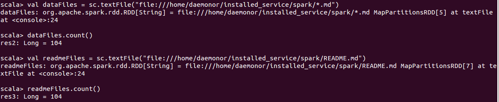

用Python加载文本文件有非常相似的更熟悉的语法。你将依然在Spark上下文调用textFile()方法，然后用该RDD来做其它操作，例如transformation和action：

相似地，对于Java，相关的代码例子将会像如下：

​	//读取在目录下的所有md文件

​	JavaRDD\<String\> dataFiles = sc.textFile("*.md");

​	// 读取README.md文件

​	JavaRDD\<String\> readmeFile  = sc.textFile("README.md");

​	// 读取所有的CONTRIBUTIONS.md文件

​	JavaRDD\<String\> contributions = sc.textFile("CONT*.md");

到目前位置我们仅仅在本地文件系统下做了尝试，那么从HDFS或S3之类的文件系统上读取一个文件将会有多大不同呢？让我们快速看看通过Spark可用的不同选项。

***注意***：我期望大多数读者已经熟悉HDFS和HADOOP，以及如何将数据上传到Hadoop。如果你依然没有开始你的Hadoop之旅，你也许需要看一看下面的Hadoop快速启动指导：http://bit.ly/HadoopQuickstart。

我们现在已经有数据被上传到HDFS。数据在目录/spark/sample/telcom下可以获取到。这儿有一些呼叫详情记录（CDRs）样本数据，被创建用于本练习。你将在本书的GitHub页面上找到样本数据：

​	//上传数据到Hadoop集群

​	hadoop fs -copyFromLocal /spark/data/ /spark/sample/telecom/

​	// 从Scala-Shell访问HDFS数据

​	val dataFile = sc.textFile("hdfs:///yournamenode:8020/spark/sample/telecom/2016*.csv")

​	// 从Python shell访问HDFS数据

​	dataFile = sc.textFile("hdfs:///yournamenode:8020/spark/sample/telecom/2016*.csv")

你也可以用非常相似的方法访问Amazon s3。

现在我们已经了解了RDD创建过程，让我们快速浏览可以在RDD执行的操作类型。

#### RDD操作

可在RDD上执行的两类主要的操作类型，它们被称为：

​	transformation

​	action

###### transformation

transformation是创建新数据集的操作，原因是RDD是不可修改的。他们用于将一个数据转换到另一个，这可能会导致数据放大、数据减小或完全不同的样子。这些操作并不返回任何值到驱动程序，因此是延迟执行的，这也是spark的主要优势之一。

transformation的一个例子可以是一个map函数，将遍历RDD的每个元素，返回一个全新的RDD，代表在原始数据集上的函数应用结果。

###### action

action是向驱动程序返回值的操作。如之前讨论的，在Spark上所有的transformation是延迟的，这本质上意味着Spark记得在一个RDD上所有的transformation，并且，当一个action被调用时，将会用最优化的方式来应用他们。例如，你可能有1TB的数据集，你将它传递给一系列map函数用于多种transformation。最终，你在数据集上执行了reduce action。Apache Spark将仅会返回一个最终的数据集，其大小可能是数十兆，而不是映射的中间结果的整个1TB数据集。

然而，你应该记得要保留中间结果，否则，Spark将在每个action每次调用时会重新计算整个RDD，在RDD上的persist()方法将帮助你防止重计算并保存中间结果。我们之后将对此给出更多的细节。

让我们通过一个简单的例子来展示transformation和action的作用。在这个具体的例子中，我们将使用flatmap() transformation和一个count action，使用本地文件系统的README.md文件作为例子。我们将解释Scala例子的每一行，然后再给出Python和Java的代码。通常，你必须用自己的文本片段试试这个例子，并探查该结果：

​	// 加载README.md文件

​	val dataFile = sc.textFile("file:///home/sysop/spark/README.md")

现在数据已经加载，我们将需要运行一个transformation。因为我们知道文本的每一行将会被加载成一个单独的元素，我们将需要运行一个flatMap transformation，并将单个单词分离出来作为一个单独的元素，对于这个要求，我们将调用split函数并使用空格作为分隔符：

​	// 将每个RDD元素分离出一个单词列表

​	val words = dataFile.flatMap(line => line.split(" "))

记住，直到这里，你似乎已经运用了一个transformation函数，什么都没有执行，所有的transformation已添加到逻辑计划中。同样要注意这个transformation返回了一个新的RDD，然后我们可以在这个词RDD调用count() action执行计算，这将导致在运用具体的transformation函数之前，从文件获取数据并产生一个RDD。你可能注意到了我们实际上传递一个函数给Spark，这是在本章的后续章节***向Spark传递函数***所覆盖的领域。现在我们有了RDD的另一个RDD，并对该RDD调用count()来获得RDD的元素总数：

​	words.count()

调用count() action时，该RDD即被执行，其结果将被发送回驱动程序。这对于大数据应用是非常灵巧和特别有用的。

如果你是Python精通者，你也许想要在PySpark中执行以下代码。你应该注意到lambda函数被传递给Spark框架：

​	// 加载数据文件，运用transformation和action

​	dataFile = sc.textFile("file:///home/sysop/spark/README.md")

​	words = dataFile.flatMap(lambda line: line.split(" "))

​	words.count()

用Java编写相同的功能也是很直观的，并且看起来与Scala很相似：

​	JavaRDD\<String\> lines = sc.textFile("file:///home/sysop/spark/README.md");

​	JavaRDD\<String\> words = lines.map(line -> line.split(" "));

​	int wordCount = words.count();

这也许看起来是一个简单程序，但在场景后面的（behind the scenes）使用了line.split(" ")函数并将其并行地运用到集群里的所有分区。这个框架提供了这种简单性，并在背后完成了集群上的协调调度工作，返回结果。

#### 传递函数到Spark（Scala）

在前面例子你已经看到，传递函数是Spark提供的关键功能。从用户的观点，你可以传递函数给驱动程序，Spark将会指出集群内存的数据分区位置，并行化执行该函数。传递函数的确切语法在不同编程语言里是不同的，由于Spark由Scala编写，我们将首先讨论Scala。

在Scala中，传递函数到Spark框架的推荐方法如下：

​	匿名函数

​	静态单例方法

###### 匿名函数

匿名函数用于简短的代码片段。他们也作为lambda表达式被引用，是编程语言一种很酷且简洁优美的特性。他们被称为匿名函数的原因是你能给输入参数任何名字，而结果都是一样的。

例如，下面的代码例子将会产生相同的输出：

​	val words = dataFile.flatMap(line => line.split(" "))

​	val words = dataFile.flatMap(anyline => anyline.split(" "))

​	val words = dataFile.flatMap(_.split(" "))

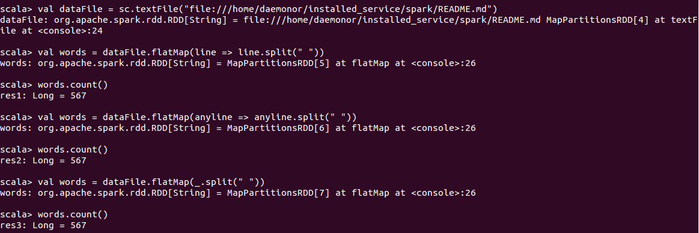

###### 静态单例函数

虽然匿名函数对代码短片段确实很有帮助，但当你想要向spark框架请求复杂的数据控制时则无能为力，而这能被静态单例函数自有的细微差别解救，我们将在这一节讨论这个。

***注意***，在软件工程中，***单例模式***是一种设计模式，用于限制一个类实例化到一个对象，当在系统上协调action时就完全需要有这样一个对象，这时单例模式是非常有用的。静态方法属于这个类，但不是它的一个实例。他们通常从参数获取输入，执行动作，最后返回结果。

静态单例是传递函数的常用方法，技术上就像你创建了一个类，在该类实例上调用一个方法，例如：

​	class UtilFunctions {

​		def split(inputParam: String): Array[String] = {inputParam.split(" ")}

​		def operate(rdd: RDD[String]): RDD[String] = {rdd.map(split)}

​	}

你可以发送一个类中的方法，但这样会有性能隐患，毕竟整个对象会随着方法被发送。

###### 向Spark传递函数（Java）

在Java中，为了创建一个函数，你需要实现在org.apache.spark.api.java函数包中的接口，这儿有两种常用的方法来创建这种函数：

​	在你自己的类中实现接口，并传送实例给Spark。

​	从Java 8开始，你能用Lambda表达式来传送函数给Spark框架。

让我们用Java实现之前的词统计例子：

​	@SuppressWarnings("serial")

​	JavaRDD<Integer> numWordsPerLine = dataFile.map(new Function\<String,Integer\>(){

​		public Integer call(String s) {

​			return s.split(" ").length;

​		}

​	});

​	@SuppressWarnings("serial")

​	int totalWords = numWordsPerLine.reduce(new Function2\<Integer, Integer, Integer\>(){

​		public Integer call(Integer len1, Integer len2) throws Exception {

​			return len1 + len2;

​		}

​	});

​	System.out.println("Total number of Words: " + totalWords);

如果你是那种感觉编写inline函数会让代码变得复杂和不可接受的程序员（很多人同意这个论断），你也许想要创建单独的函数并如下调用它们：

​	@SuppressWarnings("serial")

​	class GetNumWords implements Function\<String,Integer\> {

​		public Integer call(String s) {

​			return s.split(" ").length;

​		}

​	}

​	@SuppressWarnings("serial")

​	class SumWords implements Function2\<Integer, Integer, Integer\> {

​		public Integer call(Integer len1, Integer len2) {

​			return len1 + len2;

​		}

​	}

​	public void totalWords(JavaSparkContext sc, String fileName) {

​		JavaRDD\<String\> distFile = sc.textFile(fileName, 4);

​		JavaRDD\<Integer\> numWords = distFile.map(new GetNumWords());

​		int totalWords = numWords.reduce(new SumWords());

​		System.out.println("Total number of Words: " + totalWords);

​	}

###### 向Spark传递函数（Python）

Python提供了向Spark传递函数的简单方法，Spark编程指导（在spark.apache.org上获取到）建议可以用三种推荐方法来实现：

​	Lambda表达式是一种对于内部只有一个简单表达式的短函数非常奏效；

​	在函数里的本地defs，向Spark调用更长代码（？）

​	在一个模块中的顶级函数

由于我们已经在之前的例子中看到过一些lambda函数的使用例子，现在让我们看看这些函数的本地定义，下面会展示如何将词的划分和统计封装成两个单独的函数。

​	def splitter(lineOfText):

​		words = lineOfText.split(" ")

​		return len(words)

​	def aggregate(numWordsLine1, numWordsLineNext):

​		totalWords = numWordsLine1 + numWordsLineNext

​		return totalWords

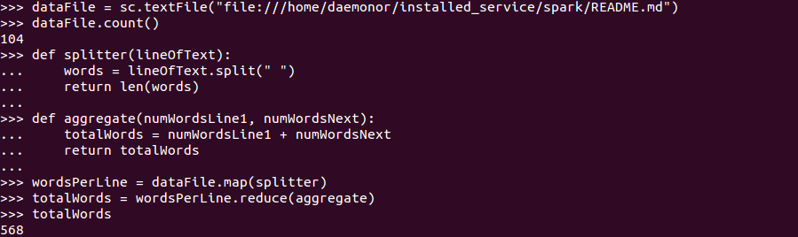

这儿还有另外一种实现该功能的方法，定义函数作为UtilFunctions类的一部分，然后在map和reduce函数中引用它们：

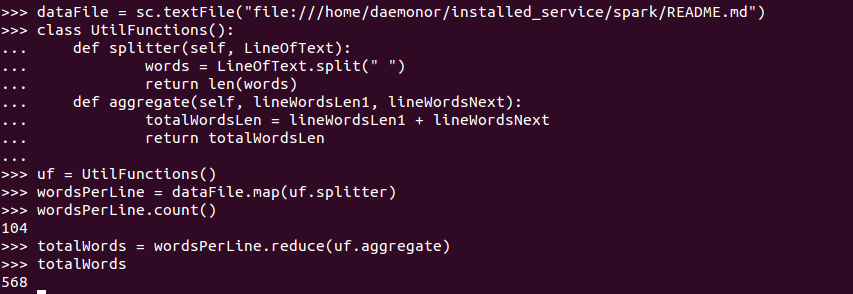

你也许想变得更大胆一些，并试图添加一个countWords()方法到UtilFunctions，这样它能接受RDD作为输入，并返回词总数。这种方法有潜在的性能隐患，因为整个对象将要被发送到这个集群。让我们看看如何实现这个需求，在下面截屏中可以看到结果：

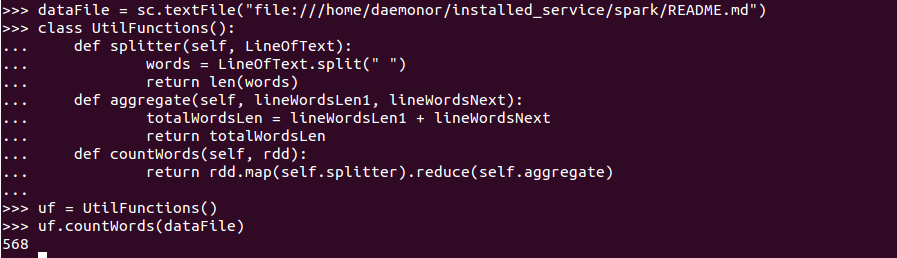

这可以通过生成本地对象的引用数据域的一份拷贝来防止，而不是直接外部访问它。（？）

现在我们已经掌握了如何向Spark传递函数，也在前面的例子中了解了一些transformation和action，包括map、flatMap和reduce，我们将要查看在Spark中更通常使用的transformation和action，下面的列表并不详尽，你可以在Apache Spark文档的编程指导章节(http://bit.ly/SparkProgrammingGuide)中找到更多的例子。如果你想要获取所有可用函数的更全面列表，你可以查看以下API文档：

|        | RDD                   | PairRDD               |
| ------ | --------------------- | --------------------- |
| Scala  | http://bit.ly/2bfyoTo | http://bit.ly/2bfzgah |
| Python | http://bit.ly/2bfyURl | N/A                   |
| Java   | http://bit.ly/2bfyRov | http://bit.ly/2bfyOsH |
| R      | http://bit.ly/2bfyrOZ | N/A                   |

#### Transformations

在本章中我们在例子中使用了少量的transformation函数，但我想要与你分享在Apache Spark中最常用的transformation函数列表。你可以在官方文档中找到完整的函数列表：http://bit.ly/RDDTransformations。

| 最常用的transformation                      |                                          |
| --------------------------------------- | ---------------------------------------- |
| map(func)                               | coalesce(numPartitions)                  |
| filter(func)                            | repartition(numPartitions)               |
| flatMap(func)                           | repartitionAndSortWithinPartitions(partitioner) |
| mapPartitions(func)                     | join(otherDataset, [numTasks])           |
| mapPartitionsWithIndex(func)            | cogroup(otherDataset, [numTasks])        |
| sample(withReplacement, fraction, seed) | cartesian(otherDataset)                  |

###### map(func)

这个map transformation是最常用的、最简单的RDD transformation，它将在参数中传递的函数应用到源RDD的每个元素上。在前面的例子，我们已看到map() transformation的用法，即将split()函数传递给输入RDD。

我们再也不会给出像之前看到的大量的map函数i使用例子。

让我们看看filter() transformation，这个也是最常用transformation函数之一，特别是在日志分析时。

###### filter(func)

Filter，正如其名所暗示的，过滤输入RDD，并按照满足传递参数的预期创建一个新的数据集。

例子2.1:Scala过滤例子：

​	val dataFile = sc.textFile("file:///home/daemonor/installed_service/spark/README.md")

​	val linesWithApache = dataFile.filter(line => line.contains("Apache"))

例子2.2：Python过滤例子：

​	dataFile = sc.textFile("file:///home/daemonor/installed_service/spark/README.md")

​	linesWithApache = dataFile.filter(lambda line: "Apache" in line)

例子2.3：Java过滤例子：

​	JavaRDD\<String\> dataFile = sc.textFile("file:///home/daemonor/installed_service/spark/README.md")

​	JavaRDD\<String\> linesWithApache = dataFile.filter(line -> line.contains("Apache"))

###### flatMap(func)

flatMap() transformation与map相似，但提供了更多的灵活性，从相似于map函数的观点，它操作RDD的所有元素，但这种灵活性源自于处理函数的能力，即返回一个序列而非一个单个项。你在之前的例子也看到了，我们使用flatMap()来平铺split(" ")函数的结果，它返回的是一个平铺的结构而不是一个string数组类型的RDD。

让我们看一看Scala的flatMap例子。

下面的例子展示了你如何用Scala的flatmap()方法将一个列表（在本例中是电影）平铺。

例子2.4:Scala的flatmap()例子

​	val favMovies = sc.parallelize(List("Pulp Fiction", "Requiem for a dream", "A clockwork Orange"));

​	favMovies.flatMap(movieTitle => movieTitle.split(" ")).collect()

下面Python的flatmap()例子达到了与例子2.4相似的目标，且该例子的语法与Scala例子看起来很相似（罗嗦。。。）。

例子2.5:Python的flatmap()例子：

​	movies = sc.parallelize(["Pulp Fiction", "Requiem for a dream", "A clockwork Orange"])

​	movies.flatMap(lambda movieTitle: movieTitle.split(" ")).collect()

如果你是一个Java粉丝，你可以用下面的Java代码例子来实现电影列表的平铺，用Java实现相同的例子显得有点罗嗦，但它本质上生成了相同的结果。

例子2.6:Java的flatmap()例子：

​	JavaRDD\<String\>  movies = sc.parallelize(Arrays.asList("Pulp Fiction", "Requiem for a dream", "A clockwork Orange"));

​	JavaRDD\<String\> movieName = movies.flatMap(

​		new FlatMapFunction\<String,String\>() {

​			public Iterator\<String\>  call(String movie) {

​				return Arrays.asList(movie.split(" ")).iterator;

​			}

​		}

​	);

###### Sample(withReplacement, fraction, seed)

采样是任意数据分析的一个重要组件，并会对你的结果/发现的质量会产生很大的影响。如果你期望在全数据集运行前先采样一部分数据快速测试你的假设，Spark为你的计算提供了RDD采样的便捷方法。我们将在机器学习章节讨论更多有关采样的问题，但这里会先对传递给该方法的参数做一个快速浏览：

​	withReplacement：是一个布尔类型（True/False），指示元素是否可以多次采样（当被采样出来后再放回）。放回式采样意味着两个采样值是独立的。在实际的术语中这意味着，如果我们放回式抽取两个样本，我们在第一个上得到的不会影响第二个抽取的，因此这两个样本的协方差是0。如果我们非放回式采样，这两个样本将不会是独立的。实践中，这意味着我们在第一个抽取的会影响第二个的采样，因此这二者的协方差不为0。

​	fraction：指示样本期望的大小是RDD大小的一部分，该值必须位于0到1。例如，如果你抽取5%样本，你可以选择0.05作为fraction。

​	seed：该参数用于随机数产生器。（注：如果前面两个参数不变，且该参数也不变，则多次调用的结果一致）

首先看一个Scala的采样例子。

例子2.7:Scala的sample()例子：

​	val data = sc.parallelize(List(1,2,3,4,5,6,7,8,9,10,11,12,13,14,15,16,17,18,19,20));

​	data.sample(true, 0.1, 12345).collect();

Python的采样例子看起来与Scala相似。

例子2.8:Python的sample()例子：

​	data = sc.parallelize([1,2,3,4,5,6,7,8,9,10,11,12,13,14,15,16,17,18,19,20])

​	data.sample(True, 0.1, 12345).collect()

在Java中，采样例子返回的是一个整数RDD。

例子2.9:Java的sample()例子：

​	JavaRDD\<Integer\> nums = sc.parallelize(Arrays.asList(1,2,3,4,5,6,7,8,9,10,11,12,13,14,15,16,17,18,19,20));

​	nums.sample(true, 0.1, 12345).collect();

#### Spark的集合操作

对于来自数据库世界和已经探索过大数据世界的读者，你可能在寻找如何在Spark数据集上运用集合操作。你可能已经意识到RDD能够表示任意种类的数据，但是它并没有必要表示成一个基于集合的数据。在数据库世界中典型的集合操作包括以下操作，并且我们将看到它们如何运用到Spark。然而，要特别记住虽然Spark提供了一些方法来模仿这些操作，但Spark不允许你在这些条件下运用这些操作，而这在SQL操作是很常见的(?)：

​	***Distinct***：该操作为你提供了从数据集中产生的非重复数据集。

​	***Intersection***：该操作返回那些存在于两个数据集的元素。

​	***Union***：该操作返回两个数据集中的元素。

​	***Substract***：该操作返回从第一个数据集中去除第二个数据集中匹配第一个数据集的元素的剩余元素。

​	***Cartesian***：两个数据集的笛卡尔积。

###### distinct()

在数据管理和分析时，工作在一个有区别无重复的数据集合通常非常重要。Spark提供了用可取的transformation操作实现从数据集抽取出有区别的值的能力（？）。让我们看看Scala、Python和Java收集有区别元素的方式。

例子2.10：Scala的distinct：

​	val movieList = sc.parallelize(List("A Nous Liberte", "Airplane", "The Apartment", "The Apartment"));

​	moviesList.distinct().collect();

例子2.11：Python的distinct：

​	moviesList = sc.parallelize(["A Nous Liberte", "Airplane", "The Apartment", "The Apartment"])

​	moviesList.distinct().collect()

例子2.12：Java的distinct：

​	JavaRDD\<String\> moviesList = sc.parallelize(Arrays.asList("A Nous Liberte", "Airplane", "The Apartment", "The Apartment"));

​	moviesList.distinct().collect();

###### intersection()

intersection与内联操作很相似，但警告是它并不支持joining的标准。intersection在两个RDD里寻找元素，返回同时存在于两个数据集的元素。例如，你可能基于技能集划分出候选人：

​	java_skills = "Tom Mahoney", "Alicia Whitekar", "Paul Jones", "Rodney Marsh"

​	db_skills = "James Kent", "Paul Jones", "Tom Mahoney", "Adam Waugh"

​	java_and_db_skills = java_skills.intersection(db_skills)

接下来展示几个用Scala、Python和Java实现的两个数据集的intersection例子。

例子2.13:Scala的intersection：

​	val java_skills = sc.parallelize(List("Tom Mahoney", "Alicia Whitekar", "Paul Jones", "Rodney Marsh"));

​	val db_skills = sc.parallelize(List("James Kent", "Paul Jones", "Tom Mahoney", "Adam Waugh"));

​	java_skills.intersection(db_skills).collect();

例子2.14：Python的intersection：

​	java_skills = sc.parallelize(["Tom Mahoney", "Alicia Whitekar", "Paul Jones", "Rodney Marsh"])

​	db_skills = sc.parallelize(["James Kent", "Paul Jones", "Tom Mahoney", "Adam Waugh"])

​	java_skills.intersection(db_skills).collect()

例子2.15：Java的intersection：

​	JavaRDD\<String\> java_skills = sc.parallelize(Arrays.asList("Tom Mahoney", "Alicia Whitekar", "Paul Jones", "Rodney Marsh"));

​	JavaRDD\<String\> db_skills = sc.parallelize(Arrays.asList("James Kent", "Paul Jones", "Tom Mahoney", "Adam Waugh"));

​	java_skills.intersection(db_skills).collect();

###### union()

union是两个数据集的基本聚合。如果部分元素同时存在于两个数据集，他们将会重复。如果使用前面例子的数据，你将得到Tom Mahoney和Paul Jones这两个人同时拥有Java和DB技能，对这两个数据集的union操作会产生他们的两个入口。本案例中我们将只会查看Scala例子。

例子2.16:Scala的union：

​	val java_skills = sc.parallelize(List("Tom Mahoney", "Alicia Whitekar", "Paul Jones", "Rodney Marsh"));

​	val db_skills = sc.parallelize(List("James Kent", "Paul Jones", "Tom Mahoney", "Adam Waugh"));

​	java_skills.union(db_skills).collect();

###### substract()

substraction，如名所指，将一个数据集的元素从另一个中删除，这非常适于ETL处理连续时间段产生的新数据，且确保在整合前标识出新的数据项，下面快速浏览Scala例子，并查看操作的结果。

例子2.17：Scala的substract()

​	val java_skills = sc.parallelize(List("Tom Mahoney", "Alicia Whitekar", "Paul Jones", "Rodney Marsh"));

​	val db_skills = sc.parallelize(List("James Kent", "Paul Jones", "Tom Mahoney", "Adam Waugh"));

​	java_skills.substract(db_skills).collect();

结果是：Alicia Whitekar, Rodney Marsh。

###### cartesian()

cartesian模拟了SQL系统的交叉连接，给出两个数据集的元素之间所有可能组合。例如，你可能有一年的12个月，总共5年，且想在所有可能的日期上执行一个特别操作。这就是你在Spark中如何用cartesian() transformation来产生数据（？）。

***注意***：为了简便，我们将不给出Python和Java的例子，但你能在本书的GitHub页面上找到它们。

#### Actions

前面已经讨论过，action会让Spark按你忙于执行transformation的同时由框架在后台创建的图执行真实的计算。由于Spark提供了一长列的action，我们只会列出由Spark提供的最常用action，并带你浏览其中某些action：

| reduce(func)                             | takeOrdered(n, [ordering]) |
| ---------------------------------------- | -------------------------- |
| collect()                                | saveAsTextFile(path)       |
| count()                                  | saveAsSequenceFile(path)*  |
| first()                                  | saveAsObjectFile(path)*    |
| take(n)                                  | foreach(func)              |
| takeSample(withReplacement, num, [seed]) |                            |

***注意***：方法saveAsSequenceFile()和saveAsObjectFile()仅在Java和Scala中可用。

我们在之前的例子中已经看到过reduce()、collect()和count()，所以我们将快速过它们的语义，但为了简便性而不会提供相关的例子。

###### reduce(func)

顾名思义，reduce对输入数据集执行聚合操作，该数据集通常是map函数调用的结果。你可以传递函数给reduce action，但前提是该函数是可交换(commutative)和关联的（associative？），以便并行执行。

***注意***：这个词commutative来源于commute或move around，所以commutative属性即指代移动周围的东西。对于加法，该规则是a+b=b+a；用数字表示，这意味着2+3=3+2。对于乘法，该规则是ab=ba;用数字可表示为2x3=3x2。

这个词associative来源于associate或group;associative属性指的是按组的规则。对于加法，规则是a+(b+c) = (a+b) +c;用数字可表示为2+(3+4)=(2+3)+4。对于乘法，规则是a(bc)=(ab)c;用数字可表示为2(3x4)=(2x3)4。

在以前的例子，我们已经看到如何从flatmap函数的输出中得到词统计。

###### collect()

collect将返回调用它的RDD的内容给驱动程序。通常这是你已经执行过transformation和filter这类操作产生的输出数据子集，例如map()和filter()。有一些在使用collect()需要注意的地方，在调用前你应该知道的：

​	通常用于单元测试，在产品环境中你应该使用SaveAsXXXFile方法来存储结果，并由下游处理接管。

​	RDD的整个内容将会发送回驱动程序，这也意味着它应该与单机上的内存匹配。不要在大的数据集上调用collect()，否则你的客户端会crash掉。

​	由于RDD在多个节点上分区，collect()调用将不会返回一个有序的结果。

我们已经在之前的例子看到了有关collect()的使用，所以我们在这里将跳过代码例子。

###### count()

在前面的例子看到过，count()将会返回RDD中的元素总数。例如，当我们从文件系统中加载一个文件，count()函数返回的是文件中的总行数。count通常用于单元测试，但它是一个重操作的action，因为在返回一个计数前会重新计算RDD图。如果有一个你经常需要检查行数的数据集，这时将它缓存比较合适（我们之后会看到cache())。

Spark框架提供了一些count函数的变种：

​	countByValue()：返回在RDD每个唯一值的以(value,count)为数据对的map统计。

​	countByValueApprox()：一个CountByValue()的近似版本，这将返回一个可能不完整带误差边界的结果。

​	countByKey()：仅适用于类型为(K,V)的RDD，返回每个key计数的(key,number)map。

###### take(n)

如果你想从结果数据集中取出前面的元素，take是一个能派得上用场的函数。这个函数将从RDD中取出前n个元素。由于RDD通常有多于一个分区，take(n)将会扫描一个分区，并用从该分区得到的结果来预估需要多少额外的分区，以满足n个输出行的期望请求。这个函数在单元测试和Spark程序调试时非常高效。

take(n)也有一些spark的变种：

​	takeSample(withReplacement, num, [seed])：顾名思义，它与take()非常相似，但返回一个以数组形式的RDD固定大小采样子集。特别要注意的是当使用该方法时，只有你期望结果数组是比较小时才去调用它，因为所有返回的数据都将被载入到驱动器的内存。

​	takeOrdered(n, [ordering])：从RDD返回的前n个元素是由隐含的Ordering[T]定义的。与takeSample()方法相似的是，这个方法返回数组形式的数据，并将载入到驱动器内存。

例子2.18：Scala的takeOrdered()：

​	sc.parallelize(Seq(10, 4, 2, 12, 3)).takeOrdered(1)

​	// 返回 Array(2)

​	sc.parallelize(Seq(2,3,4,5,6)).takeOrdered(2)

​	// 返回 Array(2, 3)

###### first()

​	first本质上是take(1)，它在spark中用一种很相似的方法来实现。基本上，该函数将返回RDD中的第一个元素。

###### saveAsXXFile()

在数据集成应用中，通常在执行了transformation或一个机器学习模型等的主要操作后，会将数据保存到文件中。Spark提供了三个趁手的saveAsXXXFile()函数，每个都有相似的语法，但些微不同的含义，这三个方法如下：

​	saveAsTextFile(path)：它允许将RDD当作文本文件存入到本地系统、HDFS或任何其它Hadoop支持的文件系统。输入的元素可以是任意类型，然而，在存入之前，Spark会对每个元素执行toString()以转换成文本。我们将在有关用Spark做ETL的章目里看到它的使用例子。

​	saveAsSequenceFile(path)*：这个方法仅在Java和Scala中可用，将RDD作为一个Hadoop SequenceFile写入到由参数指定的路径。这个路径可以指向本地文件系统、HDFS或任何其它Hadoop支持的文件系统。

​	saveAsObjectFile(path)*：这个方法再次只适用于Java和Scala。RDD中的元素会写入到参数指定的路径，且能够用Spark Context的objectFile()方法重新加载。

***注意***：saveAsSequenceFile和saveAsObjectFile()仅适用于Java和Scala。

###### foreach(func)

我们已经看过map函数，其作用基本上是在RDD的每个元素上应用一个方法，并返回另一个RDD作为输出。考虑有这么一个场景，你想要对RDD的每个元素应用一个操作，但不返回结果给驱动程序。在这种特别的场景，你可以用foreach(func)来初始化一个计算，而不用向驱动程序返回结果。你将会使用它的典型案例：

​	更新一个accumulator（查看**共享变量**小节）

​	与外部系统交互，例如，存储到一个数据库

由于我们将在之后的小节**共享变量**中讲解accumulator，现在只需要理解accumulator是一个用于在executor之间聚合信息的变量。我们已经操作过README.md文本文件并做了一些基础的词计数，但业务上想要清楚文件的平均词长度。现在，如果你没有有关MPP平台的背景，你可能会认为计算平均值仅仅是一个简单的操作。事实上Spark是一个分布式系统，意味着每个executor的操作是各自独立的，为了得到全局聚合，你需要定义一个全局变量，以便所有的executor在知道每个词的长度之后能够更新它。这也是accumulator能够救场的地方。另外，我们也将需要统计每个词总量，这需要一个foreach()操作的地方。让我们跳入一个Python例子来看看foreach()的使用：

#### PairRDDs

到目前为止，我们已经看了一些基本的RDD，其元素可以是词、数字或文本的行，现在来讨论PairRDD，这本质上是一种key/value对的数据集。用过MapReduce的人对key/value对的概念及其在聚合、联合、排序、统计和其它ETL操作上带来的好处会比较熟悉。用key-value对的漂亮之处在于，你可以并行化处理属于一个特定key的数据，可以用的操作有聚合或联合。最简单的例子可以是零售店销售时使用StoreId作为key，销售总量作为value，这将帮助你在StoreId上执行一些高级的分析，能用来做并行的数据处理。

#### 创建PairRDDs

要理解PairRDD的第一步是要理解它们如何被创建的。我们在前面已经看到，在摄入的时候数据并没有必要是key/value形式的，因此有必要用传统的RDD transformation函数将数据转换成PairRDD。

转化前要做细致的考虑，最终要的考虑点包括回答以下关键问题：

​	什么做key？

​	什么做value？

答案有赖于你正在试图解决的业务问题。例如，如果你有一个文本文件，里面有StoreId（1000个不同的商店）以及每月的销量（000's of dollars），所以key可以是StoreId，value可以是销量。我们将基于逗号分隔的文件进行工作，该文件含有StoreId以及相关的月销量value。从本书网站上可以下载到文件storesales.csv。

在我们对将来的action课程做任何决定之前，先看看该文件的结构：

这个文件的结构指出我们有三个数字的StoreID（不超过一千的值），其后是逗号以及商店销量的value。我们的目标是要每个商店的总销量，以了解每个商店运作的情况。在之前讨论的，首先要将该数据转换成PairRDD，这可以使用一个map（Python和Scala）以及MapToPair(Java)函数做到。让我们快速看一看用Scala、Python和Java实现的样例：

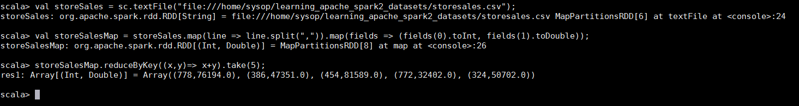

用Python实现的例子代码与Scala相似，也只是使用map函数将其转换成PairRDD：

然而，在Java中有些不一样，需要使用mapToPair()函数来实现将数据转换成PairRDD：

​	JavaRDD\<String\>  dataFile = sc.textFile("file:///home/sysop/learning_apache_spark2_datasets/storesales.csv");

​	JavaRDD\<Integer,Integer\> lines = dataFile.mapToPair(new PairFunction<String,Integer,Integer(){

​		public Tuple2\<Integer, Integer\> call(String input) throws Exception {

​			String[] tokens = input.split(",");

​			return new Tuple2\<Integer,Integer\>( new Integer(token[0]), new Integer(token[1]));

​		}

​	});

​	System.out.println("Top 5 rows " + lines.reduceByKey((x,y) -> x+y).take(5));

#### PairRDD transformation

Spark不仅仅提供了PairRDD的构造方法，也提供了一些在标准RDD提供的transformation之外的只适用于PairRDD的特殊transformation。如PairRDD其名所指的那样，两个元素(a,b)对构成了一个元素，因此，你将看到一些只适用于pair/tuple的操作。

***注意***：Tuple是一种包含多个部分的数据结构，在关系型数据库中，它指构成一条记录的数据有序集。

用于PairRDD的操作设计原则来源于一个事实，即操作有一个word key或value时指示它们应该用于PairRDD：

| Key               | Value               |
| ----------------- | ------------------- |
| reduceByKey(func) | flatMapValues(func) |
| groupByKey()      | mapValues(func)     |
| combineByKey()    | values()            |
| keys()            |                     |
| sortByKey()       |                     |

我们将要运行的例子，其数据为英国地区的销量数据，样本输入数据如下：

​	{(London, 23.4), (Manchester, 19.8), (Leeds, 14.7), (London, 26.6)}

######reduceByKey(func)

我们已经看过reduceByKey(func)的例子，将基于storeid(key)的商店销量按照相同的key的value聚合起来。作为参数传递的函数作为关联函数（？），运用在源RDD上，并将结果value创建成一个新的RDD。由于不同key的数据可以分布在不同的executor上，这个函数可能需要数据shuffling。下面的例子展示了Scala、Python和Java的reduceByKey()：

Python代码与Scala看起来很相似：

在前面例子也看到过，Java代码看起来比较罗嗦，你需要在运行reduceByKey这个action之前创建一个Tuple2对象的列表：

​	List\<Tuple2\<String,Float>> pairsData = new ArrayList();

​	pairsData.add(new Tuple2("London", 23.4));

​	pairsData.add(new Tuple2("Manchester", 19.8));

​	pairsData.add(new Tuple2("Leeds", 14.7));

​	pairsData.add(new Tuple2("London", 26.6));

​	JavaPairRDD\<String, Float> storeSales = sc.parallelize(pairsData);

​	JavaPairRDD\<String, Float> totalStoreSales = storeSales.reduceByKey( (accum, sales) -> accum + sales);

​	System.out.println("Sales Per Store: " + totalStoreSales);

######GroupByKey(func)

顾名思义，其功能是按相同key将value分组。为了简便，我们将留给读者尝试处理为reduceByKey()加载的数据集，并运用groupByKey()来查看结果。

###### reduceByKey vs. groupByKey()  ---性能影响

reduceByKey()和groupByKey()可以用于相似的结果，但它们的执行有很大不同，对性能也有巨大的影响。在这个场景后面，它们都是用了combineByKey并结合不同的combine/merge实现构成了关键的区别。groupByKey()操作可能非常昂贵，特别是如果你在做分组以实现对每个key执行聚合（例如求和或平均值）。在这种场景中，使用aggregateByKey或reduceByKey将获得更好的性能。关键区别在于：

​	reduceByKey()：提供一个Map方的combine，这意味着参与shuffle的数据量将比groupByKey要少。

​	groupByKey()：必须能够在内存中容纳任何key的所有的key-value对。如果一个key有过多的value（特别普遍流行的有，例如股票交易），它将潜在导致一个OutOfMemoryError的出现。groupByKey()调用参数mapSideCombine参数被设置成false的函数combieByKey()，这会导致额外增加的shuffling，因此影响性能。

​	总的说来，你应该禁用groupByKey()。例如，在下面的Scala例子中，用groupByKey()实现的聚合也可以用reduceByKey()实现。

例子2.19：Scala的groupByKey()和reduceByKey()

###### combineByKey(func)

为了更好的理解combineByKey()，你需要理解Hadoop MapReduce的combiner功能。Combiner是map端的reduce函数，可以减少shuffle的数据量。combineByKey()有三个不同的参数：

​	CreateCombiner：这是combineByKey()函数的第一个参数，顾名思义，它创建一个后面将使用的combiner，在partition中的key被第一次发现时调用。

​	MergeValue：当key有一个accumulator时被调用。

​	MergeCombiner：当对同一个key的有accumulator的分区多于一个时调用。

让我们考虑数据集的例子，如下：

​	("k1", 10), ("k2", 5), ("k1", 6), ("k3", 4), ("k2", 1), ("k3", 4)

为了简便性，我们对数据保留三个key，即（k1,k2,k3)，meigekey至少有两个value。我们的目的是计算每个key的平均值。让我们先看Python例子，这可能是最简单的：

第一步将数据在集群上并行化。现在分析combineByKey()的每一步，查看做了什么以解释该操作的语义：

​	lambda val: (val, 1)：如前面所提到的，这是combiner的创建，key的每个分区上会被调用。这将会从在输入数据集中的(key,value)对去除value数据项，并转换成另一个对，这里是(value,1)。所以，例如处理("k1", 10)，它将取其value 10，并转化成(10,1)对，这基本上是combiner的初始化。每次当它遇到一个新key的partition，将会重复执行相同的处理。不可思议的地方就隐藏在这个操作combineByKey的名字里。

​	lambda valcntpair, val: (valcntpair[0]+val, valcntpair[1]+1)：这是合并value的步骤，