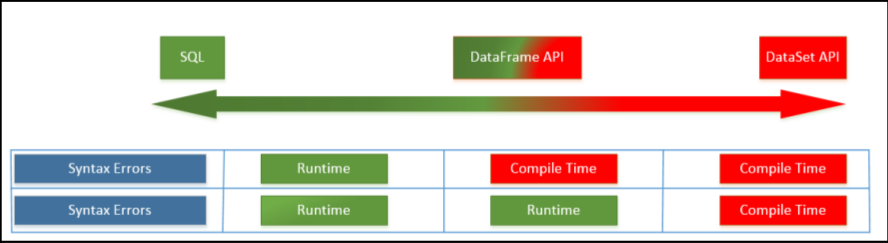

# 第四章 Spark SQL

***set_daemon@126.com 2017-10-04 图书：Learning Apache Spark2，可在github https://github.com/PacktPublishing/Learning-Apache-Spark-2找到源码。 （如有侵权，请与我联系）***

到目前为止，我们经历了一次过山车（？）。在上一章，我们查看了用Spark执行ETL，最重要的是，从不同数据源加载数据和保存数据到不同的数据源。我们看过结构化数据流以及NoSQL数据库，整个过程中我们都一直尝试使用RDD来操作这些数据源，轻微的尝试了DataFrame和DataSet API，但只限于表面而没有深入探讨这些主题的更多细节，不过，我们将在本章给出更全面的介绍。

如果你有数据库背景，并依然试图使用RDD API，这可能是你最喜欢的章节，因为它会深度解析如何挖掘Spark框架的能力来使用SQL。

在本章，我们将覆盖以下关键主题：

​	DataFrame API

​	DataSet API

​	Catalyst优化器

​	Spark Session

​	控制Spark DataFrame

​	使用Hive、Parquet文件以及其它数据库

让我们开始突破！

## Spark SQL是什么？

SQL现在已经成为20年以来业务分析师事实上的语言，随着大数据的发展，出现一种构建业务应用的新方式，即API。然而，编写Map-Reduce的用户很快意识到尽管MapReduce是一种极强的范式，但由于复杂的编程范式导致它难以接触，这类似于迫使之前使用SQL解决业务问题的业务分析师退出使用它。业务分析师是这样的一类人，有丰富的业务知识，但有限的API构建应用的知识，因此对他们来说，很难将他们的业务问题用这新的、闪亮的且承诺了很多的框架编码实现。这导致开源社区开发了一系列项目更容易处理大数据，例如Hive和Impala。

相似地，在Spark场景中，尽管RDD是最强大的API，但对业务用户可能还是太过于底层，Spark SQL应运而生，解救那些倾向于使用Spark、但又不想了解RDD而更关注于解决业务问题的人们。

我们大多数人都知道SQL表示结构化查询语言，因此强调它处理结构化数据的能力。因此，Spark SQL是一个主要用于结构化数据处理的模块。想象一下，一个优化器需要处理数据而又不知道它在处理什么（？），且试图在计算时找出这个信息，（Imagine an optimizer who has to work with data without knowning what it is working with, and trying to figure that out during the computation compared to being provided with information up front on the type of data and computation being performed）。Spark SQL向优化器提供了更多信息，也帮助提供更多优化。有必要了解Spark SQL将会对所有API使用相同的计算引擎，因此确保，不管指定计算选用的API而有相似的计算性能。

与Spark SQL交互有多种方式，包括SQL和DataSet API，运行SQL的结果是一个Dataset或者DataFrame，因此，有必要理解Dataset和DataFrame是什么。

## DataFrame API是什么？

我相信在查看DataFrame API是什么之前，有必要复习RDD是什么，以及在RDD接口上可以做什么提升。RDD是自Apache Spark产生之初即是用户所面对的 API，如之前所讨论的可以代表无结构化数据，是编译期安全的，有依赖，延迟执行，以及代表在Spark集群的分布式数据集合。RDD可以有分区，由本地信息辅助，因此帮助Spark调度器可允许数据所在的机器上执行计算，以此降低网络负载消耗。

然而，从编程的角度，计算本身是不透明的，Spark并不知道你在做什么，例如join/filter，等等。他们表达一个方案如何比一个方案是什么更好（？）。数据本身对优化器而言是不透明的，这意味着Spark在Scala、Java或Python中获得一个对象，作为一个框架仅能做的事情是使用一个序列化器将其转化为字节，限制了访问单列的能力，特别的压缩，等等。这限制了你以及优化器对数据执行优化的能力。Spark RDD API的另一个问题是，它们在非JVM语言上是比较慢的，例如Python。换句话说，很容易构建一个低效的转化，例如，filter之后跟着的是reduce而非vice-versa。

DataFrame API与RDD相似，也像RDD一样代表了一个不可修改的分布式数据集合。DataFrame API背后的核心目标是让开发者可以表达他们想完成的，而非他们想如何完成，将底层优化留给Spark框架。DataFrame的另一个目标是扩展Spark的目标用户范围，而不限于能用Java及/或Scala编码的数据工程师。DataFrame允许结构上带来的负担转化到分布式的数据集合，从而允许更高层级的抽象，提供特定领域的API来操作分布式数据。Spark的DataFrame特性是它有模式，意味着它的每一列都有特定名称和类型。一旦你得到一个DataFrame，你可以用SQL操作它。

## Dataset API是什么？

Spark在1.6版本发布了Dataset API，代表映射到关系模式的强类型不可修改对象集合的DataFrame API扩展。Dataset API被开发用于利用Catalyst优化器，通过开放表达式和数据域给查询planner（？）。Dataset带来了编译时类型安全，意味着你可以在产品应用运行前检查出错误，一个不断跟随DataFrame API出现的主题。

Dataset API的一个主要好处是降低内存使用总量，原因是Spark框架可以理解在dataset中的数据结构，因此在缓存数据集时在内存空间创建了一个优化的布局。有测试表明，相比使用RDD表示的相同数据，Dataset API只使用其4.5分之一的内存空间。

下图展示了由Spark使用多种的API显示的分析错误，在频谱一端显示的是SQL分布式job，另一端是Dataset：

## Spark 2.0的新变化

对于一直关注Spark 2.0声明的用户，你可能听到过一个事实，Dataframe API现在已经合并了Dataset API，意味着开发者现在要学习更少的概念，工作于一个单独的更高级、类型安全的称为Dataset的API。

Dataset API有两个独特的特性：

​	强类型API

​	无类型API

在Apache Spark 2.0中的DataFrame仅是一个通用行对象的dataset，当你未提前知道这些域时这特别有用；如果你不知道最终可以隐藏这个数据的类时，你将想要保持它为通用对象，之后再转化成任何其它类（很快你就能知道这指什么）。如果你想切换到一个特定的类，你可以请求Spark SQL在之前生成的通用行对象上使用DataFrame的as方法强制转换类型。

让我们考虑一个简单的例子，从JSON文档中加载一个Product，并在其上强制转换成一个类对象：

​	val df = spark.read.json("file:///home/daemonor/Learning-Apache-Spark-2/DataSets/products.json")

​	case class Product(ProductId:Int, ProductName:String,ProductCategory:String)

​	val ds:DataSet[Product] = df.as[Product]

对比来看，一个dataset是一个强类型的JVM对象集合，由一个Scala定义的case类，或Java中的类。下面表格指出类型化和无类型化API的列表：

| 语言     | Dataset[类型化] | DataFrame[无类型化] |
| ------ | ------------ | --------------- |
| Scala  | Dataset[T]   | Dataset[Row]    |
| Java   | Dataset[T]   | **没有无类型化API     |
| Python | **没有类型化API   | DataFrame       |
|        | **没有类型化API   | DataFrame       |

我们意识到Python和R并不提供编译时类型安全，因此，你将仅能找到这两种语言的无类型API，名为DataFrame。

