# Learning with Apache Spark 2

***set_daemon@126.com   2017-08-18  （如有侵权，请与我联系）***

翻译的原因有两个：尝试锻炼英语翻译能力，方便以后看其它资料；加深对spark的理解。

可在github https://github.com/PacktPublishing/Learning-Apache-Spark-2找到源码。

##第1章 架构与安装

本章意在提供和描述有关Spark的整个体系，包括Spark架构。你将会领略这个框架的高层级细节、安装以及编写你第一个Spark程序。

本章将覆盖接下来的核心主题，如果你已经熟悉这些主题，可以放心的转到下一章：Resilient Distributed Datasets（RDDs）。

Apache Spark的架构概览：

​	Apache Spark部署

​	安装Apache Spark

​	编写第一个Spark程序

​	提交应用

####Apache Spark架构概览

Apache Spark是一个开源中的分布式数据处理引擎集群，提供统一编程模型引擎，可跨多种类型数据处理工作负载和平台（注：数据源可多种）。

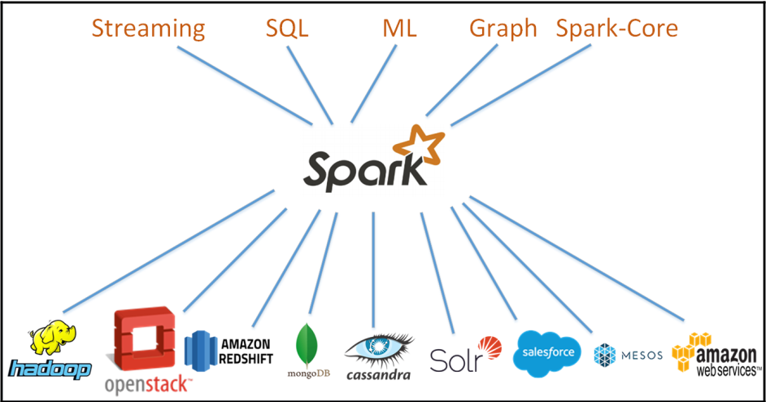

这个项目的核心是支持Streaming、SQL、Machine Learning（ML）和Graph的API集合。Spark社区提供多样开源和合适的数据存储引擎的连接器支持，除随Spark绑定的独立安装的独立集群管理器外，也具备运行在其它多种集群管理器的能力，如YARN和Mesos。因此，这与Hadoop生态系统有很大的不同，hadoop提供了一个完整的平台，如存储格式，计算引擎，集群管理，等等。Spark的单一设计目标是一个优化的计算引擎。因而这允许你在不同的集群管理器上运行Spark，包括独立运行，或插入到YARN和Mesos。同样，Spark也没有自己的存储，但它可以连接到大量的存储引擎。

当前Spark APIs已经得到最通用语言的支持，包括Scala、Java、Python和R。

让我们从浏览Spark上的各类API开始来这段旅途。

####Spark-core

Spark架构的心脏就是Spark的核心引擎，通常被称作spark-core，构成了这个强大架构的基础。Spark-core支持服务，例如，管理内存池，集群任务调度（Spark部署成集群模式时以大量并行处理系统Massively Parallel Processing的方式工作，即MPP），恢复失败的job，以及提供支持在多种存储系统上工作，如HDFS、S3等等。

***注意***：Spark-core为独立调度提供了一个完整的调度组件，代码可以从以下网址获取到：https://github.com/apache/spark/tree/master/core/src/main/scala/org/apache/spark/scheduler。

<u>Spark-core为用户从集群工作模式下的底层技术抽象了一套API。Spark-core支持作为其它高层级API基础的RDD API，这是Spark的核心编程元素</u>。我们将在本书之后的章节讨论RDD、DataFrame和Dataset的API。

***注意***：MPP系统通常使用大量的处理器（在单独的硬件上或虚拟化出来的）来并行化执行操作集合。MPP系统的目标是将工作划分为更小的任务片段，并行化的执行这些小任务，以期增加吞吐量。

#### Spark SQL

Spark SQL是Spark最流行模块中的一个，被设计成结构化和半结构化的数据处理。Spark SQL允许用户在Spark程序内使用SQL或DataFrame和Dataset API来查询结构化数据，并被Java、Scala、Python和R所支持。基于DataFrame API支持统一方式访问多源数据，包括Hive数据集、Avro、Parquet、ORC、JSON和JDBC，用户可以用同样的方式连接到任何数据源，并将多个数据源连接在一起。Spark SQL可以使用Hive的元存储，为用户提供了完全兼容的方式来访问已经存在的Hive数据、查询和UDF，这样，用户能无缝的运行他们当前的Hive工作，而不需要在Spark上做修改。

Spark SQL也能通过spark-sql shell被访问，也可以使用商业工具通过标准JDBC和ODBC接口来连接。

####Spark Streaming

超过50%的用户认为Spark Streaming是Apache Spark最重要的组件，Spark Streaming使得处理主动到来的数据或实时流数据成为可能。主动流可以是来自于静态文件，你将其数据流入到Spark集群，包括多种数据，例如web服务器的日志，社交媒体行为（比如跟随一个特定的Twitter标签），来自于汽车/手机/家庭的传感数据，等等。Spark-Streaming提供一堆API来帮助你创建streaming应用，如同创建一个batch job一样，只需微小改动。

作为Spark 2.0，<u>隐含在Spark Streaming背后的哲学并不是要像传统数据源的处理方案一样推导出streaming和创建数据应用的方式</u>，这意味着从数据源出来的数据持续地附加到已经存在的表里，所有的操作是在新窗口里运行。一个单独的API就可以让用户创建一个batch或streaming的应用，唯一不同之处是在batch应用中的表是有限的，而在streaming job中的表是无限的。

####MLlib

MLlib是Spark的机器学习库，如果你从封面处还记得，迭代算法是创造Spark的关键推动器中的一个，大多数机器学习算法用不同方式执行迭代处理。

***注意***：机器学习是AI人工智能的一个类型，为计算机提供无需显性编程就能自学的能力。机器学习关注于开发能教自己成长且顺应新数据做相应改变的计算机程序。

Spark MLlib允许开发者使用Spark API，访问多种数据源构建机器学习算法，包括HDFS、HBase、Cassandra等等。Spark执行迭代计算非常快，比MapReduce要快100倍。Spark MLlib包括大量算法和适用工具，包括但不限于，逻辑回归，SVM，分类和回归树，随机森林，梯度增强树（gradient-boost tree），使用ALS的推荐，K-Means的聚类，主成份分析PCA以及其它。

#### GraphX

GraphX被设计用来操作图的一套API。图可以是，通过超级链接构成的web页面链接图，或Twitter上由followers或retweets连接而成的社会化网络图，或Facebook朋友列表。

​	图理论是对图的研究，一种模型化物体之间关系对的数学化结构。一个图由多个节点构成，节点之间通过边连接。  --- Wikipedia.org

Spark提供了内置的图操作库，<u>因而允许开发者无缝工作于图和集合，将ETL、发现性腺分析和迭代图操作合并到一个单独的工作流中。</u>在一个单独系统能高速地合并transformations、机器学习和图计算的能力，使得Spark成为最灵活和最强大的框架。Spark既能保留容错的标准特征又不失计算速度，使得它特别适合处理大数据问题。Spark GraphX有一系列的内置图算法，包括PageRank、Connected Components、Label Propagation、SVD++和Triangle Counter。

####Spark部署

Apache Spark可以运行在Windows和Unix类系统（例如，Linux和Mac OS）。如果你刚开始使用Spark，可以先在单机上运行本地环境。Spark要求Java 7+，Python 2.6+，以及R 3.1+。如果你喜欢用Scala API（这是实现Spark的语言），你需要至少Scala版本2.10.x。

Spark能运行在集群模式，Spark使用该模式可以自己运行，也可以运行在其它一些集群管理器上。你可以部署spark在以下的集群管理器上，且随着活跃社区的支持，该列表每天都在增长：

​	Hadoop YARN

​	Apache Mesos

​	Standalone调度

<u>***Yet Another Resource Negotiator(YARN)***是关键特性中的一个，包括一个重新设计的资源管理器，在hadoop中将调度和资源管理能力从原来的MapReduce中分离出来。</u>

Apache Mesos是一个加利福尼亚伯克利大学开发的开源集群管理器。它提供了有效的跨分布式应用/框架的资源隔离和共享。

####安装Apache Spark

如前几页所提到的，Spark既能部署到一个集群上，也可以在单机上本地运行。

在本章，我们将要下载和安装Apache Spark到Linux机器上，并运行为本地模式。在做任何事情之前，我们需要从Spark项目的Apache网页上下载Apache Spark：

​	1 使用你喜欢的浏览器浏览页面http://spark.apache.org/downloads.html

​	2 选择Spark的一个发布版本。你也会看到Spark之前的发布版本列表，我们将选择发布版本2.0.0（在本书写作时，仅预览版本是可用的）。

​	3 你可以下载Spark的源码，用来编译生成支持Hadoop的多个版本，或者下载特定Hadoop版本的。在本例中，我们将下载支持Hadoop2.7+的预构建版本。

​	4 你也可以选择直接下载，或从其它不同的镜像中挑选一个下载。为了练习的目的，我们将使用直接下载，存放到我们首选的位置。

​	***注意***：如果使用windows系统，请记得使用一个不带空格的路径名。

​	5 你刚下载的文件是一个压缩的TAR包。你需要解压缩该文档。

​	***注意***：这个TAR应用工具通常用来解压TAR文件。如果你没有TAR，你也许可以从仓库中下载下来，或使用7-ZIP，这也是我喜爱的一个工具。

​	6 一旦解压完成，你将看到一系列目录/文件。当你列出解压后的目录下的内容时，下面是你通常能看到的：

​		bin文件夹包括一些可执行shell脚本，例如pyspark、sparkR、spark-shell、spark-sql和spark-submit。所有这些可执行文件都是用来与Spark交互，我们将使用这其中的大部分。
​	7 如果你看到我特定的Spark下载，你将发现一个文件夹叫做yarn。下面的例子表示Spark是基于Hadoop版本2.7构建的，随带着YARN作为集群管理器。

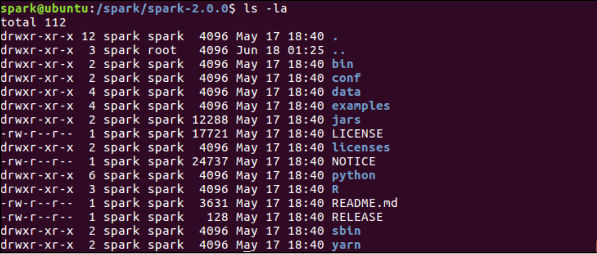

我们将开始运行Spark Shell，这是开始Spark和学习API的非常简单的方式。Spark shell是一个Scala Read-Evaluate-Print-Loop（REPL），并且支持Spark的REPL还有Python和R。

你应该切换至Spark下载路径，如下执行Spark shell：/bin/spark-shell。

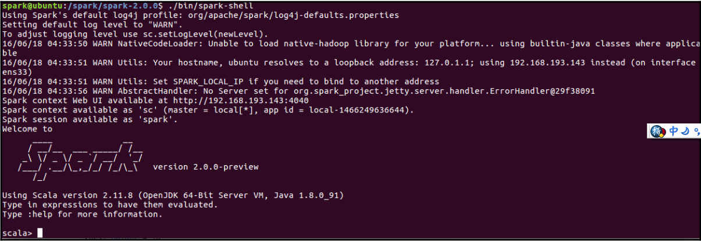

现在我们将Spark运行在standalone模式。我们稍后在本章讨论部署架构的细节，但现在让我们启动基本的Spark编程，来领略Spark框架的强大和简单。

#### 编写你的第一个Spark程序

如之前所述，你可以使用Python、Scala、Java和R来用Spark。在spark/bin路径下有不同的可执行shell脚本可用，且到目前为止，我们仅仅尝试了Spark shell，使用Scala来探索数据。在spark/bin路径下还有如下的可执行文件可用，在本书的课程中将使用其中的一些：

​	beeline

​	pyspark

​	run-example

​	spark-class

​	sparkR

​	spark-shell

​	spark-sql

​	spark-submit

无论你使用那个shell，都基于你过去的经验和能力，且都必须掌握好一个抽象概念，那是你在Spark集群上能操作数据的手柄，可以是本地的，也可以是跨分布在上千台机器上的。这个抽象概念在本处所指的是Resilient Distributed Datasets（RDD），是Spark上数据和计算的基础单元。顾名思义，除其它之外，它们还有两个关键特性：

​	***它们是弹性的***：如果内存中的数据丢失了，新的RDD将被创建

​	***它们是分布式的***：你能用Java或Python操作跨集群分布的对象

*第二章，Spark RDD的转换和动作*，将会带你领略RDD的复杂精细度，当然也将讨论其它基于RDD创建的更高层API，例如Dataframe和机器学习管道。

让我们快速给你展示如何使用Spark浏览本地文件系统的文件，之前在图1.2中，我们浏览spark的文件夹内容时，我们看到一个名为README.md的文件，该文件包含了Spark的概览、在线文档的链接，以及开放给开发者和分析师的其它有用的东西。我们即将读取那个文件，并将其转化成一个RDD。

为了进入Scala shell，请操作接下来的命令：

​	./bin/spark-shell

用这个Scala shell运行以下代码：

​	val textFile = sc.textFile("README.md") #创建一个名为textFile的RDD

你会立即得到这种类型的变量被创建的确认提示：

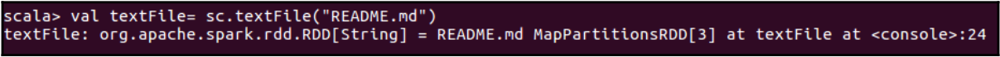

如果你想查看RDD支持的操作类型，在命令行提示符后写入变量名“textFile.”（注：后面加原点号），并按下Tab键，你将看到以下可用的操作/动作列表：

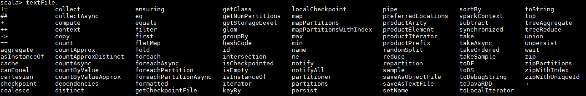

由于我们的目标是做一些基本探索性的分析，我们将看一看该RDD上的一些基本操作。

***注意***：RDD可以在它们上调用action或transformation，但是它们的结果却是不同的。transformation的结果是一个新创建的RDD，而action的结果是RDD被执行、并返回结果给客户端。

让我们看一看在该RDD中的前7行：

​	textFile.take(7)  #以字符串数组的形式返回文件中的前7行

其结果看起来像：

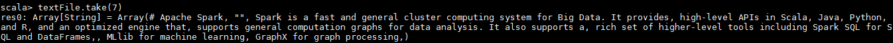

或者，让我们看一看该文件中总行数，<u>使用字符串RDD上另一个作用像是list的action</u>。请注意，在RDD中，文件中的每一行被看作是单独的项：

​	textFile.count() # 返回总项数

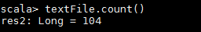

我们了解了几个action后，现在再来了解下字符串RDD操作支持的transformation。如前所述，transformation是一直返回结果为另一个RDD的操作。

试着对数据文件过滤出包含关键词Apache的数据行：

​	val linesWithApache = textFile.filter(line => line.contains("Apache"))

该transformation将返回另一个字符串RDD。

你也可以将多个transformation和action串起来。举个例子，下面将过滤文本文件中包含关键词Apache的行，然后返回在结果RDD中这样的行数：

​	textFile.filter(line=>line.contains("Apache")).count()

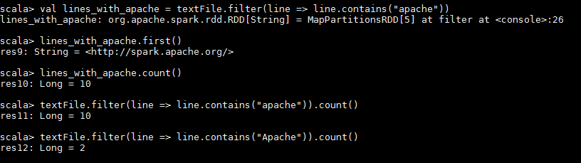

你可以从Spark UI上监视在集群中运行的job，默认端口4040。

如果你用浏览器访问http://localhost:4040，你将看到以下Spark驱动程序的UI：

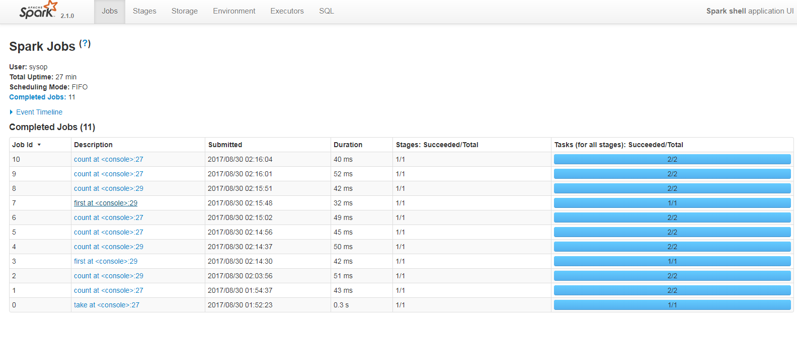

取决于你运行了多少个job，你将看到基于所处状态的job列表（注：分为运行中、失败、完成）。通过UI，你可以看到job类型的概览，提交日期/时间，所用时长，完成的stage数。如果你想查看job的详情，简单的点击job的描述，将会带你进入到另一个展示所有完成stage详情的页面。你也许想看该job的某个stage，点击它，你会得到更多关于该job的详细指标。

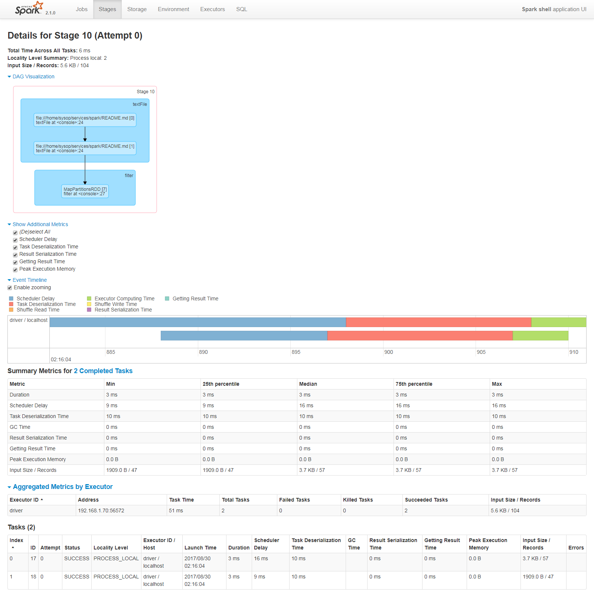

我们将在后续章节中介绍UI更多的细节，例如DAG Visualization、Event Timeline和其它方面，当然给你展示这些的目的是让你明白，如何在运行和完成后监视你的job。

在查看更多例子之前，我们用为Python程序员准备的Python Shell重演一遍同样的例子。

####Python shell例子

为了满足习惯用Python而非Scala的读者，我们将在Python shell下执行一遍之前的例子。

为了进入Python shell，请执行以下命令：

​	./bin/pyspark
你将看到类似下面的输出：

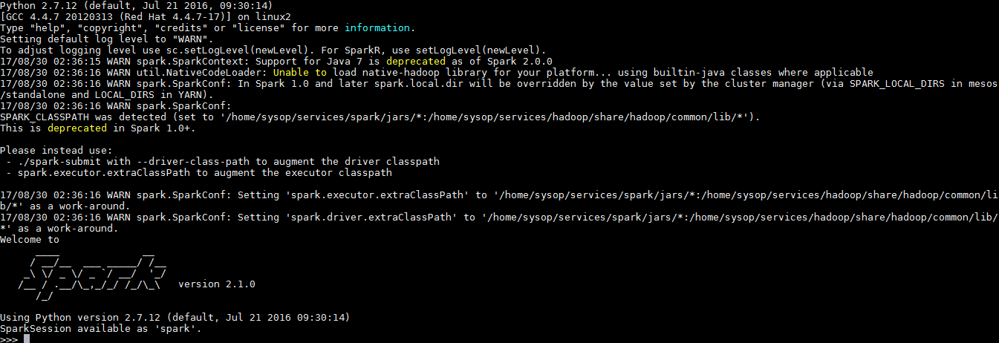

如果你仔细查看这个输出，你将看到框架试图在端口4040上启动Spark UI，但没能成功（注：原书的截图是有这个提示，但是自己的环境没有输出），最终在4041端口上启动的。你能猜到为什么吗？原因是4040端口已经被占用，Spark将在4040端口后继续尝试，直到找到一个可用于绑定UI的端口。

让我们在Python shell上使用python做一些基本的数据操作，再次读入README.md文件：

​	textFile  = sc.textFile("README.md") # 创建一个读取文件README.md内容的名为textFile的RDD

读取该文件的前7行：

​	textFile.take(7)

查看文件总行数：

​	textFile.count()

你将看到类似下面的输出：

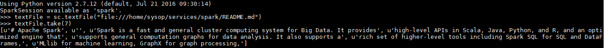

和使用Scala shell展示的一样，我们也能用Python来运用transformation，并将transformation和action串起来。

使用以下的代码对数据集应用transformation操作，记住，transformation返回的结果是另一个RDD。

下面的代码应用transformation，过滤输入数据集，并找出包含单词Apache的行：

​	lineWithApache = textFile.filter(lambda line: "Apache" in line) # 查找包含Apache的行

一旦得到过滤后的RDD，对其应用action：

​	lineWithApache.count() //计算项目总数

再将transformation和action串起来：

​	textFile.filter(lambda line: "Apache" in line).count()  // 将transformation和action串起来

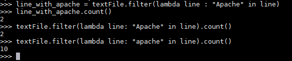

如果你不熟悉Python的lambda函数，此时也不必过于担心，因为展示该用法的目的是告诉你用spark做数据探索是很容易的。我们将在之后的章节中涵盖更多的细节。

如果你想看驱动程序的UI，你会发现，相比用Scala shell执行的结果，新生成的总结指标更清晰。
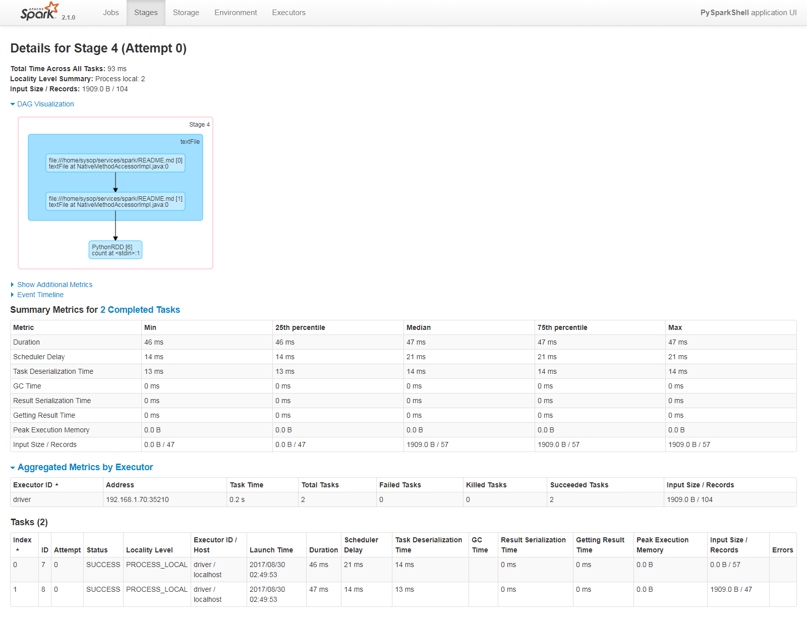

到目前为止，我们完成了一些基本的Spark程序，所以现在也值得去对Spark的架构做更多理解。在下一节，我们将深挖Spark的架构，再在下一章用更多的代码例子来解释有关RDD的不同概念。

####Spark架构

让我们从高层次角度的概览以及一些关键软件组件的简要描述来了解Apache Spark的架构。

#####高层次概览

从高层次来看，Apache Spark应用架构包括以下关键软件组件，而且重要的是要掌握它们中的每一个，以理解框架的精细复杂度：

​	驱动程序

​	Master节点

​	Worker节点

​	Executor

​	Tasks

​	SparkContext

​	SQL context

​	Spark session

这里有一张概览图，可以看到这些软件组件如何在整个架构中配合工作的：

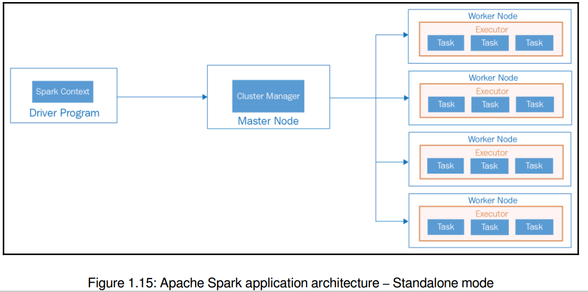

######驱动程序

驱动程序是Spark应用的主要程序。Spark应用进程（创建了SparkContext和Spark Session）运行的机器称作驱动节点，该进程称作驱动进程。驱动程序通过与集群管理器通信以分发任务到执行器（executor）。

###### 集群管理器

集群管理器，顾名思义管理一个集群，如之前讨论的，Spark具备工作在多种集群管理器上的能力，如YARN、Mesos和独立的集群管理器。独立集群管理器包括两个长期运行的守护进程，一个运行在master节点，另一个运行在worker节点。关于集群管理器和部署模型，我们将在第8章***集群模式下的操作***有更多讨论。

###### Worker

如果你熟悉Hadoop，可以理解成Worker节点就相当于slave节点。<u>Worker机器是那些在Spark执行器内部执行真实工作的机器</u>。这个进程向master节点报告节点上可用资源，通常在Spark集群内的每个除master外的节点，都运行一个worker进程。我们通常的做法是，一个工作节点启动一个spark worker守护进程，这些进程可以为应用启动和监视执行器。

######Executors

master分配资源，使用跨集群的workers为驱动器创建Executor，驱动器这时才能用这些Executor运行它的任务。只有当一个job在worker节点上启动时，Executor才会启动。每个应用有它自己的executor进程，这些进程会保持到应用结束，并用多线程执行任务。这也导致了应用隔离和多应用之间数据非共享的副作用。Executor负责执行任务，<u>将数据保存在跨进程的内存或磁盘存储中</u>。

###### Tasks

一个task就是将要发送到一个executor的工作单元。具体来说，这是一个由驱动器程序将Function对象序列化成的命令并发送至executor，executor反序列化该命令（实际上是已经加载的JAR包一部分）后在一个partition上执行该task。

partition是在Spark集群上分发的一个数据逻辑块。很多情况下，Spark将会从分布式存储上读取数据，为了跨集群的并行处理，也会将数据分区。例如，如果你从HDFS上读取数据，每一个HDFS分区将会被创建成一个partition。partition很重要，因为Spark将为每个partition运行一个任务，这也意味着partition的数量也很重要。Spark因此会在你没有手动设置partition个数时自动生成partition的个数，手动配置项有sc.paralleize(data,numPartitions)。

######SparkContext

***SparkContext***是Spark session的进入点，也是Spark集群的连接，能用来在集群上创建RDDs、accumulators和广播变量。每个JVM最好只有一个活跃的SparkContext，因此在创建一个新的SparkContext前要对当前活跃的调用stop()操作。你也许注意到了，之前在本地模式下，无论我们启动Python或Scala shell，我们都有一个自动创建的SparkContext对象，变量sc指向该SparkContext对象。我们不需要创建SparkContext，而直接用它从文本文件中创建了RDD。

###### Spark Session

Spark session是spark编程下使用dataset和DataFrame API编程的进入点。

#### Apache Spark集群管理器类型

据之前所讨论的，Apache Spark当前支持三种集群管理器：

​	独立集群管理器

​	Apache Mesos

​	Hadoop YARN

我们将在第8章***集群模式下的操作***详细介绍这些类型的启用，讨论了集群模式下的操作。

#### 用Apache Spark创建独立应用

直至现在我们在Scala和Python shell下使用spark做探索性分析，同样也能使运行Java、Scala、Python或R语言的独立应用操作Spark。在之前看到的，Spark shell和PySpark为你提供了SparkContext，然而，当你在使用一个应用时，你需要初始化你自己的SparkContext。一旦你得道SparkContext的引用，剩下的API与在交互查询分析环境下保持完全一致。毕竟，这是相同的对象，不同的是这两个context的运行环境。

在你的应用中使用Spark方法的区别在于你更倾向的语言。所有Spark artifact由Maven中心服务，你可以像下面同等增加一个maven依赖（即改变版本）：

​	groupId: org.apache.spark

​	artifactId: spark_core_2.10

​	version: 1.6.1

你能用Maven来创建项目，也可以使用Scala/Eclipse IDE添加Maven依赖到项目中。

***注意***：Apache Maven是一个Java项目主要使用的自动化构建工具。单词maven在Yiddish语（犹太人主要用语）中意思是“知识积累”。Maven表现了构建软件的两个核心方面：第一，描述软件如何被构建，第二，描述了软件的依赖。

你可以配置你的IDE做spark相关的事情。虽然一些Spark开发者在命令行下使用SBT和Maven，但最通用的IDE是IntelliJ IDEA，社区版本是免费的，你可以在上面安装JetBrains Scala插件。更多关于设置IntelliJIDEA或eclipse来使用spark的指导，请参考http://bit.ly/28RDPFy。

######提交应用

在Spark bin路径下的spark提交脚本，是提交spark应用到spark集群最常用的方法，可以在所有支持类型的集群上启动应用。你也需要将应用所有的依赖项目与应用一起打包，Java项目可以生成一个集成的JAR文件（aka uber/fat JAR），这样Spark就能在集群上分发。

带依赖的spark应用可以使用bin/spark-submit脚本启动，该脚本仔细设置classpath以及它的依赖，并支持所有spark支持的集群管理器和部署模式。

对于Python应用：

​	不需要\<application-jar\>，简单传递.py文件；

​	添加Python的.zip、.egg和.py文件添加到搜索路径下，可以指定--py-files选项；

####部署策略

***Client方式***，常用于当你的应用靠近集群时。在这个模式下，驱动程序作为spark-submit进程的一部分被启动，对集群来说就是一个客户端，应用的输入输出通过console传递。这种模式适合于，当你的网关机器（？）与worker机器物理上集中时（？），也用于包括REPL的spark shell应用。这是默认的模式。

***集群模式***：当你的应用是从远离worker机器的机器上提交时（例如，在你本地的笔记本），为了最小化驱动程序和executor之间的网络延迟，采用集群模式比较合适。当前仅YARN支持Python应用的集群化。<u>下面的表格所展示的集群管理器、部署管理器和使用在Spark2.0.0上并没有支持</u>：

| 集群管理器      | 部署模式    | 应用类型          | 支持   |
| ---------- | ------- | ------------- | ---- |
| Mesos      | Cluster | R             | 否    |
| Standalone | Cluster | Python        | 否    |
| Standalone | Cluster | R             | 否    |
| Local      | Cluster | -             | 不兼容  |
| -          | Cluster | Spark-Shell   | 无应用  |
|            | Cluster | Sql-Shell     | 无应用  |
|            | Cluster | Thrift Server | 无应用  |

#### 运行Spark例子

Spark提供了打包的例子，涵盖Java、Python、Scala和R语言。我们将演示如何在样例目录下运行程序。

由于之前我们只做了本地安装，所以接下来的例子Spark PI将会在本地4核上运行。这些例子可以在Apache Spark的Github页面http://bit.ly/28S1hDY上找到，我们截取样例一小段代码来解释SparkContext如何被初始化：

​	val conf = new SparkConf().setAppName("Spark Pi")

​	val spark = new SparkContext(conf)

该例子与Spark的可执行包打包在一起，代码也可以从Github上下载到。仔细阅读这段代码，你将了解到我们自己的SparkContext对象是从SparkConf对象初始化而来。名称为“Spark PI”的应用在执行期间将会以运行中的应用出现在Spark UI中，这也可以帮助你追踪该job的状态。记住，这与spark-shell自动初始化SparkContext并传递它的一个引用形成鲜明对比。

让我们用Spark submit脚本运行这个例子：

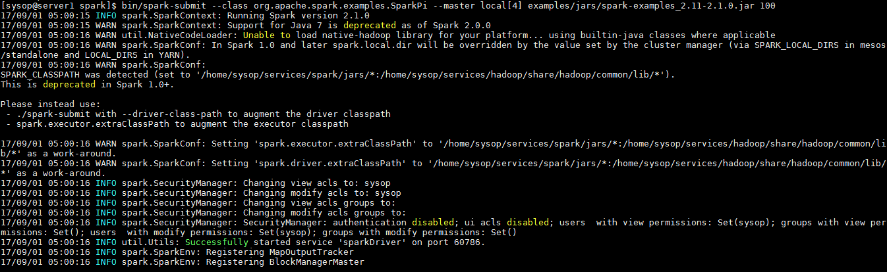

这个脚本的日志跨越多页，所以我们将跳过这些中间操作步骤，直接跳到输出打印的地方。记住这个例子中我们运行的是Spark Pi，它输出的是Pi值。这是日志的第二部分：

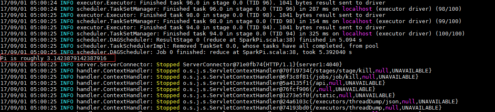

此时，我们看到的是Scala例子，如果我们用这个例子的python版本，你将看到我们将尽需要传递Python源码。由于不引用其它代码，我们不需要传递任何JAR文件（？Python）。类似于Scala例子，我们也需要直接初始化SparkContext，不像PySpark shell已经自动提供给你一个该context对象的引用：

​	sc  = SparkContext(appName = "PythonPi")

运行这个Spark Pi例子与Scala例子略有不同：

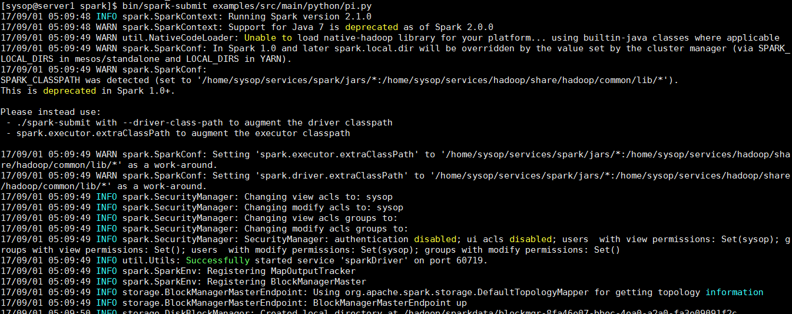

与PySpark例子相似（？应该是Scala的），这个SparkPi程序在spark-shell上的日志同样跨越多页。我们将直接跳到Pi值输出的地方：

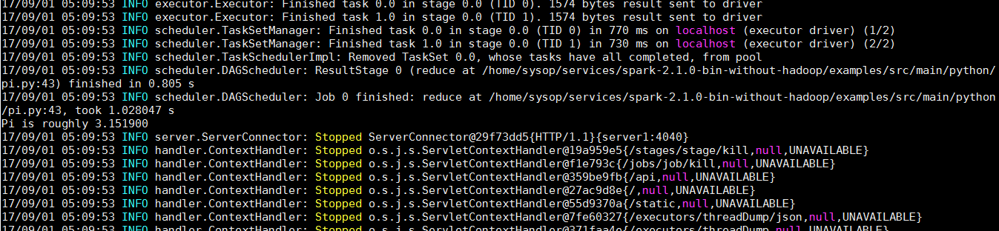

#### 构建你自己的程序

我们测试了预编译好的程序，但是如本章之前所讨论的，你能创建自己的应用程序，用sbt或Maven打包后，再调用spark-submit脚本运行。在本书后续的章节中，我们将同时使用REPL环境和spark-submit来执行多个代码例子。对于完整的代码例子，我们将在***第9章，构建推荐系统***中创建一个推荐系统，在***第10章 客户流失预估***中预估在电信环境下的客户流失。这两个例子（尽管是虚构的）将会帮助你理解一个机器学习应用的整个生命周期。

#### 脑筋急转弯

与Spark shell对应的端口4041而不是4040。

我们已经运行了一个Scala shell，该shell在端口4040上创建Spark UI，Python Shell绑定UI到不同的端口，这个场景下是4041。（？这是脑筋急转弯还是转筋）

#### 参考引用

https://en.wikipedia.org/wiki/Apache_Mesos

https://aws.amazon.com/ec2/

http://spark/apache.org/docs/2.0.0-preview/quick-start.html

http://spark.apache.org/docs/2.0.0-preview/cluster-overview.html

http://spark.apache.org/docs/2.0.0-preview/submitting-applications.html

https://en.wikipedia.org/wiki/Apache_Maven

http://cdn2.hubspot.net/hubfs/438089/DataBricks_Surveys_-_Content/2016_Spark_Survey/2016_Spark_Infographic.pdf 

####总结

在本章中，我们给出了Spark架构的概览，编写第一个Spark应用，了解Spark的软件组件，并执行Spark应用。这为下一章讨论Spark RDD提供了坚实的基础，Spark RDD是Apache Spark最重要的构成之一。

## 第2章 Spark RDD的transformation和action

现在我们已经对Spark的架构和关键软件组件的基本认识，本章将介绍Spark RDD。在本章的课程中，将逐一说明以下主题：

​	如何构造RDD

​	RDD的操作，例如transformation和action

​	传递函数给Spark（Scala、Java和Python）

​	transformation的具体方法map、filter、flatMap以及样例d	

​	集合操作，例如distinct、intersection和union

​	action的方法reduce、collect、count、take和first

​	PairRDD

​	共享及广播变量

让我们开始破解其中的奥秘。

#### 什么是RDD

<u>在一个名字中有什么，对玫瑰来说是对的</u>，但对弹性分布式数据集（RDD）也许并不是这样，它本质上是在描述一个RDD是什么。

它们是基本的数据集，跨集群分布的（记住Spark框架是继承自MPP架构），并天性上提供弹性（自动故障恢复）。

在我们讨论更更多细节之前，让我们试着对此理解更多一些，也再试着尽可能抽象些。我们假设你拥有来自飞行器传感器的传感数据，且只想分析数据而不用管数据大小和位置。例如，空客A350整机大约有6000个传感器，每天产生2.5TB，而预期在2020投产的更新型号每天将产生7.5TB数据。从数据工程的角度，理解数据管道会更重要，而从分析师和数据科学家的角度，更主要关注的是分析数据而不用理会数据大小以及数据存储的跨节点个数。这就是RDD概念以及对整个数据集上执行的transformation/action产生的纯粹缘由。A350六个月有价值的数据集大约有450TB数据，将需要跨越多台机器存储。

为便于讨论，我们假设你工作在4个worker机器的集群上，你的数据也将像下面一样在这些worker上分区：

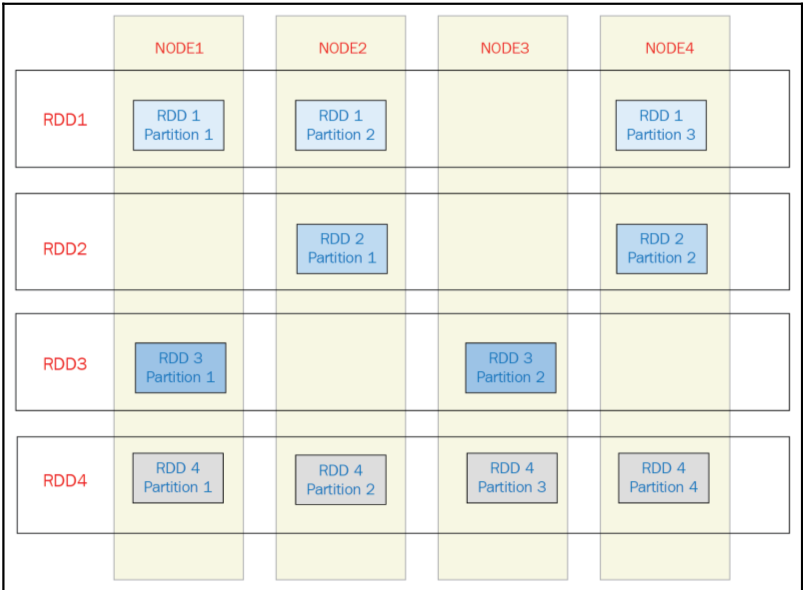

这个图基本解释了一个RDD是数据的分布式集合，框架将数据跨集群分发。跨机器集的数据分布带来了包括要从节点失败恢复的干扰。RDD由于能从RDD关系图中重新计算而具有弹性，这种图是当前RDD的整个父RDD的图。除了弹性、分布式以及表达一个数据集，一个RDD还有多种其它的与众不同的品质：

​	内存型：一个RDD是对象常驻于内存的集合。我们将看到一些可选项，使得RDD可以存储在内存、磁盘或者两者。然而，Spark的执行速度来源于一个事实，数据存放在内存中，而不是每次操作都从磁盘获取。

​	分区：分区是将逻辑数据集或组成的元素划分为独立部分。分区是分布式系统一个事实上的性能优化技术，用于最小化网络带宽消耗，去除这个高性能工作的”杀手“。面向数据key-value的分区的目的是放置相似的key区间，起到了最小化shuffling的作用。在RDD内的数据被分割到分区上，并且跨集群多个节点。我们将在本章后面的内容给出更多细节来进行讨论。

​	类型：在RDD中的数据是强类型的。当你创建了一个RDD，所有的元素类型由数据类型决定。

​	延迟执行：在spark上，transformation操作是延迟的，这意味着只有当你执行一个action时才会在RDD中产生数据。然而，你可以在任何时候对RDD使用一个count() action来生成可用数据。我们将讨论该特性及其相关的好处。

​	不可变：RDD一旦创建即不能修改。当然，可以执行一系列的transfromation操作来将其转换成一个新的RDD。

​	并行：RDD的操作是并行化的。由于数据会被传播到集群的不同分区，每个分区都能并行操作。

​	缓存：由于RDD是延迟执行的，在RDD上的任何action都会导致执行所有的transformation以此来创建该RDD。通常这对于大数据集不是很好的行为（注：每个action都会对已经执行过的关系图再执行），因此spark提供可选项来缓存数据到内存或磁盘。我们将在本章讨论缓存的细节。

一个典型的带RDD的spark程序流程包括：

​	1 从数据源创建RDD

​	2 一系列的transformation，例如，filter、map、join等等

​	3 持久化RDD以防止再执行

​	4 对RDD调用action开始在集群上执行并行操作

下图描述了以上的流程：

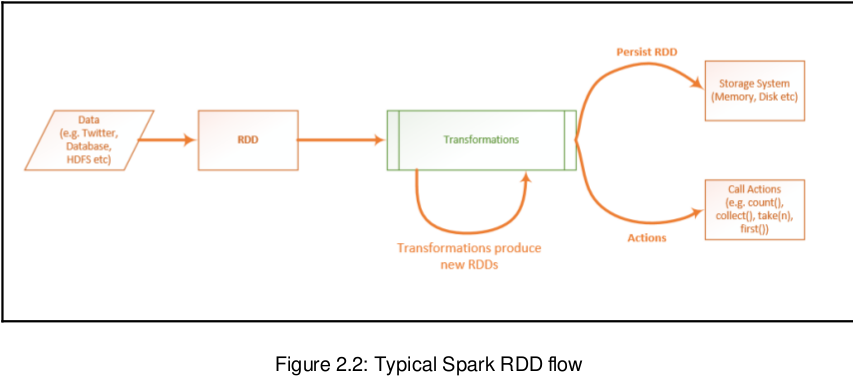

让我们快速查看可以创建RDD的不同方法。

#### 构造RDD

创建RDD有两种主要的方法：

​	在驱动程序中并行化一个已经存在的集合；

​	通过引用外部数据源来创建RDD，例如，文件系统、HDFS、HBASE，或者可以支持Hadoop输入格式的任何数据源

###### 并行化已存在的集合

并行化的集合是通过在驱动程序内的SparkContext上调用方法paralleize()产生的。这个parallelize()方法要求Spark基于给定的数据集创建一个新的RDD。一旦本地的集合/数据集转换成了RDD，那它就可以被并行化操作。parallelize()通常用于构建原型，而少用于产品环境，由于这个数据仅在单机上能获取到。让我们看分别用Scala、Python和Java将集合并行化的例子：

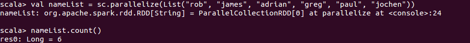

用Python并行化集合与Scala非常相似，如下例子所示：

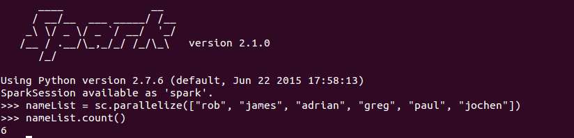

用Java也是一样的（注：本处可能有问题）：

​	textFile = sc.textFile("README.md")  //读取README.MD文件内容来创建一个名为textFile的RDD

该parallelize方法有很多变种，包括设定数值区间的一个选项，例如：

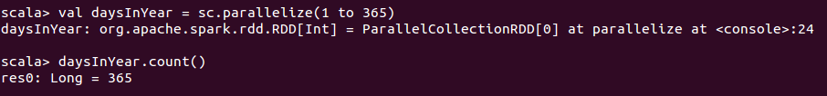

与Scala稍有差异的是，Python要用range()方法。结尾的值是不包括的，因此，你可以看到与Scala例子不同的地方，结尾值是366而不是365:

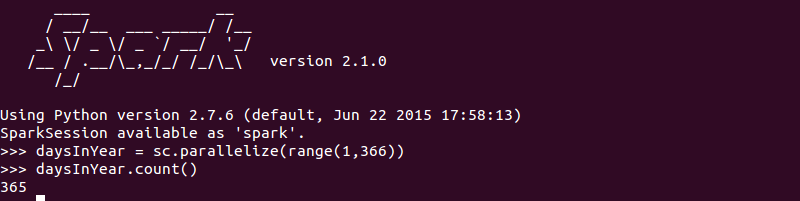

python提供的xrange函数也可以使用，与range相似，但执行更快，因为与在内存中创建列表的range()比较，它本质上是一个延迟执行的序列对象。

现在RDD已经创建完毕，它可以被并行化操作。你可以传递第二个参数给方法parallelize()，用于指示数据将要被分片的分区个数，作为一种深入优化的手段。spark将为集群的每个分区运行一个任务：

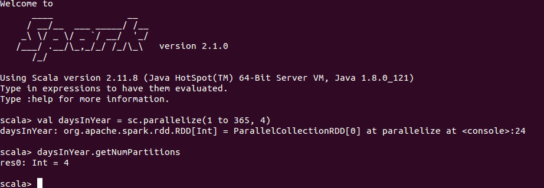

Python对这个的处理语法看起来与Scala差不多。例如，如果你想要对一个范围内的整数分割到4个分区做并行化，你可以像这样：

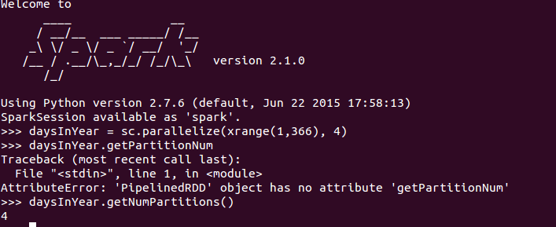

#### 引用外部数据源

你已经用parallelize方法创建了Spark的RDD对象，这主要用于构建原型。在产品使用中，spark可以从由Hadoop支持的任何存储源中加载数据，这些源包括本地文件系统的文本文件，以及HDFS、HBASE或Amazon S3上的数据。

如我们在前面例子看到的，你可以用textFile方法从本地文件系统中加载一个文本文件，其它可用的方法有：

​	hadoopFile()：从一个任意输入格式的Hadoop文件创建RDD

​	objectFile()：从一个保存为包含序列化对象的SequenceFile载入RDD，这种对象是有一个序列化分区的NullWritable key和BytesWritable值（？）

​	textFile()：这个方法之前已经见识过了，可以从HDFS或本地文件系统上读入文本文件，并返回字符串类型的RDD

***注意***：你可能想访问Spark的上下文API文档（http://bit.ly/SparkContextScalaAPI）来了解这些方法的细节，其中有些可能被重载过并允许你传递某些参数来加载多种文件类型。

一旦RDD创建完后，你可以对该RDD实施transformation或action的并行化操作。

***注意***：当从本地文件系统加载文件时，确保这个文件路径存在于所有的worker节点上。你也可能想使用网络挂载的共享文件系统。

Spark的textFile()方法提供了一些最为可贵的多种有用特性，扫描目录的能力，操作压缩文件以及使用通配符。那些工作在产品系统和机器日志的人将会欣赏这种特性的好处。

例如，在你的Spark文件夹里有两个.md文件，而同时我们已经在之前加载了README.md，让我们使用通配符来读取所有.md文件，并尝试其它的选项：

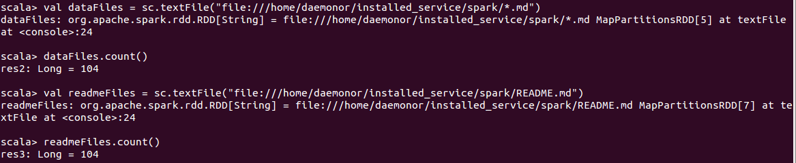

用Python加载文本文件有非常相似的更熟悉的语法。你将依然在Spark上下文调用textFile()方法，然后用该RDD来做其它操作，例如transformation和action：

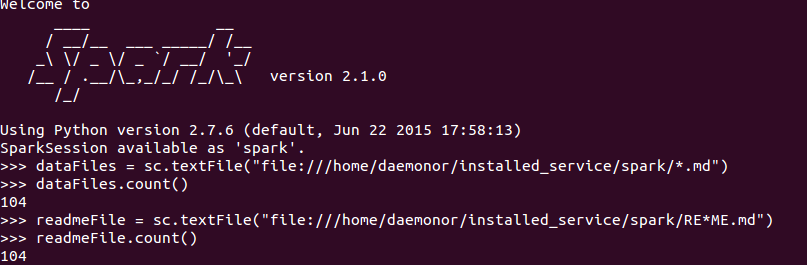

相似地，对于Java，相关的代码例子将会像如下：

​	//读取在目录下的所有md文件

​	JavaRDD\<String\> dataFiles = sc.textFile("*.md");

​	// 读取README.md文件

​	JavaRDD\<String\> readmeFile  = sc.textFile("README.md");

​	// 读取所有的CONTRIBUTIONS.md文件

​	JavaRDD\<String\> contributions = sc.textFile("CONT*.md");

到目前位置我们仅仅在本地文件系统下做了尝试，那么从HDFS或S3之类的文件系统上读取一个文件将会有多大不同呢？让我们快速看看通过Spark可用的不同选项。

***注意***：我期望大多数读者已经熟悉HDFS和HADOOP，以及如何将数据上传到Hadoop。如果你依然没有开始你的Hadoop之旅，你也许需要看一看下面的Hadoop快速启动指导：http://bit.ly/HadoopQuickstart。

我们现在已经有数据被上传到HDFS。数据在目录/spark/sample/telcom下可以获取到。这儿有一些呼叫详情记录（CDRs）样本数据，被创建用于本练习。你将在本书的GitHub页面上找到样本数据：

​	//上传数据到Hadoop集群

​	hadoop fs -copyFromLocal /spark/data/ /spark/sample/telecom/

​	// 从Scala-Shell访问HDFS数据

​	val dataFile = sc.textFile("hdfs:///yournamenode:8020/spark/sample/telecom/2016*.csv")

​	// 从Python shell访问HDFS数据

​	dataFile = sc.textFile("hdfs:///yournamenode:8020/spark/sample/telecom/2016*.csv")

你也可以用非常相似的方法访问Amazon s3。

现在我们已经了解了RDD创建过程，让我们快速浏览可以在RDD执行的操作类型。

#### RDD操作

可在RDD上执行的两类主要的操作类型，它们被称为：

​	transformation

​	action

###### transformation

transformation是创建新数据集的操作，原因是RDD是不可修改的。他们用于将一个数据转换到另一个，这可能会导致数据放大、数据减小或完全不同的样子。这些操作并不返回任何值到驱动程序，因此是延迟执行的，这也是spark的主要优势之一。

transformation的一个例子可以是一个map函数，将遍历RDD的每个元素，返回一个全新的RDD，代表在原始数据集上的函数应用结果。

###### action

action是向驱动程序返回值的操作。如之前讨论的，在Spark上所有的transformation是延迟的，这本质上意味着Spark记得在一个RDD上所有的transformation，并且，当一个action被调用时，将会用最优化的方式来应用他们。例如，你可能有1TB的数据集，你将它传递给一系列map函数用于多种transformation。最终，你在数据集上执行了reduce action。Apache Spark将仅会返回一个最终的数据集，其大小可能是数十兆，而不是映射的中间结果的整个1TB数据集。

然而，你应该记得要保留中间结果，否则，Spark将在每个action每次调用时会重新计算整个RDD，在RDD上的persist()方法将帮助你防止重计算并保存中间结果。我们之后将对此给出更多的细节。

让我们通过一个简单的例子来展示transformation和action的作用。在这个具体的例子中，我们将使用flatmap() transformation和一个count action，使用本地文件系统的README.md文件作为例子。我们将解释Scala例子的每一行，然后再给出Python和Java的代码。通常，你必须用自己的文本片段试试这个例子，并探查该结果：

​	// 加载README.md文件

​	val dataFile = sc.textFile("file:///home/sysop/spark/README.md")

现在数据已经加载，我们将需要运行一个transformation。因为我们知道文本的每一行将会被加载成一个单独的元素，我们将需要运行一个flatMap transformation，并将单个单词分离出来作为一个单独的元素，对于这个要求，我们将调用split函数并使用空格作为分隔符：

​	// 将每个RDD元素分离出一个单词列表

​	val words = dataFile.flatMap(line => line.split(" "))

记住，直到这里，你似乎已经运用了一个transformation函数，什么都没有执行，所有的transformation已添加到逻辑计划中。同样要注意这个transformation返回了一个新的RDD，然后我们可以在这个词RDD调用count() action执行计算，这将导致在运用具体的transformation函数之前，从文件获取数据并产生一个RDD。你可能注意到了我们实际上传递一个函数给Spark，这是在本章的后续章节***向Spark传递函数***所覆盖的领域。现在我们有了RDD的另一个RDD，并对该RDD调用count()来获得RDD的元素总数：

​	words.count()

调用count() action时，该RDD即被执行，其结果将被发送回驱动程序。这对于大数据应用是非常灵巧和特别有用的。

如果你是Python精通者，你也许想要在PySpark中执行以下代码。你应该注意到lambda函数被传递给Spark框架：

​	// 加载数据文件，运用transformation和action

​	dataFile = sc.textFile("file:///home/sysop/spark/README.md")

​	words = dataFile.flatMap(lambda line: line.split(" "))

​	words.count()

用Java编写相同的功能也是很直观的，并且看起来与Scala很相似：

​	JavaRDD\<String\> lines = sc.textFile("file:///home/sysop/spark/README.md");

​	JavaRDD\<String\> words = lines.map(line -> line.split(" "));

​	int wordCount = words.count();

这也许看起来是一个简单程序，但在场景后面的（behind the scenes）使用了line.split(" ")函数并将其并行地运用到集群里的所有分区。这个框架提供了这种简单性，并在背后完成了集群上的协调调度工作，返回结果。

#### 传递函数到Spark（Scala）

在前面例子你已经看到，传递函数是Spark提供的关键功能。从用户的观点，你可以传递函数给驱动程序，Spark将会指出集群内存的数据分区位置，并行化执行该函数。传递函数的确切语法在不同编程语言里是不同的，由于Spark由Scala编写，我们将首先讨论Scala。

在Scala中，传递函数到Spark框架的推荐方法如下：

​	匿名函数

​	静态单例方法

###### 匿名函数

匿名函数用于简短的代码片段。他们也作为lambda表达式被引用，是编程语言一种很酷且简洁优美的特性。他们被称为匿名函数的原因是你能给输入参数任何名字，而结果都是一样的。

例如，下面的代码例子将会产生相同的输出：

​	val words = dataFile.flatMap(line => line.split(" "))

​	val words = dataFile.flatMap(anyline => anyline.split(" "))

​	val words = dataFile.flatMap(_.split(" "))

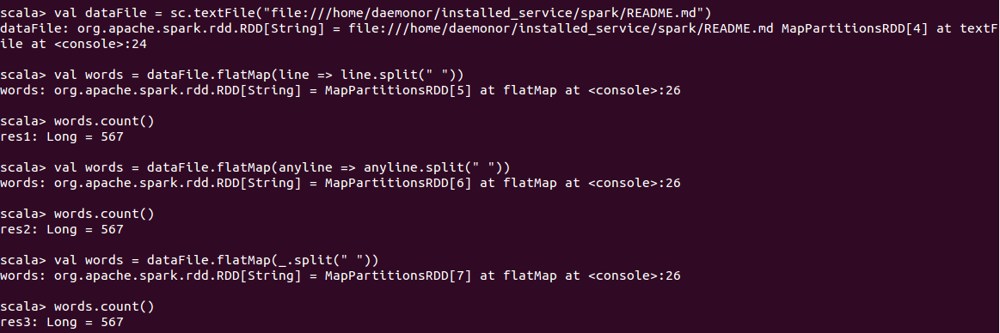

###### 静态单例函数

虽然匿名函数对代码短片段确实很有帮助，但当你想要向spark框架请求复杂的数据控制时则无能为力，而这能被静态单例函数自有的细微差别解救，我们将在这一节讨论这个。

***注意***，在软件工程中，***单例模式***是一种设计模式，用于限制一个类实例化到一个对象，当在系统上协调action时就完全需要有这样一个对象，这时单例模式是非常有用的。静态方法属于这个类，但不是它的一个实例。他们通常从参数获取输入，执行动作，最后返回结果。

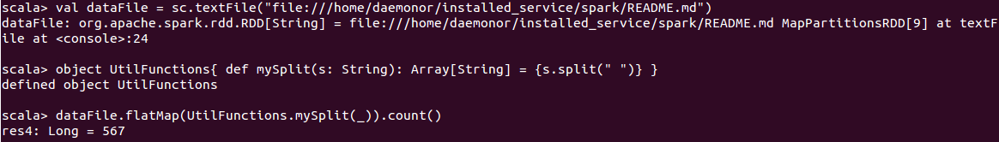

静态单例是传递函数的常用方法，技术上就像你创建了一个类，在该类实例上调用一个方法，例如：

​	class UtilFunctions {

​		def split(inputParam: String): Array[String] = {inputParam.split(" ")}

​		def operate(rdd: RDD[String]): RDD[String] = {rdd.map(split)}

​	}

你可以发送一个类中的方法，但这样会有性能隐患，毕竟整个对象会随着方法被发送。

###### 向Spark传递函数（Java）

在Java中，为了创建一个函数，你需要实现在org.apache.spark.api.java函数包中的接口，这儿有两种常用的方法来创建这种函数：

​	在你自己的类中实现接口，并传送实例给Spark。

​	从Java 8开始，你能用Lambda表达式来传送函数给Spark框架。

让我们用Java实现之前的词统计例子：

​	@SuppressWarnings("serial")

​	JavaRDD<Integer> numWordsPerLine = dataFile.map(new Function\<String,Integer\>(){

​		public Integer call(String s) {

​			return s.split(" ").length;

​		}

​	});

​	@SuppressWarnings("serial")

​	int totalWords = numWordsPerLine.reduce(new Function2\<Integer, Integer, Integer\>(){

​		public Integer call(Integer len1, Integer len2) throws Exception {

​			return len1 + len2;

​		}

​	});

​	System.out.println("Total number of Words: " + totalWords);

如果你是那种感觉编写inline函数会让代码变得复杂和不可接受的程序员（很多人同意这个论断），你也许想要创建单独的函数并如下调用它们：

​	@SuppressWarnings("serial")

​	class GetNumWords implements Function\<String,Integer\> {

​		public Integer call(String s) {

​			return s.split(" ").length;

​		}

​	}

​	@SuppressWarnings("serial")

​	class SumWords implements Function2\<Integer, Integer, Integer\> {

​		public Integer call(Integer len1, Integer len2) {

​			return len1 + len2;

​		}

​	}

​	public void totalWords(JavaSparkContext sc, String fileName) {

​		JavaRDD\<String\> distFile = sc.textFile(fileName, 4);

​		JavaRDD\<Integer\> numWords = distFile.map(new GetNumWords());

​		int totalWords = numWords.reduce(new SumWords());

​		System.out.println("Total number of Words: " + totalWords);

​	}

###### 向Spark传递函数（Python）

Python提供了向Spark传递函数的简单方法，Spark编程指导（在spark.apache.org上获取到）建议可以用三种推荐方法来实现：

​	Lambda表达式是一种对于内部只有一个简单表达式的短函数非常奏效；

​	在函数里的本地defs，向Spark调用更长代码（？）

​	在一个模块中的顶级函数

由于我们已经在之前的例子中看到过一些lambda函数的使用例子，现在让我们看看这些函数的本地定义，下面会展示如何将词的划分和统计封装成两个单独的函数。

​	def splitter(lineOfText):

​		words = lineOfText.split(" ")

​		return len(words)

​	def aggregate(numWordsLine1, numWordsLineNext):

​		totalWords = numWordsLine1 + numWordsLineNext

​		return totalWords

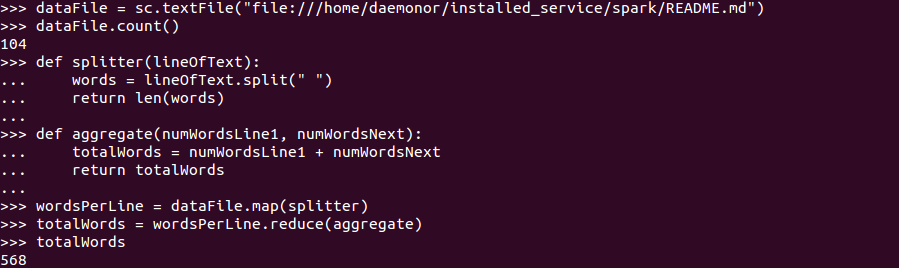

这儿还有另外一种实现该功能的方法，定义函数作为UtilFunctions类的一部分，然后在map和reduce函数中引用它们：

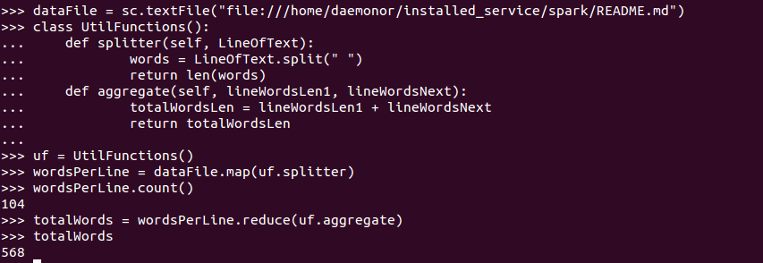

你也许想变得更大胆一些，并试图添加一个countWords()方法到UtilFunctions，这样它能接受RDD作为输入，并返回词总数。这种方法有潜在的性能隐患，因为整个对象将要被发送到这个集群。让我们看看如何实现这个需求，在下面截屏中可以看到结果：

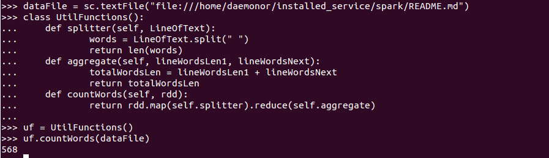

这可以通过生成本地对象的引用数据域的一份拷贝来防止，而不是直接外部访问它。（？）

现在我们已经掌握了如何向Spark传递函数，也在前面的例子中了解了一些transformation和action，包括map、flatMap和reduce，我们将要查看在Spark中更通常使用的transformation和action，下面的列表并不详尽，你可以在Apache Spark文档的编程指导章节(http://bit.ly/SparkProgrammingGuide)中找到更多的例子。如果你想要获取所有可用函数的更全面列表，你可以查看以下API文档：

|        | RDD                   | PairRDD               |
| ------ | --------------------- | --------------------- |
| Scala  | http://bit.ly/2bfyoTo | http://bit.ly/2bfzgah |
| Python | http://bit.ly/2bfyURl | N/A                   |
| Java   | http://bit.ly/2bfyRov | http://bit.ly/2bfyOsH |
| R      | http://bit.ly/2bfyrOZ | N/A                   |

#### Transformations

在本章中我们在例子中使用了少量的transformation函数，但我想要与你分享在Apache Spark中最常用的transformation函数列表。你可以在官方文档中找到完整的函数列表：http://bit.ly/RDDTransformations。

| 最常用的transformation                      |                                          |
| --------------------------------------- | ---------------------------------------- |
| map(func)                               | coalesce(numPartitions)                  |
| filter(func)                            | repartition(numPartitions)               |
| flatMap(func)                           | repartitionAndSortWithinPartitions(partitioner) |
| mapPartitions(func)                     | join(otherDataset, [numTasks])           |
| mapPartitionsWithIndex(func)            | cogroup(otherDataset, [numTasks])        |
| sample(withReplacement, fraction, seed) | cartesian(otherDataset)                  |

###### map(func)

这个map transformation是最常用的、最简单的RDD transformation，它将在参数中传递的函数应用到源RDD的每个元素上。在前面的例子，我们已看到map() transformation的用法，即将split()函数传递给输入RDD。

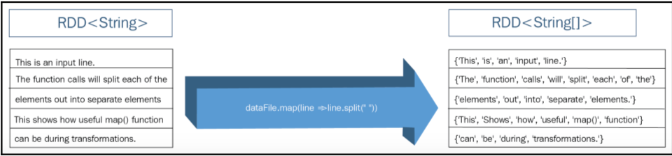

我们再也不会给出像之前看到的大量的map函数i使用例子。

让我们看看filter() transformation，这个也是最常用transformation函数之一，特别是在日志分析时。

###### filter(func)

Filter，正如其名所暗示的，过滤输入RDD，并按照满足传递参数的预期创建一个新的数据集。

例子2.1:Scala过滤例子：

​	val dataFile = sc.textFile("file:///home/daemonor/installed_service/spark/README.md")

​	val linesWithApache = dataFile.filter(line => line.contains("Apache"))

例子2.2：Python过滤例子：

​	dataFile = sc.textFile("file:///home/daemonor/installed_service/spark/README.md")

​	linesWithApache = dataFile.filter(lambda line: "Apache" in line)

例子2.3：Java过滤例子：

​	JavaRDD\<String\> dataFile = sc.textFile("file:///home/daemonor/installed_service/spark/README.md")

​	JavaRDD\<String\> linesWithApache = dataFile.filter(line -> line.contains("Apache"))

###### flatMap(func)

flatMap() transformation与map相似，但提供了更多的灵活性，从相似于map函数的观点，它操作RDD的所有元素，但这种灵活性源自于处理函数的能力，即返回一个序列而非一个单个项。你在之前的例子也看到了，我们使用flatMap()来平铺split(" ")函数的结果，它返回的是一个平铺的结构而不是一个string数组类型的RDD。

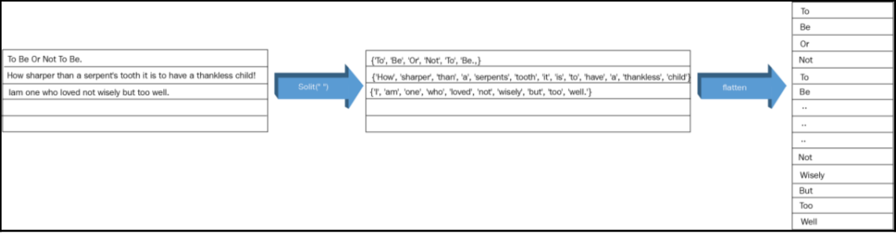

让我们看一看Scala的flatMap例子。

下面的例子展示了你如何用Scala的flatmap()方法将一个列表（在本例中是电影）平铺。

例子2.4:Scala的flatmap()例子

​	val favMovies = sc.parallelize(List("Pulp Fiction", "Requiem for a dream", "A clockwork Orange"));

​	favMovies.flatMap(movieTitle => movieTitle.split(" ")).collect()

下面Python的flatmap()例子达到了与例子2.4相似的目标，且该例子的语法与Scala例子看起来很相似（罗嗦。。。）。

例子2.5:Python的flatmap()例子：

​	movies = sc.parallelize(["Pulp Fiction", "Requiem for a dream", "A clockwork Orange"])

​	movies.flatMap(lambda movieTitle: movieTitle.split(" ")).collect()

如果你是一个Java粉丝，你可以用下面的Java代码例子来实现电影列表的平铺，用Java实现相同的例子显得有点罗嗦，但它本质上生成了相同的结果。

例子2.6:Java的flatmap()例子：

​	JavaRDD\<String\>  movies = sc.parallelize(Arrays.asList("Pulp Fiction", "Requiem for a dream", "A clockwork Orange"));

​	JavaRDD\<String\> movieName = movies.flatMap(

​		new FlatMapFunction\<String,String\>() {

​			public Iterator\<String\>  call(String movie) {

​				return Arrays.asList(movie.split(" ")).iterator;

​			}

​		}

​	);

###### Sample(withReplacement, fraction, seed)

## 第9章  构建一个推荐系统

在上一章，我们介绍了在各种集群上搭建spark的概念。在这个课程和下一章，我们将看到一些实际使用例子。在这一章主要看如何构建一个推荐系统，这是大多数人正在用不同方式构建的一种系统。我们将包含以下主题：

​	1）推荐系统概览

​	2）为什么需要推荐系统

​	3）长尾现象

​	4）推荐的类型

​	5）推荐中的关键问题

​	6）基于内容的推荐

​	7）协同过滤

​	8）隐语义模型

本章希望可以给你一个推荐系统的很好介绍，并随之给出一个解决现实世界使用问题电影推荐具体的代码例子。

让我们开始吧。

#### 推荐系统是什么

我们几乎每天都与推荐系统打交道，比如你从Amazon上购买东西，在Netflix上观看电影，在Xbox上玩游戏，在google上查找新闻文章，在Spotify上听音乐。这些在线的应用基于你的历史记录或者与你有相似兴趣的用户给你推荐物品。

为什么推荐在我们生活中已经变成一件如此重大的事情，而15至20年以前在典型的由砖和水泥制造的商店中，这都闻所未闻？答案有赖于我们生活在一个物质极大丰富而不是匮乏的时代。我们也将更深入分析这个观点。20年以前，典型的零售商存储的物品数量都有限，原因是有限的货架空间和昂贵的房地产成本。

同样地，我们喜爱的电影院仅拥有有限的电影，我们的图书卖家仅拥有限的图书。我仍然记得20年以前，为了找一本Pascal图书，需要在不同商店中穿行，行走距离至少10英里，因为这不是一个热门的物品，在Islamabad主要的图书商店都没有库存。Web就没有这样货架空间的限制，因此，在Netflix上能找到的电影数量远超过任何代表性的影院。以此类推，在Amazon和eBay上能找到的产品数量比当前世界上任何一家零售商的要多出数十倍。什么让这一切变得可能？这可能归功于***[长尾现象](***https://www.wired.com/2004/10/tail/ ***)***。这种现象的思想就是，***如果你按受欢迎度给物品排序，而欢迎度是基于一个特殊物品的销售数量，零售商仅会售卖超过一定限度的物品，这个限度通常就是维持物品在库存中的成本（？）***。如图9.2所描述。

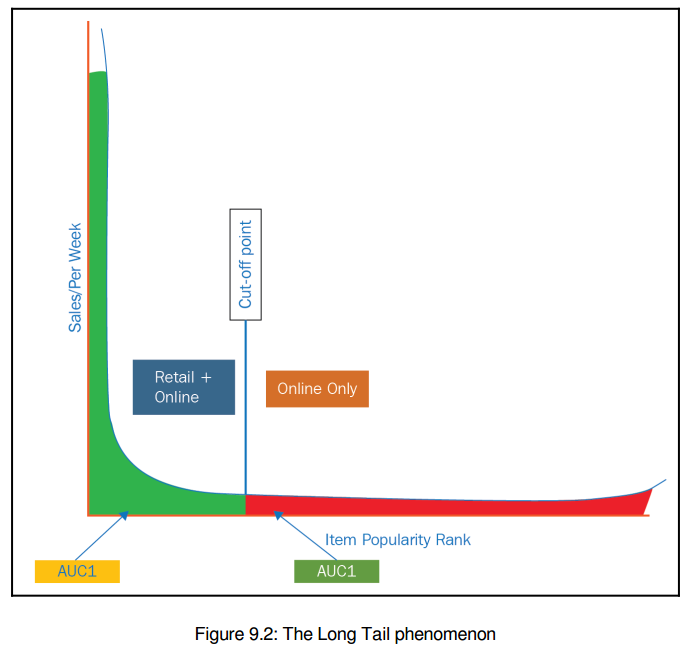

当依据单位销量来判断物品的受欢迎度，观察量大受欢迎和量小不太受欢迎的物品时，你可以看到长尾现象。零售商通常只会储备受欢迎的物品，并给它最佳性价比，而不太受欢迎的物品（在分割点右侧）只被在线商店存储。这种现象适用于所有类型的物品，包括图书、电影、歌曲和新闻文章，在趋向分割点右侧的曲线带被称为长尾。
更有趣的事情是如果你计算曲线下面的面积，例如AUC1,绿色覆盖的区域代表可在线商店和零售商店找到的物品，对比红色覆盖的区域代表只可在线找到的物品，可以发现AUC2通常即便不大于AUC1,但也相差无几。这些在线物品没法在零售店找到，实际上这类物品中有许多是很难找到的，在很多情况下用户并不知道确切的物品名，这时你需要向用户介绍这些新产品。事实上，你现在对物品有更多的选择，意味着你需要更好的过滤器，推荐引擎是这种情况下的解决方案。有许多熟知的案例，一些产品并不太好卖，结果导入到推荐引擎后表现极其惊人。

#### 推荐的类型
这里有三种推荐类型，我们将逐一介绍：
	1)人工推荐
	2)基于欢迎度的简单聚合推荐
	3)用户个性化推荐

###### 人工推荐
人工推荐是最简单而古老的推荐方式，这甚至与传统零售商相关。例如，如果你去你所地的影像商店，他们也许会在一个小通道里展示排名前十的电影，这通常是使用一些人工处理实现的。访问一些流行的网站，你可以看到喜爱收藏夹或员工推荐，这些并不考虑任何用户的参与(不是用户投票或其它方式产生的)。

###### 基于人气的简单聚合推荐
一些在线商店已经从人工推荐系统发展到另外一种更简单的用户物品推荐方式。在许多网站，默认的机制是采用当前售卖前十的物品展示成人气物品。相似地，如果你访问YouTube，你能看到最高人气的视频或热门视频。同样你访问Twitter时，你能看到最近用户正在推的热门话题。这类推荐基于普遍用户行为，并不指定特定的用户，通常是基于用户的聚合行为。

###### 用户特定推荐
为了从用户获得最好的参与，你必须针对特定用户裁剪推荐，而不是基于高层次的聚合或者人工挑选。用户更可能观看一部与他们之前看过的电影相似的影片，或者读一本与他们喜欢读的图书相似的书，而不是从前10列表中选出一部电影观看或一本书阅读。这种推荐最难做到准确，但能给出最好的结果，因此是本章的核心。

#### 用户特定推荐
在本章余下部分，我们将重点讨论用户特定的评级。让我们从考虑推荐系统的模型开始。
假设：
	C = 消费者集合
	I = 物品集合（可以是电影，图书，新闻等等）
	R = 评级集合。这是一个有序集合，更高数字表示特别物品的高喜爱度，更小数字表示特别物品的低喜爱度。通常数字是由0到1之间的实数表示。
我们定义一个功能函数u：组合消费者和物品配对，并将配对映射到特定的评级，即 u: C*I -> R。
如下实用矩阵的例子，表示用户与电影的集合：

|        | 教父1(Godfather I) | 教父2 (Godfather II) | 心灵捕手(good will hunting) | 美丽心灵(A Beautiful Mind） |
| ------ | ---------------- | ------------------ | ----------------------- | ---------------------- |
| Roger  |                  |                    | 1                       | 0.5                    |
| Aznan  | 1                | 0.7                | 0.2                     |                        |
| Fawad  | 0.9              | 0.8                | 0.1                     |                        |
| Adrian |                  |                    | 1                       | 0.8                    |

这个实用矩阵通常是一个稀疏矩阵，原因是用户对观看过的电影很少评级。这些未评级的区域可能是由于用户对电影评级不用心，或者简单的事实是他们对电影评级完全不上心（not bothered to rate the movies at all）。***推荐系统的目标是找出这些缺失值，识别出用户可能会评级很高的电影并将其推荐给用户***。

#### 推荐系统的关键问题
通常，推荐系统有三个关键问题：
	1) 收集已知的输入数据
	2) 通过已知评级预测未知
	3) 评测预测方法

###### 收集已知的输入数据
构建推荐系统的第一个临时里程碑是收集输入数据，即客户、产品和相关评级。由于在CRM或其它系统中已经有客户和产品数据，你将要从客户获得产品的评级。这有两个收集产品评级的方法：
	1）***明确的***：明确的评级意味着用户也许会明确地对一个特定物品评级，举例来说，Netflix的一部电影，Amazon的一本书或一个产品，等等。这是一种与用户打交道的直接方式，通常提供最高质量的数据。在真实生活中，尽管对物品评级会给一些激励，但非常少用户实际上会留下产品的评级。因此，对于任何有意义的预测练习，获取明确的评价是不可伸缩的（scalable）。
	2)***隐性的***：由于明确的评级通常不是一个选择，你可以决定从其他用户动作中推断出评级。例如，在网站上购买了产品而没有退回，也许可以意味着用户对该物品评级很高。同样的，一个视频流网站也许可以察觉到，如果用户观看了完整视频，这说明他们给了这个电影/视频一个正面的高评级，如果他们在半道就决定结束视频播放，这可以假定用户给这个产品负评级。这个隐性的评级有一个问题，仅能给正负评级，而不能给出高低评级。例如，产品购买暗示一个产品的正面评级，而未购买或退还暗示负面评级。然而，你不能用1(低）到10(高）的比例来度量此值，无论是5还是10.

###### 从已知评级预估未知
一旦准备好数据，我们能从已知评级推断出未知的评级。这里关键的问题是之前构建的实用矩阵是稀疏的，意味着大部分人不给物品评级。除此之外，我们必须处理冷启动问题，即新物品没有任何评级，同时新用户没有历史数据可以用来推荐新内容。从已知推荐/预估未知有三个主要方法：
	1)基于内容的推荐
	2)协同过滤
	3)隐语义模型

#### 基于内容的推荐
基于内容推荐背后的主要概念是将与用户已经高评级物品的相似物品推荐给用户，例如，如果我们谈论电影，将推荐相同演员、类型或导演的电影给用户。如果你是Facebook的用户，你会定期获得朋友推荐，被推荐的用户与你有一些类型的关联，如根据相同朋友，相同学校/大学，等等。基于内容的分级是通过生成物品和用户配置文件来完成的。物品配置文件是物品的基本特征，例如电影的场景，物品配置可能包括特征，如标题、演员和导演等等；基于用户的场景，其配置包括朋友集，或者他们一起居住、学习或工作的共同地方。物品配置基本上是一个向量，包含1或0个，依赖于特定的特征是不是物品配置的一部分。

在博客和新闻文章的场景，项目配置更复杂，它们基于文本特征，本质上是一些重要的词汇，通常用TF-IDF分数（词频-逆文档频次）来标识重要性。

<u>一旦你完成了物品的配置（profile 配置？），下一步是构建用户配置。带有前期搭建特定配置的物品（item）可能已经被用户评过级</u>。我们假设用户已经评级了n个物品，用i(1)到i(n)表示。获取用户配置的最简单方法是平均化物品的配置。假定N是物品配置的总数量，计算物品配置的平均数。不过，这只是一个很初步的方法，并不考虑用户除其它的物品外还有特定的物品，在这种情况下，我们可以采取加权平均，这里的权重即是用户给的评级。尽管如此，经验上来看，某些用户是随意评级者（easy raters），某些用户是严格评级者（hard raters），即，按1到5的比例范围来说，一些用户只会谨慎地给出1到3的评级分数，而其他人评级时更为慷慨，会愉快地给一部电影评级为5（如果电影的评级框都被勾选）。在这个特殊情况下，也许我们想要用该用户的平均评级来***归一化权重***。重要的是，要了解哪些特定的特征使得用户给电影评级很高，且特征的数量是任意的。

当我们得到用户配置和物品配置，下一个任务就是做出预估并推荐物品给用户。方法是，找一部用户之前未看过的电影，尝试预估出用户将要给这部电影可能的评级。评估所有的电影后，将用户可能会评级最高的电影推荐给用户。

###### 预估未知评级

用户和物品的配置都是存储大量不同特征的高维空间向量。有必要计算它们之间的距离，余弦相似度是一种主要的距离指标。对于任何用户，计算出用户和目录中所有的物品余弦相似度，取k最近邻的物品推荐给用户。

#### 基于内容推荐的优点和缺点

​	***优点***是：

​		1）基于内容的评级是基于内容和单个用户。不需要其它用户的评级，因此能从第一天就开始执行基于内容的推荐。

​		2）与协同过滤方法不同的是，你可以根据用户的独特口味量身打造出不同的选择，而不是全局普遍性的推荐。

​		3）基于内容的推荐允许推荐新的和人气的物品，因为是基于静态的配置（profile），而不是有多少人在之前看过/评级/买过它们，这也绕过了协同过滤的先评级（first-rate，第一步数据准备阶段需要评级）的问题（与缺点的第2条相反？）。

​		4）基于内容的推荐允许你对每个推荐给出解释。

​	***缺点***是：

​		1）对相关特征做特征工程有一定困难。特别是图像的特征极难找到。

​		2）<u>由于大量用户只对少量他们看过/买过的电影/物品评级，并不明确地对相似的电影给出兴趣度，推荐没有反馈数据</u>（？）。因此，有时候一部人气高的电影没有被推荐出去，因为用户没有给与该电影有相似特征的电影评过级，例如演员、类别等等。

​		3）冷启动仍然是个问题。如果一个用户从未评级过物品，很难给他们推荐出物品。既然这样，新用户通常是基于系统级别的人气推荐，一旦用户开始生成自己的配置，将采用其他的推荐方法。

#### 协同过滤

协同过滤遵循一个相对更简单的方法来做推荐。协同过滤背后的思想是假设你想推荐物品给特定的用户X，你会发现，基于好恶，与用户X有一群相似的用户，一旦我们得到这群用户，可以将群体中高评级的物品推荐给用户，引出了关键问题是如何找到相似的用户。某些度量相似度的方法包括：

​	1）Jaccard相似度

​	2）余弦相似度

​	3）中心化余弦相似度（Centered cosine similarity ）

在协同过滤例子之后给出了实例代码，我们将会看到更多的细节。由于电影是一个很容易与本主题相关的领域，所以还是以电影为例，之后还会有具体实现代码。我们有4个用户和电影集，这些用户做过一些评级：

|        | 教父1 （Godfather I） | 教父2（Godfather II） | 心灵捕手（Good Will Hunting） | 美丽心灵（A Beautiful Mide） |
| ------ | ----------------- | ----------------- | ----------------------- | ---------------------- |
| Roger  |                   |                   | 5                       | 4                      |
| Aznan  |                   | 5                 | 2                       |                        |
| Fawad  | 5                 |                   | 1                       |                        |
| Adrian |                   |                   | 4                       |                        |

Roger和Fawad都对两部电影做了评级。为了理解两个用户之间的相似度，用X和Y来表示两个用户，为了创建相似度指标，将用到他们的评级向量，r(x)表示用户X的评级向量，r(y)表示用户Y的评级向量。如果你观察评级表格，可以看到我们有大量未知的评级，<u>这是影响计算推荐评估值的关键问题</u>。

此外，这里的关键目标是用户分组，通过用户的相似喜好将用户聚集到一个组。从表格可以看到，Roger和Adrian，对“心灵捕手”都评级很高，可以说是相似的；Aznan和Fawad是相似的，都对“教父1”和“教父2”评级很高，而同时对“心灵捕手”评级相对较低。此外，如果观察Roger和Fawad，他们是很不相似的，Roger对“心灵捕手”评级很高，而Fawad则相反给出较低评级。当用之前共享指标来对这些用户分组，要确保这些相似度必须计算恰当，因为这些分组将会直接影响在我们应用内的网站上的推荐效果。

###### Jaccard相似性

***Jaccard指数***（index），又称***Jaccard相似度***系数，是用于比较样本集的相似性和多样性的一种统计。由于本章主要目标不在于该系数，所以不对其细节做更深的探讨，您可以访问https://en.wikipedia.org/wiki/Jaccard_index来了解更多。在我们这个例子中，Jaccard相似度可以用数学公式表示，如下：

$$Sim(Roger,Faward) = |r(Roger)  \bigcap r(Fawad)|/|r(Roger) \bigcup r(Fawad)|$$

$$Sim(Roger,Adrian) = |r(Roger) \bigcap r(Adrian)| / |r(Roger) \bigcup r(Adrian)|$$

Roger和Fawad都看了两部电影，可以看到他们有十分不同的品味：

​	$$r(Roger) \bigcap r(Fawad) = 1$$

​	$$r(Roger) \bigcup r(Fawad) = 3$$

​	$$Sim(Roger,Fawad) = 1/3$$

另一方面，Roger和Adrian同样都看过两部电影，但有相似的品味（？难道表格中数据有缺失）：

​	$$r(Roger) \bigcap r(Adrian) = 1$$

​	$$r(Roger) \bigcup r(Adrian) = 3$$

​	$$Sim(Roger,Adrian) = 1/3$$

这个例子揭示了Jaccard相似度系数的缺点，它只是用了评级的个数，而非真实能真正表示用户之间相似度和品味的评级数值。

###### 余弦相似度

余弦相似度是另一种非零向量之间相似度的衡量方法，计算两者间的夹角余弦值。从http://bit.ly/1V8H7Vp 可以了解更多余弦相似度的信息。本质上，我们将不同用户的评级数据处理成评级向量。余弦相似度，要求不能有未知评级，为了完善这个向量和评级矩阵，我们可以将缺失值填充为0，这个评级矩阵看起来像这样：

|        | 教父1 Godfather I | 教父2 Godfather II | 心灵捕手Good WIll Hunting | 美丽心灵A Beautiful Mide |
| ------ | --------------- | ---------------- | --------------------- | -------------------- |
| Roger  | 0               | 0                | 5                     | 4                    |
| Aznan  | 0               | 5                | 2                     |                      |
| Fawad  | 5               | 0                | 1                     | 0                    |
| Adrian | 0               | 0                | 4                     | 0                    |

计算Roger和Fawad的余弦相似度，其结果如下：

​	$$Sim(Roger,Fawad) = 0.153$$

然而，当我们计算Roger和Adrian之间的余弦相似度，其结果截然相反：

​	$$Sim(Roger,Adrian) = 0.780$$0

这三个评级向量的余弦相似度清晰地表明，与Roger和Fawad之间的相似度比较而言，Roger和Adrian之间有更多相似的兴趣。这也很直观。然而，余弦相似度的假设存在一个轻微的问题，我们设定丢失值为0，这是由评级值的数值本质所决定，且意味着丢失的评级是负评级。如果Adrian没有给“美丽心灵”评级，可假设其评级是负的。这不是正确的，而且当面对更大、更多样化数据集时，会得到一个负结果。

另外，我们还没有考虑随意评级者（easy raters）和严格评级者（hard raters），这是一个有趣的问题。例如，你也许会看到这样的用户，对于确实喜欢的电影会给出5分的评级，而另一类用户对一部很好的电影只会给3分评级，事实上这类用户确实喜欢这部电影。这种情况如何度量？怎么处理这个问题？答案是使用***中心化余弦法***，也可以称为***Pearson相关性***。

###### 中心化余弦（Pearson相关性）

为了计算中心化余弦，我们将对用户的评级归一化处理，通常是减去用户评级的平均数得到；除此之外，我们将空白值按0处理，但有意思的事情是这个值将会以0为中心上下浮动。可以用不同的数据集来尝试一下。

###### 预估未知评级

至此，我们已经知道用何种指标来显示用户与其他用户之间的相似，用户与其他用户之间的相异。我们计算用户与其他每个用户之间的相似度，并选出具有相似度值最高的前k个用户，这被称为N集。一旦得到这个集合，我们可以做出预估。我们现在想知道用户将对一个特定的产品I会做出什么样的评级：

​	***选项1***：实现这个需求的最简单方法是，从相邻用户中取出产品I的评级做平均值，使用该值作为对该用户评级预估。

​	***选项2***：采用加权平均。我们可以用平均值来对相似度值做权重。例如，使用相邻N用户的数据，对N中的每一个用户y，以用户x和y的相似度作为用户y对物品I的评级的权重，这样就可以得到用户x对物品I的评级预估值。

​	***选项3***：我们刚看到了“用户-用户”的协同过滤处理，这同样适用于“物品-物品”的协同过滤。方法是，取物品I，找出与物品I相似的物品，基于相似物品的评级预估该物品的评级。“用户-用户”模型中的指标也同样适用于此模型。在实践时，大多预估都是用”用户-用户“协同过滤和”物品-物品“协同过滤的组合方法实现的。

#### 隐语义方法（Latent factor methods）
隐语义方法背后的动机是物品评级有时深受一些非常特定领域的因素影响。例如，《教父》系列电影得到广泛好评，是因为这是有关意大利黑手党的第一部电影，这很难明显也很困难去估计对特定物品的影响力。目标是将推荐问题模型化成最优化问题，再用数学方法推理出隐语义因子。出于时间的考虑，本章将不会花费太多时间在隐语义因子方法理论上，如果你想了解更多，我建议阅读这个分享的幻灯片：http://bit.ly/2j0mcft。

#### 评测预估方法
到目前我们已经讨论了开发推荐系统的多种方法，然而，我们现在需要判别推荐是否准确。观察下面的实用矩阵，x轴代表电影，y轴代表用户。如之前所讨论的，通常这类实用矩阵是稀疏矩阵。一些用户对某些电影的评级分数从1到5。

评测一个特定的推荐策略的通用方法是，从矩阵中取出一块作为测试集合。这些评级集合在前面的矩阵图中已被高亮成金色。如你所见，一些用户对某些电影做了评级，但我们将这些数据处理成未知量，并使用我们的推荐算法对这些电影做评级，将预估出来的数据与用户真实评级数据做比较，来判断推荐系统是否工作。度量准确度最常用的方法是RMSE（Root Median Standard Error根均方差）。

假设对于测试集T，<u>隐含评级数量总数N的用户u对物品i评级</u>：
	预估的评级 = r(u,i)
	真实评级 = r(u,i)*
该数据集的均方差为：

$$RMSE=\sqrt{(\sum_{(u,i)\in_T}{r_{(u,i)}-r_{(u,i)}^*})/ N}$$

本质上我们在计算预估评级到真实评级的偏差，以此认清我们的预估评级模型（推荐系统）与特定数据集的拟合程度。

请注意RMSE是能用来评估推荐系统预估评级好坏程度的很好衡量方法，但这并不完美。原因是构建推荐系统的目标是给出更好的推荐，而不是给物品最好的评级。找到最好的评级也许会导致推荐给我们的物品失去多样性。例如，如果某些人已经看了《教父1》，基于评级预估，我们将极可能给他们推荐《教父2》和《教父3》，然而这种价值是有限的，我们最终创建了评级的非多样化集合。预估上下文和预估顺序与预估本身同等重要。例如，如果一个人已经购买了耳机，一个典型的推荐系统也许会给他推荐其它的耳机，因为还有其他人也一起浏览了它们。但问题是一旦一个人已经买了一件物品，<u>推荐系统应该是上下文感知的</u>，进而给这个儿推荐与耳机相关的物品。

最后，预估的顺序也很重要。例如，一个人阅读了一个图书系列的书，推荐系统应该顺序推荐这些书，而不是临时一气全部推荐。掌握预估中的顺序非常重要，这将使得推荐更有价值。

##使用Spark构建推荐系统
以Spark构建的推荐系统为例子继续推进本章的内容。由于大多数用户对电影更熟悉，我们将用MovieLens的数据集来构建推荐系统，<u>对数据做一些分析，以及看一看一些选项</u>。推荐系统的理论和实践例子应会给你一个搭建自己的系统很好的起点。

####样本数据集
我们将使用MovieLens的100k数据集，在本书写作时更新时间为2016年11月。这个数据集（ml-latest-small）描述了来自提供电影推荐服务的MovieLens（[https://movielens.org/](https://movielens.org)）的5星评级和文本标记活动，包括100004个评级和9125个电影上的1296个标签应用，由671个用户产生于1995年2月9日至2016年11月16日。这个数据集生成于2016年11月17日，可在网址[http://bit.ly/24PV0hK](http://bit.ly/24PV0hK)下载，更多细节参考[http://bit.ly/2i6yste](http://bit.ly/2i6yste)。下面将浏览一遍数据集中部分文件的结构。
	1.评级数据结构
	所有的评级数据由ratings.csv存储，每一行代表每个用户对电影的评级，其格式如下：
		userID, movieID, rating, timeStamp
	评级数据文件内容样例：
		userId,movieId,rating,timestamp
		1,31,2.5,1260759144
		1,1029,3.0,1260759179
		1,1061,3.0,1260759182
		1,1129,2.0,1260759185
		1,1172,4.0,1260759205
		1,1263,2.0,1260759151
		1,1287,2.0,1260759187
		1,1293,2.0,1260759148
		1,1339,3.5,1260759125
	2.标签数据结构
	所有的标签数据存放于文件tags.csv中，每一行代表用户对一部电影的标签，文件格式如下：
		userid,movieid,tag,timestamp
	tag.csv文件内容样例：
		userId,movieId,tag
	
	3.电影数据结构
	电影信息存放于文件movies.csv，在文件头之后的每一行代表一部电影的信息，其格式为：
		MovieId,Title,Genres	
	电影文件内容样例：
		movieid,title,genres	

####Spark如何支持推荐
Spark机器学习库spark.ml支持基于模型的CF，在该模型中，隐语义因子可以描述物品，如之前所述，能用来预估缺失项。Spark的spark.ml包支持Alternative Least Squares(ALS)算法学习隐语义因子。ALS是备选最小二乘法（Alternative least squares）实现矩阵分解算法，将用户-物品矩阵R分解成用户-特征矩阵U和物品-特征矩阵M，并用并行方式执行。

ALS算法找出能解释用户-物品评级的隐语义因子，使用迭代方法来逼近最优的因子权重，最小化预测值与实际评级直接的最小二乘。ALS是非常弹性且易于并行化的算法，请查看网址来获得更多信息：http://bit.ly/2jhXx29（也可以在http://yifanhu.net/PUB/cf.pdf找到）。

Spark API基于DataFrame，当前实现使用了以下参数，其它的参数描述请参考http://bit.ly/2fk8vXh：

| 参数名称      | 描述                                    |
| --------- | ------------------------------------- |
| numBlocks | 性能调优选项，指用户及商品将要被分区的块数，用于并行化计算（默认值10）  |
| rank      | 指模型中隐语义因子的个数                          |
| maxIter   | 如之前所提到的，ALS是一个迭代算法，这个参数控制了迭代次数（默认值10） |

现在开启推荐系统的开发旅程。

####导入相关库

通常，在开始任何编码前，我们需要导入相关的库：

​	import org.apache.spark.ml.evaluation.RegressionEvaluator

​	import org.apache.spark.ml.recommendation.ALS

​	import org.apache.spark.sql._

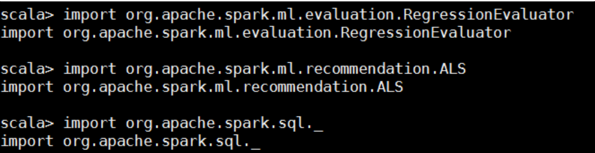

####定义评级的模式

如之前所提到的，评级数据可以在文件ratings.csv中得到。我们将使用DataFrame API来加载这个数据，并使用编码器类来实现模式定义。在本书编写时，这个类还处于试验阶段，它将一个类型为T的JVM对象与一个内部的Spark SQL表达互转，如果不是用这个类，将需要用StructType、StructField和DataType类来定义一个特殊行对象的模式，这显得很繁杂：

​	case class Ratings(userId:Int, movieId:Int, rating:Double, ratingTs:Long)

​	val ratingsSchema = Encoders.product[Ratings].schema

#### 定义电影数据的模式

在加载数据集之前，我们将用同样的策略来定义电影数据模式：

​	case class Movies(moveId:Int, title:String, genre:String)

​	val moviesSchema = Encoders.product[Movies].schema

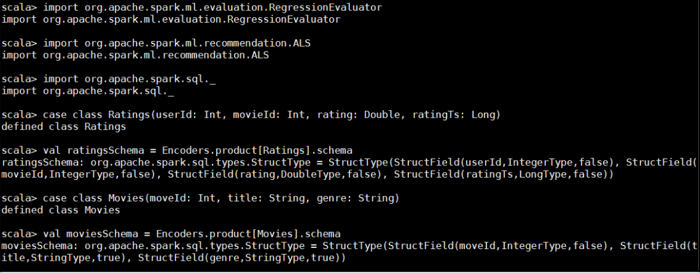

#### 加载评级和电影数据

现在将评级和电影数据读入到DataFrame中：

​	val ratings = spark.read.option("header", "true")

​				.schema(reatingsSchema)

​				.csv("hdfs://sparkmaster:8020/user/hdfs/sampledata/ratings.csv")

​	val movies = spark.read.option("header", "true")

​				.schema(moviesSchema)

​				.csv("hdfs://sparkmaster:8020/user/hdfs/sampledata/movies.csv")

加载评级和电影数据后，查看头5个记录以确认数据被正确加载。

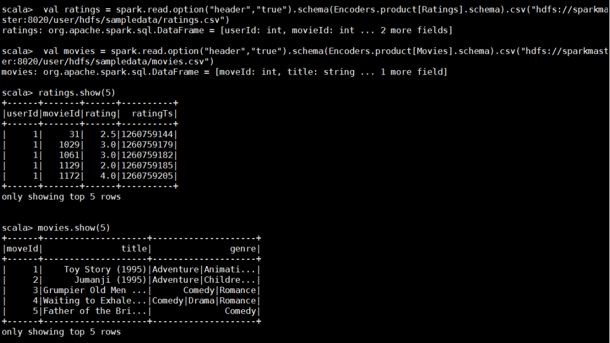

####数据分区

如在本章开始部分我们所解释的，我们将会把数据划分成训练和验证两部分。用于练习的目的，我们使用70/30比例切分数据，这很常见，也有一些专业人士喜欢80/20比例。我们将用randomSplit()方法来划分数据：

​	val Array(train, test) = ratings.randomSplit(Array(0.7, 0.3))

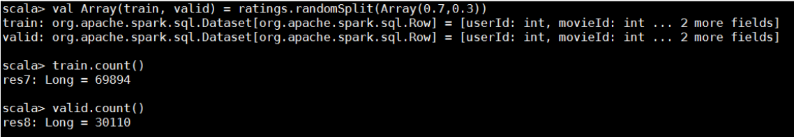

####训练ALS模型

现在我们将使用交替最小二乘矩阵分解法，在本章前面讨论过该方法的理论，关键参数是：

​	***最大迭代数***参数定义了参数的最大个数

​	***正则化参数***，设置成0.01
在本章之前讨论的，推荐可以在多个行业使用，通常有三个关注实体：

​	给物品评级的用户

​	被评级的物品

​	用户对特定物品的评级

你需要将合适的列名传递给ALS模型，并使用参数来适配训练数据集，以生成模型：

​	val als = new ALS()

​		.setMaxIter(15)

​		.setRegParam(0.01)

​		.setUserCol("userId")

​		.setItemCol("movieId")

​		.setRatingCol("rating")

​	val recommendationModel = als.fit(train)

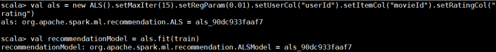

#### 预估测试数据集

一旦你得到模型，你可以用转换选项来转换输入数据集，基于模型生成对应的预估值：

​	val predictions = recommendationModel.transform(test)

这个结果数据集有一个额外的列，默认命名为predictions，包含从模型得到的预估值。你可以用实际评级与模型生成的预估值进行比较。

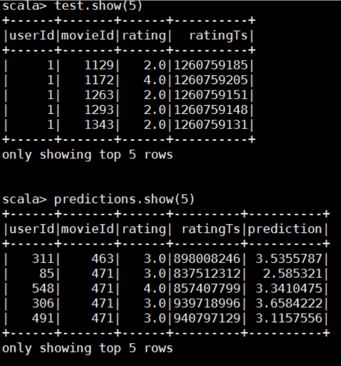

####评估模型效果

一旦我们得到模型和指标集合，可以用回归评估器来评估结果。这个回归评估器支持以下指标：

​	***RMSE***，根均方差（默认）

​	***SE***，平均方差

​	***MAE***，平均绝对差

我们已经在本章前面内容讨论过均方差的细节，接下来用该方法来评估预估值的结果。

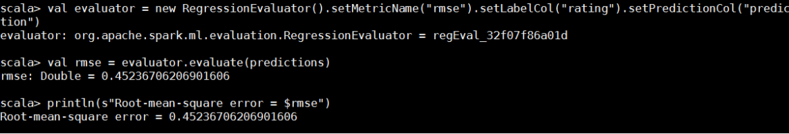

这绝不是一个优化的模型，其效果可以通过调整各种选项来优化。一个比较好的方法是选择各种参数的边界，例如，迭代次数10到20，lambda值位于0.1到6.0之间，等等，之后在一个循环中执行，每次比较计算好的最佳RMSE，如果你的RMSE比之前存储的RMSE小，可以将当前模型作为最佳模型，当前RMSE作为最佳RMSE。

这里有一个快速的例子，来展现你将如何试图达到优化模型的目的，该例子改编自一个RDD样例，来源于AmpLab(http://bit.ly/2jaFE6i)。本例子更多细节可从本书GitHub页面上得到：

​	val ranks = List(1,2,3,4,5,6,7,8,9,10)

​	val lambdas = List(0.1, 0.2, 0.3,0.4,0.5,0.6,0.7,0.8,0.9,1,2,3,4,5,7,10.0)

​	val regParams = List(0.01, 0.05,0.1,0.2,0.3,0.4,0.5,0.6,0.7,0.8,0.9,0.10,10)

​	val numIters = List(5,10,15,20)

​	var bestModel: Option[ALSModel] = None

​	var optimalRMSE = Double.MaxValue

​	var bestRank = 0

​	var bestRegParam = -1.0

​	var bestNumIter = -1

​	/** 迭代计算-寻找最佳模型 */

​	for (rank <- ranks; regParam <- regParams; numIter <- numIters ) {

​		val als = new ALS().setMaxIter(numIter).setRank(rank)

​				.setRegParam(regParam).setUserCol("userId")

​				.setItemCol("movieId").setRatingCol("rating")

​		val model = als.fit(train)

​		val predictions = model.transform(valid)

​		val currentRMSE = evaluator.evaluate(predictins.filter("prediction <> 'NaN'"))

​		println("Metrics => RMSE (Validation) = " + currentRMSE + ": Model Metrics(rank = )" + rank + ", regParam = " + regParam + ", and numIter = " + numIter + ").")

​		if (currentRMSE < optimalRMSE) {

​			bestModel = Some(model)

​			optimalRMSE = currentRMSE

​			bestRank = rank

​			bestRegParam = regParam

​			bestNumIter = numIter

​		}

​	}

在迭代的最后，你将得到最好模型参数bestModel，可用于对用户生成推荐。

####使用隐性偏好
在我们的例子中使用了显性评级，如果评级矩阵基于之前讨论的隐性信号，可以将隐性偏好设置为True：
	val als = new ALS()
		.setMaxIter(15)
		.setRegParam(0.01)
		.setImplicitPrefs(true)
		.setUserCol("userId")
		.setItemCol("itemId")

####心智检查(sanity checking)
由于已经加载好电影数据，我们也能检查预估是否准确和说得通。这通常意味着交叉检查来判断电影推荐是否真正工作。例如，你也许想知道动作电影是否推荐给喜欢看动作片的人，惊悚电影推荐给习惯观看惊悚片的人。这通常是整个练习的重要部分。
####模型部署
所以你构建了一个很棒的模型，能给系统带来很大的提升。下一步该做什么？当然这并没有结束。正如构建一个能带来提升的模型很重要，部署模型到产品中也非常关键。重要的是要理解，模型开发环境可能是基于spark，但是模型实施环境是多样的。除了实施环境，模型评分可能是在离线或在线模式。一个离线模式的例子可以是流失预估，你将数据分段，识别哪些客户将要流失，并配备流失处理策略。在线评分可以是当用户等待响应时。在线评分场景通常需要低延迟，例如，在线作弊检测，或广告位竞价。
最终，需要重要掌握的是，业务在持续演进，同样模型本身的需求也是变化的，你需要持续评估已经部署的模型是否有必要改变。装配警示很重要，这可以更新模型上带来的陈旧不适应，及随后评估的需求。模型一定要有一个合适的开发、测试和产品环境的发布过程。很多公司通常使用A/B测试来应对不同模型版本，来掌握哪个模型在哪些特定场景工作的更好。
如果你愿意学习更多关于模型部署的知识，建议从http://bit.ly/SparkModelDeployment开始。
###参考
本章的内容使用了下面的文章、博客和视频，这也是提供给用户更深入的阅读材料：
	1. Coursera课程 Mining Massive Datasets by Stanford University。
	2. 长尾理论-https://www.wired.com/2004/10/tail.
	3. 哈佛CS50-推荐系统，https://www.youtube.com/watch?v=Eeg1DEeWUjA
	4. https://en.wikipedia.org/wiki/Cosine_similarity
	5. https://en.wikipedia.org/wiki/Jaccard_index
	6. F. Maxwell Harper and Joseph A. Konstan. 2015. The MovieLens Datasets: History and Context. ACM Transactions on Interactive Intelligent Systems (TiiS) 5, 4, Article 19 (December 2015), 19 pages. DOI= h t t p ://d x . d o i . o r g /10. 1145/2827872
	7. http://ampcamp.berkeley.edu/big-data-mini-course/movie-recommendation-with-mllib.html

####摘要
这里对本章做一个总结，我们已经过了一遍推荐系统，包括理论以及使用Scala实现的例子。我从Coursera的数据挖掘课程上学习到了很多关于该理论的知识，这是一个神奇的平台。我希望我们能够公正地对待该主题。我们一直把重点放在推荐系统涉及到的设计和相关因素上，一旦你理解了所要面对的问题，我一直相信该方案的工程化是很简单的。
下一章的重点是另一个案例研究，即流失预估，是任何用户驱动的组织中实际案例最流行中的一个，用于掌握获取新用户的成本和已存在用户的留存。

