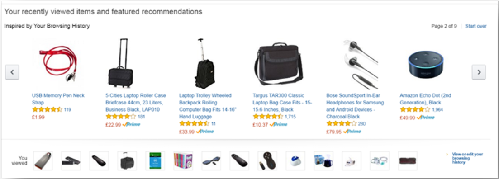

# Learning with Apache Spark 2

***set_daemon@126.com   2017-08-18  （如有侵权，请与我联系）***

翻译的原因有两个：尝试锻炼英语翻译能力，方便以后看其它资料；加深对spark的理解。

可在github https://github.com/PacktPublishing/Learning-Apache-Spark-2找到源码。

## 第9章  构建一个推荐系统

在上一章，我们介绍了在各种集群上搭建spark的概念。在这个课程和下一章，我们将看到一些实际使用例子。在这一章主要看如何构建一个推荐系统，这是大多数人正在用不同方式构建的一种系统。我们将包含以下主题：

​	1）推荐系统概览

​	2）为什么需要推荐系统

​	3）长尾现象

​	4）推荐的类型

​	5）推荐中的关键问题

​	6）基于内容的推荐

​	7）协同过滤

​	8）隐语义模型

本章希望可以给你一个推荐系统的很好介绍，并随之给出一个解决现实世界使用问题电影推荐具体的代码例子。

让我们开始吧。

#### 推荐系统是什么

我们几乎每天都与推荐系统打交道，比如你从Amazon上购买东西，在Netflix上观看电影，在Xbox上玩游戏，在google上查找新闻文章，在Spotify上听音乐。这些在线的应用基于你的历史记录或者与你有相似兴趣的用户给你推荐商品。

为什么推荐在我们生活中已经变成一件如此重大的事情，而15至20年以前在典型的由砖和水泥制造的商店中，这都闻所未闻？答案有赖于我们生活在一个物质极大丰富而不是匮乏的时代。我们也将更深入分析这个观点。20年以前，典型的零售商存储的商品数量都有限，原因是有限的货架空间和昂贵的房地产成本。

同样地，我们喜爱的电影院仅拥有有限的电影，我们的图书卖家仅拥有限的图书。我仍然记得20年以前，为了找一本Pascal图书，需要在不同商店中穿行，行走距离至少10英里，因为这不是一个热门的商品，在Islamabad主要的图书商店都没有库存。Web就没有这样货架空间的限制，因此，在Netflix上能找到的电影数量远超过任何代表性的影院。以此类推，在Amazon和eBay上能找到的产品数量比当前世界上任何一家零售商的要多出数十倍。什么让这一切变得可能？这可能归功于***[长尾现象](***https://www.wired.com/2004/10/tail/ ***)***。这种现象的思想就是，***如果你按受欢迎度给商品排序，而欢迎度是基于一个特殊商品的销售数量，零售商仅会售卖超过一定限度的商品，这个限度通常就是维持商品在库存中的成本（？）***。如图9.2所描述。

当依据单位销量来判断商品的受欢迎度，观察量大受欢迎和量小不太受欢迎的商品时，你可以看到长尾现象。零售商通常只会储备受欢迎的商品，并给它最佳性价比，而不太受欢迎的商品（在分割点右侧）只被在线商店存储。这种现象适用于所有类型的商品，包括图书、电影、歌曲和新闻文章，在趋向分割点右侧的曲线带被称为长尾。
更有趣的事情是如果你计算曲线下面的面积，例如AUC1,绿色覆盖的区域代表可在线商店和零售商店找到的商品，对比红色覆盖的区域代表只可在线找到的商品，可以发现AUC2通常即便不大于AUC1,但也相差无几。这些在线商品没法在零售店找到，实际上这类商品中有许多是很难找到的，在很多情况下用户并不知道确切的商品名，这时你需要向用户介绍这些新产品。事实上，你现在对商品有更多的选择，意味着你需要更好的过滤器，推荐引擎是这种情况下的解决方案。有许多熟知的案例，一些产品并不太好卖，结果导入到推荐引擎后表现极其惊人。

#### 推荐的类型
这里有三种推荐类型，我们将逐一介绍：
	1)人工推荐
	2)基于欢迎度的简单聚合推荐
	3)用户个性化推荐

###### 人工推荐
人工推荐是最简单而古老的推荐方式，这甚至与传统零售商相关。例如，如果你去你所地的影像商店，他们也许会在一个小通道里展示排名前十的电影，这通常是使用一些人工处理实现的。访问一些流行的网站，你可以看到喜爱收藏夹或员工推荐，这些并不考虑任何用户的参与(不是用户投票或其它方式产生的)。

###### 基于人气的简单聚合推荐
一些在线商店已经从人工推荐系统发展到另外一种更简单的用户商品推荐方式。在许多网站，默认的机制是采用当前售卖前十的商品展示成人气商品。相似地，如果你访问YouTube，你能看到最高人气的视频或热门视频。同样你访问Twitter时，你能看到最近用户正在推的热门话题。这类推荐基于普遍用户行为，并不指定特定的用户，通常是基于用户的聚合行为。

###### 用户特定推荐
为了从用户获得最好的参与，你必须针对特定用户裁剪推荐，而不是基于高层次的聚合或者人工挑选。用户更可能观看一部与他们之前看过的电影相似的影片，或者读一本与他们喜欢读的图书相似的书，而不是从前10列表中选出一部电影观看或一本书阅读。这种推荐最难做到准确，但能给出最好的结果，因此是本章的核心。

#### 用户特定推荐
在本章余下部分，我们将重点讨论用户特定的评级。让我们从考虑推荐系统的模型开始。
假设：
	C = 消费者集合
	I = 商品集合（可以是电影，图书，新闻等等）
	R = 评级集合。这是一个有序集合，更高数字表示特别商品的高喜爱度，更小数字表示特别商品的低喜爱度。通常数字是由0到1之间的实数表示。
我们定义一个功能函数u：组合消费者和商品配对，并将配对映射到特定的评级，即 u: C*I -> R。
如下实用矩阵的例子，表示用户与电影的集合：
|      | 教父1(Godfather I) | 教父2 (Godfather II) | 心灵捕手(good will hunting) | 美丽心灵(A Beautiful Mind|
|Roger |                    |                      |1                            |0.5                       |
|Aznan |1                   |0.7                   |0.2                          |                          |
|Fawad |0.9                 |0.8                   |0.1                          |                          |
|Adrian|                    |                      |1                            |0.8                       |
这个实用矩阵通常是一个稀疏矩阵，原因是用户对观看过的电影很少评级。这些未评级的区域可能是由于用户对电影评级不用心，或者简单的事实是他们对电影评级完全不上心（not bothered to rate the movies at all）。***推荐系统的目标是找出这些缺失值，识别出用户可能会评级很高的电影并将其推荐给用户***。

#### 推荐系统的关键问题
通常，推荐系统有三个关键问题：
	1) 收集已知的输入数据
	2) 通过已知评级预测未知
	3) 评测预测方法

###### 收集已知的输入数据
构建推荐系统的第一个临时里程碑是收集输入数据，即客户、产品和相关评级。由于在CRM或其它系统中已经有客户和产品数据，你将要从客户获得产品的评级。这有两个收集产品评级的方法：
	1）***明确的***：明确的评级意味着用户也许会明确地对一个特定商品评级，举例来说，Netflix的一部电影，Amazon的一本书或一个产品，等等。这是一种与用户打交道的直接方式，通常提供最高质量的数据。在真实生活中，尽管对商品评级会给一些激励，但非常少用户实际上会留下产品的评级。因此，对于任何有意义的预测练习，获取明确的评价是不可伸缩的（scalable）。
	2)***隐性的***：由于明确的评级通常不是一个选择，你可以决定从其他用户动作中推断出评级。例如，在网站上购买了产品而没有退回，也许可以意味着用户对该商品评级很高。同样的，一个视频流网站也许可以察觉到，如果用户观看了完整视频，这说明他们给了这个电影/视频一个正面的高评级，如果他们在半道就决定结束视频播放，这可以假定用户给这个产品负评级。这个隐性的评级有一个问题，仅能给正负评级，而不能给出高低评级。例如，产品购买暗示一个产品的正面评级，而未购买或退还暗示负面评级。然而，你不能用1(低）到10(高）的比例来度量此值，无论是5还是10.

###### 从已知评级预估未知
一旦准备好数据，我们能从已知评级推断出未知的评级。这里关键的问题是之前构建的实用矩阵是稀疏的，意味着大部分人不给商品评级。除此之外，我们必须处理冷启动问题，即新商品没有任何评级，同时新用户没有历史数据可以用来推荐新内容。从已知推荐/预估未知有三个主要方法：
	1)基于内容的推荐
	2)协同过滤
	3)隐语义模型

#### 基于内容的推荐
基于内容推荐背后的主要概念是将与用户已经高评级商品的相似商品推荐给用户，例如，如果我们谈论电影，将推荐相同演员、类型或导演的电影给用户。如果你是Facebook的用户，你会定期获得朋友推荐，被推荐的用户与你有一些类型的关联，如根据相同朋友，相同学校/大学，等等。基于内容的分级是通过生成商品和用户配置文件来完成的。商品配置文件是商品的基本特征，例如电影的场景，商品配置可能包括特征，如标题、演员和导演等等；基于用户的场景，其配置包括朋友集，或者他们一起居住、学习或工作的共同地方。商品配置基本上是一个向量，包含1或0个，依赖于特定的特征是不是商品配置的一部分。

在博客和新闻文章的场景，项目配置更复杂，它们基于文本特征，本质上是一些重要的词汇，通常用TF-IDF分数（词频-逆文档频次）来标识重要性。

