#  三个步骤设计高效 Dashboard

***作者 [陈新涛](微信公众号三生石，小密圈数据人修炼之路。)  日期：2017-06-16 原文来源：[人人都是产品经理](http://www.woshipm.com/data-analysis/691262.html)   （如有侵权，请联系set_daemon@126.com）***

研究国外业内前沿数据产品，了解当前实现数据价值的最新思路和实践。

无论哪一种数据产品，仪表盘（Dashboard）都是最核心的功能。它作为用户接触数据的第一个页面，相当于数据产品的门户，担负着提纲挈领，引导分析的重要职能，帮助用户能够快速判断业务情况，支持他们做出决策并行动。
个人有幸经历过三个数据平台的 Dashboard 设计，企业内部和 ToB 型产品皆有涉猎。根据研究过的一些 Dashboard 设计案例和文章，最后将所有这些经验总结成以下的「123」：***一个原则，两个时期，三个细则***。
一个原则即「提纲挈领，引导分析」，在一个页面里明确告诉用户当前业务状况好坏，并支持能够针对某个问题进行下钻分析，从而串联起整个数据平台。由此原则从而可推出以下三个细则：
1. ***因人而异，细分场景***：根据用户和场景设计产品
2. ***少胜于多，分清主次***：展示最关键的指标，区分优先级
3. ***深入分析，落地行动***：支持深入分析，并落地为具体行动
***这就像讲一个用户故事。经过起承转合慢慢铺垫，最终进入正题，告诉用户应该怎么去执行，怎么去优化产品和业务。***
各类数据产品在实现前面提到的不同原则时，又可以分为两个时期：***Report（定制化）***和***Customize（个性化）***。前者是早期形态，如 GA 和 Mixpanel 等，特点是根据指定的分析思路，严谨地从汇总到细分，层层下钻。它们为实现「因人而异」，往往会设定多个 Dashboard 页面，或者本身就只针对某一类用户群体。后者更常见于一些比较新型的分析产品，如 Domo 和 Looker，特点是报表自定义程度较高，通过自由选择单图的方式来组建 Dashboard。随着时间的发展，这两者的界限在慢慢模糊，但主要的特点依旧鲜明。

## 因人而异，细分场景
产品的核心就是解决问题，解决某些用户在某些场景下的某个问题。对于不同行业，不同业务，不同职位的人们来讲，关注的内容自然不一样。在设计一个数据产品或页面时，我们需要围绕着用户和场景来做设计。
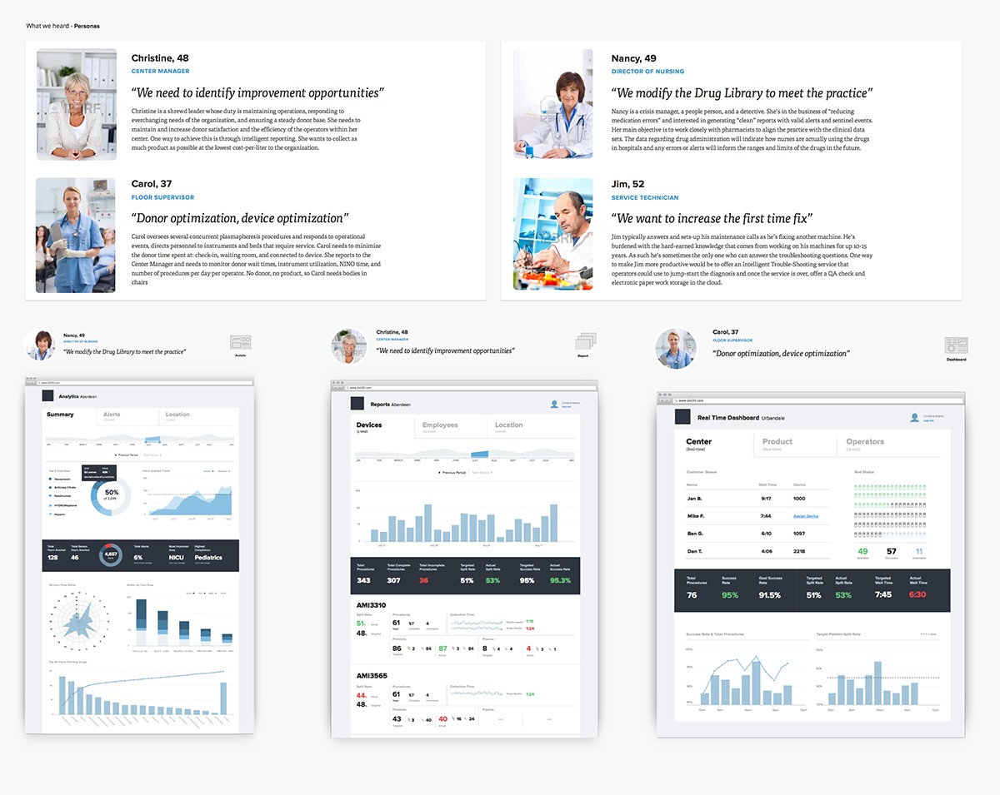
#### 划分用户
划分用户，一般会从业务线或岗位入手。不同业务线间，关注的核心指标自然不同，比如转转下面各种业务部门，即使大家都关注大盘数据，但每天更关心的，还是自己的业务细节指标。
岗位也是同理，管理层重在把握全局，而执行层重在每个细节的执行效果，关注的数据层级和指标也会有所差异。
以 Domo 为例，它为每个职位的人单独设一个 tab 来显示，每一个岗位都有自己预设的 Dashboard 页面。
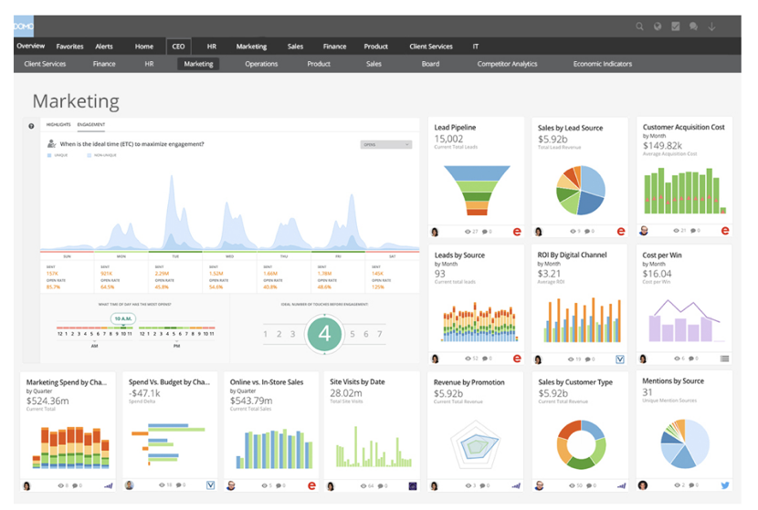
同时，它也支持用户对这些报表进行内容的增删改查，以及对整体布局进行调整。
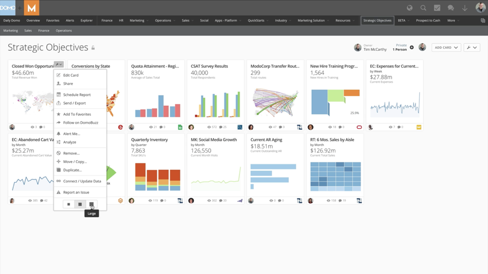
所有设计仪表盘的第一件事情，就是明确自己的用户，然后根据不同的用户群体设计仪表盘，及确定开发的优先级。
#### 划分场景
划分场景，主要的场景有包括但不局限以下情况：实时监控场景，指定主题分析场景，移动查询场景，周日会汇报场景和大屏显示场景等。
从实时监控场景来讲，Dashboard 会被分为实时和历史两种，两种略有差异。实时侧重于监控，历史侧重于了解和分析。这两种没有明显的分界，实时需要历史的信息作为对比，来判断当前的数据是否正常。而历史也需要准实时的信息来更快地了解当前的情况。这两种形态的Dashboard 对于数据产品来讲都必不可少。
以下是较好的实时 Dashboard 设计方案，核心在于细分维度的多维监控，并确定合适的阈值点。
从特定主题分析场景来讲，Domo 为每一个数据源设定相应的 Dashboard，如 Facebook 广告，Google ADs 等等。因为每个数据源就代表着一种场景。

移动场景考虑到屏幕等硬件条件的限制，则侧重于通知和展示，不深入到分析部分。到具体产品设计上，则是通过M页或者APP等方式实现，提供最核心的数据查看和智能挖掘，不做过多的查询功能和复杂的交互。同时，基于现有大部分人通过手机进行沟通，那么页面或数据的分析也变得重要。
同样以 Domo 为例，它在移动端也有相应的场景划分，支持消息的移动推送和展示：

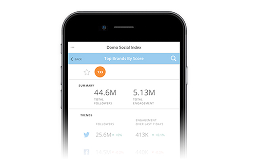

## 少胜于多，分清主次
根据「提纲挈领，引导分析」的原则，仪表盘的界面上优先展示的指标应该是用户最关心的，且因为每个用户时间精力有限，在数量上要极度精简。在挑选指标时，要遵循一下原则：
	*从用户的需求出发*
	*精准，精确反映当前业务情况*
	*核心指标不超过7个*
	*确定核心指标间的联系及优先级*
Webtrend 创立于 1993 年，是目前公认市场占有率第一的商业网站分析方案，为接近 2000 个公司提供服务。作为一款通用的商业分析产品，它在 Dashboard 页面提供了网站用户最关心的 7 个指标，包括最近 30 天的汇总PV，访问量，访问深度，新访问用户，日均访问用户数，平均访问时间，跳出率。同时通过与上个30天的环比的增减，跌涨与红绿对应，能够使用户一眼就了解到当前业务情况。
同时，这几个业务从几个侧面整体衡量了网站的用户数量及质量，既能监测网站访问用户数的情况，同时通过跳出率等指标来分析访问用户的质量，可监测爬虫或及时识别伪造用户。
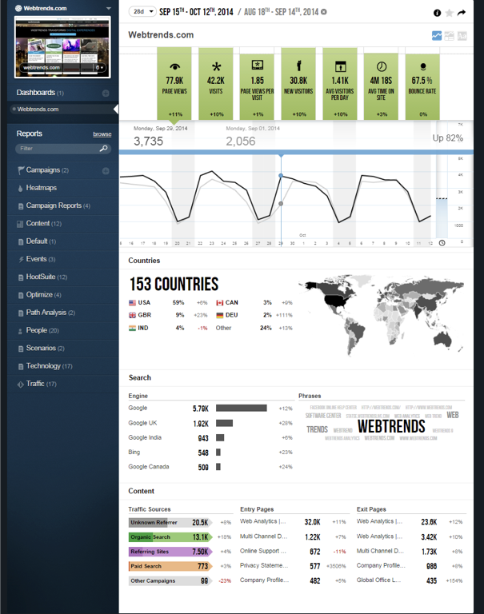
对于非通用性产品，如企业内部的数据产品，这个环节的关键就落在了确定核心指标头上。结合《精益数据分析》和个人经验，有个简单的方案可供参考：
	*根据商业领域不同及企业发展时期的不同，要采取不同的指标验证*
	*建立第一性指标，目标要依据情况而变*
比如在美团外卖最开始的时候，关注的重点的是订单数，后续发展成订单额，新客数和资金使用率等等。***在不同战场，在战场的不同时期，需要观测的指标都不一样***。
以下是《精益数据分析》中关于各种商业模式和公司阶段应该思考的问题，和采取的第一性指标，仅供参考：
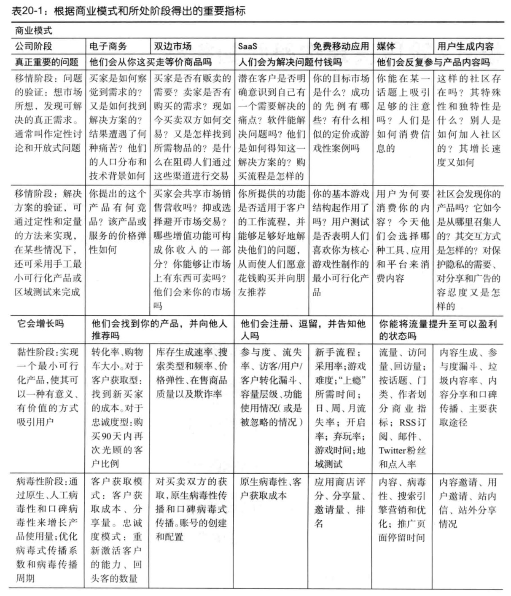
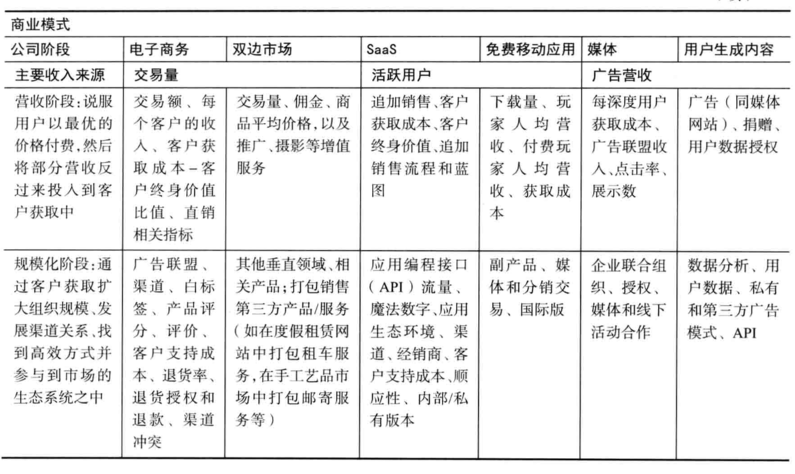
在具体设计第一性指标及衍生指标时，需要注意：
	1) 注意行业常识
	比如社交产品，电商产品等应该关注什么类型的第一性指标
	2) 选择合适形式
	***采取简单易懂的指标***：复杂的指标发生异常时，并不能明确告诉你问题的原因，简单成本中
	***采取比率指标***：相对于资金使用量，资金使用率，如订单金额/活动金额能防止资金滥用，产生更大的经济效益。
	***采取伴生指标***：在关注某个指标时，需要有个另一个指标对它进行制衡，避免「跑偏」。如关注新客数时，也必须关心获客成本，避免市场部门为了完成新客指标而花费了过高的成本
	3) 避免统计陷阱
	***平均值的一项巨大能力就是阻碍决策的制定***。因此在使用平均值时，要注意通过使用分布数据来防止这种偏差。只说全国人民平均收入时，会给大家造成理解偏差。但如果加上省份间的分布数据的话，情况就一目了然了。
	***百分比/比率，要注意显示绝对值***。当一个业务部门说自己增长 100% 时，可能只是因为他上一个周期的绝对值低而已。
	4) 塑造指标易用性
	***帮助用户理解和相信他们看到的数据***：提供数据的来源，算法以及异常的原因。异常的数据需要提供可验证的途径
	***提供上下文信息***：提供数据清晰的标题，标签和解释，提供易于理解的指标名称，以及标记数据异变的原因。
对于第四点，通常需要通过鼠标悬浮的方式展示每个核心指标的定义，在有条件的情况下，还需要对每个数据异动提供注释。在 Mixpanel 中，它支持在某个指标的某个时间点上添加备注，来说明数据变化的原因。
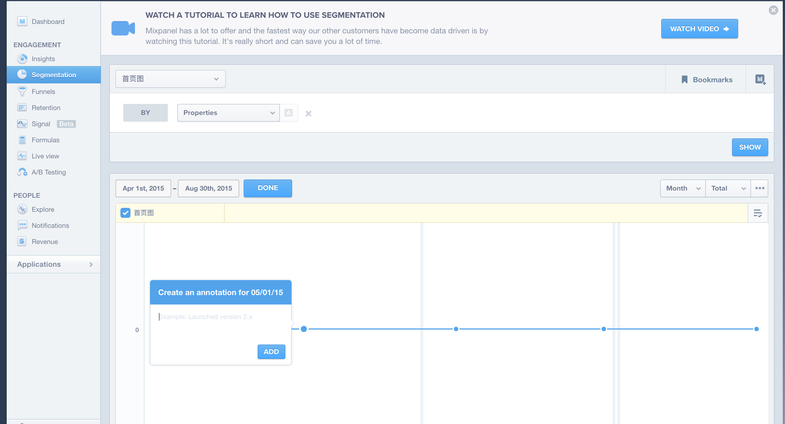
至于「精准，精确反映业务情况」，精准讲的是指标要设计合理，精确讲的是***一定要保证数据准确性***。一个老板天天看的页面，数据出错了能发现还好，如果依赖错误的数据作出了决策，后果你能想象…

## 深入分析，落地行动
分析无非「对比，细分，溯源」，从这个角度讲，仪表盘的设计需要让用户能够在「提纲挈领」之余，也要能提供给用户分析思路。当发现数据异常时，能够沿着思路自主得到答案，或者分析方向。
#### 对比
没有对比就没有分析，从各种指标的对比中才能看出指标的偏离。对比可分为三大维度：
	1) ***时间维度***：同比，环比
	2) ***空间维度***：地区对比，团队对比，商品／服务/渠道对比
	3) ***设计维度***：目标值，业界值，极限值等与实际值的对比
Qlik 作为一个老牌的可视化厂商，它旗下的产品 QlikView 将对比的概念发挥的淋漓尽致，基本涉及了以上各种对比类别。

在 Sales 图表中，提供了各个月份间的时间维度对比。在 Sales/Margin/Customer 上和左侧的列表中，则提供了地区，渠道，品类等各空间维度的对比。而在 KPI Scorecard（计分卡）图表中，是设计维度的对比：「当前销售额」和「某个时间段内的最高值和最低值」，「利润率」和「目标利润率」&&「利润率区间」，从而使所有地区的销售情况一目了然。

而且从上面的例子可以看出，对比对于显示关键信息来讲非常重要。在设计相关的对比模块时，一要在合适的维度上进行对比，这个维度应该对当前指标的变动起主导作用。二要突出对比的结果，方式有颜色变化，内容闪烁或数据报警等。

这里顺便提下对于红绿色含义的认知差别。有些国内的数据产品会以为在中国股市中，红涨绿跌，并且在中国传统文化中红色代表喜庆，所以在数据产品中红色应该也代表数据变好。***其实数据可视化的原则是，高效地向用户传递数据信息***。而用户天然对红色的内容会比较敏感，红色应该用来传递更重要的信息。数据下跌比数据上涨要重要得多，因此数据产品在***指标的显示上，应该仍遵循红坏绿好的原则***。
#### 细分
细分是对核心指标进行多维度的划分，分为单维度细分，多维度细分，流程细分及TonN细分等等。
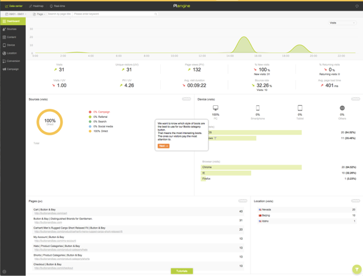
以 Ptengine 为例，它提供了对不同核心指标的细分，包括访问来源，访问地区，访问设备及页面。同时，用户可以在页面对不同指标进行切换。***当你对某些数据有疑问时，你可以通过点击相应的维度跳转进入各个子页面，起到了「引领分析」的作用。***

流程细分一般是指的从漏斗的角度去拆解指标的上下游。举例来说，当我们关注的指标是支付订单数时，我们就需要去拆分从列表页，详情页，下单页到支付页的每个流程的数据及转化。
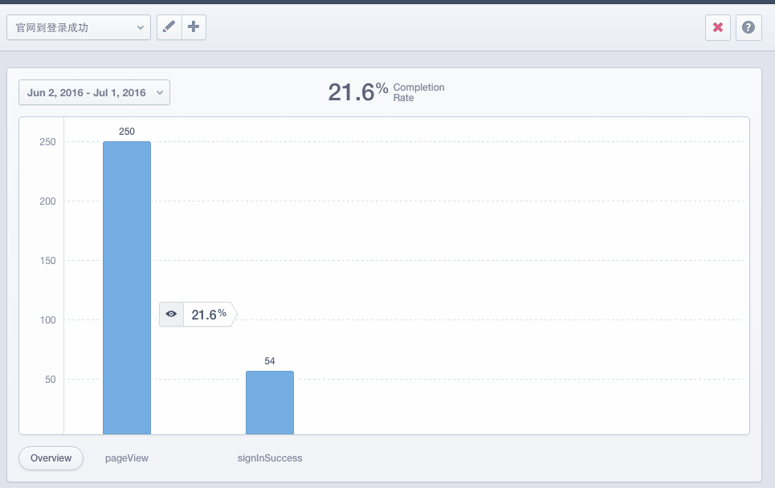
TopN 细分则是注重看中某个维度下占比前列的维度值的变化，来直接反映某些指标值的变化。
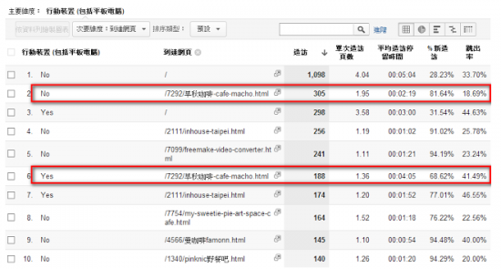
#### 溯源
其实，溯源作为一个对于数据异变根本原因的追查过程，很难融合在以简洁为原则的 Dashboard 中，不过 Amplitude 通过隐藏选项并且通过和内在其他功能的融合，很好地解决了这个问题。
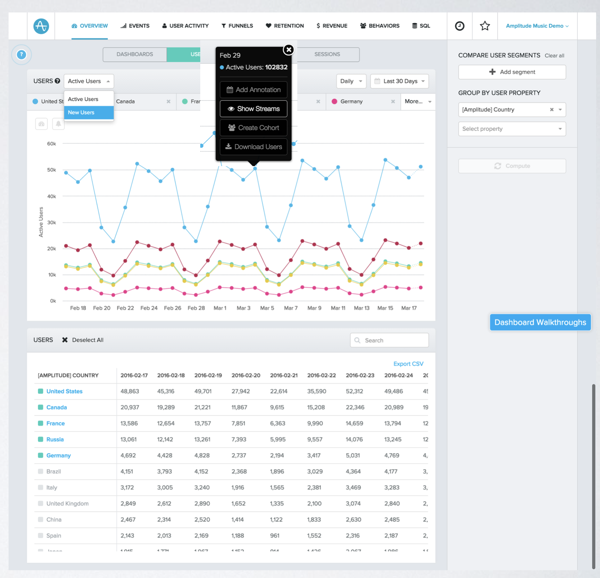
Amplitude 首先提供了不同主题，不同形式的数据的对比细分展示。而在某类具体业务和数据点上，我们可以选取某个时间点的用户群体作为 Cohort 对象或者针对这批用户的流向结合产品内其他功能进行分析。它甚至能够将整个用户id列表下载下来，做线下分析。

事实上，对比，细分和溯源不是严格区分出来的三个流程，而是互相融合在一起的。在不断地在异常的维度上进行对比和细分时，才能得到可以付诸行动的结果。
#### 行动
***在设计仪表盘时，要反复地问自己“So What”***。从设定用户场景，到确定指标和优先级，再经历对比细分溯源三个分析流程，最后要做的，就提供给用户决策和行动的建议和方向。

这里有点个人的技巧：***先假定几个异常的场景，然后通过设计出来的仪表盘，演练拆解场景中出现的问题***。如果能够在若干个场景中都顺利走通，那就证明你整个设计能够支持用户做出决策和行动，已经马克森斯了。

再往上一层，就是能够直接给出业务建议的层次了。这个一方面需要对业务的极度熟悉，另一方面可能还需要数据挖掘和机器学习的内容。举个 Google Analytics 的移动版为例，在这个版本的 Dashboard 里，已经有这种智能化的提醒了。
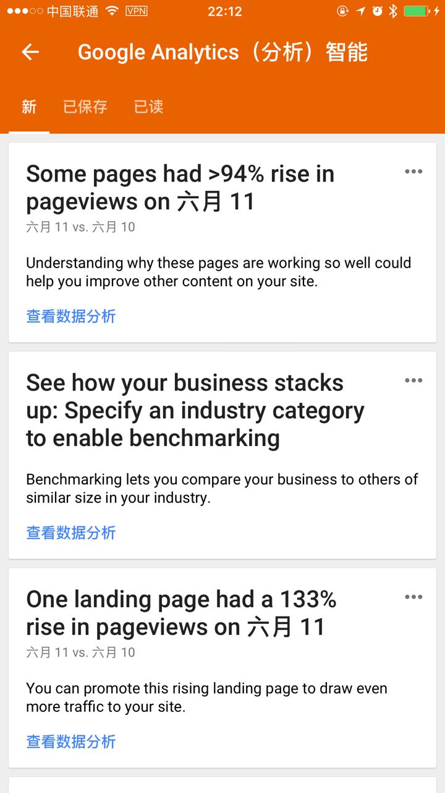
## Dashboard 设计原则
刚开始做 Dashboard 设计时，不要一上来就画原型图，而是先划分用户和场景，然后用思维脑图确认核心指标和衍生维度。再根据思维脑图画出草图，演练几遍在 3.4 提到的「用户故事」。在整个流程都走顺之后，再开始仪表盘的设计。

在设计细节上，不要刻意追求炫酷的效果，而是注重设计的内在逻辑和传递消息的有效性。有一些设计原则可以参考：
	1)在功能设计上***
	***突出核心指标：***不能让复杂的设计掩盖了指标的呈现	
	***突出对比***：时间对比，空间对比，设计对比等等
	***提供细分及下钻***：方便用户在有疑问时能够快速得到方向
	***减少用户选择***：提供默认的同环比和时间选择，提供最常见的维度切分
	2) 在可视化设计上
	***简洁为上***：减少Tab、按钮、单选框、复选框，在1-2个页面里完成展示
	***避免过多的颜色和点缀***：太多的颜色会让人眼花缭乱，失去重点
	***选择正确的可视化形式***，可参见***华尔街是怎么做可视化的***	
汇总以上提到的各种类型的 Dashboard ，可供参考的设计框架有以下两种，均可从本文中提到的各个大厂设计的 Web Dashboard 的样式作为佐证。
***(1) 总分式，先展示核心指标，再对核心指标进行拆分***
在实际操作过程中，因为指标往往比较多，通常会通过加上指标筛选框或者 Tab 的方式来进行区分。
在实际使用过程中，模块间可以任意组合。如 GA 和 Ptengine 就是上趋势下数字搭配若干个细分维度，而 Webtrends 则是上数字下趋势再搭配细分维度，Mixpanel 和 Amplitude 则干脆就是趋势+细分维度。

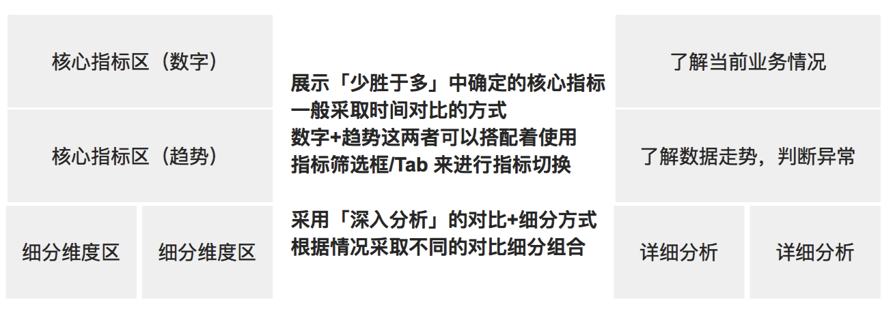
***（2）分散式，常见于 Customize 类型的数据产品，形式是若干个报表集中在一个页面展示。***
这是因为此类产品一般没有等级明确的金字塔结构来承接分析思路。此类形式胜在自由，但缺陷在于信息量太大，让用户一下子不知道该关系哪个指标。所以建议此类产品必须可以定制每个单图的大小，从而起到「少胜于多，分清主次」的作用。
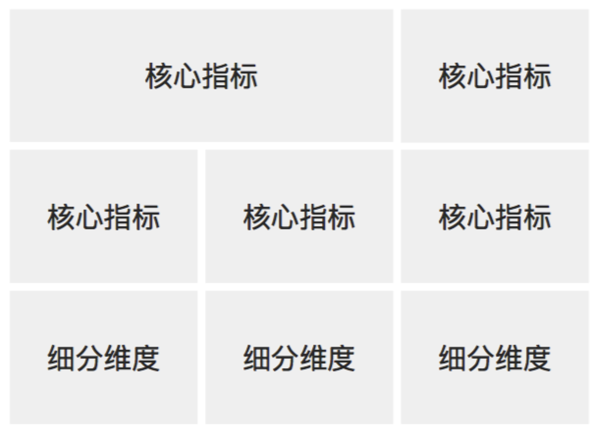
为了追求视觉效果，在大屏展示场景下，也会经常采取这种布局方式，比如天猫的双十一大屏和一些公司内部的大电视上。
在《Information Dashboard Design》一书中，作者给出了他眼中最完美的 Dashboard 设计范例，堪称简洁典范：
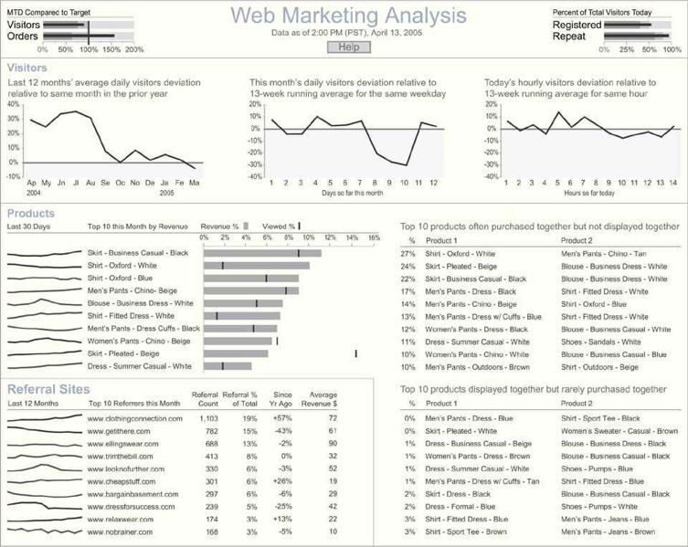
在实际设计过程中，以上几个方法可能会互相冲突，比如 Amplitude 产品中，我们说尽量减少 Tab 切换，可它就在页面中提供了若干个切换的入口。这时候就得在业务需求，产品简洁和信息量上做好取舍。

设计完成和产品上线后，都必须持续听取用户的意见，对指标和交互进行修正。随着企业阶段的演变，Dashboard 也会处在不断变化当中。
## Report && Customize
我们先用 Google Analytics 和 Looker 来举例说明这两者的差别。

Google Analytics 中根据分析主题划分出受众群体，流量获取，行为，转化四个子菜单，每个菜单会再按照菜单层次依次往下拆分，就像一层层金字塔一样。

另外一面，在 Looker 中，会采取这种分散的图表的组织方式，每个图表都可以再次编辑。整个分析页面，不再是简单的图和表的堆砌，而是变成了一个画布。用户可以在这个画布上放置他们任意想要的内容。
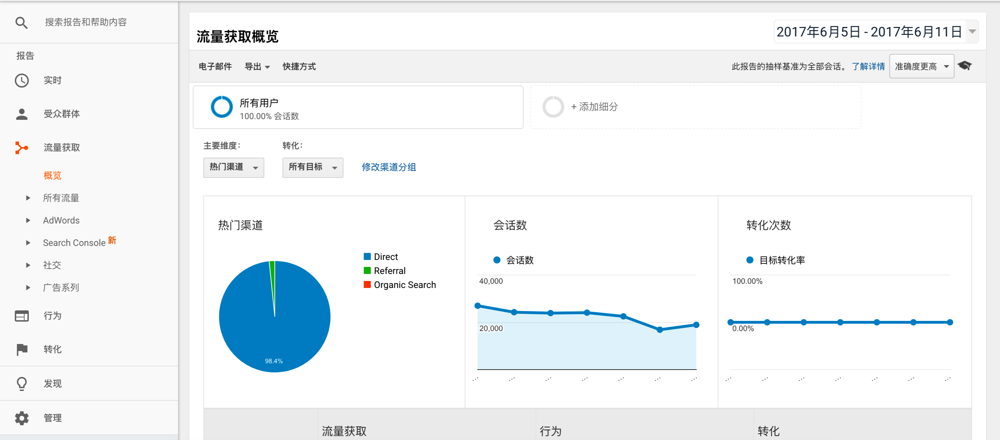
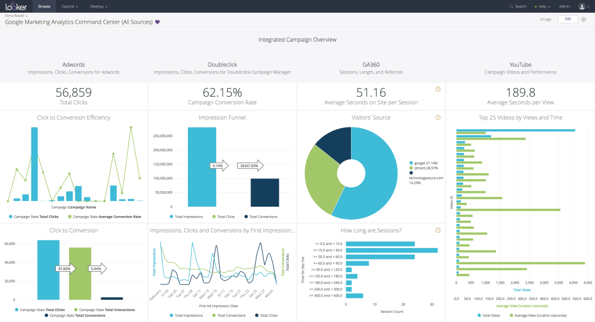
这两种方式各有利弊。

Report Dashboard 适用于整个市场的数据利用意识处于早期阶段，分析思路匮乏，对指标的需求比较单一，只能由设计者提供一个抽象普适的分析思路，供用户日常使用。

而随着数据运营的方法论越来成熟，整个数据采集和分析工具越来越先进时，原先的方案已经不能满足人们的需求。不同的人，同一个人不同时期关注的内容都不一样。因此对个性化的要求便能越来越高。

不过，Customize Dashboard 会面临几个问题：1，对底层数据的规范要求较高；2，对使用者要求较高，这需要用户有十分明确的分析思路及定义指标的概念。为了解决这个问题，很多产品便提出了两者相融合的方式：在 Customize Dashboard 的基础上，提供一些默认的报表，方便用户使用。允许用户修改，从而具备更大的自由性，适用于跨业务跨部门的情况。同时带来的问题就是分析思路不明确，可能没有重点和框架，用户在分析使用的过程中容易困惑。这种情况下，***预定义的多主题的 Dashboard 和分析思路就显得非常重要，否则整个产品的上手难度会比较高***。
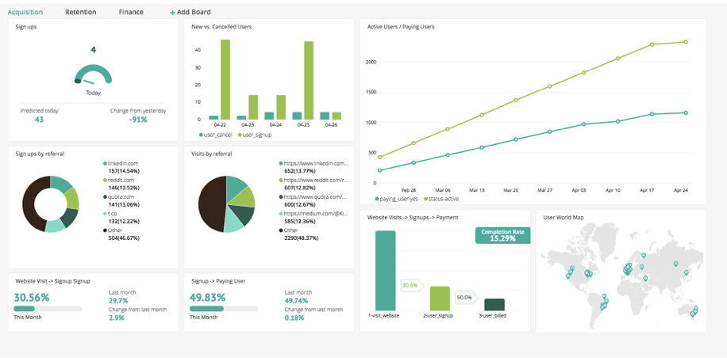
在 Kilometer.io 的设计中，它会给用户预设几个常见的模板，同时允许用户对模板进行自定义的编辑。这是很多 TOB 数据产品都具备的功能，而 kilometer.io 比其他产品更进一步的做法时，在自主添加报表时，它同样提供了默认的指标和形式供你选择，避免了用户在自定义报表时无所适从的问题。

说起来，这有点像降维打击，后者只要有完善的底层数据和交互规范，片刻就可完成多种类型的 Report 的设计。这已经不是一个层次的战争。

这个趋势不但是 ToB 类数据产品出现，在企业内部数据产品上亦是如此。很多公司如美团，转转都开启了这种以自定义 BI 为基础，以「个性化看板」的方式组织所有定制化和自定义的报表的模式。这种 BI2.0 的结构能够为不同的业务线，不同的场景提供不同的 Dashboard。私以为，这将是大幅提高企业内数据使用，分析和分享的效率。

***当数据仓库基础已经完善或业务需求非常多样化的时候，就可以开始考虑这种架构了***。

## 在数据产品门户之外
在数据产品之外，在管理后台产品，用户端产品，也有这种集中展示数据，帮助用户快速了解情况的场景，大多数集中在运动类产品，理财类产品和工具型产品上。类型虽然不同，理念大同小异。大家可以借此验证文中理念，拓宽思路。

运动类产品

理财类产品
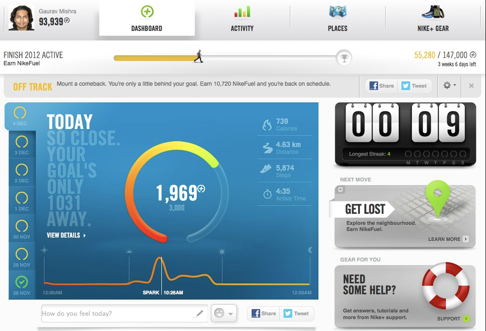
工具型产品
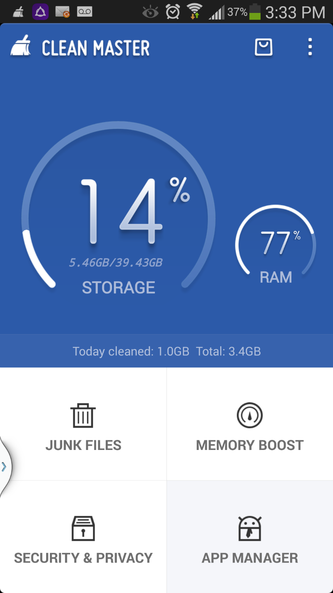

#### 参考文章
1 [Designing Data-Driven Interfaces](https://medium.com/truth-labs/designing-data-driven-interfaces-a75d62997631)
2 [Ten key elements for effective dashboard design](http://searchbusinessanalytics.techtarget.com/tip/Ten-key-elements-for-effective-dashboard-design)
3 [APP的数据图表设计，你以为简单？]()
4 [Online Dashboards: Eight Helpful Tips You Should Hear From Visualization Experts](http://blog.plot.ly/post/123617968702/online-dashboards-eight-helpful-tips-you-should)
5 [《精益数据分析》]()
6 [《精通 Web Analytics 2.0》]()
7 [《Information Dashboard design》]()

作者：陈新涛，现任转转数据负责人，曾任美团外卖首任数据PM。微信公众号三生石，小密圈数据人修炼之路。
