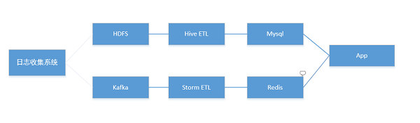

# 需求背景
***来源：http://www.raincent.com/content-85-7091-1.html***

我今天分享的话题是Druid驱动大数据实时OLAP。

首先我来谈一下实时OLAP的需求背景，我们广告系统有DSP睿视系统和AD exchange等，实时竞价是DSP的核心，广告主或者优化师需要动态调整出价优化使收益最大化。广告主调整出价策略或者投放策略进行优化，想要尽快得到实时的反馈，比如修改了地域定投，实时分地域查看竞得率和转化率，甚至是分钟粒度的。

在我们的DSP系统中我们提供12种维度(不算多)的多维分析，用户可以任意组合下钻查询。最初的时候我并不是采用Druid，而是采用Storm+Kafka+Redis实时数据处理，以及hive+mysql的离线处理的Lambda架构见下图。

实时数据经过Storm ETL，主要是将不同维度组合作为key，计算metrics以后为value存在redis中。离线数据定时将昨天的数据在Hive中 经过一系列ETL，按照维度组合计算metrics以后将结果存储在mysql中。采用redis作为实时数据的存储有两个核心问题需要解决：

1. redis不支持range scan，我们需要在app层拼好所有的key，然后调用mget获取，如果执行group by查询的话例如select area,pv from t where cast='a' group by area的话，需在客户端好所有的cast_area的key。那么问题来了，我并不知道投放a在哪些城市 产生过曝光，如果有地域定向还好，如果没有的话需要拼接所有城市的key取redis中进行mget。哪这样只是城市维度还好，全国也只有几百个城市，但如果换做其他基数很大的维度，哪性能开销就比较大了。

2. 如果做到真正的多维分析，需要穷举1维，2维知道N维维度的所有组合，例如有A B C和D，那么一维的组合有A B C D，二维的有 AB BC CD DA等组合，依次类推直到组合到N维。同时每种维度又有自己的基数，例如ABCD各自的基数都是100，最差的情况， 今ABCD这种组合就会有1亿个key，但现实数据一般都是稀疏，不会出现这种的情况。总之穷举维度组合作为key的方式存储空间 会非常大，特别是添加维度以后，有可能是指数级的增长，非常不可控。

为了规避这个问题，我们对功能进行了降级，我们提供某些维度组合的查询，这样就做到了简单可控。但需要历史和实时结合查询的场景，问题就又来了，我需要将mysql的数据和redis的数据整合起来。只能在app端进行数据合并。就这样这个系统愉快地高效运转了一段时间。

4月份的时候我参加Qcon和Druid中国用户组的Meetup，听Druid项目发起人Fangjin Yang将Druid的昨天今天和明天，6年前他们在 metamarkets创业公司，主要为广告公司提供多维数据分析，尝试过很多方案，例如传统的关系型数据mysql/postgresql,kv存储的 Hbase，Hbase受限于rowkey设计，都不能很好地解决多维分析，随后创建Druid。我相信很多公司都有类似的经历。说了这么多终于引入正题。

# Druid简介
Druid是一个实时处理时序数据的Olap数据库，因为它的索引首先按照时间分片，查询的时候也是按照时间线去路由索引。下面介绍一下他的几个特性：

1. 高性能，亚秒响应的交互式查询。
2. 支持高并发，支撑面向用户的应用。
3. 实时导入，导入即可被查询。支持高并发导入。
4. 高可用，Druid的所有组件都可以做到高可用。
5. 可扩展性，采用分布式shared-nothing的架构，可以扩展到PB级。
6. 节省资源，平衡性能和资源开销，精巧的索引数据布局，高效压缩，查询时高效聚合。
7. 支持聚合函数，count和sum，以及使用javascript实现自定义UDF，支持复杂的Aggregator，近似查询的Aggregator例如HyperLoglog以及Yahoo开源的DataSketches

适合星型模型，不支持大表之间的Join，但其lookup功能满足和维度表的Join

它是如何做到的呢?列存储，倒排索引，Roll UP，roaring 或者concise bitmap位图索引以及高效的压缩支撑了Druid的高效查询。提到倒排索引，大家都会联想到Lucene，Solr以及Elastic Search。确实Elastic Search是Druid的强大竞争对手，后续会简单对比。

Druid是由一组不同角色的节点，每种节点都是一个单独的子系统负责不同的功能，这些节点组成一个系统协同工作，我们来看一下Druid的整体架构见下图

这张图上有Realtime，Broker，Historical等节点，以及灰色的代表数据导入的流向，红色的代表数据查询的流向。

Segment是Druid的索引。Druid首先按照时间分片，Segment Granularity代表Segment存储了那些时间范围的数据，这里的 Segment Granularity可以是分钟 小时天等时间粒度。

RealTime部分可以是Indexing Service或者Realtime Node，它负责实时导入数据，生成Segment(索引),在Realtime中采用LSM-tree 的模型，他可以采用push或者pull的方式获取流式数据，数据首先添加到内存的增量索引中，内存增量索引采用SkipListMap，对写友好而且能够高并发处理，查询也相对来说高效。当达到一定阈值后，这个阈值可以内存增量中最大条数，或者累积到一定时间。

采用异步线程将 内存增量索引转成倒排索引持久化到磁盘中，同时生成一个新的内存增量索引接收数据。周而复始，当达到设定的Segment Granularity时，Druid会Merge那些Segment Granularity内所有持久化的索引成一个Segment，并且推送到Deep Storage。在推送到 Deep Storage之前，Realtime负责对这些Segment的查询。

Historical是Druid的主力，他从"Deep Storage"中下载Segment，采用mmap的方式加载Segment，并负责来自broker对这些 Segment的查询。在Zookeeper中为每个Historical创建了一个Load Queue来决定下载那些Segment，一旦加载成功，Historical在 Zookeeper中宣告这个Segment由它来负责。

Historical采用多线程的方式处理高并发，比如一个请求过来涉及多个Segment的查询，那么会为每个segment分配一个线程，并发地执行，然后汇总结果返回给broker。由于Historical处理Group by查询时，需要大量的内存存放中间临时结果，那么内存管理就显得至关重要，Druid采用一个简单的内存管理池，每次申请都会返回固定大小的direct buffer，使用 完毕以后还回池中。

前面提到Druid采用MMap的方式加载Segment，如果索引的总大小小于内存大小，并且留有一定量的direct memory大小，那么Druid变成了内存数据库，瓶颈不在IO，而不是在CPU，索引的压缩以及数据的聚合都很耗CPU。Historical采用 Shared-Nothing架构，可以无限扩展，提升内存大小以及总的CPU core数从而提升计算能力。

Broker类似分布式搜索引擎中的元搜索引擎，它不负责任何Segment的查询，他只是一个代理，从Zookeeper中获取TimeLine，这个 TimeLine记录了intervals->List(Server)的mapping关系，接收到Client的请求以后，按照时间段在TimeLine查找Segment分布在那些 Server上。然后并发地去查询然后汇总结果。前面提到在每个realtime或historical内部也是类似这样的架构。为了便于大家理解，下面我用一幅图来展示整个流程。

Coordinator负责协调Segment的均衡加载，Coordinator从元数据存储mysql中获取那些还未被加载的Segment，根据当前所有 Historical的负载能力均衡地分配到其LoadQueue。默认采用2副本加载，也就是说把同一个Segment分配到两个Historical节点上去， 这样设计是为了保障高可用。Coordinator同时会检测historical的存活，一旦发现某个Historical当掉或者有新的Historical加入，就会进行自动均衡。

好了经过上面对Druid的整体介绍，我相信大家已经有一个初步印象。重点说明的是Druid采用LSM-tree的方式做到实时索引实时查询。

## Druid和其它OLAP的对比
以下比对参考自Druid官方文档
### Druid vs Elasticsearch
Druid在导入过程会对原始数据进行Rollup，而ES会保存原始数据。
Druid专注于OLAP，针对数据导入以及快速聚合操作做了优化。
Druid不支持全文检索。

### Druid vs. Key/Value Stores (HBase/Cassandra/OpenTSDB)
KV存储的通用方式：
预算所有可能的维度组合
在事件记录上进行Range Scan

先来看第一种，需要通过穷举的方式预算所有可能的维度组合，计算和存储开销都很大。优点是查询快，增加维度困难，有可能是指数级的开销。

第二种，把事件记录作为Key，value为度量值。例如时序数据库OpentsDB就是采用这种方式。KV存储模型有一个缺点，只能根据前缀进行Range Scan，而不能对任意维度上进行索引过滤(不考虑二级索引)，而且不做到精准扫描。

Druid采用列存储，倒排和bitmap索引。可以做到快速扫描相应的列。

### Druid vs. Spark
Spark SQL的响应还不做到亚秒。
Druid可以做到超低的响应时间，例如亚秒，而且高并发面向用户的应用。

### Druid vs SQL-on-Hadoop (Impala/Drill/Spark SQL/Presto)
SQL-on-Hadoop提供一个执行引擎，可以对多种文件格式的数据进行查询，当然也可以对Druid的Segment文件进行查询。从以下三个方面分析：
1. 查询，Druid采用Scatter/Gather模式，SQL-on-Hadoop大多采用MPP方式，把执行计划分布在多个节点去执行，节点之间网络通讯以及序列化/反序列化(Serde)都会带来一定的开销。
2. 数据导入，Druid支持实时导入，SQL-on-Hadoop一般将数据存储在Hdfs上，Hdfs的写入速度有可能成为瓶颈
3. SQL支持，Druid也可以有SQL，imply提供了plyql的解决方案，还可以和Apache Drill整合提供SQL查询。Druid不支持Full Join。

## 支撑高效查询的索引以及压缩
我们在讨论高效查询时，那么得首先定义一个标准，如何才能称之为快，Druid官方宣称他们已经实现在万亿行数据集上执行 query，响应时间小于1秒。这里提到的万亿行数据集我理解是Raw Data，而不是导入Druid以后存储的数据集大小，因为Druid在导入数据过程中有Rollup处理，这个特性会减少数据集的大小，当然这只是我的理解并没有和作者求证。言归正传，Druid是如何做到这么快的呢。索引是支撑数据库高效查询的基石。以下面的一组数据举例来演示整个索引以及查询过程。

这也是Druid要求的数据，第一列是时间，是必选项，广告和地域都是维度列，在Druid中维度都作为字符串处理，展示数和点数数为Metric，一般是看作数值处理，可以是 Long或者Double，其实也可以复杂的metric例如HyperLogLog来处理UV，DataSketches的功能更加增强可以实现交并集的处理，可以用做访客的留存或者回访统计，此处不详细展开。

Raw Data的话，每个展示或者点击事件，其数量都是1，Druid在数据导入阶段会进行Rollup，将相同维度组合的数据进行聚合处理，例如在2016/05/14T11期间，在广告C1地域P1有14条件曝光事件，3条点击事件，Rollup会将采用其设定的聚合器进行聚合，在这里我们采用sum的方式，得到展示数14，点击数3.Druid采用倒排索引和列存储的方式，列存储采用字典编码的方式，将某一个维度的值，按照字典顺序编码成整数，以广告维度为例，这个数据集中共有4条记录，不重复的值有3个C1 、C2和C3，这里提出一个基数的概念，基数可以理解为集合中不重复值的数量。那么广告维度的基数是3.我们把它们按照字 典顺序编码得到C1=0，C2=1，C3=2。字典通常采用数组结构表达，元素的下标为字典编码值。

前面我们讲了Druid的数据格式，Rollup和列存储以及字典编码方式。接下来讲一下倒排索引和数据布局。倒排索引被应用在搜索引擎上用于文档的检索，随着大数据的发展，倒排索引同样在大数据分析领域绽放出新的光芒，例如Elastic Search，越来越多的用户把它 用在数据分析上。

Druid同样采用倒排索引，但不象Lucene，Druid专注于数据统计分析，而且只支持布尔查询。Druid的索引结构布局 由字典，正排(列存储)以及倒排组成，其中倒排的Posting List采用压缩的BitMap位图索引，BitMap的优势是能支持快速的布尔查询，后续会介绍。

目前支持Consice和Roaring两种BitMap方式，它们在稀疏的Posting List上均能起到很好的压缩效果，更重要的是在进行布尔运算时不用解压缩，直接在压缩的结构上进行布尔运算。

下图展示的结构是将广告编制成索引的数据布局。例如C1只出现在第一行，那么它的BitMap是1000，同理C2出现在第二和三行，那么它的Bitmap是0110.这里是介绍Dimension的索引布局，Metric同样也采 用列存储的方式按块压缩。

说到索引，不得不提是压缩技术。前面提到BitMap支持Consice和Roaring两种压缩编码方式，在Column正排部分使用变长整数编码，不同于其他场景下的可能须有一个bit标示分割，在Druid的索引中，字典的大小是已知的。

如果字典的大小小于0Xf，那么只有一个 byte存储，同理，如果字典的大小小于0Xff则用两个byte存储，依次类推。如果维度的基数为100，那个只有一个存储，压缩率为25%，非常高效。

在最新的索引版本中在变长整数编码的技术又加上了LZ系列压缩。压缩是一把双刃剑，平衡的是IO和CPU的开销。说到LZ系列压缩，Druid采用按块压缩，默认块大小为64K。

布尔查询，以这个SQL查询为例，select sum(click) from table where time between 2016-05-24T11 and 2016-05-24T12 and广告=C2 and 地域=P1;首先根据时间段定位到Segment，然后根据广告=C2和地域=P1，得到 他们各自的字典编码，C2=1，P1=0，然后根据字典编码得到BitMap的Offet，从而得到Bitmap，C2=1 index为1的bitmap为0110，同理得到P1的bitmap为1100，0110和1100进行And与运算是0100，得到的offset是1，说明我们需要在click中读取offset=1的值是4.

再举一个复杂一点的例子。Group By query。Select 地域，sum(click) from table where time between 2016-05-24T11 and 2016-05-24T12 and 广告=C2 group by 地域。Group By较 上面的Select查询不同的是它需要按照地域去汇总点击数。这样就得把符合过滤条件“广告=C2”的地域和点击数两列的值都遍历出来再 在内存中做分组聚合。

接下来演示一下整个过程，首先是根据"广告=C2"得到字典编码=1，然后根据index=1得到bitmap是 0110，Offset是1和2，根据Offset分别在地域和点击数中遍历得到，P1，4和P2 20.当然这个例子的数据非常少，现实中海量数据的话 Group by有可能遍历大量的数据，首先在内存中再做聚合得到最终的结果集。 在这一部分，我们讲了Druid高效查询的基石，倒排索引，巧妙的索引结构布局和高效的压缩，BitMap以及布尔查询。

# 应用案例
我们回到应用背景中提到的案例，使用Druid以后的架构变成下图。

特别要提出的是最初我们采用Realtime Node，部署简单，但每次Schema的更新都要重启每个实时节点，并且实时节点没有副本 不能保障高可用，Indexing service作为其的升级替代品，是一套独立的分布式系统能保障高可用，作者推荐使用。这个架构中，依然有离线和实时两条线，离线会在T+1的时候修正数据。目前我们每天的数据在20亿左右，16个维度，20多个指标项，大部分的查询响应时间都在几百毫秒，其导入即可查询的实时性和高效的交互式查询很好地支撑了业务需求。

# Q&A
Q1. 我们也在用druid，请教几个问题，一个是timestamp，官网只支持utc市区，有没有办法改为东八区?第二个问题，druid有一个时间窗口，超出时间的message会被丢弃，但过大又影响查询效率，设置多大比较合适?您在使用过程中，查询一般可以扛多大并发，qps是多少?第三，谈谈从Kafka读与tranqulity这种方式的优劣比较

张海雷：索引阶段可以使用东八区也就是咱们的本地时区，但查询结果返回的时间戳总是UTC， 在查询中设置时区。

第二问题 关于时间窗口，拒绝策略官方推荐为serverTime 如果日志延迟超过时间窗口就会丢弃，这个目前没有好办法。qps没有统计，目前我们统计了RT

第三个问题 是比较realtime node 和indexingService吧 从kafka拉取数据还是有一定优势，比如持久化了才commit offset，可以起到WAL的作用

Q2. 大概看了下文档，Druid不支持join，只好把表设计得很宽。假设有几千列的话，会不会对性能影响很大?有没有什么好的办法?另外，前端可视化贵公司用的什么?

张海雷：对 Druid适合星型模型，其lookup功能可以实现和维度表join。对Druid性能影响较大的是Rollup，维度的个数，维度的基数以及维度组合的稀疏决定了rollup的效果。举个例子，我们的报表中原始数据最多的有50列，但我只取16个维度，而且维度的基数不大，这样十几亿条数据，rollup以后只有500万左右。

Q3. olap面对现在流行的流行的实时计算storm这些还有优势吗?

张海雷：个人感觉OLAP侧重的是多维分析，Storm侧重的是流式计算，我们使用Storm对实时数据进行ETL以后导入Druid中。

Q4. 貌似跟麒麟预计算建cub差不多?

张海雷：对Kylin了解不多，Kylin也是采用KV存储 hbase，预先计算各阶各种维度组合。Druid是Rollup，列存储加索引，倒排索引以及Bitmap索引。

Q5. 你们的查询量跟响应时间有了，但是并发跟吞吐量如何呢?Druid对高并发的支持怎么样?

张海雷：我们是通过Druid的metrics获取这些监控数据的。Druid如何应对高并发，在历史节点或者realtime 是采用多线程处理请求，每个线程处理一个segment，如果一个查询涉及多个segment，会分发segment交给多线程去处理 最后合并结果 类似scatter/gather模型。

Q6. 计算昨日留存这样的case，如果不用join的话druid一般如何实现呢?

张海雷：留存可以使用FilterAggregator和DataSketches 实现。

Q7. 请问写入时，如何做salting，确保数据分散，避免热点? 数据倾斜，某节点是否会出现热点读?如何处理? 数据实时大量注入时，是否会形成大量小文件?影响查询效率?

张海雷：我们采用realtime node 每一个firechief线程对应kafka的一个partition 在Storm ETL过程 我们采用hash分区使相同维度组合的数据落在同一分区。

Q8. scatter-gatter和mpp区别在哪里呢?

张海雷：我对这一块理解地也比较浅，scatter-gather 分发-聚合的模式，mpp通常是把执行计划分发多个节点 流式处理

Q9. 有没有用到实时数据和历史数据的聚合结果，在哪里，咋计算的?

张海雷：Druid本身就是lambda架构，支持历史和实时相结合的查询。

Q10. 请问druid是否支持mdx语法? olap前端用什么展现最好，支持下钻个拖拽吗? 是否支持精确的 count distinct?

张海雷：不支持精准的distinct count 支持hyperloglog 或者datasketches。ui有imply提供的pivot很强大。

Q11. 这个和apache kylin主要区别在哪?二者能否互补?

张海雷：Druid是实时OLap Druid能支持更多的维度。

讲师介绍张海雷：优酷土豆广告产品开发团队负责Redis Cluster和Druid集群，作为Redis Cluster早期用户趟过一些“坑”最终平稳运营。现在专注于实时计算、实时OLAP，使用Druid驱动广告团队的大部分OLAP业务。

