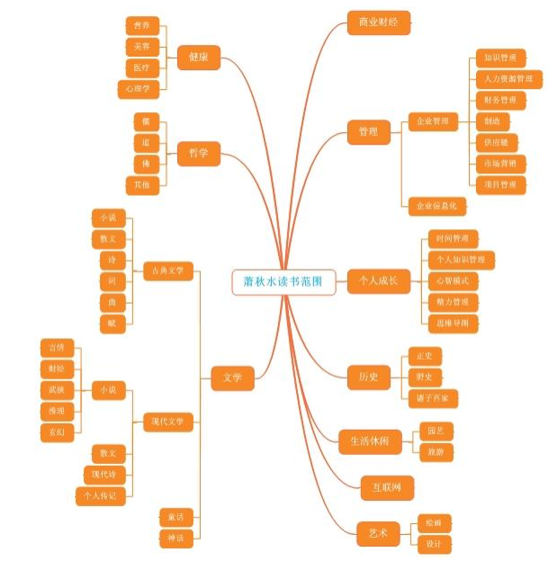
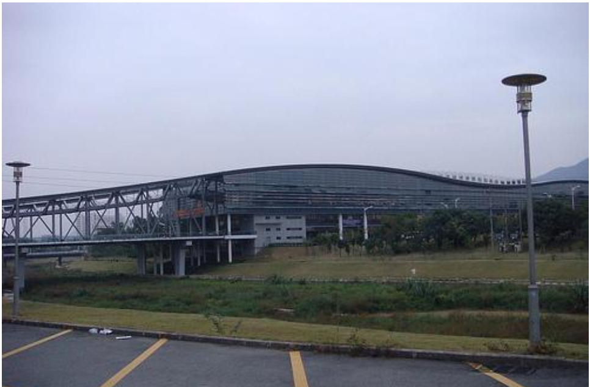

# 他们怎样读书和选书 

*作者：萧秋水 时间2010-06（收藏之用，如有版权问题，请联系set_daemon@126.com)*

[TOC]

## 前言

作为一个爱书人，一个研究者，对于书藉的一切，都是充满好奇的。我并不想作为一个传播者，去苦口婆心地劝人们爱书、读书，我只是想要探索一些读书方法，来让喜欢读书而又存在困惑的人们，得到一点有价值的启发。

我将持续地寻找并询问，了解一些看上去很忙但是仍然能够不间断地读书的人，是如何读书如何选书，希望从中总结出一些模式、规律。

我以在微博私信询问、当面采访、自动投递等方式，邀请到不同的人分享自己的读书和选书方法。 

感谢他们给予我的回答， 汇集成这本电子书。 

以下排名不分先后，原则上来说，最后更新的在前，以便于阅读。 

--- 萧秋水 2010年6月

## 萧秋水

这次活动， 说是到了尾声，其实不是结束，尤其是对我来说，这个活动，为我打开一扇门，已经取得一些进步，还会取得更多进步，所以首先，请允许我说：谢谢！

感谢所有参与这个活动的智者们，感谢关注这个活动的朋友们。 

***关于读书***

我很感谢我的祖父、父亲、外公，是他们给予我良好的读书环境，感谢我的前夫，他也是爱读书的人，并且引领我走上不同的读书道路，对我来说，是感性与理性的分水岭。感谢初恋男友，虽然他自己不喜欢看书，但因为我喜欢，所以经常买书送我，尤其是诗词类；感谢某任男友，送我一本重要的书《千江有水千江月》，虽然被辅导员借去不还但若干年后我还是又买到了。我很幸运，生活于充满书香的环境，并遇上与书相关的人们（与第二任男友是在图书馆邂逅）。

在这个活动开始之后，我的读书速度迅猛提升，有一个晚上读了三本，一个晚上读了四本，虽然，这个数字里都有水份（三本中的一本是医疗书藉，有些病不关注，所以略读；四本书中的两本都是账簿，所以只读了有用的部分），但终究，这是一个提升，要在以前，我会从头看到尾，而时间，就不好估计了。

这要得益于这个活动，所以，我的体会是： 用。

读书的目的，不在于数量，而在于对个人目标的帮助，对个人能力的提升。读万卷书，行万里路，最终是要实现个人梦想，否则，不如不读。传统的读书法，是要认真、细致、从头到尾，但现在，我已明白，这个观点，如果站在提升速度、提高效能的目标之上，必须打破。 

***1、不是必须每字必读。***

读书必须有目标，有问题，否则，即使读完，收效也可能甚微。带着问题读，从书中寻找答案，这样，会有一种强烈的关注感，书与自我，结合紧密。而对于已经了解的部分，没有必要再读，忽略即可。关注值得关注的部分。

***2、抓住全书结构。***

通过目录、关键字等，抓住全书结构。不过，要注意的是，之所以要抓住全书结构，并非我们要去了解作者想说明什么，而是：在这些结构里，哪些是对我们有用的，这样，在看目录的时候，其实就好确定，我们将在哪个部分倾注多一些时间，主次分明，节奏清晰，从而会更有效地读书。

***3、一本好书要读几上几遍。***

关注对你来说最为迫切的部分，而不是一口就吃一个胖子。谢文老师说： ***基本上既不重视细节，也不重视文采，只关心逻辑，情节和思想***。 这就是很明确的方法，当需要关注文采的时候，可以再读一遍，只关注文采。

***4、不要心疼买书的钱。***

胜间和代的书里一直强调，不要心疼买书的钱，这可以看作是投资。如果是借来的书，很难用速读法去读，而且也难以反复去读，从网上书店买书，折后的书相当便宜，放在手里和吸收进脑海里，都是精神财富（当然，前提还是要读和用）。有些人顾虑搬家等，不想多买书，因为书沉，人不必要为了这样的理由来拘锁住了自己，需要的时候，买，不需要的时候，扔。这也是佛家故事里造船和弃船的寓意所在。

***5、 范围宜专也宜广。***

我个人属于兴趣广泛的那种，既术业有专攻（做实施顾问和产品经理的时候专攻项目管理、制造，做知识管理的时候专注于知识管理），也广泛涉猎，触类旁通， 清代张潮曾在《幽梦影》中说：才必兼乎趣而始化。一个人死读书，很容易读成书呆子，而如果多涉猎一些，并且能够融汇贯通，对于成长会更有帮助。我有时候脑子空下来就会乱想，乱联系，比如知识管理和孙子兵法，串联在一起写篇文章还能赚稿费，何乐而不为呢？（当然你得想得有道理）。

秋叶在分享中提到过主题阅读，我现在非常认同这种方式，也在尝试，这种方法可以让人在较短时间内，对一个领域有较深的认识，我在整理这些读书方法时，应用到正在研究的个人理财领域，感觉收获很大，这个也将是我博客的下一主题。

***关于选书***

在前面的读书和选书方法中已经说得非常多了，我自己主要是豆瓣、朋友介绍这两大途径，因为我读书太杂，就不敢依赖豆瓣猜了，主要是看关联书藉，感觉这个比较有用。

在朋友介绍这个方面，要让朋友了解自己的爱好、现在在研究的领域，这样，朋友的介绍会更加精准。前两天子扬介绍《自慢》给我，这本书我以前没有听过，子扬举出一些适用于我的理由，我非常信服，于是立刻下单。

我是看到有人提到一本书时，立刻加在豆瓣想读中（统一到一个容器里存放），在买书的时候，直接翻阅“想读” ，加进购书单，这个办法我认为相当不错， 当然豆瓣对我来说不只是想读，我把豆瓣的“ 想读” 作为购书参考使用，把“ 在读” 作为读书计划使用，把“读过” 作为读书总结使用，感觉对自己的读书习惯，是很好的帮助。

在本文的最后，推荐一个读书博客，在京华烟云滚滚红尘中，这位小盆友的精神值得鼓励：

​	朱翊，互联网从业，从事产品和运营工作，现于北京苟活于高房价与低收入的IT 民工潮流中。我喜欢读书和写字，无数时日多么繁忙，我都要强迫自己阅读一些文字，以及到书市选购一些书籍。

​	目前有一个读书博客，主要以原创书评、读书笔记、读后感为主，更新还算及时(上周去成都，导致一个多礼拜没有更新)，这是我的小博客而已，我知道内容还很浅显，但我正在努力。

​	个人博客地址： http://zhuyi.org/book/

## 秋叶

我喜欢读书，而且是纸质的书，一年至少看 50 本书，最近几年应该还不止，没少花银子。不过一本书只要有一点让我有启发，我觉得这世界就很难找到这么划算的生意，这一般只需要 30 元不到，比大学生家教还便宜。

先说我看书的习惯吧，我小时候喜欢床上看书，有催眠的效果，现在读书基本是在火车或飞机上，把等待和旅程时光变成阅读时间，每次从武汉到上海一路 6 个小时，我可以读完三本书。这是因为我看书非常非常快，打小如此，没有特别练习过速读。所以一本小说到我手中，别人要看一天的，我就是 2 个小时。当然这样读，有缺点，往往只记住了轮廓，不记得精华，对专业的书籍，要是如此阅读的话，怕是毫无成效。

但一目十行的习惯一旦养成，要改也不容易，所以我为了让自己能吸收一点有价值的营养，从 98 年开始，强迫自己做阅读笔记，如果总是做阅读摘录其实也很无聊，也很难坚持，所以我就变化出这么几种形式。

​	***1、摘录精华***

​	特别是专业书，不抄下来不行，有些东西，即使抄下来还不是自己的。特别是杂志类，我喜欢看的，看到精华，我是一定要抄的，下次可能我就想不起了，就是想起也找不到了。

​	***2、写篇书评***

​	到今天，大概写了书评的书，超过 60 本， 07 年发现豆瓣不错，书评都转豆瓣上了。最近开始学着写眉批，我觉得也不错，估计会坚持下去。

​	***3、学以致用***

​	我这个人很好奇，看到书中好的或有趣的观点，能立即尝试的，就立即去试，不去想有效没效。我个人以为用过的知识和没用过的知识对大脑刺激是完全不同的。

​	***4、重新组织***

​	这招也是我写博客的一个秘密，我看到好书，就会自己主动琢磨如何把书中的好观点，结合自己近期的博客主题写出来，赶紧编就一篇，将别人的嘉言变成自己的话，这样加工过后，书中喜欢的内容就变成自己的了。

​	***5、看了就忘***

​	看书的人应该知道，这世界好书不多，伪书不少，但还是会经常看到一般的书，这是概率问题。而且有些不是很好的书，或者有知名度的书还是要看，通过对比可以知道当下的品味和自己的不同，鉴别好书与坏书的区别。但这些书要学会忘记，最典型如黄色小说，当年我算博览了不少，除了个别可算色情文学的，大部分我都忘了。不忘的话，你的脑袋装不下新东西，我想有的读者应该明白我的意思。

最近参加 lonelyfish 发起的《麦穗计划》，大家可以去[他博客](http://lonelyfish1920.blog.163.com/blog/static/117135176201041655338760/)看看，就是用 PPT 写书摘。我做了一个作品，是《猿猴大爆炸》这本书，这种形式也挺锻炼人的，不过有的朋友喜欢给书做思维导图，我个人没养成这习惯，但我觉得也挺好，我是用 PPT 代替思维导图了。

我做的 PPT 书摘大家可以去这里看看： http://www.70man.com/?p=3500

再说我选书的习惯吧，我看书不挑方向，只要好玩，我都愿意看，这点从看我豆瓣书评也可以看出来，历史的，管理的，经济的，文学的，传记的，社会学的，只要好看，我都会买来看。我觉得看不同门类的书对自己很有帮助，不只是知识面，每个学科都有自己独到的研究方法，假如你理解并迁移到你的工作中，也许大有收获。

比方说我曾经花费很多力气研究逻辑和建立知识框架的能力，这些读书当时不觉得有多大用途，结果当我把这方面的思考嫁接到 PPT 领域，我无意就成为所谓的 PPT 高手，这就是杂家的好处，当然，杂是为了专注一点，否则太发散也不好，毕竟人类文明 遗留下来的好书太多，是看不完的。

但我还有一个习惯，***假如近期我要研究某个领域，我会把这个领域相关全部能买的书籍全部买回来通读，这样可以很快对某个方向有一个全局把握，建立自己的视野，有了视野才能提出自己的思考方向和研究路线，零散看几本书是没有太大帮助的***， 我写《超越对手-大项目售前售后的 30 种实战技巧》，做 ERP 和项目管理的书我买了很多，现在研究 PPT 和设计的书，是出一本我就买一本，通过这种方式快速学习。

最近我读书又有进步，说白了就是开始用独立思维去读书，我想到了我这个年龄，读书应该有点批判能力，什么都是抱着学习的心态，那是 20 几岁以前的事情，我读书，看万千世界，留下我的思考，和作者通过书去互动，这里面有大乐趣。

买书方面，我习惯利用当当，卓越排名，我知道很多书买榜，但通过目录和书评的仔细分析，还是大概能看出一本书的潜质。反正书买得多了，自然就有鉴别力。此外朋友推荐我也很重视，好朋友推荐的好书，我有时间都会去买，这既是对他们阅读水平的信任，也是爱读书朋友之间的小乐趣。

假如今年工作顺利，想在明年系统读一读春秋战国时期百家经典，这些书在读书时都当分数读了，其实还不太理解，现在有了阅历，重读应该别有风味。

秋叶博客： www.70man.com

秋叶豆瓣： http://www.douban.com/people/qiuyemantan/ 

秋叶微博： http://t.sina.com.cn/1280110097 

（秋水： 和秋叶太熟了，本篇不须“ 秋水按” 。  ）

## 良辰

博客： http://liangchenip.spaces.live.com/

原载于： http://liangchenip.spaces.live.com/default.aspx

看到秋水姐的这个贴，感觉很好就来写一下吧。

选书，一词，我个人不是很喜欢，我的经验告诉我，很可能是书选你，而不是你选书。 当我读经典名著的时候，看书，看不下去。当经历过，感悟过之后，重新读，感觉是相见恨晚。所以对书，我到是感觉随缘就好。

随缘，并不表示我读的书不系统。我将书分为三种，一种是工作用，一种是爱好，一种兴趣，一种是休闲。而我读的最多的是爱好与兴趣类的书。这两类书，往往是兴趣变成了爱好。比如偶尔遇到一次鸡尾酒的书，被图片打动，虽然不喝酒，还是慢慢关注了这些书，也收藏了一本鸡尾酒的书，偶尔翻来重温一下。而我也在划定我的未知， 按月和季度来读相关书弥补我的未知知识结构，这样就系统了。而工作用书，那更是问前辈高手来系统化。

先说说我的书的来源：

​	***1、网络***

​	当当、豆瓣，读品等都会去看，不过看了也很少买。呵呵。

​	电子书，经常下一些，经常看一下，有几个网站。

​	网络小说，这个是纯休闲，比如我很欣赏的《 间客》。 

​	博客以及朋友推荐的书。 

​	***2、读书会***

​	深圳本地有些读书会，有些已经商业，有些还是私人。听听这些书友的介绍，感觉耳目一新，不由想重新回来读一些读过书，另有一番心得。而书友强烈推荐的书，也会寻来或借来读读，有些很喜欢，有些不喜欢。

​	深圳草根读书会的组织者的博客 http://janny.org/ QQ 群 110604490

​	***3、图书馆***

​	小小的陋室，根本没有那么多地方放书，除非必然，我现在买书越来越少。如果说，前面的电子书是不尊重知识产权。图书馆就不怕了。深圳市一直在建立图书馆之城，可是图书馆还是太少，活动更是少。图书馆有大量的电子书，十辈子也看不完。即使纸本书，也是十辈子都看不完。

​	相比市图书馆，我更喜欢大学城图书馆，也就是深圳科技图书馆，虽然远，但是常常两周去一次，最频繁一周去三次。该馆被称为中国最有特色的图书馆之一，我个人也这么认为。一个图书馆横亘在沙河上，非常特殊。外形如“如意” 一般，非常特别。这样你也许可以想象出来她的深度，那真是馆内深深深几许？ 转超平老师的博客《 中国最异的两个大学图书馆，之一》，偷个懒，转博客的图书馆照片

​	无论哪个图书馆，电子系统查书，我是很不屑的。因为即使标明在馆入藏，你还是找不到。找馆员一起找，未果，告之可能被人自习在看或书烂在维护正准备上架等等，反正架上没有，但是在馆。于是，常常是自己在图书馆里闲逛。书中漫步，往往有不少惊喜的发现，也许邂逅了寻觅已有的书，也许无意中开启了一扇新的门。这是我这么多年来获取书的最佳途径，从小学都开始逛读书馆的，所以很喜欢这种风格，改天可另起一文写写心得。

​	当然， 虽然不屑电子系统，还是会关注，每月新书和每月的借书排行榜。拿科技图书馆来说，这几个月，除了学习书之外，东野圭吾的推理小说借阅量都在前十，真有几本推理小说我还没看，正在计划何时一气看了。

读书，是一种享受。每天哪怕再忙，也会读几页。随身的包里放着一本，往往是小说或不怎么费脑的书，公交地铁等有空就看。办公室，放着散文，比如最近一段放的是贺卫方与章诒和的《四手联弹》，独立的散文，正是工作很累时候读一篇，换换脑子，而花费的时间又不长。这本《四手联弹》也读了三分之一了。而家里，床头，书桌都放着书，计划着先读这一本再读那一本。呵呵

读完了书，有的一本书仅仅只有几句话摘录下来就好。有的确需要做笔记，读书笔记说起来就需要另起一篇来写了。而有的，大段的好东东，已经不可能象以前那样，手抄一遍了，也不可能对着电脑手打一 遍。虽然能支撑书的书立这些我还都在。两年前终于买了一个扫描仪，将好的东西，扫描下来，当作读书笔记。

其他的读书笔记也许都在标签纸上记着，然后再汇总，而有一本书，是我不断读，不断批注的书，那就是红楼梦，周汝昌修订的版本。

曾经也统计过自己每分钟能读 1000 多少字，希望有一天突破 2k。也统计过自己一周能看多少书。后来发现刻意了之后，就会多看一些，为了超过之前那个成绩，会努力去看书，不看电脑。也失去了本来的乐趣，以已经不做这样的统计，随喜随性而为。

常常问读书的意义。我就告诉别人没意义。

记得中学有个命题作文，说什么某个外国人，读了无数的书， 却没有什么成果。我是很反感，为什么一定要有成果。读书是为了自己更好的生活，更好是心态，而不是物质，我是这样认为的。不过面对功利的社会，许多人急切喜欢读一本就发财了，很不屑我这样的说法。于是，就说了另一个说法，也是一篇散文中写的，说自己很丑，但相信上帝是把两个人放在天平中称重，两个人一样重，那么就是夫妻了。而上帝是把相貌，学识等等都折算来称重的。于是自己读书，文章结尾是： “今天，我又读了一 本书。 ” 文章深深的打动了我，但当时还没有知识收集系统，作者原文都没有了。但大脑还是牢牢记得这个。

所以，这个说法被很多人接受，特别是丑丑的我来说的时候。终于，有一点，我把我的 douban 介绍改为：

​	我相信，上帝是把两个人放在天平中称重，两个人一样重，那么就是夫妻了。而上帝是把相貌，学识等等都折算来称重的。所以，我今天又品了一本书，看了一张碟，听了一首曲子，读了一片评论。

#### 秋水按

​	这篇是良辰发到我的邮箱，我觉得写得不错，所以登载出来。 

​	良辰提到深大图书馆，这是我挺向往的一个地方，曾经也想办个借书证（深大图书馆是对外开放的），后来是因为有了深图的自助图书馆，所以就没有办。不过，在大学那样幽静的环境里看书，感觉应该还是不同的。

​	我上大学的时候，是有感情的地方就是图书馆（与第二任男友邂逅就是在图书馆），其实那时候，还简陋得很，是在离校以后，建成了很大规模的图书馆，无福消受，但也不遗憾，毕竟，在图书馆曾经借阅很多很杂的书，对于自己的知识结构来讲，当时似乎无用，但在后来慢慢显出有用——所以我想，有时候，的确读书不要太功利，随着兴趣来。

## Seamoon

博客： 海风湛蓝 原载于： http://www.douban.com/note/75586256/ 

如果 2 个小时可以看 3 集新三国，那么它也够看完一本 12 万字的浅显书籍。多看一本好书可以提高自己的修养，多看一本差书则可以提高自己的鉴别力。但是会对自己产生影响力的书籍，绝对是 2 个小时内读不完的，所以我们要放弃一部分阅读简易书籍的时间，朝着精深书籍的方向努力。当你读过更多的精深书籍，时，你就可以藐视无数简易书籍。武侠小说中英雄的身体素质都是百里挑一，但实力七上八下，就是因为学的武功的不同，读简易书籍读的是形式，读精深书籍学的才是招式。

书该读原著，刘心武评红楼梦有意思，但你得知道原来的红楼梦说的是个什么意思。只有读过原著，我们才可以得到自己对原著的见解，而个人的见解未必就逊色于那些出各种书解的大师们的作品。不配做大师被别人称作大师不可恶，自己是大师自己却不知道才可恶。

我也根据豆瓣来选择书籍，这方面我和依据豆瓣群体评分高低来决定自己是否阅读的人不同。我热爱篮球运动，高中时常常被别人问到投篮准确的诀窍，我的回答只有两个字：练习。我豆瓣上有几个阅读过上千本书以及十余个很可能在28 岁之前读书超过一千本的人，我很在意他们对每本书的评价高低，因为这会为后人指路。吃过枣多的人，才知道哪片地上结的枣更甜。为了指引后人，我阅读完每一本书都会在豆瓣上加一段评语。另一方面我也反对过分依赖于他人评价， 毕竟我们想看的是书，而不是评语，而看评语的时间大多足够将一本书翻到十分之一。 ***我们有理由相信，亲身实践去阅读是检验一本书品质的优良标准，我们个人的口味是他人的评价所总结不出来的。有很多写书评的人，本身看书就少，可能从一本书里发现许多新知所以极力褒扬，而对于知识渊博的人可能从同样一本书里只能发现两三个亮点，以至不能给予很高的评价。***

近两三年的我，平均每年读一百本书以上。我将阅读的每一本书都按国家与内容进行分类，方便自己查询，也方便别人了解自己的爱好。我的阅读没有绝对的禁区，有的书豆瓣上也没有。

最近在对照中国人写的《曼昆经济学原理第五版课后习题解答》来阅读《曼昆经济学原理(中文)第五版微观分册》，还有《三国演义》。我的阅读时速是 5万字，在读书多的人里算中等偏下。

我的豆瓣： http://www.douban.com/people/kfcmoon/ 

我的音乐人页面： http://www.douban.com/artist/seamoon/

我的红楼梦观点： http://book.douban.com/review/2967804/

#### 秋水按

​	在我的豆邮里，我收到两封来自 Seamoon 的信，都是上面这篇文章，但是不一样，是原稿，以及又看了一遍改过错别字和病句的，这样认真，我有点惊讶。

​	内文中，我才知道，原来 Seamoon 是大四临毕业，我又惊讶了一回， Seamoon常在我的上善若水博客留言，语句不长，但是颇有见地，我那时候以为，虽然是年轻人，但应工作多年，竟然大四临毕业，而且，是这样的速度，还觉得中等偏下（这是骄傲呢还是谦虚），我只能说，我妒忌了。

​	当然，这样的孩子（既然是大四临毕业，嘿嘿，我就托一回老了），真的让人妒忌不起来，他的博客，海风湛蓝，页面、文字都是那样清新，看上去，赏心悦目，是一道美好风景，亦如他的名字一样。

## 米迦勒

新浪微博： http://t.sina.com.cn/mijialeme

博客： http://mijiale.me

关注 IT 科技， SEO，营销，网络营销，网站运营，中医经方，素质训练成长，哲学宗教研究，喜欢读书学习„„

原载于： http://mijiale.me/36617.html

在萧秋水的博客看到关于选书，读书的活动，最近也在思考这个问题，于是随便整理一下。

***如何选书***

​	书是人写的，读一个主题的书，先找到这个领域里面的权威高手，认真研究他的书。

​	如何找到权威高手，是另外的一个问题。

​	1.1 笑来提到的，一个领域里面，比较有权威的人，会出现在 Wikipedia 中，可以通过阅读相关条目，找到。另外，也可以通过查看书的出版次数，来判断一个书是否经典。

​	1.2 请对相关领域有研究的人，推荐经典的书。比如，我要学习乐理，我问音乐学院的朋友，给我推荐一下经典的，浅显易懂的乐理的书。豆瓣的推荐，也和这个类似。 

​	你是如何找权威高手的呢？ 

***如何学习***

​	2.1 和权威高手学习的途径

​	学习途径从好到差依次为：面对面交流，视频学习，音频学习，文字学习。文字是在描述事实，现象等等。作者写成文字，是一个编码过程，读者读文字，是一个解码过程，在这编码和解码的过程中，信息往往有所偏差。
面对面，视频等学习，可以更加的直观，形象，并且，不光传达了信息，也会更多的传达作者的信心，情绪等等，这些对于学习也是非常重要的。

​	2.2 独立思考
​	学而不思则罔，读重要，独立思考更加重要。通过独立思考，深入理解掌握。随着学习成长，慢慢了解文字背后， 是有很多的东西，需要通过思考，去挖掘出来。比如，政治事件，往往不是简单的事情„„常常看占豪的博客，在这方面有些学习。（占豪主要讲股票，我对股票不感兴趣，主要看他写的关于时政评论，顺便转载到这里） 

​	2.3 学习，然后实践
​	学习，就是为了提高，改变。读书，首先来到想法上的更新改变，然后落实到行动上，去实践所学习的东西，甚至培养成为新的习惯。

随便回顾一下自己读书的经历。
***小时候读书，饥不择食***

记得在高中以前，读书是比较少的。意识到需要多多读书，所幸家门口有 2个卖旧书的书摊，就常常去书摊看书，感兴趣的主题，科技、气功、武术、 中医等等，随意的看，因此说，饥不择食。其中高中的时候，其中一年，家里订了《齐鲁晚报》，每天中午放学回家都会快速的翻一遍，通过报纸，自己对这个社会有了更多了解„„
***大学时读书***
在大学的时候，常常去图书馆， 书真的是太多了，喜欢看什么主题，随意的选择一本就看。现在想一想，在主题明确的前 提下，选择哪本书的来读，往往根据，书名，封面设计，配图„„其中一段时间，对周易感兴趣，在大学所在的城市（吉林市），各大书店，旧书摊逛，买了不少书„„
***网络时代读书***
开始用上电脑，连上互联网，面对海量的信息，在里面随意遨游。很少玩游戏，就是在网络上遨游，看各样的信息„„也看了不少电子书，网上下载，在手机上看，很方便。在网上看到有人提到某书，自己有兴趣的话，就找一下电子版，或做当地图书馆找一下，或者 网上订购。喜欢一个作者的话，就尝试找到他的更多的书。
常用的一个网站是 www.worldcat.org， 书目非常的全。很多 朋友都在用豆瓣，自己用的少，惭愧了，需要多多学习。
英文的书，也常会去 Google Books 去看看。
由李笑来的博客得知， http://gigapedia.com 上 面，往往可以找到不少资源，他还写了一篇文章，关于如何搜索电子书，推荐阅读。
从饥不择食到有选择，有目的的阅读。特别最近，感到， “大道至简，研究经典” 。在所研究的领域，找到经典的书，慢慢研究，慢慢品读。

#### 秋水按

米迦勒同学，在我有疑问的时候出现在我的博客上，回复问题，给出指引，后来，问我可否友链，我答应，并且曾对 Yibie 说，米迦勒的《影响力》看得不错。 :)
米迦勒多才多艺，热情而且严谨，我去看米迦勒的博客，常觉得诧异，年龄应该不大，但是涉猎如此之广，而且又具备一定深度，这非常难能可贵。读书，到底在一个人的成长中起到何种作用？这个可能没有一个科学的数据来表明，但是我坚信，在爱书者这个群体中，人受书的影响会很大。
米迦勒所说的“ 大道至简” 我也非常认，且在修炼之中。 

## Martin 马增光

博客： http://www.xinlingchuangfu.com/
原载于： http://www.xinlingchuangfu.com/blog/how_to_reading.html
看到互联网上的朋友秋水发出怎样我是选书和读书的选题，看到很多人都给出自己的观点，作为一名读书人，虽然并没有被点名，也想借些机会讲讲自己的一些经验。
读书应该是我最大也是目前为止持续时间最长的兴趣了，小时间因为书比较少曾经立下长大要当图书管理员的理想。长大后虽没有真正去当图书管理员， 但也在工作一些年后开过一段时间书店圆了圆儿时的梦。我读书比较杂，按照目的分大概可以分为两种：一种是为了休闲，二是为了成长。
休闲的书纯粹是根据当时的兴趣，中学和大学阶段曾经看过很多武侠小说，曾经是地道的金庸迷，倚天屠龙记最少买过 3 套；也看过一段世界名著，《简爱》、《三个火枪手》是当时的最爱；野史小说也看过一些，非常喜欢的有二月河的清帝系列和唐浩明的《曾国藩》等；当代文学也曾经是我的最爱，《围城》、《平凡的世界》、《浮躁》伴随了我的成长，也对我人生观、价值观的养成起了相当大的作用。
为了成长读的书要看当时的兴趣点。
大学的时候对摄影非常感兴趣，所以当时对古今中外的摄影教材看了很多；一直对个人成长非常有兴趣，所以戴尔.卡耐基、拿破仑、希尔的书也从大学时代就开始接触。也正是在他们的影响下，我一个并不外向的人大学毕业后选择了销售行业并一直到现在，每次在和客户交流完或者讲完课我和他们讲我是一个相对内向的人的时候很多人都会大跌眼镜；
香港回来后从事金融理财行业，就看了大量投资理财相关的书；去年开始打算把理财和身心灵结合开发身心灵相关的培训课程，又接触了大量身心灵相关的书，吸引力法则、 NLP、家庭系统排列、前世催眠疗法、唯识深层沟通、佛法相关的书看了不少。
***书的选择主要有两种：***
一是自己寻找。关心的领域就找该领域最权威的人和他们的著作，对于有感觉的人就把他所有相关的著作全部找到通读，并沿着书中的推荐往外延伸；二是朋友推荐。身边师长或朋友的推荐也是选书很重要的途径，他们更早接
触或对某个领域有所研究，他们可以根据我当时所处的情况推荐更合适我阅读的书。
我读书速度还是比较快的，一本 300 页的非专业书一般 3 个小时我可以通读一遍。前期读书我是喜欢做读书笔记的，大学期间读书笔记就做了好几本。后来读书笔记做的比较少，我主要是通过学以致用的方式消化掌握书中的内容。现在我主要通过教授书中内容的方式加深自己对书中知识点的理解。好的书我一般会收藏起来，过一段时间我会重复阅读，往往发现在不同时读书同一本书会有不同的发现，给自己不同的启发和感悟。
今后的计划是把读书的书做成思维导图、 PPT 甚至开发成课程。思维导图可以轻松的把一本书读薄， PPT 和课程可以帮人用更少的时间了解一本书的 精髓。
书会是我相伴终生的朋友，相信三五年财务自由后，我也会把读书、写书、讲书作为我终生的专业来做的。

#### 秋水按

坦白地说，对于马增光，我还不算熟，不过，在我正研究个人理财的时候，马兄突然间出现，真是“天上掉下个林妹妹” 。 :)而且，在马增光博客回复上，也看到不少熟人的影子，如 Amy、 cindy，这个世界很小，总有些线索，会把大家串起来。看了一下文中列出的书目，不 少书也都是我非常喜爱的，所以，在财富自由这个线索之外，书藉本身也是可以深入沟通的话题。 

## 白起

豆瓣： http://www.douban.com/people/2436009/
原载于： http://www.douban.com/note/75591567/
秋水让我谈谈， 很高兴能够再就这个问题说说看法， 因为我对如何读书有了新的见解。
***1.读书的关键是把握作者的逻辑脉络***， 分为三层：
​	-1-事理逻辑与推理
​	-2-作者安排各个观点顺序的意图
​	-3-作者写这本书的深层次意图
​	通常比较重要的书， 我会在第二次读的时候考察后两者。 至于第一点， 如果逻辑脉络复杂， 则要阶段性的梳理， 画画图， 这也构成了读书笔记的主要内容。读书的顺序应当是顺应逻辑的构建的。
***2.速度尽量提高***

​	 读书慢是阅读量提高的最主要障碍，很多人没能读完一本书最主要的原因是因为他读得太慢了，因为人的耐心有限，时间拉得越长，就越难以看完；而分次阅读每次要回忆上一回的内容，增加了成本。读书只读经典的前提是你的速度要快,能迅速的知道一本书是不是经典.如何提高速度：
​	-1-读书之前，事先根据书本题目构想一下内容，想象着如果我要阐述这个题目，我该怎么阐述。然后再对比书的目录，根据相同与差异进行选择性阅读，当然，如果差异得太离谱，建议重头读起。
​	-2-读你不懂的，那些一眼看上去就知道自己懂得了的，就可以不必细读了，即使是数学的各种公式推理与演变，从左边到公式右边，只要我有种确信感， 都会直接略过，就更不必说社科性的"更大， 更快， 更好"一类的推论结论了.
​	-3-信息密度高 VS 信息密度低，经典 VS 杂芜。 这里的关键是要先确定一本书是信息密度低还是信息密度高，信息密度与读者自身的信息存量有关，如果一本书对你而言信息密度比较高，且是经典 （众人说好），那么这是最应该花你的精华时间来读（长时间段，工作效率高的时间），信息密度低且经典，花精华时间来读，迅速翻阅，在感兴趣的地方仔细阅读，信息密度高且杂芜， 一般的杂志与网络论坛即是如此，可花非精华时间，只读其中一两篇，信息密度低且杂芜（再差的东西都可能出现让你眼睛一亮的理念）你应该花你最不宝贵的时间段来阅读这些，且最好是用无目的性的阅读， 或许能够有所收获。
***3.如何作笔记***
​	-1-作笔记： 我以前读书是不作笔记的,在读一些理论性十分强的书(如纳什的博弈论论文),当时懂了,一两年后又得从头艰难地读起,这就十分浪费了.后来重要的结论,我都会记在笔记中,顺便提及结论是如何导出的。
​	-2-看完整章再做笔记，看完整本，再借助集体智慧:看完一段就做笔记，影响连贯性，如非信息过于密集，最好是看完整章再做笔记，有时可以自已回忆一下都说了些什么，实在想不起来再回翻确认。同样，除非信息过于密集，要看完整本书，再借助网络这一大脑，集思广益，帮你解答问题，帮你扩展提高认识，不必边看边查网络。

***4.选书若干思考***
​	-1-读书还是识人？ 每读到一本好书，我会去查查作者有没有博客，他写了其他什么样的书， 至少多方面的接触一个人对理解他的思想会更有效果。
​	-2-诺贝尔奖， 最高管理学奖,最高心理学奖等是找到好书的良好途径。
​	-3-中文书如中医， 一本书就是一副药， 提供全面的医治(视角)， 英文书如织衣， 一本书织一圈， 留下些线头等其他书织完。 我对中文书不太喜欢， 可能是因为中华文化积弱太久的缘故， 但这里恰恰是要提醒大家， 看英文书要么不看，要么要一气看十几本， 不然， 你只会穿着织了半截的毛衣， 连普通的读传统古代中文书籍的人都比不上(这种现象很常见)。
​	-4-经典书未必是名人写的。 时势是一阵一阵的， 即使你现在完全领悟了巴菲特的思想， 也不可能有他的成就， 甚至下场会很惨， 因为如今的势已不是以前的势了； 巴菲特本人携带着他的思想进入市场,就已经把市场变得不容许第二个巴菲特存在了。 我的意思是， 识人当趁早， 那些年纪轻轻的人的思想， 蕴含着以后未来的趋势。 而盲目地追求古老、经典， 永远只会被时代甩在后头——这不是说不读经典， 读经典是为了要认识经典及否定他。
以上是我的总结， 希望对大家有所帮助。
PS:在写这篇文章的时候我去看了秋水的总领篇(http://www.xiaoqiushui.com/archives/1470)， 顺便参考了其他人的见解。Yibie 也参与了， 并且文章写得很认真。 虽然没见过 Yibie， 甚至也没跟他说上几句话， 但是一直十分欣赏他， yibie 是那种无私奉献到令人感动的人： 他在自己的博客中推荐了许多好的博客， 他最近的笔记<时间投资法>写得很详细(http://book.douban.com/review/3301411/)， 势必花费了许多时间精力， 简直让人觉得有点于心不忍的感觉。 希望中文博客圈能有越来越多这样的博友。

#### 秋水按

我在豆瓣上偶遇白起，这里面，也有着因《大秦帝国》而起的因缘，白起关注我相对早些，而我如果不是看了《大秦帝国》，可能对白起这个名字不会有特殊 感觉——其实真是相关注恨晚啊！我把白起在豆瓣的日志浏览了多篇以后，惊艳之感不减，读死书的人我不喜欢，如果通篇都是术语我更会退避三舍，我看白起在那里谈论怎么健身、移民，以及怎么学习的 2.0，兴趣盎然，这是我喜欢的文字风格，当然，在背后，是思想风格。 

## sujie

新浪微博： http://t.sina.com.cn/iamsujie/
博客： http://iamsujie.com/
出版书藉：《人人都是产品经理》
***读书***
其实上学时读书并不多，反倒是工作后，从 07 年开始看书多些，一开始是工作相关的书，后来扩展到经济、历史等等，涉 猎越来越广。算下来每个月 2、 3 本的样子，和这个系列的其他人比起来并不多，呵呵。
我的读书方法，很多人也提到了，最核心的一点就是千万别把目标定为“ 读完” ，读完只是手段，背后的目的，应该是希望有所收获。地球上的书是永远读不完的，哪怕是你感兴趣的书也是读不完的，那我们不妨按照根本目的做一个优化，把目标改进为——用最少的时间吸取一本书里的精华部分。也正是因为想清楚了这个问题，才能分辨哪些书/内容精读、哪些选读、哪些浏览，我才能在工作后，可支配时间变少的情况下，反而能够每年读几十本。
***选书***
主要是朋友推荐吧，想看哪方面的书，就去找比较内行的朋友聊，基本不会自己去找书，推荐来的书，我会再去 豆瓣看一下评分，看几篇书评，感觉不错就记下以后看了。

#### 秋水按

在《人人都是产品经理》中， sujie 列出了不少书藉，我并不感到惊讶，因为据我所知道的，凡是写书的人，也都是爱读书的人，要想在一个不算长 的时间（ 4 年时间说起来也不短，不过我因为工作 18 年之久，所以对 4 年的定义是不算长）取得这样的进步，那么，书藉作为一个重要途径是不可忽略的。我没见过 sujie，事实上，见和不见，我从不认为重要，通过网络，一样了解一个人，何况，再加上一本书。 我从不掩饰我对 sujie 的欣赏，对于 sujie强大的记述和总结能力，我钦佩有加。
sujie 说，工作后读书多些，这一点也值得关注。我在毕业后，才真正开始学习——因为在上学期间，不知道应该学什么，要在工作以后，方向明确了，知道短板了，才开始学习有用的知识，直到现在。

## Yibie

博客： http://www.gtdstudy.com
《 深入浅出谈 GTD》 作者
Chandler 汉化组织者
***选书方法***
​	记得很久以前就写过《 如何在网上选书购书》， 现在看来还很浅陋。李笑来老师写的《 选书时的一些考虑》则是很系统化的建议，推荐在选书之前，都好好的看过这篇文章。我比较喜欢的出版社有，中信出版社和机械出版社，其他的出版社还没关注到。专业书籍，可以尝试查询相关重量级的出版社，比如如果是法律书籍，法律出版社、中国政法大学出版社就很重要。我选书的标准，如果是入门书，希望能够给出一个系统的架构出来，通过这本入门书就能清楚的了解关于这个方面，我需要了解哪些内容。而专业书的话，希望能够给出详细的解释，以及丰富的案例，以免在理解的过程中出错。一本好的入门书，能够给你一个相对完整的知识地图， 而专门的书，可以充实这个地图，从而帮助自己形成正确的知识，也可以让自己形成系统化的知识结构。另外，好书的发现，未必一定要直接接触过才能发现。比如《金字塔原理》，就列为我必定阅读的一本书，为什么呢？因为，它出现的频率很高，无论是网络上文章提到的，还是朋友提高的，它出现的次数都已经不下 20 次，如此之高的出现频率，而且都一致获得好评，很容易就知道，这本书的价值相当的高，因此已经列入我必定阅读的书籍列表里面。
​	因此，通过豆瓣、 Blog，阅读别人的读书 感受、评价、笔记，都可以间接的感受到一本书是不是你所需要的。当当网、以及卓越网，都会定期向你介绍最新的书籍，也可以藉此来了解最新的书讯。再有就是，梁文道主持的《 开卷八分钟》是一档很优秀的节目，梁文道会在这个节目里介绍自己阅读的感受，以及书里面的 故事，是很好的了解一本书的途径，同时还可以在这个节目里面找到很多素材。我阅读偏爱的题材，喜欢关于思维技巧、心理活动、经济类小品文、科普类作品、短小的文学作品等等。算是涉猎广泛。
***读书方法***
​	目前，我所采用的方法，是学而时嘻之所介绍的《用强力研读书（ 上、 下）》。总体来说，和秋水姐的朋友阿朱的方法类似。先粗读一遍，如果确定有价值，就认真的读，同时做好读书笔记，这个读书笔记的内容希望是能够媲美原书，也就是说，如果不看原书，只要看这个笔记就可以了解到原书里面的内容。做好笔记之后，会发布到自己的博客上。然后，收藏到 Firefox 上的 Zotero（ Firefox上著名的知识管理软件），等待以后查询。
​	同时，阅读不同类型的书，可以采用不同的阅读方法。对于侧重于说明技巧、方法的书，只要了解一下里面所说的技巧，以及所运用的案例就够；如果是文学类的作品，一般不会做读书笔记，而是直接读完了事，如果可以会写写读后感。同时，我喜欢利用主题式学习的方式，来形成自己系统架构。比如，在前一段时间，我关注时间管理，所以就阅读过：《 Getting Things Done》、《少就是力量》、《小强升职记》。
关注阅读的时候，就读了：《如何阅读一本书》、《越读者》。在这些主题式学习的同时，还积极搜集网络相关的信息。 学而时嘻之所介绍的《用强力研读书》，就是这么发现的。但是，这并不意味一直以来，我的选书、读书方法就是这样。《用强力研读书》是刚刚开始决定实践和使用的读书方法。

***读书频率***

我的读书频率不高，和左岸读书的频率差不多。一年也就 25 本左右。一切读过的书，都会记录在豆瓣上。
最近发布的读书笔记《 奇特的一生》《 时间投资法》

#### 秋水按

我上午对 Yibie 提起这件事情，他中午即发送给我，这个速度，吓了我一跳，而且，质量又是这样的好。
我已经忘记了我怎么和 Yibie 认识的了，事实上，我们还曾经见过面，在2007 年的中文网志年会上，不过那个时候，我还不认识他，我后来通过 vista的链接，看到 Yibie 的博客，不过看过也没留意，后来再看到那篇文章，我就想起来这个片断。
Yibie 还是在校的学生，但我从 Yibie 身上学习到很多，我有段时间研究Chandler，中文译部分就是 Yibie 他们完成的，这里面，有一种热情的、奋发的力量，他们热爱这个软件，并且把这份热爱藉由这个文档散布开。在这个意义上，Chandler 真是一个特异的产品，从开发，到汉化，都是 如此（那段时间我也看了关于 Chandler 的《梦断代码》）。
Yibie 他们的博客， GTDStudy 也是一个非常专业的博客，里面有大量深具价值的内容。

## 包月阳 

新浪微博： http://t.sina.com.cn/baoyueyang
博客： http://blog.sina.com.cn/baoyueyang
中国发展出版社社长。前报人，现出版人。因上精进，果上随缘
***读书***
我大致每周读完一本书吧，同时读好几本，轮换着看。多数是下班以后读，因为上班忙。我最近读的书有几类：佛学的（以禅宗为主），历史的，历史地理的，出版业的。
***选书***
网上朋友们的推荐是重要选择手段。禅宗的主要来自同道推荐和网上推荐。

#### 秋水按

王克勤，和他的《山西疫苗乱象调查》，揭开了黑疫苗事件的真相。签发这篇文章的，是时任中国经济时报社长、总编辑的包月阳。这是包总所谓的“前报人” 。
汶川大地震两周年祭日，包总被免职，前去仅 20 余人的国研中心下属单位中国发展出版社工作。这是包总所谓的“现出版人” 。
包总佛相，但有狮子之心，否则，不会顶着那样的压力，以及在预知到结果的情况下，签发那个调查。到了发展出版社，他以新人的姿态，谦虚地学习（我从 微博上看到的），必须说，这很感人，要知道，包总是 60 后。在他百忙之中，仍然给我回复，我很感动。一周一本书，这个速度，看上去不算惊人，但是，对于一 位刚刚上任不久的出版人，包总的这种学习精神，是令人钦佩的。
因为包总的缘故， 我也开始关注中国发展出版社。
微博地址： http://t.sina.com.cn/developress
博客： http://blog.sina.com.cn/developress
关注人的全面发展，关注社会的健康发展。以经济、管理为主，兼顾社科、励志、教材等。有志于做最受尊敬的出版社。期盼各位的支持。 

## 阿朱

新浪微博： http://t.sina.com.cn/happyljw
博客:http://blog.csdn.net/david_lv
《走出软件作坊》作者。
***读书方法***
看前言、序，然后目录，然后自己疑问重点关注的章节，然后看结尾，然后从头细读。边读边记，随手记，只记关键字。然后整理到记事本形成文章。然后把文章发到 blog 上，和众人评论 PK 完，然后形成自己客观的加深的见解。
***读书的频率***
粗读，一般都是一晚上 4 个小时看完， 300-500 页的书。如果这本书确实值得读，那么会反复精读，这个时间没有估计过。每个月大约会阅读 5-6 本杂志，读书差不多 10 来本。一天不读书，就觉得很空。
***最近读的书有***
黄仁宇系列 3 本，丰田精益模式系列 5 本，还有麦肯锡方法。
除了专业软件设计、软件架构、软件技术类书籍，我一般喜欢看 IT 应用、CIO 信息化、中国社会、中国历史、新管理模式的书籍。其实就是：中国社会大背景、 中国企业管理模式、中国企业信息化、中国企业信息化落地，这是一脉相承的。
中国企业的发展依赖于中国社会的大背景，所以我经常看南方周末、中国经营报。中国企业的发展现状，中国企业信息化如何匹配，所以要看 IT 经理世界之类的书 籍，其实，一切都是为了企业信息化，喜欢并信仰，计算机技术一定会推动企业竞争力。
***选书的途径***
两类途径：朋友围脖、 blog 提到；看当当的新书热卖榜，还有当当网的自动关联书目。
近日书评相关链接：
再读 《麦肯锡方法》
再读 《丰田精益模式》
再再读 《轻公司》

#### 秋水按

我和阿朱，认识很久了——在网上，不过我们是今年才见过面。第一次见阿朱时，有点惊讶，因为样子比想象中年轻，那时候有点惊讶，想着这样年轻的人，怎么会有那样的知识积累，写出《走出软件作坊》这样的书，这个答案，我今天已经明白了。
阿朱读书的结构化非常强，这是我今天非常大的收获，知识结构如同棋盘，书藉的选择如同落子，书与书的关联，书与整体结构的关联，也就昭然若揭了。 

## 左岸读书

新浪微博： http://t.sina.com.cn/zreading
博客： http://www.zreading.cn/
左岸读书不是简单的资料堆积，他是一种进取心的表达！他不发牢骚，喜欢提出问题，并致力于方法的解决。
原载于： http://www.zreading.cn/archives/1828.html
应秋水的提问，说说我是怎么读书和选书的。
***读书*** 

和铂程、谢文、月光他们比起来，我看书的速度可以用蜗牛来形容了，感叹 牛人的效率就是高啊！我给自己的要求是每年能好好读完 25 本书就可以了，内容包括：心理、历史、经济、投资和技巧类书籍。我属于精读类读者，
不知为什么， 一本书在我手里，我并不着急把它看完，我是看几章，然后会停下来，去探寻书中的观点。
***选书*** 

所以，像我这样的慢阅读，为了增加我的阅读效果，我自然要选高质量的书来读，我信奉“1 本顶 10 本的观念” ，必须精挑细选。我 会通过“ 豆瓣的评价+读者的读后感+一些摘要” 来决定一本书值不值得买来阅读。

#### 秋水按

我惊异于左岸读书博客的更新量和知识性，那真是一种极负责任的知识撷取、整理、升华的态度，所以，在我的鲜果订阅里，左岸读书是必读级别的。
从读书方法本身来说，不同的人，有不同的性格、爱好、习惯，因而应当采取不同的读书方法，适合自己的，就是好的。我整理这个系列，是希望启发别人，这些人，他们有这样的读书方法，如果是和自己同一类型的，可以借鉴和学习。我自己就是在看了这些读书方法后，明白到一天数本书是有可能的，所以在昨晚就看了三本书（分别是《范长伟极简艾灸法》、《杠杆读书术》和《这样思考，人生就不一样》），同时，也大增了信心。所以，允许我感谢萧秋水同学一下，当然，更感谢这些分享读书方法的智者们！ 

## cindy

博客：云中曼步 http://cindypan.com/
原载于：
http://cindypan.com/2010/06/how-do-i-read-and-choose-books/
看到秋水发起的活动，忽然想到其实自己老早也想写类似的文章。于是花点时间写下来。
首先说***读书***。因为上班坐地铁，我会利用坐地铁的时候看书。平时包里总有一本书，在等人的时候或是无聊的时候拿出来阅读。平时也会在半夜读书，理由是安静，而且这个时候领悟力特别好。我一般在睡觉前阅读一些零星的书籍。我自己看书一般看得很快。一些书籍我会快速翻过，只记住精华部分。记得曾有一个人说，一本书的精华放到一起，不过一页纸而已。
我会经常在我阅读的书上做笔记，原因是下次看到可以快速找到内容。最近发现自己看书越来越快，看一些书的时候我能够对书中的内容进行“ 拍照” ，能很快记住其中的主要内容。
现在看的书籍，大多和心理治疗，灵性成长，养生和行销相关。有段时间也看演讲，领导力，时间管理等书籍。看的书记比较广，不固定哪类书籍。
至于***选书***，我一般会看一些朋友的推荐。时常有朋友推荐。不过我自己会看豆瓣上的推荐，我会很注意推荐的作者的背景与其读书笔记。不过也有很多书买回来后没有时间阅读。我对一些作者的书会特别着迷，比如李欣频，《与神对话》的作者尼尔，这些作者的书我一般都会直接 买下来。
关于选书，重要的是自己最近在关注哪些事情。有段时间我特别关注项目管理，于是在网上狂搜大家推荐推荐的项目管理书籍。最近在关注心灵成长，我也会和志趣相投的朋友交流看大家最近在阅读什么书。
读书是学习力的重要组成部分。经常读书，能够减少自己犯错误的概率，也可以滋养自己的精神，又可以添加很多乐趣。
多读书吧。博览群书。

#### 秋水按

周六，和人月神话、长云、 Amy、 Helen 聚会时，想起我和人月、长云上次聚会，已经很久了，那次，有 Cindy 和她的一位朋友，想想虽然是同城，但其实大家仍然是网上交流多于线下交流。不过，交流从未断过，在我的邮箱里，经常收到 Cindy 分享的好文章。上次聚会， Cindy 也推荐了《与神对话》和《最后的日记》两书给我，后一本书对我非常有益，我当时正好去泰国，一路上带着和看，在异国文化的冲撞下，对这本书的感悟更有不同。 

## 月光博客

新浪微博： http://t.sina.com.cn/williamlong
博客： http://www.williamlong.info
月光博客是专注于互联网、搜索引擎、 IT 技术、 Google Earth、 Web 2.0等领域的科技博客
***读书***
如果是好的书，一般来说一两天就可以看一本。频率不固定，所以不计算每周看多少书。
***选书***
主要是通过豆瓣，因为所看的书藉普遍很专业，而且集中在某个领域，所以豆瓣猜很精准，在发现这点以后，就把豆瓣列表中的小说等都删了，好让结果更合乎需要。
另外，点击某本喜欢的书进去，可以看到关联阅读（喜欢读本书的人也喜欢），这个书单一般来说也比较准确，也是选书的参考之一。
出版社或者作者经常会寄书过来，都会认真阅读（注：出版社和作者朋友可以关注此条）2010 年上半年读的书中，认为最有用的是李开复的两本，《最好的自己》和《与未来同行》 ,因为两本内容差不很多，所以就并列了(我很好奇地多问了 一句，搞明白这两本书都是开复同学送给月光的，就释然了，要是自己买的话，一般是不会买同样的嘛*_*）。

#### 秋水按

对月光，我没别的好形容，我只能说我太幸运了，月光给予我很多帮助，尤其是在互联网应用方面，有时候在班车上遇到月光，月光会热情地向我推荐某个应 用，我有不少应用是因为月光的推荐才注意到的，而且我的独立博客也是因为月光的建议、帮助而建立。

很多人认为月光是一个沉默寡言的人，其实并非如此，月光在谈到自己感兴趣的事情时，神彩飞扬，那种狂热的样子是非常有感染力的。 

## Amy

2007 年毕 业于广东外语外贸大学， 英 语专业，自认为相当于没有专业，所以现在通过 web 2.0 和 传统的学习方式结合，希望用几年建立一个新专业。
因为爱好 blogging, 爱屋及乌，对跟网站相关的一切都有兴趣，也因此爱上了 wordpress 以及无数 IT bloggers.
因为 blog 的 友情链接，结识了萧秋水和友商社区，然后有幸认识了光耀，人月，成 为友商社区的版主，然后 越来越迷恋 IT 和互联网。
原载于：http://www.ourdearamy.com/2010/06/07/reading-books-selection/
秋水提出的一个非常好的话题——他们怎样读书和选书
我参与投稿：）
***怎样读书？***
我很少读休闲书，所以大部分情况下，我都是带着目的去读书的：
​	学习某个领域的知识
​	学习某项技能
 	寻求某个问题的解决方案（相对以上两个目的，这个对答案的寻求更直接更迫切些）
​	开拓自己的视野
因为目标明确，所以一般都会：
 	先看前言或者导读（了解中心思想观点）
 	 浏览目录（了解书的框架结构）
 	 通读每一章&挑选章节来读
 	 好的书籍在不同时间段反复读（可能通读，也可能挑着读）
而且我习惯在书上写写画画，做笔记，写随感。现在经常通过 twitter 和腾讯微博随时做摘录。
这两年形成了一定要做书面的读书笔记或者读书心得的习惯。 有些是笔记，是为了日后更好地翻开回顾，有的是心得，是对书中知识的进一 步理解和提炼。同时发布在 blog 上作为一种分享和交流。
***怎样选书？***
总的来说是两大方法：

​	1 通过他人（信任的良师益友&专家）推荐

​	2 通过自己翻阅判断

​	没有深度使用互联网之前，我更多地是自己在书店里翻书，看一两段觉得内容不错，就决定买来读，或者由身边的良师益友推荐。这两年深度使用互联网，我更多地是根据自己的学习需要，先找到某个领域的专家，去看他们推荐的书，尤其是在一个新领域学习的时候。通常我不需要直接联系他们，因为很多人会写 blog，比如大学小容，比如萧秋水本人等，我就会通过他们的 blog 先看他们写过的书评推荐，他们也会用douban，有的书他们没写长长的书评，我就会在他们读过的书中按他们的推荐排序， 找到他们最推荐的书。有的读书人还会写一些读书的推荐清单，在 blog上，或者在豆瓣上以豆列的形式推荐。我会经常在其中挖掘适合自己的好书。

对于某些非常信任的良师益友，通常他们读什么书，我都会很关注，久了一般他们读什么，我看看觉得自己也感兴趣的，也都会读读。
随着自己在某个领域的不断积累，对于该领域的书，哪些值得读，哪些随 便看看就好，哪些完全不用读，自己也就有了比较正确的判断，这时候一般都是自己通过书的作者，目录，在线几个章节连载，或豆瓣上的良莠不齐的书评等来判断是否要读了。

#### 秋水按

Amy 是发现这个活动后，第一个投稿的，我不想用感动这样俗套的词，虽然的确感动。结识 Amy，其实偶然，但竟然成深缘，似乎人生本当如此。要形容 Amy，我觉得， “ 阳光” 这个词就足够了，而阳光对于我们，又何其重要。她的成长历程，对于很多职场新人，都是很有启发的，所以我经常用 Amy作范例介绍给年轻人们，她平凡，但又不凡，我相信她的分享精神，如同火种，会燃烧起很多人的希望，以及带来更多分享。 

## 史路引 

新浪微博： http://t.sina.com.cn/yinzi
博客： http://www.yinzi.org/专注城市社区、城市媒体、社会化商务； 喜
爱读书、喝茶、音乐、学佛、旅行、心理学。
原载于： http://www.yinzi.org/post/reading-book-like-this.php
***开篇***
曾被多次问到：你到底是怎么读书的？为什么你一个月可以读那么多书？读书的秘诀到底在哪里？那些大道理就不讲了，我在这里将自己的读书法分享给诸位，希望能对爱读书的朋友有一些参考价值。
***为什么读书***
读书之前，先要搞清楚为什么读书。每个人的目的不一样，也决定了读书时的思维方式和深浅度。现在你的大脑里是否已经在进行思考了？下面这几个目的可以作为参考：工作需要以完善知识体系，获取资讯以查漏补缺，纯粹休闲怡情，改变思维方式实现自我突破„„
不管出于什么目的， 我们可以认识到读书是学习的一种好方式。读书和聆听、沟通、体验等多种方式，一起构成了整体的学习体系。抱着一种学习的态度来读书， 那么就读书的目的和过程就很清楚了：学习——>运用——>分享——>再学习
***读什么书***
在知道读书的目的之后，再来选择读什么书。不同的读书目的，必然会产生不同的书目。由于工作需要提高自身的项目管理能力，则需要选择专业的项目管理书籍；备孕阶段想要生个更健康的宝宝，则会选择怀孕相关的书籍；为了准备毕业论文需要查阅大量参考书籍，则需要寻找与论题有关的书籍。
人的生命时间是有限的，在有限的时间里，读真正对自己有所价值的书籍，仍然是绝大部分必须去解决的一个难题。所以，古往今来读书人对自己能读到一本好书都颇有感慨。
***读书法***

*固定读书时间*
​	听到太多的人抱怨：我实在太忙了，哪有时间读书啊！这是不折不扣的借口。尝试着从今天开始，给自己留半个小时的读书时间，先从自己马上需要去读的书开始。每天半个小时，坚持一个月试试，看你还会不会再说没时间。一旦你养成习惯了， 很多东西就很自然了。
​	再是最好将读书的时间规律化，我是选择了晚上 21:00 到 23:00（这里涉及到时间管理，不展开讲。）这个时间段就无条件地用来读书，没有重大变化就不轻易去改变。
***利用碎片时间***
​	碎片时间，包括坐公交车地铁时、等人时、大便时，都是可以利用的碎片时间，每个碎片时间都在 5 分钟以上，坐车时往往更长，加起来甚至会比你固定的读书时间还长。有人会问，怎么可能随时随身带书啊？事实上，随着科技的发展，纸 质书之外我们还有电子书的选择，而电子书可以存储于手机、 PDA、 IPAD 等多种媒介来实现阅读。
*提高阅读速度*
​	阅读速度是可以训练的，这样的训练法在网上非常多。不过我倒没有试过，现在回想应该是在大学时候 提高起来的，每周向图书馆借阅 5 本书籍并准时归还，这对我的阅读速度大有提高。 “十目一行” 常被认为是神话，其实并不难，你一定至少能提高到一目三行、五行的。
*换脑式阅读*
​	换脑式阅读是重点推荐的方法，在南怀瑾老师那里都有充分应用。具体的办法是：在一定的阅读时间段里，同时阅读不同学科不同类别的书籍，当一本书读不下去时，马上换另一本书。这种方法最大的好处是，保持阅读的兴奋度。对于那些 400 页以上的书，我都会采取换脑式阅读，像最近同时阅读的书是：史铁生的《灵魂的事》、霍克的《改变心理学的 40 项研究》、蒋勋的《生活十讲》。南怀瑾老先生说他做学问，旁边必备一本黄书，待学问做得枯涩头痛之时，则看黄书解闷。（当然，不建议放黄书，放本休闲一点的书即可，选择凤姐最喜欢看的《读者》杂志也可以。）
*做读书笔记*
​	做读书笔记，有利于理清作者的思路结构，也有利于下一步的总结、运用和分享。我在之前介绍过 《如何更有效地读一本书》，讲到做笔记本的重要性和方法，这里不再重述。
*运用和分享*
​	书读完了就戛然而止，这不是好的读书，对于个人和组织都是没有价值的。即使是像纯粹休闲怡情的书籍，也要在读完后，将获得好心情的方法总结运用，让自己更长久的保持这种闲情逸致。运用，是实践书里的知识， 为工作和生活创造实际的价值。分享，则是将这种实际的价值放大，为你身边的人、组织甚至社会也能创造价值。
***结语***
这样的读书方法是否对你也有用，可以根据个人实际情况选择性地尝试。但不管选择何种方法，首先要明确自己为什么读书、读什么样的书，再将这种读书习惯培养起来。很多我们觉得很难做到的事情，并不是我们真的做不到，而是没有去做。这样读书很有效，你也一定能做得到！

#### 秋水按

史路引，是我在微博上认识的朋友，感谢他写作这篇文章支持这个活动，除了《读书记：这样读书很有效》之外，我也阅读了他博客上另外一些文章，其中，有些文章图文并佳，令人叹赏，有些文章，如【给老婆讲德鲁克】的系列，既专业又让人忍俊不禁。引子是位精彩的人呐！ 

## 麦田

新浪微博： http://t.sina.com.cn/maitian
博客： http://blog.sina.com.cn/maitian
简介：我的工作是蚂蚁网客服， www.mayi.com；我的爱好是观察和分析互联网产品以及网络传播
***读书***

​	读书速度，我一般 3 天到一周左右看一本书吧。
***选书***

​	如何找到书，主要是在网上浏览，看到合适的书讯，就会找到那书来看看。

#### 秋水按

麦田也是不需要介绍的人，长得很憨厚，事实上很精明——反正在微博上经常有些看上去象真人真事的，往往会给麦 田揭穿，所以我怀疑麦田有个私人打假中心，麦田自我揭密说，其实就是他+Google+百度。对话就是这么简单，让人怀疑麦田同学惜言如金，其实这同学特能写，不过对他的读书速度，我还是悄悄地 BS 了一回，这表明我的线报错误（有人说麦田同学是他认识的人中为数不多的爱看书的人，于是我就去采访了），我对这个比较简短的回答也不算满意，于是追着麦田又问了句 2010 年上半年他读的最有用的一本书是啥，他回答说是刘震云的《一句顶一万句》，我到豆瓣上查了查，是小说，属于我的关注范围内，于是加了想读。 

## 谢文

新浪微博： http://t.sina.com.cn/xiewen
博客： http://blog.sina.com.cn/xiewenblog
***读书***

一年大约读 100 本书左右。每天读 3 份报纸， 2 本杂志，网络阅读 1小时。我基本上是读书不求甚解类，属于快速阅读，概念阅读和 印象阅读一派。基本上既不重视细节，也不重视文采，只关心逻辑，情节和思想。
***选书*** 

个人兴趣啊。文史类的一般看作者和主题，消遣类的一般看作者和出版社，畅销类的一般看新京报的读书周刊，新浪和当当的书榜。另外，朋友推荐也是一条路。

#### 秋水按

对于谢文老师，不需要介绍， Google 一下就可以了。谢老师是我所尊重的长者，说长者，是出于尊重，事实上，谢老师虽是长辈、前辈，但是充满了朝 气和斗志，人也非常绅士。
我以前对谢老师的了解，局限于互联网，有一次看到谢老师写去复活节岛的游记，大为惊讶，好像发现了谢老师的另一面。看到谢老师说一年 100 本的这个数量真把我吓了一跳。 

## 喷嚏网铂程

新浪微博： http://t.sina.com.cn/dapentizk
个人网站： http://www.dapenti.com
喷嚏网：阅读、发现和分享： 8 小时外的健康生活！
***读书***
​	最快的时候，一天看 2 本新书。一本 300 页左右的书， 2-3 个小时看完。有些书看一遍就可以了，快速扫描。看完了放下，隔一段时间，有兴趣的地方， 想起来再看。一本书，一般都不会只有一种观点，肯定是很多种观点。你不需要记住每种看法，只需要打个记号。好的书，每年都会找出来翻翻。读书，开始的时候，读多一点可以，到了一定阶段，就要讲收获了。边读边想，与书对话，自己要梳理出头绪，就可以把书读薄。这样的话，自然速度就上去了。
***选书***
刚开始选，是要有代价的。时间长了，随手翻开，读上一段，就知道好坏了。因为你有判断力了。我看的书比较杂，但是，也集中在 1-2 类：专业和爱 好。专业书，看国外的经典，这个好找，经常反复出版的，肯定不错。新书，就去看排行榜，先找到一本好的，然后，看关联的书。慢慢就会找出一堆来。读书分几个专类，一个专类里面读几本经典，读透了。一个类别的问题，大概八九不离十。我看国外的书比较多，即使是翻译的，也不看国内的。国内的垃圾太多。

#### 秋水按

我注意到铂程，是在豆瓣上，不少我想读、在读、读过的书，都有铂程的书评，我惊讶于书评的速度和质量，惊讶于铂程涉猎之广，以至于有些书要专门找铂 程的书评来看，是很重要的参考。
我现在还没有达到铂程的速度，不过正在朝这个方向迈进。我以前读书，有“从头看到尾” 、 “ 必须有较大收获” 的误区，但现在明白到，其实，那样做未必适用于所有书。 

