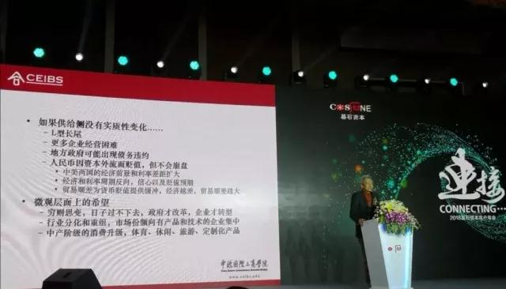

# 别总盯着特朗普，企业家不用花太多时间在宏观上--许小年教授最新精彩演讲
***来源：华夏基石e洞察（ID：chnstonewx）***
***作者：许小年（著名经济学家,中欧国际工商学院经济学和金融学教授）***
`本文根据2018基石资本客户年会许小年教授《后工业化时代的经济与企业》主题演讲整理，未经本人审核`。

```
许小年：大家不必对宏观环境关心过度，现在的这个时代，在后工业化的时代，不是看宏观做企业的时代，而是看着企业、看着市场、看着需求、看着你的客户做企业的时代。我自己都从宏观转行到微观了，你们不要花太多的时间在宏观上。
```

大家早上好。非常高兴来到基石资本做交流。我是研究宏观经济的，但是最近离宏观越来越远，转向到了微观领域做比较深入的企业调查与分析。我的演讲分两个部分，第一部分讲宏观，第二部分讲微观。

最近几年的企业调研使我发现，做好一个企业和宏观没有太大的关系。宏观好，企业可以乘风扬帆，跑得更快一点。宏观比较差，企业同样有非常多的机会。宏观不好的情况下，优秀的企业才能够脱颖而出，取得超过行业平均水平的业绩。既然如此，为什么我要花一半时间讲宏观？目的是希望能够说明宏观其实对企业没太大影响，无需再像以前一样去关注宏观。


## 后工业化时代企业面临的挑战
从中国经济总体来讲，目前处于一个历史性的转折期。纯粹从经济的角度来看，改革开放的前三四十年，我们基本上是通过工业化取得了经济的高速增长，这种模式在世界历史上并不是中国独此一家。早在十九世纪的中期和晚期，日本和德国就通过工业化实现了比当时的发达资本主义国家更快的增长率。

1868年日本明治维新，打破了封建制，建立了中央集权的民族国家，迅速地开展了工业化，经济增长超过了老牌的先行的工业化国家，法国、英国不在话下，甚至超过了美国。

1871年，德意志第二帝国建立，德意志民族第一次有了统一的国家，形成统一市场，推动了工业化，使得德国的工业增长超过了英国。

正是凭借着工业化所带来的超强增长，德国人、日本人向当时的世界秩序发起了挑战。德国人在欧洲挑战英国为支柱的现存的经济政治秩序，日本人则在太平洋地区向美国人发起了挑战。挑战的结果就是第一次世界大战和第二次世界大战，以后发的工业化国家的惨败宣告结束。

二战之后，这两个国家回望工业化路程，终于走上宪政民主的道路。

如果说中国经济存在奇迹的话，那就是工业化的奇迹。改革开放将中国从农业社会带入了工业社会。工业社会阶段和农业社会有一个非常大的区别，就是要进行大规模的资本积累，要抽出国民经济中的剩余（尽管是很小一部分的从农业方面来的剩余），进行工业和商业方面的投资，来推动经济的增长。中国也不例外。

在改革开放的前30年间，中国经济的增长都是由投资驱动的，这是工业化阶段必不可少的一个步骤。投资的驱动使得每个人、每个劳动力拥有的资本存量迅速提高，和农业社会相比，拥有了更复杂的机器、更先进的技术来进行生产活动，其效率当然要比农业社会高。所以，工业化带来在传统社会看不到的经济增长速度的原因之一，就是人均资本拥有量的提高，是生产技术的全面提高。后发的工业化国家，之所以超过自然增长的工业化国家，比如说英国和法国，原因就是他们有着后发优势——可以利用当时世界上已有的技术。*德国、日本工业化的时候，蒸汽技术在西方已经普及了，铁路也成了一个支柱产业，日本和德国不需要自己去进行研发，利用当时世界上现存的、已有的技术，就可以建设自己的铁路，就可以用蒸汽机来装备自己的工业，这使其取得了后发优势。*

其实中国的工业化和日本德国走过的道路非常类似。我们打破了计划体制以后，资源开始自由的流动，从低效率的农业部门转移到高效率的工商业部门，从低效率的国有部门转移到高效率的民营部门。同时，开放使我们可以用很低的成本，甚至是零成本，获得当时我们还没有的工业技术、商业技术。这里讲的技术，不仅仅限于电脑、无线电、化学工业等等，其中还包括了企业的经营管理和市场的组织，用时兴的话来说，不仅仅是硬技术还有软技术。我们几乎不用支付先期的成本，就可以现成的去利用，所以改革和开放一定是中国过去几十年经济发展的两大基石。没有改革开放，我们就不可能获得那些技术；没有改革开放，我们就不知道如何按照市场经济的规律去推进经济体制的改革。

我认为，工业化的高速增长带来了发展高峰，但在过去的十年间，推动力逐渐地衰竭，原因是经过两轮的投资高峰，中国的工业化基本上已经结束，也就是资本积累的阶段已经结束。这两个高峰一个是1990年代初期，一个是中国加入WTO阶段。第二次的高峰从2001年持续到大约2012年。经过两轮投资高峰以后，中国的各个行业各个产业都出现了产能过剩的现象，以至于今天再讲投资，已经不知道往哪里投了。在产能过剩的情况下，企业对未来的投资都相当的谨慎。

从宏观的统计数字上看，投资增长率已经从20%左右降到了个位数，从过去两倍于GDP的增长降到了基本上与GDP同步。换句话说，投资、资本积累、工业化已经不再是中国经济增长最强劲的引擎了。那么，新的增长动力从哪里来？制约中国经济进一步发展的，不仅仅是产能过剩、投资饱和，更重要的是过去的30多年间，我们几乎是免费获得的技术，现在已经不存在了，想要的技术都不可能在市场上以低成本获得。

后工业化时代有两个挑战：
```
第一个挑战，就是对国家经济来说，在投资增长速度不断放慢的情况下，如何去寻找增长的动力；对企业来说，同样面临这样的挑战，就是企业已经不可能依靠扩大生产能力来获得持续的发展。

第二个挑战，是过去的低成本甚至免费的技术不复存在，对企业来说，现成的技术已经利用到了极致，下一步企业要发展的技术必须依靠自己研发才能获得。
```
很明显的一个例子就是手机。过去做麦克风、做电脑等等这些看上去是有科技含量的产品，实际上不用做太多的前期的开发，如果能够把核心的原器件买来，比如说CPU的芯片，自己组装一下，一台PC机就可以卖出去了。今天已经不是这个情况了。做智能手机已经不能在市场上获得低成本手机制造的技术和设计技术了，这也是为什么在手机生产方面，我们基本上是跟在苹果、三星后面。现在华为赶上来了，其他厂商还都是跟随者。我们的前期研发没有奠定坚实的基础，当一款新产品出现的时候，不能像过去那样迅速的仿制，然后推出低成本的产品。

## 后工业化时代企业发展的方向
在后工业化时代，在投资拉动现有技术、低成本技术为基础的增长结束之后，下一阶段中国的经济发展、中国的企业往哪里走？这是一个非常严峻的挑战。在这个挑战面前，最近的提法——新常态，我认为某种程度上还是反映了这种趋势的变化。关于新常态的理解，人们一般都停留在新常态下经济增长不会像以前那么高，而不会进一步去分析，为什么经济增长重心整体会下移？为什么不会像以前那样接近两位数？也没有更深入去分析新常态的实质是什么？

我认为，所谓“新常态”，就是后工业化时代，就是投资不再作为经济的主要推动力，就是我们所需要的技术现在不得不依靠研发来获得，而不可能在市场上廉价地通过收购、仿制来取得。在新常态下，宏观上、微观上都出现了一些新的现象。产能过剩的情况下，经济从过去经常见到的通胀变成现在的通缩，政府在需求方面采用的各种政策越来越没有效率，我们称之为政府政策效益的递减，所以这两年不太讲拉动内需了。货币政策的放水、信贷政策的松宽对经济的影响越来越弱。新增加的贷款，投放到市场上的信贷，没有进入实体经济，反而是“脱实向虚”，进入了资产市场，进入了资本市场，推高了资产价格，而对实体经济没有太大的帮助。

在后工业化时代，或者叫新常态下，政策已经转向，最近几年的基调已经从保增长转向了防范系统性风险。这是因为在2008年以来，政府采取了一列的刺激性和扩张性政策，使得中国经济的总体负债水平不断提高，甚至有可能引发局部风险。由于这方面数据的缺乏，我们很难做出深入的定量分析，只能根据一些零星的报道和披露的数据做一些猜测。2017年全年的经济工作重点是防范系统性风险，今年两会之后，新任的央行行长更是明确表示，政府已经做好准备退出货币松宽，央行要准备缩表，改变过去一味的依靠货币松宽和信贷增长来维持经济增长的做法。这个转变如果说来得太迟的话，亡羊补牢尤未晚也。

我们看这张图，从2009年执行四万亿的政策以来，中国经济的负债率在急剧上升，从占GDP的160%，一直上升到2016年底的240%，新的数据大概是上升到了260%。也就是说，在过去十年间的负债相当于一年的GDP，负债从160%增长到GDP的260%。我们借了一年的GDP来维持经济的增长，这是典型的透支现象。透支的后果就是债务危机的风险，在这个风险面前，政府从去年开始延续到今年采取了货币紧缩的政策，虽然，有一点晚，但我认为是正确的。这张图上的红线是货币的增长曲线。这个狭义货币的增长曲线，我请大家注意，从2016年开始的货币供应的迅速增加，由于货币供应的迅速增加，我们等了很久的TBI生产价格指数，跟着货币就上去了，所以这种短期的刺激政策，对经济的效果很明显。这个生产价格指数的反弹，使得有些人说中国经济出现了新周期，其实根本就不存在什么新周期，而只是老周期的新循环，没有任何新意。原因在于当中央银行收紧货币，狭义货币增长速度开始下降的时候，这个生产价格指数跟着就跌下来。所以在过去一两年间，上游产品、原材料大宗商品的流逝，很快就会跟着中央银行的收紧货币而结束，总体上，经济可能重回通缩。16年和17年上半年短期的繁荣和景气，主要还是在于货币放水，但是货币的超发，不可能无限制的进行下去，中央银行意识到这一点，从去年年中开始，就收货币，一路收下去，今年继续收，明年继续收。中国人讲覆水难收，水泼出去很容易，想收回来很难的，因为往经济里灌水，大家都舒服，收回来的时候就会难受，但是难受也要收，不收的话，中国的债务风险就会达到无法控制和管理的地步。


在今后的几年中，在货币和政策方面，我个人的预期都是偏紧的。这不可避免会对经济增长发生影响，我们做企业的、做投资的，都要对这个宏观形势有所认识。这并不是说，在政策环境偏紧的情况下，企业就没什么好做了。正相反，对于优秀的企业来说，反而是在政策环境偏紧的时候能把握的机会更多。

在新常态下，经济增长的动力从哪里来？企业发展的方向在哪里？从最近的政策表述上得到一些反映，这个政策的表述叫供给侧。经济增长的动力不再拉动需求，而在于提高供给侧的效率。我们赞同从供给侧要经济增长的提法，也赞同要供给侧提高效率的总体取向，对此我给出自己的理解和建议。

所谓提高供给侧的效率，也就是提高企业的效率。企业的效率如何提高？要采用新技术。由于现在低成本获得新技术越来越困难，企业必须自己进行研发，自己进行创新。供给侧政策也罢，制度变革也罢，应该聚焦于如何促进企业的创新，如何引导企业从过去的制造转向研发。刚才张维（基石资本董事长）介绍了他们投资的一些企业，我大概看了一下，都是具有比较强的研发能力的企业，而不是看企业的规模，不是看企业资源整合的能力。我认为供给侧的提法是对的，但供给侧需要的不是政府的政策引导，不是产业政策，而是需要一系列的制度改革。我认为供给侧的重要制度改革有四点。

```
第一，加强私人产权保护。这也最重要的一点。因为如果没有私人产权保护，企业就没有进行长期研发投资的激励，就不可能把资金和积累投入到长期的研发项目上，不是扎根在中国的行业和市场上进行研发，像华为那样，做了三十年的企业，搞了三十年的研发，而可能是投向海外，是做短期项目。所以中国的企业从制造转向研发，必须要解决企业家进行研发投资的激励问题，这就要求首先要进一步提高私人产权保护的有效性，否则企业家对于私人产权保护的信心不足，对未来的不确定性没有把握。

第二，推进混合所有制改造。在我看来，推进混合所有制改造应该是缩小国有经济的范围，更多的由市场导向来进行资源配置。

第三，放松和解除管制，扩大对内对外开放。

第四，全面减税。让更多的资源由企业来配置，让市场发挥配置资源的决定性作用。
```

这是作为一名学者提出的供给侧的制度改革。所有的制度改革，目标在于鼓励企业进行长期研发的投资，鼓励企业进行创新，把增长的动力和企业发展的动力真正地转向技术创新。如果供给侧的制度改革不能够到位，那企业怎么办，是不是就此刀枪入库马放南山？即使改革进展缓慢，企业依然有很多的机会，可以在这个时候大有作为。

关于宏观经济，各位可能都有一个问题，就是中美贸易战对企业有什么影响。从通过谈判、让步和妥协来解决中美贸易纷争的一些迹象来看，是有谈判解决的可能性。我只能这样说，爆发全面贸易战的概率目前小于50%，再多的我也不能预测。在第一轮关税战之后，特朗普首先在推特上表了态，他说我和习主席是好朋友，相信通过协商谈判，能够解决我们之间的问题。一天以后，习主席在博鳌的讲话，提出四点政策，特别是第一点——中国的开放只能是越做越宽，越做越大，而不会去关上门，这是非常积极的一个信号，就是中国愿意通过协商来解决中美之间的贸易纷争。这些新的事态都使我提高了对于避免全面贸易战前景的信心，但接下来如何发展，要看中美两国的互动，谁也说不清楚。不管全面贸易战能不能打起来，企业的经营照旧，企业的创新不会、也不应该因为中美爆发贸易战而中断。你该做什么还是做什么，你在市场上竞争，不是和特朗普在竞争，而是和你的同行在竞争。如果因为中美谈判不顺利，这个行业的关税加上去了，出口受阻，别忘了你的竞争对手同样面临这样的局面，这个宏观环境对所有人都是一样的，你没有道理对此感到特别悲观。问题在于你要比竞争对手做得更好，宏观政策我们没有办法左右，中美之间的问题我们没有影响力，专注做好自己企业的事情，在市场上争取做得最好，最起码你要做的比主要竞争对手好。这样在同样不利的宏观环境下，你就相对的可以比别人发展的好。大家不必对宏观环境关心过度，现在的这个时代，在后工业化的时代，不是看宏观做企业的时代，而是看着企业、看着市场、看着需求、看着你的客户做企业的时代。我自己都从宏观转行到微观了，你们不要花太多的时间在宏观上。

## 后工业化时代，企业的突破口是“创新”
那么，在这样的环境下，企业要做些什么事呢？要持续创新，要提高自己的核心竞争力。创新转型不等于转行，跨界很危险，传统行业依然有巨大潜力可挖。刚才张维提到德鲁克的《创新与企业家精神》，这也是我极力向中欧学员推荐的一本书。这本书里的两个观点，我非常的赞同。

第一个观点，创新无需高科技。不要以为我们是在传统行业，就没办法做创新。传统行业创新的机会远远多于科技行业。德鲁克用他那个时代的数据表明：1980年代，美国的创新企业3/4来自于传统行业，1/4来自于科技行业。他在这本书里提到了两项传统行业的创新，一个是麦当劳，实现了汉堡包的操作标准化、工业化生产；一个是集装箱，一个卡车司机发明的集装箱，完全改变了港口以及世界航运的格局。它们都没有用什么科技，但是对行业的格局产生了深远的影响。所以德鲁克讲创新何需高科技，传统行业照样可以做。

第二个观点，创新需要专注，需要在一个行业、一个领域中长期的积累之后，才能形成突破。创新不是找风口，不是找到下一个要成为朝阳产业的领域。我经常讲的一句话是，这个世界上没有朝阳行业，只有朝阳企业。传统行业里，你可以看到朝阳企业；在科技行业里，你照样可以看到衰败的公司。创新不分行业，不分地区，哪里都有这个可能性，关键是看你自己怎么做。在夕阳行业、传统行业中，我们看到很多的朝阳企业，我给大家分享几个案例，它们大多数是在传统行业。

* 案例1：餐饮业
餐饮业多传统啊，有什么好做的？能做的事情太多了。最近我走访了海底捞，在我们所认为的夕阳行业中，这是一家非常优秀的公司。它的创新可以作为彼得·德鲁克这本书中的一个现实案例。经过长期的摸索，它的创新是激励机制、是人力资源管理的创新。张勇开玩笑说，在餐饮业干了20多年了，才摸索出了今天这一套行之有效的激励机制，把过去我要干的事儿都干完了。其实这也是事实。他干的这些事现在由他的几百家店长在做，他的激励机制把这些店长的积极性充分调动了起来。过去开餐馆他自己选址，现在不用去操心了，店长在积极地帮他寻找，帮他思考在哪里开店？这个店该怎么布局？招多少人？一套很好的利益分享机制，把大家全都调动起来，他自己却没有什么事情可干了。这就是公司经营的最高境界——无为而治。这种方法保证了海底捞的快速扩张，同时也保证了产品和服务的一致性。现在海底捞正在跟松下在谈合作，要做后台的无人厨房。我们要再花一点时间，很好的去提炼总结海底捞在激励机制和人力资源管理上的创新。

创新何需高科技，实质是说运用高科技。高科技不能够改变经济规律，不能够改变商业的本质。高科技只能帮助我们更有效的解决商业的本质问题。关于技术和创新之间的关系，我们需要进行思考。

* 案例2：服装业
第二个案例，是做定制西服的红领。只是运用大数据技术、互联网技术，都不算是高科技，而是中科技，甚至是低科技。在市场上，你外包找一家软件商，他就能给你做。关键是你自己要把商业模式想清楚，要把技术的大方案拿出来让外面的公司给你做。这家服装制造商就用大数据的技术解决定制化服装、个性化服装制作中的重点问题，实现了手工裁缝操作的方式改变成了流水线的生产，大大地提高了效率。但是这个流水线生产之所以成为可能，是有大数据的支持。

我们的创新往往是创新在名词上，创新在口号上，而不是创新在市场中，不是创新在对客户的服务上。今天会有AI的专家来讲人工智能。AI满大街都在谈，但它怎么赚钱？你不能站在街上吆喝：我是一个新公司，产品是AI。这看不见，摸不着。AI如何把人工智能变成产品，再把产品销售出去?我是平台，上有大数据，大数据将来可以卖，这全都是美好的故事。谁来买你的大数据？你的大数据从哪里来？人家为什么要买你的大数据？扎克伯格卖大数据卖出问题来了，现在被美国国会追着打。

用互联网和数据技术来改造传统行业，提高传统行业的效率，我认为这是一个出路。在市场上，在企业的经营中，我们需要深入的思考，如何运用技术解决本行业面临的重点问题，而不要去追逐那些新鲜的名词，不要去追逐那些潮流，不要去寻找风口，不要去幻想着卡位卡在什么地方，布局布在什么地方。这都是工业化时代在技术已知的情况下才可以这样做。在后工业化时代，这种思路已经行不通了。

* 案例3：传统销售渠道
传统方法比互联网更有效，比如销售渠道。小米在网上销售，销售得挺好。但是到目前为止，华为、OPPO、vivo全都用的是线下销售渠道，销售量不比小米差。那么要思考的问题是，线上销售、线下销售哪一个效率更高？为什么效率更高？不要去追求潮流性的东西，认为不上线就不行。

* 案例4：金融业
这个案例的小微贷款金融机构，是我的学生做的一家企业。在P2P现金贷遭到监管全面收缩与限制的今天，这家金融机构的业务照常进行，不出意外可以顺利的拿到备案。它的做法正好反过来，不是用互联网思维去做金融，而是用金融的思维去思考互联网如何能够帮助它提高效率。

我一直主张“传统行业+互联网”，而不是“互联网+传统行业”。

金融业要解决的本质问题是由信息不对称而引起的信贷风险，所以在金融行业，第一要义不是资产规模，不是增长速度，而是风险控制。如果你不懂风险控制，就不要做金融。

目前我们国家的信用环境中，完全依靠线上进行风险控制是不可能的，是不现实的，必须要走线下，但是走线下的问题是成本太高。于是他们就想尽各种各样的办法，用移动技术，用图像识别技术，用互联网技术，千方百计去降低信息收集处理和分析的成本，从而能够降低利率，能够服务更多的小微企业。我觉得用技术来解决金融的问题，而不是运用互联网的思维方式来做金融，这也是在做创新。你如果用互联网的思维方式来做金融，首先连监管这道关你都过不去。

* 案例5：大数据解决个性化定制的实例
如何用大数据来进行个性化服装的流水线生产？我稍微展开说两个案例，也是我花比较多的时间去研究的案例。

一般来讲，流水线生产都需要标准化产品，这家时装企业却实现了个性化产品的流水线生产。它是怎么解决问题的？客户来了以后，先给你量体，把尺寸量好，过去是裁缝师傅拿皮尺给你量，现在三维技术扫描解决问题。360度三维扫描机一扫，一秒钟就给你量完了。量体很方便，更重要的是如何把身体的三维数据变成两维平面上的尺寸？布片是两维的，三维数据变成两维平面上的尺寸，把它裁下来，再缝起来，这是服装制作的过程。

过去，从三维尺寸画出这个裤子布片的形状，这是一个技术活，必须要有经验的老师傅才能做。定制服装为什么都是小裁缝铺，不能做大规模，原因就在这里。因为一个老师傅，他生产能力有限，他每天就能画这么几十件衣服，每天就能画这么几十条裤子，再多了他就干不了。

现在呢，由机器来干，这边数据采集完进入到系统，系统自动生成。每条裤子做成什么样的图片，自动画出来，这个背后需要数据库来支持。生成了这些图片以后，马上把数据送到了数控裁床，这个机器根据比例，把每一片布都裁好，裁好了。工作人员在边上站着，给每一片布上钉上一个传感器——IC卡，把它挂在流水线上，就在车间里走。布片走到这个工位的时候，由机器发出指令自动停下来，工人就把这片布拿下来，缝纫机上都有一个屏幕，一扫卡就知道这片布在这个工位上，应该干什么活。该开扣眼的开扣眼，该锁边的锁边，该缝制的缝制，该绣名字的绣名字，加工完了以后再扫一下，挂回到流水线上，继续往下走。这一条流水线走到尽头，就是打包发给客户的地方。大家注意一下，流水线上的西服，颜色、款式、大小，没有两件是相同的。

这就是个性化的大批量生产。这家企业做的经济效益非常好，现在订单雪片一样飞来，生产能力不够，急着在扩张产能。在时装产业产能过剩的情况下，这家企业产能不够用，为什么？是由于运用了大数据驱动的流水线生产，大幅度的降低了成本，一套西服的售价是市面上裁缝铺售价的一半。这个价格优势，订单当然纷纷涌来，这是毫不意外的。

这家老板跟我说，这是全中国第一个物联网，我跟他说这还不是物联网，不是工业4.0，只算是工业3.2，因为工业4.0物联网是智能的，是AI的。你做衣服用不着AI，不要为AI而AI，而是要问一下用人工智能来解决什么问题？目前这个企业根本没有用人工智能，因为人类的智能潜力还没有充分发挥出来，你用什么机器智能啊。我说你先把这个HI（Humen Intelligence）用好就可以了。

另一个案例是广东的尚品宅配，也是用大数据的方法来解决家庭装修的个性化定制，和刚才那家时装企业一样，在个性化设置上有大数据的支持，在制造环节上有大数据支持，就使得它可以运用工业化流水线的生产方式，来生产个性化的定制产品。

从餐饮业到制造业，从服务业到金融业，这些非常现实的案例说明到处都是机会。中国处于从资本积累时代到创新时代的转型过程中，谁能够认识到这个转型的趋势，先行一步，在自己熟悉的领域中推进创新，尽量的采用先进的技术来改造行业和企业，就有可能在下一轮的经济发展中取得领先的地位。

希望在座的各位都是这样的企业，或者在座的各位所投的公司都是这样的企业。祝大家好运，谢谢！
